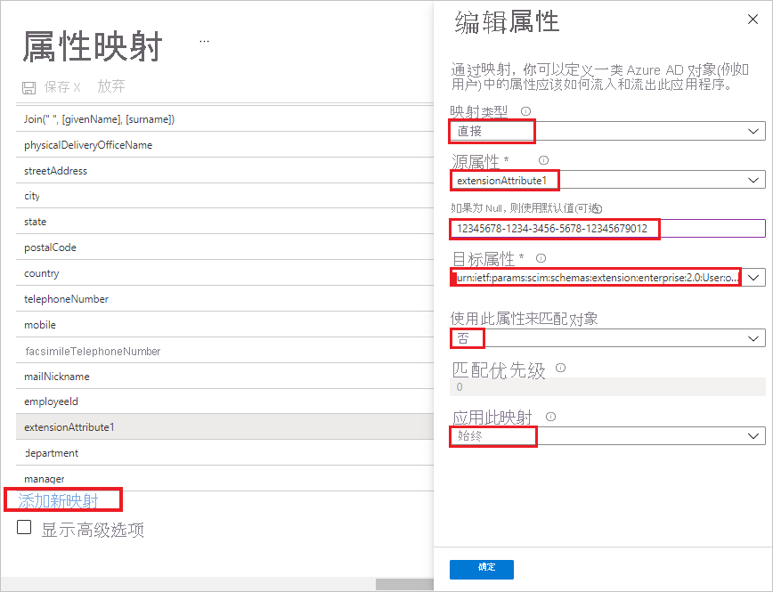

# 教程：在 SchoolStream ASA 中为 SchoolStream ASA 配置自动用户预配

本教程介绍在 SchoolStream ASA 和 Azure Active Directory (Azure AD) 中配置自动用户预配需执行的步骤。 配置后，Azure AD 会使用 Azure AD 预配服务自动将用户和组预配到 [SchoolStream ASA](https://www.ssk12.com/) 并自动取消预配。 有关此服务的功能、工作原理以及常见问题的重要详细信息，请参阅[使用 Azure Active Directory 自动将用户预配到 SaaS 应用程序和取消预配](../app-provisioning/user-provisioning.md)。 

## 支持的功能
> [!div class="checklist"]
> * 在 SchoolStream ASA 中创建用户 
> * 在用户不再有访问需求的情况下，在 SchoolStream ASA 中删除用户。
> * 使用户特性在 Azure AD 和 SchoolStream ASA 之间保持同步。
> * 在 SchoolStream ASA 中预配组和组成员身份。
> * [单一登录](../manage-apps/add-application-portal-setup-oidc-sso.md)到 SchoolStream ASA（建议）。

## 先决条件

本教程中概述的方案假定你已具有以下先决条件：

* [Azure AD 租户](../develop/quickstart-create-new-tenant.md) 
* Azure AD 中[有权](../roles/permissions-reference.md)配置预配的用户帐户（例如应用管理员、云应用管理员、应用所有者或全局管理员）。 
* SchoolStream 网站。 如果没有，请联系 [SchoolStream 支持人员](mailto:support@rtresponse.com)。

## 步骤 1。 计划预配部署
1. 了解[预配服务的工作原理](../app-provisioning/user-provisioning.md)。
1. 确定谁在[预配范围](../app-provisioning/define-conditional-rules-for-provisioning-user-accounts.md)中。
1. 确定[在 Azure AD 与 SchoolStream ASA 之间映射](../app-provisioning/customize-application-attributes.md)的数据。 

## 步骤 2. 将 SchoolStream ASA 配置为支持通过 Azure AD 进行预配

1. 请联系 [SchoolStream 支持人员](mailto:support@rtresponse.com)以请求 SchoolStream ASA 集成，你将需要提供 Azure AD 租户 ID 和 SchoolStream 网站 URL 。

1. SchoolStream 映射你的 SchoolStream 网站和 Azure AD 租户 ID 后，你将获得机密令牌和 SchoolStream ASA 租户 URL 。

## 步骤 3. 从 Azure AD 应用程序库添加 SchoolStream ASA

若要在 Azure AD 中开始管理 SchoolStream ASA 的预配，需要从 Azure AD 应用程序库添加 SchoolStream ASA。 

1. 使用工作或学校帐户或个人 Microsoft 帐户登录到 Azure 门户。
1. 在左侧导航窗格中，选择“Azure Active Directory”服务  。
1. 导航到“企业应用程序”，选择“所有应用程序”   。
1. 若要添加新的应用程序，请选择“新建应用程序”  。
1. 在“浏览 Azure AD 库”部分的搜索框中，键入“SchoolStream ASA” 。
1. 在结果面板中选择“SchoolStream ASA”，然后注册该应用 。 在该应用添加到租户时等待几秒钟。

如果以前针对 SSO 设置过 SchoolStream ASA，则可以使用同一应用程序。 但建议你在最初测试集成时创建一个单独的应用。 若要详细了解如何从库中添加应用，可以单击[此处](../manage-apps/add-application-portal.md)。 

## 步骤 4. 定义谁在预配范围中 

使用 Azure AD 预配服务，可以根据对应用的分配或用户/组的特性来限定谁在预配范围内。 如果选择根据分配来限定要将谁预配到应用，可以按照下面的[步骤](../manage-apps/assign-user-or-group-access-portal.md)操作，将用户和组分配到应用。 如果选择仅根据用户或组的属性来限定要对谁进行预配，可以使用[此处](../app-provisioning/define-conditional-rules-for-provisioning-user-accounts.md)所述的范围筛选器。 

* 将用户和组分配到 SchoolStream ASA 时，必须选择“默认访问”以外的角色。 具有“默认访问”角色的用户将从预配中排除，并在预配日志中被标记为未有效授权。 如果应用程序上唯一可用的角色是默认访问角色，则可以[更新应用程序清单](../develop/howto-add-app-roles-in-azure-ad-apps.md)以添加其他角色。 

* 先小部分测试。 在向全员推出之前，请先使用少量的用户和组进行测试。 如果预配范围设置为分配的用户和组，则可以先尝试将一两个用户或组分配到应用。 当预配范围设置为所有用户和组时，可以指定[基于属性的范围筛选器](../app-provisioning/define-conditional-rules-for-provisioning-user-accounts.md)。 

## 步骤 5。 配置到 SchoolStream ASA 的自动用户预配 

本部分介绍如何配置 Azure AD 预配服务以基于 Azure AD 中的用户和/或组分配在 SchoolStream ASA 中创建、更新以及禁用用户和/或组。

### 在 Azure AD 中为 SchoolStream ASA 配置自动用户预配：

1. 登录 [Azure 门户](https://portal.azure.com)。 依次选择“企业应用程序”、“所有应用程序” 。

    

1. 在应用程序列表中，选择“SchoolStream ASA”。

    

1. 选择“预配”  选项卡。

    

1. 如果是首次配置预配，请选择“入门”。

    
    
1. 将“预配模式”设置为“自动”。

    

1. 在“管理员凭据”部分，输入 SchoolStream ASA“租户 URL”和“机密令牌”  。 单击“测试连接”以确保 Azure AD 可以连接到 SchoolStream ASA。 如果连接失败，请确保 SchoolStream ASA 帐户具有管理员权限，然后重试。

    

1. 选择“保存”以查看“设置”部分 。

1. 在“设置”部分的“通知电子邮件”字段中，输入应接收预配错误通知的个人或组的电子邮件地址，并选中“发生故障时发送电子邮件通知”复选框  。

    

1. 在“映射”部分，选择“预配 Azure Active Directory 用户” 。

1. 选择底部的“添加新映射”。

1. 在“编辑属性”对话框中： 
    
   * 在“映射类型”字段中，从下拉列表中选择“直接” ，
   * 在“源属性”字段中，从下拉列表中选择“extensionAttribute1” ，
   * 在字段“如果为 Null，则使用默认值(可选)”中输入你的 Azure AD 租户 ID ，
   * 在“目标属性”字段中，从下拉列表中选择“urn:ietf:params:scim:schemas:extension:enterprise:2.0:User:organization” ， 
   * 在“使用此属性匹配对象”字段中，从下拉列表中选择“否” ，
   * 在“应用此映射”字段中，从下拉列表中选择“始终” ，
   * 选择“确定”。

       

1. 在“属性映射”部分，查看从 Azure AD 同步到 SchoolStream ASA 的用户属性。 选为“匹配”属性的特性用于匹配 SchoolStream ASA 中的用户帐户以执行更新操作。 如果选择更改[匹配目标属性](../app-provisioning/customize-application-attributes.md)，则需要确保 SchoolStream ASA API 支持基于该属性筛选用户。

   |属性|类型|支持筛选|
   |---|---|---|
   |userName|字符串|&check;
   |活动|Boolean|   
   |displayName|字符串|
   |emails[type eq "work"].value|字符串|
   |preferredLanguage|字符串|
   |name.givenName|字符串|
   |name.familyName|字符串|
   |name.formatted|字符串|
   |phoneNumbers[type eq "mobile"].value|字符串|
   |externalId|字符串|
   |urn:ietf:params:scim:schemas:extension:enterprise:2.0:User:organization|字符串| 

1. 在“映射”部分下，选择“将 Azure Active Directory 组同步到 UNIFI” 。

1. 在“属性映射”部分中，查看从 Azure AD 同步到 UNIFI 的组属性。 选为“匹配”属性的特性用于匹配 UNIFI 中的组以执行更新操作。 选择“保存”按钮以提交任何更改  。

      |Attribute|类型|支持筛选|
      |---|---|---|
      |displayName|字符串|&check;
      |members|参考|
      |externalId|字符串|      

1. 选择“保存”按钮以提交任何更改。 可以返回“应用程序”选项卡，然后选择“编辑预配”以继续 。

1. 若要配置范围筛选器，请参阅[范围筛选器教程](../app-provisioning/define-conditional-rules-for-provisioning-user-accounts.md)中提供的以下说明。

1. 若要为 SchoolStream ASA 启用 Azure AD 预配服务，请在“设置”部分将“预配状态”更改为“启用”  。

    

1. 通过在“设置”部分的“范围”中选择所需的值，定义要预配到 SchoolStream ASA 的用户和/或组 。

    

1. 已准备好预配时，单击“保存”  。

    

此操作会对“设置”部分的“范围”中定义的所有用户和组启动初始同步周期 。 初始周期执行的时间比后续周期长，只要 Azure AD 预配服务正在运行，后续周期大约每隔 40 分钟就会进行一次。 

## 步骤 6. 监视部署
配置预配后，请使用以下资源来监视部署：

* 通过[预配日志](../reports-monitoring/concept-provisioning-logs.md)来确定哪些用户已预配成功或失败
* 检查[进度栏](../app-provisioning/application-provisioning-when-will-provisioning-finish-specific-user.md)来查看预配周期的状态以及完成进度
* 如果怀疑预配配置处于非正常状态，则应用程序将进入隔离状态。 有关隔离状态的详细信息，请访问[此处](../app-provisioning/application-provisioning-quarantine-status.md)。  

## 更改日志

* 2020/09/24 - 已启用组预配。

## 更多资源

* [管理企业应用的用户帐户预配](../app-provisioning/configure-automatic-user-provisioning-portal.md)
* [Azure Active Directory 的应用程序访问与单一登录是什么？](../manage-apps/what-is-single-sign-on.md)

## 后续步骤

* [了解如何查看日志并获取有关预配活动的报告](../app-provisioning/check-status-user-account-provisioning.md)