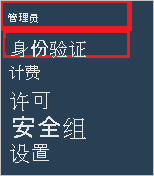
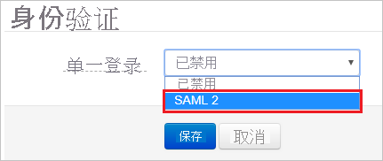
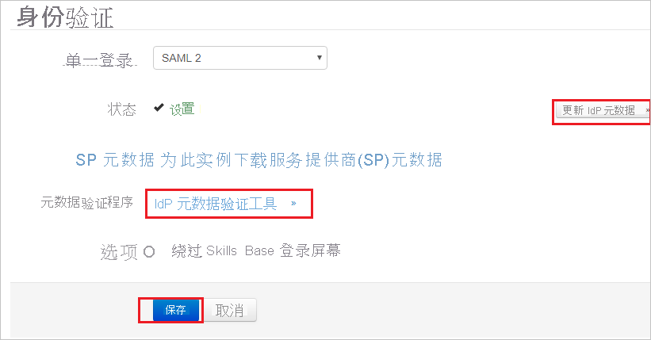

# 教程：Azure Active Directory 与 Skills Base 集成

本教程介绍如何将 Skills Base 与 Azure Active Directory (Azure AD) 集成。 将 Skills Base 与 Azure AD 集成后，可以：

* 在 Azure AD 中控制谁有权访问 Skills Base。
* 让用户使用其 Azure AD 帐户自动登录到 Skills Base。
* 在一个中心位置（Azure 门户）管理帐户。

## 必备条件

若要开始操作，需备齐以下项目：

* 一个 Azure AD 订阅。 如果没有订阅，可以获取一个[免费帐户](https://azure.microsoft.com/free/)。
* 已启用 Skills Base 单一登录 (SSO) 的订阅。

> [!NOTE]
> 此集成也可以通过 Azure AD 美国国家云环境使用。 你可以在“Azure AD 美国国家云应用程序库”中找到此应用程序，并以与在公有云中相同的方式对其进行配置。

## 方案描述

本教程会在测试环境中配置和测试 Azure AD 单一登录。

* Skills Base 支持 SP 发起的 SSO。
* Skills Base 支持实时用户预配。

> [!NOTE]
> 此应用程序的标识符是一个固定字符串值，因此只能在一个租户中配置一个实例。

## 从库中添加 Skills Base

若要配置 Skills Base 与 Azure AD 的集成，需要从库中将 Skills Base 添加到托管 SaaS 应用列表。

1. 使用工作或学校帐户或个人 Microsoft 帐户登录到 Azure 门户。
1. 在左侧导航窗格中，选择“Azure Active Directory”服务  。
1. 导航到“企业应用程序”，选择“所有应用程序”   。
1. 若要添加新的应用程序，请选择“新建应用程序”。
1. 在“从库中添加”部分的搜索框中，键入“Skills Base” 。
1. 从结果面板中选择“Skills Base”，然后添加该应用。 在该应用添加到租户时等待几秒钟。

## 配置并测试 Skills Base 的 Azure AD SSO

使用名为 B.Simon 的测试用户配置并测试 Skills Base 的 Azure AD SSO。 若要使 SSO 有效，需要在 Azure AD 用户与 Skills Base 中的相关用户之间建立关联。

若要配置并测试 Skills Base 的 Azure AD SSO，请执行以下步骤：

1. **[配置 Azure AD SSO](#configure-azure-ad-sso)** - 使用户能够使用此功能。
    1. **[创建 Azure AD 测试用户](#create-an-azure-ad-test-user)** - 使用 B. Simon 测试 Azure AD 单一登录。
    1. **[分配 Azure AD 测试用户](#assign-the-azure-ad-test-user)** - 使 B. Simon 能够使用 Azure AD 单一登录。
1. **[配置 Skills Base SSO](#configure-skills-base-sso)** - 在应用程序端配置单一登录设置。
    1. **[创建 Skills Base 测试用户](#create-skills-base-test-user)** - 在 Skills Base 中创建 B.Simon 的对应用户，并将其关联到用户在 Azure AD 中的表示形式。
1. **[测试 SSO](#test-sso)** - 验证配置是否正常工作。

## 配置 Azure AD SSO

按照下列步骤在 Azure 门户中启用 Azure AD SSO。

1. 在 Azure 门户的“Skills Base”应用程序集成页上，找到“管理”部分，选择“单一登录”  。
1. 在“选择单一登录方法”页上选择“SAML” 。
1. 在“设置 SAML 单一登录”页面上，单击“基本 SAML 配置”旁边的铅笔图标以编辑设置 。

   

4. 在“基本 SAML 配置”  部分中，执行以下步骤：

    在“登录 URL”文本框中，使用以下模式键入 URL：`https://app.skills-base.com/o/<customer-unique-key>`

    > [!NOTE]
    > 可以从 Skills Base 应用程序获取登录 URL。 请以管理员身份登录并转至“管理员”->“设置”->“实例详细信息”->“快捷方式链接”。 复制登录 URL 并将其粘贴到上面的文本框中。

5. 在“使用 SAML 设置单一登录”页的“SAML 签名证书”部分，单击“下载”以根据要求下载从给定选项提供的“联合元数据 XML”并将其保存在计算机上   。

    

6. 在“设置 Skills Base”部分，根据要求复制相应的 URL。

    

### 创建 Azure AD 测试用户

在本部分，我们将在 Azure 门户中创建名为 B.Simon 的测试用户。

1. 在 Azure 门户的左侧窗格中，依次选择“Azure Active Directory”、“用户”和“所有用户”  。
1. 选择屏幕顶部的“新建用户”。
1. 在“用户”属性中执行以下步骤：
   1. 在“名称”字段中，输入 `B.Simon`。  
   1. 在“用户名”字段中输入 username@companydomain.extension。 例如，`B.Simon@contoso.com` 。
   1. 选中“显示密码”复选框，然后记下“密码”框中显示的值。
   1. 单击“创建”。

### 分配 Azure AD 测试用户

本部分将通过授予 B.Simon 访问 Skills Base 的权限，使其能够使用 Azure 单一登录。

1. 在 Azure 门户中，依次选择“企业应用程序”、“所有应用程序”。 
1. 在应用程序列表中，选择“Skills Base”。
1. 在应用的概述页中，找到“管理”部分，选择“用户和组” 。
1. 选择“添加用户”，然后在“添加分配”对话框中选择“用户和组”。
1. 在“用户和组”对话框中，从“用户”列表中选择“B.Simon”，然后单击屏幕底部的“选择”按钮。
1. 如果你希望将某角色分配给用户，可以从“选择角色”下拉列表中选择该角色。 如果尚未为此应用设置任何角色，你将看到选择了“默认访问权限”角色。
1. 在“添加分配”对话框中，单击“分配”按钮。

## 配置 Skills Base SSO

1. 在另一个 Web 浏览器窗口中，以安全管理员身份登录到 Skills Base。

2. 在菜单左侧的“管理”下，单击“身份验证”。

    

3. 在“身份验证”页上，选择“单一登录”作为 **SAML 2**。

    

4. 在“身份验证”页上，执行以下步骤：

    

    a. 单击“状态”选项旁边的“更新 IdP 元数据”按钮，并将从 Azure 门户下载的元数据 XML 的内容粘贴到指定的文本框中。

    > [!Note]
    > 还可以通过上面屏幕截图中突出显示的“元数据验证器”工具验证 idp 元数据。

    b. 单击“ **保存**”。

### 创建 Skills Base 测试用户

在本部分，我们会在 Skills Base 中创建一个名为 Britta Simon 的用户。 Skills Base 支持默认启用的恰时用户预配。 此部分不存在任何操作项。 如果 Skills Base 中不存在用户，则会在身份验证后创建一个新用户。

> [!Note]
> 如果需要手动创建用户，请按照[此处](http://wiki.skills-base.net/index.php?title=Adding_people_and_enabling_them_to_log_in)的说明进行操作。

## 测试 SSO

在本部分，你将使用以下选项测试 Azure AD 单一登录配置。 

* 在 Azure 门户中单击“测试此应用程序”。 这会重定向到 Skills Base 登录 URL，可在此处启动登录流。 

* 直接转到 Skills Base 登录 URL，并在其中启动登录流。

* 你可使用 Microsoft 的“我的应用”。 在“我的应用”中单击“Skills Base”磁贴时，会重定向到 Skills Base 登录 URL。 有关“我的应用”的详细信息，请参阅[“我的应用”简介](../user-help/my-apps-portal-end-user-access.md)。

## 后续步骤

配置 Skills Base 后，即可强制实施会话控制，实时防止组织的敏感数据外泄和渗透。 会话控制从条件访问扩展而来。 [了解如何通过 Microsoft Cloud App Security 强制实施会话控制](/cloud-app-security/proxy-deployment-aad)。
