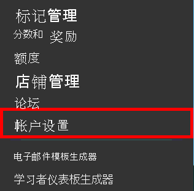
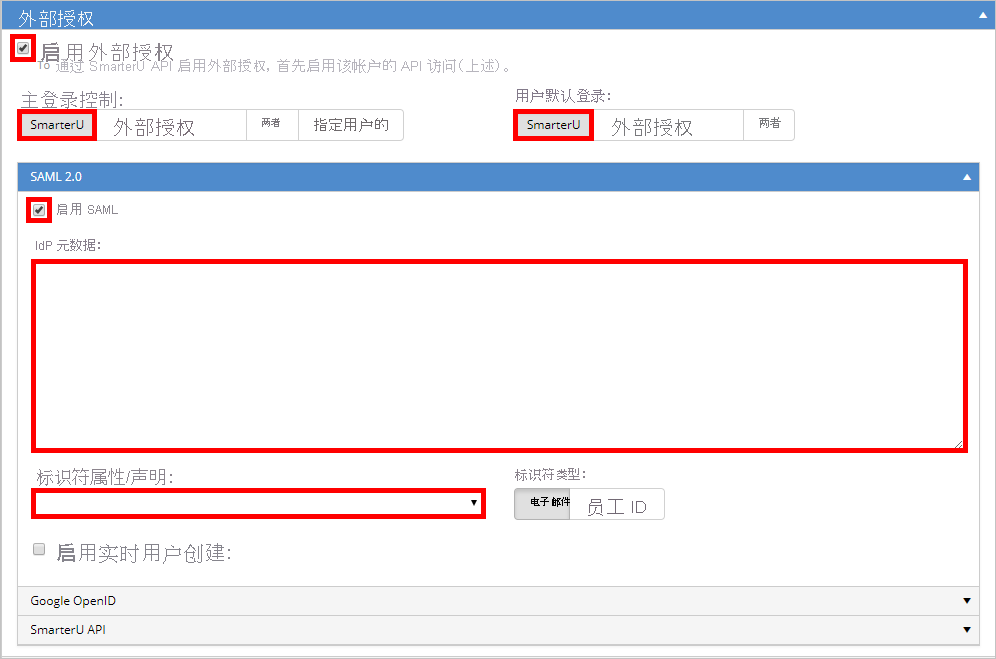
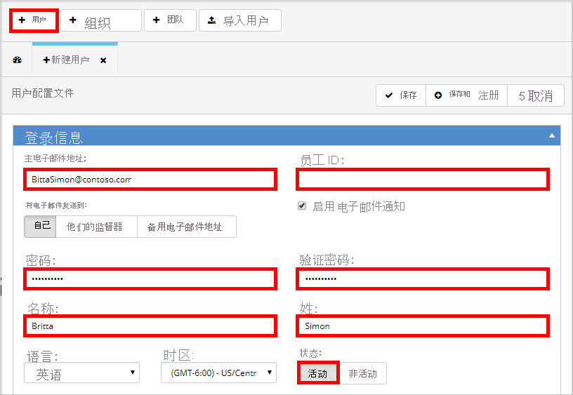

# 教程：Azure Active Directory 与 SmarterU 集成

> [!NOTE]
> 将 SmarterU 与 Azure Active Directory 集成的过程也在 [SmarterU 帮助系统](https://help.smarteru.com/ID2053086)中记录和维护。

在本教程中，了解如何将 SmarterU 与 Azure Active Directory (Azure AD) 集成。 将 SmarterU 与 Azure AD 集成后，可以：

* 可在 Azure AD 中控制谁有权访问 SmarterU。
* 让用户使用其 Azure AD 帐户自动登录到 SmarterU。
* 在一个中心位置（Azure 门户）管理帐户。

## 先决条件

若要开始操作，需备齐以下项目：

* 一个 Azure AD 订阅。 如果没有订阅，可以获取一个[免费帐户](https://azure.microsoft.com/free/)。
* 已启用 SmarterU 单一登录 (SSO) 的订阅。

## 方案描述

本教程会在测试环境中配置和测试 Azure AD 单一登录。

* SmarterU 支持 IDP 发起的 SSO。

> [!NOTE]
> 此应用程序的标识符是一个固定字符串值，因此只能在一个租户中配置一个实例。

## 从库中添加 SmarterU

若要配置 SmarterU 与 Azure AD 的集成，需要从库中将 SmarterU 添加到托管 SaaS 应用列表。

1. 使用工作或学校帐户或个人 Microsoft 帐户登录到 Azure 门户。
1. 在左侧导航窗格中，选择“Azure Active Directory”服务  。
1. 导航到“企业应用程序”，选择“所有应用程序”   。
1. 若要添加新的应用程序，请选择“新建应用程序”  。
1. 在“从库中添加”部分的搜索框中，键入“SmarterU” 。
1. 从结果面板中选择“SmarterU”，然后添加该应用。 在该应用添加到租户时等待几秒钟。

## 配置并测试 SmarterU 的 Azure AD SSO

使用名为 B.Simon 的测试用户配置和测试 SmarterU 的 Azure AD SSO。 若要正常使用 SSO，需要在 Azure AD 用户与 SmarterU 中的相关用户之间建立链接关系。

若要配置并测试 SmarterU 的 Azure AD SSO，请执行以下步骤：

1. **[配置 Azure AD SSO](#configure-azure-ad-sso)** - 使用户能够使用此功能。
    1. **[创建 Azure AD 测试用户](#create-an-azure-ad-test-user)** - 使用 B. Simon 测试 Azure AD 单一登录。
    1. **[分配 Azure AD 测试用户](#assign-the-azure-ad-test-user)** - 使 B. Simon 能够使用 Azure AD 单一登录。
1. [配置 SmarterU SSO](#configure-smarteru-sso) - 在应用程序端配置单一登录设置。
    1. [创建 SmarterU 测试用户](#create-smarteru-test-user) - 在 SmarterU 中创建 B.Simon 的对应用户，并将其链接到该用户的 Azure AD 表示形式。
1. **[测试 SSO](#test-sso)** - 验证配置是否正常工作。

## 配置 Azure AD SSO

按照下列步骤在 Azure 门户中启用 Azure AD SSO。

1. 在 Azure 门户中的“SmarterU”应用程序集成页上，找到“管理”部分并选择“单一登录”  。
1. 在“选择单一登录方法”页上选择“SAML” 。
1. 在“设置 SAML 单一登录”页面上，单击“基本 SAML 配置”旁边的铅笔图标以编辑设置 。

   

4. 在“基本 SAML 配置”  部分中，执行以下步骤：

    在“标识符”文本框中键入 URL：`https://www.smarteru.com/`

5. 在“使用 SAML 设置单一登录”页的“SAML 签名证书”部分，单击“下载”以根据要求下载从给定选项提供的“联合元数据 XML”并将其保存在计算机上     。

    

6. 在“设置 SmarterU”部分，根据要求复制相应 URL  。

    

### 创建 Azure AD 测试用户

在本部分，我们将在 Azure 门户中创建名为 B.Simon 的测试用户。

1. 在 Azure 门户的左侧窗格中，依次选择“Azure Active Directory”、“用户”和“所有用户”  。
1. 选择屏幕顶部的“新建用户”。
1. 在“用户”属性中执行以下步骤：
   1. 在“名称”字段中，输入 `B.Simon`。  
   1. 在“用户名”字段中输入 username@companydomain.extension。 例如，`B.Simon@contoso.com`。
   1. 选中“显示密码”复选框，然后记下“密码”框中显示的值。
   1. 单击“创建”。

### 分配 Azure AD 测试用户

在本部分，你将通过授予 B.Simon 访问 SmarterU 的权限，使其能够使用 Azure 单一登录。

1. 在 Azure 门户中，依次选择“企业应用程序”、“所有应用程序”。  
1. 在应用程序列表中，选择“SmarterU”  。
1. 在应用的概述页中，找到“管理”部分，选择“用户和组”   。
1. 选择“添加用户”，然后在“添加分配”对话框中选择“用户和组”。
1. 在“用户和组”对话框中，从“用户”列表中选择“B.Simon”，然后单击屏幕底部的“选择”按钮。
1. 如果你希望将某角色分配给用户，可以从“选择角色”下拉列表中选择该角色。 如果尚未为此应用设置任何角色，你将看到选择了“默认访问权限”角色。
1. 在“添加分配”对话框中，单击“分配”按钮。  

## 配置 SmarterU SSO

1. 在另一个 Web 浏览器窗口中，以管理员身份登录 SmarterU 公司站点。

1. 在顶部工具栏中，单击“帐户设置”。 

    

1. 在帐户配置页面上，执行以下步骤：

     

    a. 选择“启用外部授权”  。
  
    b. 在“主登录控制”  部分中，选择“SmarterU”  选项卡。
  
    c. 在“用户默认登录”  部分中，选择“SmarterU”  选项卡。
  
    d. 选择“启用 SAML”  。
  
    e. 复制下载的元数据文件的内容，然后将其粘贴到“IdP 元数据”  文本框中。

    f. 选择一个 **标识符属性/声明**。
  
    g. 单击“保存”  。

### 创建 SmarterU 测试用户

为了使 Azure AD 用户能够登录到 SmarterU，必须将其预配到 SmarterU 中。 对于 SmarterU，预配是一项手动任务。

**若要预配用户帐户，请执行以下步骤：**

1. 登录到 **SmarterU** 租户。

1. 转到“用户”  。

1. 在“用户”部分中，执行以下步骤：

      

    a. 单击“+用户”  。

    b. 在以下文本框中键入 Azure AD 用户帐户的相关属性值：“主要电子邮件”、“员工 ID”、“密码”、“验证密码”、“名字”、“姓氏”       。

    c. 单击“活动”  。

    d. 单击“ **保存**”。

> [!NOTE]
> 可以使用任何其他 SmarterU 用户帐户创建工具或 SmarterU 提供的 API 来预配 Azure AD 用户帐户。

## 测试 SSO

在本部分，你将使用以下选项测试 Azure AD 单一登录配置。

* 在 Azure 门户中单击“测试此应用程序”后，应会自动登录到为其设置了 SSO 的 SmarterU。

* 你可使用 Microsoft 的“我的应用”。 单击“我的应用”中的 SmarterU 磁贴时，你应该会自动登录到已为其设置了 SSO 的 SmarterU。 有关“我的应用”的详细信息，请参阅[“我的应用”简介](https://support.microsoft.com/account-billing/sign-in-and-start-apps-from-the-my-apps-portal-2f3b1bae-0e5a-4a86-a33e-876fbd2a4510)。

## 后续步骤

配置 SmarterU 后，可以强制实施会话控制，实时防止组织的敏感数据外泄和渗透。 会话控制从条件访问扩展而来。 [了解如何通过 Microsoft Cloud App Security 强制实施会话控制](/cloud-app-security/proxy-deployment-aad)。