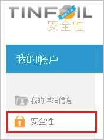

# 教程：Azure AD SSO 与 TINFOIL SECURITY 集成

本教程介绍如何将 TINFOIL SECURITY 与 Azure Active Directory (Azure AD) 集成。 将 TINFOIL SECURITY 与 Azure AD 集成后，可以：

* 在 Azure AD 中控制谁有权访问 TINFOIL SECURITY。
* 让用户使用其 Azure AD 帐户自动登录到 TINFOIL SECURITY。
* 在一个中心位置（Azure 门户）管理帐户。

## 先决条件

若要开始操作，需备齐以下项目：

* 一个 Azure AD 订阅。 如果没有订阅，可以获取一个[免费帐户](https://azure.microsoft.com/free/)。
* 已启用 TINFOIL SECURITY 单一登录 (SSO) 的订阅。

## 方案描述

本教程在测试环境中配置并测试 Azure AD SSO。

* TINFOIL SECURITY 支持 IDP 发起的 SSO。

> [!NOTE]
> 此应用程序的标识符是一个固定字符串值，因此只能在一个租户中配置一个实例。

## 从库中添加 TINFOIL SECURITY

若要配置 TINFOIL SECURITY 与 Azure AD 的集成，需从库中将 TINFOIL SECURITY 添加到托管 SaaS 应用列表。

1. 使用工作或学校帐户或个人 Microsoft 帐户登录到 Azure 门户。
1. 在左侧导航窗格中，选择“Azure Active Directory”服务  。
1. 导航到“企业应用程序”，选择“所有应用程序”   。
1. 若要添加新的应用程序，请选择“新建应用程序”  。
1. 在“从库中添加”部分的搜索框中，键入“TINFOIL SECURITY”   。
1. 从结果面板中选择“TINFOIL SECURITY”，然后添加该应用  。 在该应用添加到租户时等待几秒钟。

## 配置并测试 TINFOIL SECURITY 的 Azure AD SSO

使用名为 B.Simon 的测试用户配置并测试 TINFOIL SECURITY 的 Azure AD SSO  。 若要执行 SSO，需要在 Azure AD 用户与 TINFOIL SECURITY 相关用户之间建立链接关系。

若要配置并测试 TINFOIL SECURITY 的 Azure AD SSO，请执行以下步骤：

1. **[配置 Azure AD SSO](#configure-azure-ad-sso)** - 使用户能够使用此功能。
    1. **[创建 Azure AD 测试用户](#create-an-azure-ad-test-user)** - 使用 B. Simon 测试 Azure AD 单一登录。
    1. **[分配 Azure AD 测试用户](#assign-the-azure-ad-test-user)** - 使 B. Simon 能够使用 Azure AD 单一登录。
1. [配置 TINFOIL SECURITY SSO](#configure-tinfoil-security-sso)  - 在应用程序端配置单一登录设置。
    1. [创建 TINFOIL SECURITY 测试用户](#create-tinfoil-security-test-user)  - 在 TINFOIL SECURITY 中创建 B.Simon 的对应用户，并将其关联到其在 Azure AD 中的表示形式。
1. **[测试 SSO](#test-sso)** - 验证配置是否正常工作。

## 配置 Azure AD SSO

按照下列步骤在 Azure 门户中启用 Azure AD SSO。

1. 在 Azure 门户中的“TINFOIL SECURITY”应用程序集成页上，找到“管理”部分并选择“单一登录”  。
1. 在“选择单一登录方法”页上选择“SAML” 。
1. 在“设置 SAML 单一登录”页面上，单击“基本 SAML 配置”旁边的铅笔图标以编辑设置 。

   

1. 在基本 SAML 配置部分，应用程序进行了预配置，且已通过 Azure 预填充了必要的 URL。 用户需要单击“保存”  按钮来保存配置。

1. Visitly 应用程序需要特定格式的 SAML 断言，这要求向 SAML 令牌属性配置添加自定义属性映射。 以下屏幕截图显示了默认属性的列表。

    

1. 除了上述属性，Visitly 应用程序还要求在 SAML 响应中传递回更多的属性，如下所示。 这些属性也是预先填充的，但可以根据要求查看它们。

    | 名称 | 源属性 |
    | ------------------- | -------------|
    | 帐户 ID | UXXXXXXXXXXXXX |

    > [!NOTE]
    > 本教程后面的步骤中将介绍帐户 ID 值。

1. 在“SAML 签名证书”  部分中，单击“编辑”  按钮以打开“SAML 签名证书”  对话框。

    

1. 在“SAML 签名证书”部分，复制“指纹值”并将其保存在计算机上。  

    

1. 在“设置 TINFOIL SECURITY”部分，根据要求复制相应的 URL  。

    

### 创建 Azure AD 测试用户

在本部分，我们将在 Azure 门户中创建名为 B.Simon 的测试用户。

1. 在 Azure 门户的左侧窗格中，依次选择“Azure Active Directory”、“用户”和“所有用户”  。
1. 选择屏幕顶部的“新建用户”。
1. 在“用户”属性中执行以下步骤：
   1. 在“名称”字段中，输入 `B.Simon`。  
   1. 在“用户名”字段中输入 username@companydomain.extension。 例如，`B.Simon@contoso.com`。
   1. 选中“显示密码”复选框，然后记下“密码”框中显示的值。
   1. 单击“创建”。

### 分配 Azure AD 测试用户

在本部分中，将通过授予 B.Simon 访问 TINFOIL SECURITY 的权限，允许其使用 Azure 单一登录。

1. 在 Azure 门户中，依次选择“企业应用程序”、“所有应用程序”。  
1. 在应用程序列表中，选择“TINFOIL SECURITY”  。
1. 在应用的概述页中，找到“管理”部分，选择“用户和组”   。
1. 选择“添加用户”，然后在“添加分配”对话框中选择“用户和组”。
1. 在“用户和组”对话框中，从“用户”列表中选择“B.Simon”，然后单击屏幕底部的“选择”按钮。
1. 如果在 SAML 断言中需要任何角色值，请在“选择角色”对话框的列表中为用户选择合适的角色，然后单击屏幕底部的“选择”按钮。
1. 在“添加分配”对话框中，单击“分配”按钮。  

## 配置 TINFOIL SECURITY SSO

1. 在另一 Web 浏览器窗口中，以管理员身份登录到 TINFOIL SECURITY 公司站点。

1. 在顶部菜单栏中，单击“我的帐户”  。

    

1. 单击 **“安全性”** 。

    

1. 在“单一登录”  配置页上，执行以下步骤：

    

    a. 选择“启用 SAML”  。

    b. 单击“手动配置”  。

    c. 在“SAML 发布 URL”文本框中，粘贴从 Azure 门户复制的“登录 URL”值。  

    d. 在“SAML 证书指纹”文本框中，粘贴从“SAML 签名证书”部分复制的“指纹”值    。
  
    e. 复制你的“帐户 ID”值，将此值粘贴在 Azure 门户中“用户属性和声明”部分下的“源属性”文本框中    。

    f. 单击“ **保存**”。

### 创建 TINFOIL SECURITY 测试用户

要使 Azure AD 用户能够登录到 TINFOIL SECURITY，必须将其预配到 TINFOIL SECURITY 中。 对于 TINFOIL SECURITY，需手动完成预配。

**若要预配用户，请执行以下步骤：**

1. 如果用户是企业帐户的一部分，你则需要联系 [TINFOIL SECURITY 支持团队](https://www.tinfoilsecurity.com/contact)以创建用户帐户。

1. 如果用户是常规 TINFOIL SECURITY SaaS 用户，则该用户可向任何用户站点添加协作者。 这会触发向指定的电子邮件发送邀请以创建新 TINFOIL SECURITY 用户帐户的过程。

> [!NOTE]
> 可使用任何其他 TINFOIL SECURITY 用户帐户创建工具或使用 TINFOIL SECURITY 提供的 API 来预配 Azure AD 用户帐户。

## 测试 SSO

在本部分，你将使用以下选项测试 Azure AD 单一登录配置。

* 在 Azure 门户中单击“测试此应用程序”后，你应会自动登录到为其设置了 SSO 的 TINFOIL SECURITY。

* 你可使用 Microsoft 的“我的应用”。 在“我的应用”中单击“TINFOIL SECURITY”磁贴时，应会自动登录到设置了 SSO 的 TINFOIL SECURITY。 有关“我的应用”的详细信息，请参阅[“我的应用”简介](../user-help/my-apps-portal-end-user-access.md)。

## 后续步骤

配置 TINFOIL SECURITY 后，就可以强制实施会话控制，从而实时保护组织的敏感数据免于外泄和渗透。 会话控制从条件访问扩展而来。 [了解如何通过 Microsoft Cloud App Security 强制实施会话控制](/cloud-app-security/proxy-deployment-aad)。