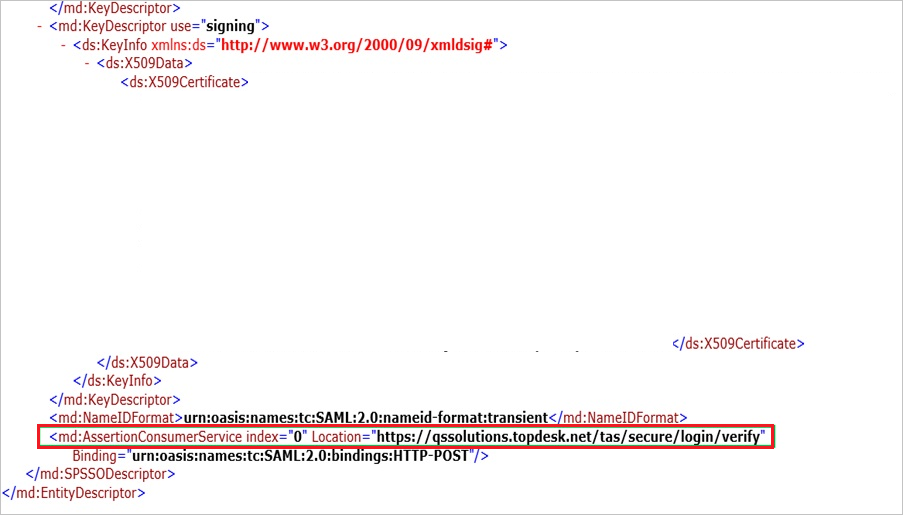
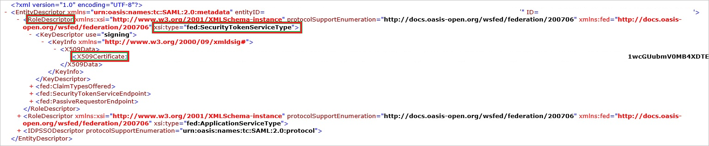

# 教程：Azure AD 与 TOPdesk - Secure 的 SSO 集成

本教程介绍如何将 TOPdesk - Secure 与 Azure Active Directory (Azure AD) 集成。 将 TOPdesk - Secure 与 Azure AD 集成后，可以：

* 在 Azure AD 中控制谁有权访问 TOPdesk - Secure。
* 让用户使用其 Azure AD 帐户自动登录到 TOPdesk - Secure（单一登录）。
* 在一个中心位置（Azure 门户）管理帐户。

## 先决条件

若要开始操作，需备齐以下项目：
 
 * 一个 Azure AD 订阅。 如果没有订阅，可以获取一个[免费帐户](https://azure.microsoft.com/free/)。
* 已启用 TOPdesk - Secure 单一登录 (SSO) 的订阅。

## 方案描述

本教程会在测试环境中配置和测试 Azure AD 单一登录。

* TOPdesk - Secure 支持 SP 发起的 SSO。

## 从库中添加 TOPdesk - Secure

要配置 TOPdesk - Secure 与 Azure AD 的集成，需要从库中将 TOPdesk - Secure 添加到托管 SaaS 应用列表。

1. 使用工作或学校帐户或个人 Microsoft 帐户登录到 Azure 门户。
1. 在左侧导航窗格中，选择“Azure Active Directory”服务  。
1. 导航到“企业应用程序”，选择“所有应用程序”   。
1. 若要添加新的应用程序，请选择“新建应用程序”  。
1. 在“从库中添加”部分的搜索框中，键入“TOPdesk - Secure” 。
1. 从结果面板中选择“TOPdesk - Secure”，然后添加该应用。 在该应用添加到租户时等待几秒钟。

## 配置并测试 TOPdesk - Secure 的 Azure AD SSO

在本部分中，将基于名为“Britta Simon”的测试用户配置和测试 TOPdesk - Secure 的 Azure AD 单一登录。
若要运行单一登录，需要在 Azure AD 用户与 TOPdesk - Secure 相关用户之间建立链接关系。

若要配置并测试 TOPdesk - Secure 的 Azure AD 单一登录，需要执行以下步骤：

1. **[配置 Azure AD SSO](#configure-azure-ad-sso)** - 使用户能够使用此功能。
    1. **[创建 Azure AD 测试用户](#create-an-azure-ad-test-user)** - 使用 Britta Simon 测试 Azure AD 单一登录。
    2. **[分配 Azure AD 测试用户](#assign-the-azure-ad-test-user)** - 使 Britta Simon 能够使用 Azure AD 单一登录。
2. **[配置 TOPdesk - Secure SSO](#configure-topdesk---secure-sso)** - 在应用程序端配置单一登录设置。
    1. **[创建 TOPdesk - Secure 测试用户](#create-topdesk---secure-test-user)** - 在 TOPdesk - Secure 中创建 Britta Simon 的对应用户，并将其链接到该用户的 Azure AD 表示形式。
1. **[测试 SSO](#test-sso)** - 验证配置是否正常工作。

## 配置 Azure AD SSO

在本部分中，将在 Azure 门户中启用 Azure AD 单一登录。

若要配置 TOPdesk - Secure 的 Azure AD 单一登录，请执行以下步骤：

1. 在 Azure 门户中的“TOPdesk - Secure”应用程序集成页上，选择“单一登录” 。

2. 在 **选择单一登录方法** 对话框中，选择 **SAML/WS-Fed** 模式以启用单一登录。

3. 在“使用 SAML 设置单一登录”页面上，单击“铅笔”图标以打开“基本 SAML 配置”对话框 。

    

4. 在“基本 SAML 配置”部分中，按照以下步骤操作：

    a. 在“标识符 URL”框中，填写可从 TOPdesk 配置中检索的 TOPdesk 元数据 URL。 它应使用以下模式：`https://<companyname>.topdesk.net/saml-metadata/<identifier>`

    b. 在“回复 URL”文本框中，使用以下模式键入 URL：`https://<companyname>.topdesk.net/tas/secure/login/verify`

    c. 在“登录 URL”  文本框中，使用以下模式键入 URL：`https://<companyname>.topdesk.net`。

    > [!NOTE]
    > 这些不是实际值。 请使用实际的“标识符”、“回复 URL”和“登录 URL”更新这些值。 请联系 [TOPdesk - Secure 客户端支持团队](https://www.topdesk.com/us/support/)获取这些值。 还可以参考 Azure 门户中的“基本 SAML 配置”  部分中显示的模式。

5. 在“使用 SAML 设置单一登录”页的“SAML 签名证书”部分，单击“下载”以根据要求下载从给定选项提供的“联合元数据 XML”并将其保存在计算机上     。

    

6. 在“设置 TOPdesk - Secure”部分中，根据要求复制相应的 URL。

    

### 创建 Azure AD 测试用户 

在本部分，我们将在 Azure 门户中创建名为 B.Simon 的测试用户。

1. 在 Azure 门户的左侧窗格中，依次选择“Azure Active Directory”、“用户”和“所有用户”  。
1. 选择屏幕顶部的“新建用户”。
1. 在“用户”属性中执行以下步骤：
   1. 在“名称”字段中，输入 `B.Simon`。  
   1. 在“用户名”字段中输入 username@companydomain.extension。 例如，`B.Simon@contoso.com`。
   1. 选中“显示密码”复选框，然后记下“密码”框中显示的值。
   1. 单击“创建”。

### 分配 Azure AD 测试用户

本部分将通过授予 B.Simon 访问 TOPdesk - Secure 的权限，允许其使用 Azure 单一登录。

1. 在 Azure 门户中，依次选择“企业应用程序”、“所有应用程序”。  
1. 在应用程序列表中，选择“TOPdesk - Secure”。
1. 在应用的概述页中，找到“管理”部分，选择“用户和组”   。
1. 选择“添加用户”，然后在“添加分配”对话框中选择“用户和组”。
1. 在“用户和组”对话框中，从“用户”列表中选择“B.Simon”，然后单击屏幕底部的“选择”按钮。
1. 如果你希望将某角色分配给用户，可以从“选择角色”下拉列表中选择该角色。 如果尚未为此应用设置任何角色，你将看到选择了“默认访问权限”角色。
1. 在“添加分配”对话框中，单击“分配”按钮。

## 配置 TOPdesk - Secure SSO

1. 以管理员身份登录到你的 **TOPdesk（安全版）** 公司站点。

2. 在 **“TOPdesk”** 菜单中，单击 **“设置”**。

    

3. 单击 **“登录设置”**。

    

4. 展开 **“登录设置”** 菜单，然后单击 **“常规”**。

    

5. 在 **“SAML 登录”** 配置部分的 **“安全”** 部分中，执行以下步骤：

    

    a. 单击 **“下载”** 以下载公共元数据文件，然后将其本地保存到计算机上。

    b. 打开元数据文件，然后找到 **AssertionConsumerService** 节点。

    

    c. 复制 **AssertionConsumerService** 值，并将此值粘贴到“TOPdesk - Secure 域和 URL”部分中的“回复 URL”文本框内。

6. 若要创建证书文件，请执行以下步骤：

    

    a. 在 Azure 门户中打开下载的元数据文件。

    b. 展开 **xsi:type** 为 **fed:ApplicationServiceType** 的 **RoleDescriptor** 节点。

    c. 复制 **X509Certificate** 节点的值。

    d. 将复制的 **X509Certificate** 值本地保存到计算机文件中。

7. 在 **“公共”** 部分中，单击 **“添加”**。

    

8. 在 **“SAML 配置助手”** 对话框页上，执行以下步骤：

    

    a. 若要从 Azure 门户上传已下载的元数据文件，请在“联合元数据”下单击“浏览”。

    b. 若要上载你的证书文件，请在 **“证书 (RSA)”** 下单击 **“浏览”**。

    c. 对于“私钥(RSA, PKCS8, DER)”，可以上传自己的私钥，也可以联系 [TOPdesk - Secure 客户端支持团队](https://www.topdesk.com/us/support)获取私钥。

    d. 若要上载从 TOPdesk 支持团队获得的徽标文件，请在 **“徽标图标”** 下单击 **“浏览”**。

    e. 在“用户名属性”文本框中，键入 `http://schemas.xmlsoap.org/ws/2005/05/identity/claims/emailaddress`。

    f. 在 **“显示名”** 文本框中，键入你的配置名称。

    g. 单击“ **保存**”。

### 创建 TOPdesk - Secure 测试用户

要使 Azure AD 用户能够登录 TOPdesk - Secure，必须将这些用户预配到 TOPdesk - Secure 中。  
对于 TOPdesk - Secure，预配是一项手动任务。

### 若要配置用户设置，请执行以下步骤：

1. 以管理员身份登录 **TOPdesk - Secure** 公司站点。

2. 在顶部菜单中，单击“TOPdesk”\>“新建”\>“支持文件”\>“操作员”。

    

3. 在 **“新建操作员”** 对话框上，执行以下步骤：

    

    a. 单击“常规”选项卡。

    b. 在“姓氏”文本框中，键入用户的姓氏（如 Simon） 。

    c. 在 **“位置”** 部分中，为帐户选择 **“站点”**。

    d. 在 **“TOPdesk 登录”** 部分的 **“登录名”** 文本框中，键入用户的登录名。

    e. 单击“ **保存**”。

> [!NOTE]
> 可使用任何其他 TOPdesk - Secure 用户帐户创建工具或 TOPdesk - Secure 提供的 API 来预配 Azure AD 用户帐户。

## 测试 SSO

在本部分，你将使用以下选项测试 Azure AD 单一登录配置。 

* 在 Azure 门户中单击“测试此应用程序”。 这会重定向到 TOPdesk - Secure 登录 URL，你可以从此处启动登录流。 

* 直接转到 TOPdesk - Secure 登录 URL，并从此处启动登录流。

* 你可使用 Microsoft 的“我的应用”。 单击“我的应用”中的 TOPdesk - Secure 磁贴时，应当会自动登录到已为其设置了 SSO 的 TOPdesk - Secure。 有关“我的应用”的详细信息，请参阅[“我的应用”简介](https://support.microsoft.com/account-billing/sign-in-and-start-apps-from-the-my-apps-portal-2f3b1bae-0e5a-4a86-a33e-876fbd2a4510)。

## 后续步骤

配置 TOPdesk - Secure 后，就可强制实施会话控制，实时防止组织的敏感数据外泄和渗透。 会话控制从条件访问扩展而来。 [了解如何通过 Microsoft Cloud App Security 强制实施会话控制](/cloud-app-security/proxy-deployment-any-app)。