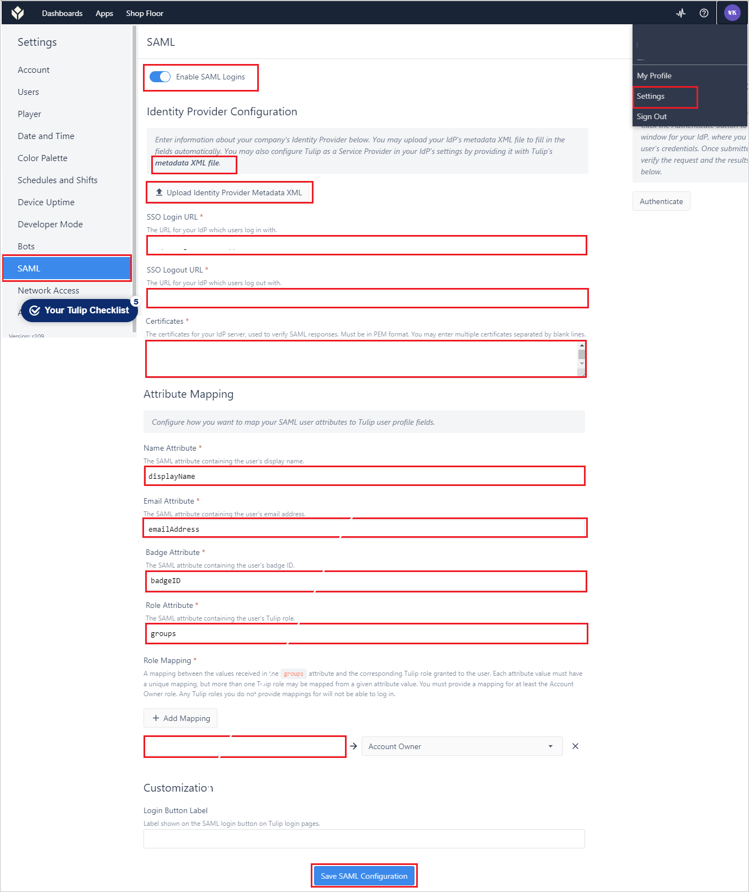

# 教程：Azure Active Directory 单一登录 (SSO) 与 Tulip 集成

本教程介绍如何将 Tulip 与 Azure Active Directory (Azure AD) 集成。 将 Tulip 与 Azure AD 集成后，你可以：

* 在 Azure AD 中控制谁有权访问 Tulip。
* 允许用户使用其 Azure AD 帐户自动登录到 Tulip。
* 在一个中心位置（Azure 门户）管理帐户。

## 先决条件

若要开始操作，需备齐以下项目：

* 一个 Azure AD 订阅。 如果没有订阅，可以获取一个[免费帐户](https://azure.microsoft.com/free/)。
* 已启用 Tulip 单一登录 (SSO) 的订阅。

## 方案描述

本教程在测试环境中配置并测试 Azure AD SSO。

* Tulip 支持 IDP 发起的 SSO。

## 从库中添加 Tulip

若要配置 Tulip 与 Azure AD 的集成，需要从库中将 Tulip 添加到托管的 SaaS 应用程序列表。

1. 使用工作或学校帐户或个人 Microsoft 帐户登录到 Azure 门户。
1. 在左侧导航窗格中，选择“Azure Active Directory”服务  。
1. 导航到“企业应用程序”，选择“所有应用程序”   。
1. 若要添加新的应用程序，请选择“新建应用程序”。
1. 在“从库中添加”部分的搜索框中，键入“Tulip”。
1. 从结果面板中选择“Tulip”，然后添加该应用。 在该应用添加到租户时等待几秒钟。

## 配置并测试 Tulip 的 Azure AD SSO

使用名为 B.Simon 的测试用户配置并测试 Tulip 的 Azure AD SSO。 若要使 SSO 正常工作，需要在 Azure AD 用户与 Tulip 中的相关用户之间建立关联。

若要配置并测试 Tulip 的 Azure AD SSO，请执行以下步骤：

1. **[配置 Azure AD SSO](#configure-azure-ad-sso)** - 使用户能够使用此功能。
    1. **[创建 Azure AD 测试用户](#create-an-azure-ad-test-user)** - 使用 B. Simon 测试 Azure AD 单一登录。
    1. **[分配 Azure AD 测试用户](#assign-the-azure-ad-test-user)** - 使 B. Simon 能够使用 Azure AD 单一登录。
1. [配置 Tulip SSO](#configure-tulip-sso) - 在应用程序端配置单一登录设置。
    1. [创建 Tulip 测试用户](#create-tulip-test-user) - 在 Tulip 中创建 B.Simon 的对应用户，并将其关联到该用户的 Azure AD 表示形式。
1. **[测试 SSO](#test-sso)** - 验证配置是否正常工作。

## 配置 Azure AD SSO

按照下列步骤在 Azure 门户中启用 Azure AD SSO。

1. 在 Azure 门户的“Tulip”应用程序集成页上，找到“管理”部分并选择“单一登录”。
1. 在“选择单一登录方法”页上选择“SAML” 。
1. 在“设置 SAML 单一登录”页面上，单击“基本 SAML 配置”旁边的铅笔图标以编辑设置 。

   

1. 在“基本 SAML 配置”  部分，如果有 **服务提供程序元数据文件**，请执行以下步骤：

    a. 单击“上传元数据文件”  。

    

    b. 单击“文件夹徽标”  来选择元数据文件并单击“上传”。 

    

    c. 成功上传元数据文件后，“标识符”  和“回复 URL”  值会自动填充在“基本 SAML 配置”部分：

    

    > [!Note]
    > 如果 **标识符** 和 **回复 URL** 值未自动填充，则请按要求手动填充这些值。

1. Tulip 应用程序需要特定格式的 SAML 断言语句，这要求将自定义属性映射添加到 SAML 令牌属性的配置中。 以下屏幕截图显示了默认属性的列表。

    

1. 除上述属性以外，Tulip 应用程序还要求在 SAML 响应中传回其他几个属性，如下所示。 这些属性也是预先填充的，但可以根据要求查看它们。
    
    | 名称 |源属性|
    | -------------- | --------- |
    | displayName | user.displayname |
    | emailAddress |user.mail |
    | badgeID | user.employeeid |
    | groups |user.groups |

1. 在“使用 SAML 设置单一登录”页的“SAML 签名证书”部分中，找到“证书(Base64)”，选择“下载”以下载该证书并将其保存到计算机上     。

    

1. 在“设置 Tulip”部分，根据要求复制相应的 URL。

    
### 创建 Azure AD 测试用户

在本部分，我们将在 Azure 门户中创建名为 B.Simon 的测试用户。

1. 在 Azure 门户的左侧窗格中，依次选择“Azure Active Directory”、“用户”和“所有用户”  。
1. 选择屏幕顶部的“新建用户”。
1. 在“用户”属性中执行以下步骤：
   1. 在“名称”字段中，输入 `B.Simon`。  
   1. 在“用户名”字段中输入 username@companydomain.extension。 例如，`B.Simon@contoso.com`。
   1. 选中“显示密码”复选框，然后记下“密码”框中显示的值。
   1. 单击“创建”。

### 分配 Azure AD 测试用户

在本部分中，你将通过授予 B.Simon 访问 Tulip 的权限，允许其使用 Azure 单一登录。

1. 在 Azure 门户中，依次选择“企业应用程序”、“所有应用程序”。 
1. 在应用程序列表中，选择“Tulip”。
1. 在应用的概述页中，找到“管理”部分，选择“用户和组” 。
1. 选择“添加用户”，然后在“添加分配”对话框中选择“用户和组”。
1. 在“用户和组”对话框中，从“用户”列表中选择“B.Simon”，然后单击屏幕底部的“选择”按钮。
1. 如果你希望将某角色分配给用户，可以从“选择角色”下拉列表中选择该角色。 如果尚未为此应用设置任何角色，你将看到选择了“默认访问权限”角色。
1. 在“添加分配”对话框中，单击“分配”按钮。

## 配置 Tulip SSO

1. 以管理员身份登录到 Tulip 站点。

1. 转到“设置” -> “SAML”，然后在下图所示的页中执行以下步骤。

    

    a. 启用 SAML 登录名。 

    b. 单击“metadata xml 文件”以下载服务提供程序元数据文件，然后在 Azure 门户中的“基本 SAML 配置”部分上传该文件。  

    c. 在“SSO 登录 URL”文本框中，粘贴从 Azure 门户复制的“登录 URL”的值。 

    d. 在“SSO 注销 URL”文本框中，粘贴从 Azure 门户复制的“注销 URL”的值。 

    e. 在记事本中打开从 Azure 门户下载的“证书 (Base64)”，然后将内容粘贴到“证书”文本框中。 

    f. 在“属性映射”中，
    
     * 将“名称属性”值指定为 displayName。 

     * 将“电子邮件属性”值指定为 emailAdress。 

     * 将“徽章属性”值指定为 badgeID。 

     * 将“角色属性”值指定为 groups。 

    g. 在“角色映射”中，将 group 的 ObjectID 映射到“帐户所有者”。

    h. 单击“保存 SAML 配置”。

### 创建 Tulip 测试用户

在本部分中，你将在 Tulip 中创建一个名为“Britta Simon”的用户。 与 [Tulip 支持团队](mailto:support@tulip.co)协作，将用户添加到 Tulip 平台中。 使用单一登录前，必须先创建并激活用户。

## 测试 SSO 

在本部分，你将使用以下选项测试 Azure AD 单一登录配置。

* 在 Azure 门户中单击“测试此应用程序”后，你应会自动登录到已设置 SSO 的 Tulip

* 你可使用 Microsoft 的“我的应用”。 单击“我的应用”中的 Tulip 磁贴后，你应会自动登录到已设置 SSO 的 Tulip。 有关“我的应用”的详细信息，请参阅[“我的应用”简介](https://support.microsoft.com/account-billing/sign-in-and-start-apps-from-the-my-apps-portal-2f3b1bae-0e5a-4a86-a33e-876fbd2a4510)。

## 后续步骤

配置 Tulip 后，可以强制实施会话控制，实时防止组织的敏感数据遭受外泄和渗透。 会话控制从条件访问扩展而来。 [了解如何通过 Microsoft Cloud App Security 强制实施会话控制](/cloud-app-security/proxy-deployment-any-app)。