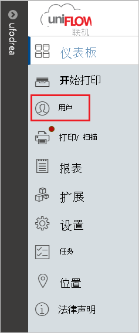
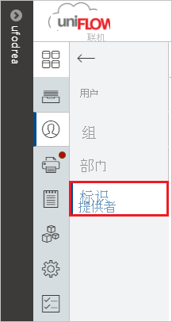
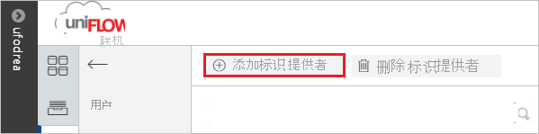
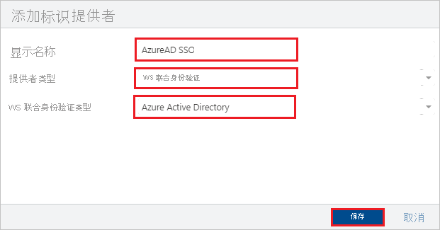
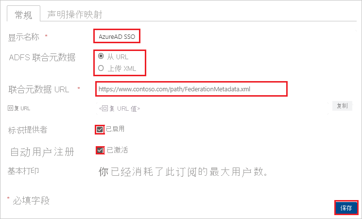

# 教程：Azure Active Directory 单一登录 (SSO) 与 uniFLOW Online 的集成

本教程介绍如何将 uniFLOW Online 与 Azure Active Directory (Azure AD) 集成。 将 uniFLOW Online 与 Azure AD 集成后，可以：

* 在 Azure AD 中控制谁有权访问 uniFLOW Online。
* 让用户使用其 Azure AD 帐户登录到 uniFLOW Online。
* 在一个中心位置（Azure 门户）管理帐户。

## 先决条件

若要开始操作，需备齐以下项目：

* 一个 Azure AD 订阅。 如果没有订阅，可以获取一个[免费帐户](https://azure.microsoft.com/free/)。
* uniFLOW Online 租户。

## 方案描述

本教程在测试环境中配置并测试 Azure AD SSO。

* uniFLOW Online 支持 SP 发起的 SSO。

## 从库中添加“uniFLOW Online”

若要配置 uniFLOW Online 与 Azure AD 的集成，需要从库中将 uniFLOW Online 添加到托管 SaaS 应用列表。

1. 使用工作或学校帐户或个人 Microsoft 帐户登录到 Azure 门户。
1. 在左侧导航窗格中，选择“Azure Active Directory”服务  。
1. 导航到“企业应用程序”，选择“所有应用程序”   。
1. 若要添加新的应用程序，请选择“新建应用程序”  。
1. 在“从库中添加”部分的搜索框中，键入 **uniFLOW Online**。 
1. 在结果面板中选择“uniFLOW Online”，然后添加该应用。  在该应用添加到租户时等待几秒钟。

## 配置并测试 uniFLOW Online 的 Azure AD SSO

使用名为 **B.Simon** 的测试用户配置并测试 uniFLOW Online 的 Azure AD SSO。 若要正常使用 SSO，需要在 Azure AD 用户与 uniFLOW Online 中的相关用户之间建立链接关系。

若要配置并测试 uniFLOW Online 的 Azure AD SSO，请执行以下步骤：

1. **[配置 Azure AD SSO](#configure-azure-ad-sso)** - 使用户能够使用此功能。
   1. **[创建 Azure AD 测试用户](#create-an-azure-ad-test-user)** - 使用 B. Simon 测试 Azure AD 单一登录。
   1. **[分配 Azure AD 测试用户](#assign-the-azure-ad-test-user)** - 使 B. Simon 能够使用 Azure AD 单一登录。
1. **[配置 uniFLOW Online SSO](#configure-uniflow-online-sso)** - 在应用程序端配置单一登录设置。
    1. **[使用创建的测试用户登录到 uniFLOW Online](#sign-in-to-uniflow-online-using-the-created-test-user)** - 在应用程序端测试用户登录。
1. **[测试 SSO](#test-sso)** - 验证配置是否正常工作。

## 配置 Azure AD SSO

按照下列步骤在 Azure 门户中启用 Azure AD SSO。

1. 在 Azure 门户中的“uniFLOW Online”应用程序集成页上，找到“管理”部分并选择“单一登录”。  
1. 在“选择单一登录方法”页上选择“SAML”   。
1. 在“设置 SAML 单一登录”页面上，单击“基本 SAML 配置”旁边的铅笔图标以编辑设置 。

   

1. 在“基本 SAML 配置”部分中，按照以下步骤操作：

    a. 在“标识符(实体 ID)”文本框中，使用以下模式之一键入 URL：

    | **Identifier** |
    |---------|
    | `https://<tenant_domain_name>.eu.uniflowonline.com` |
    | `https://<tenant_domain_name>.us.uniflowonline.com` |
    | `https://<tenant_domain_name>.sg.uniflowonline.com` |
    | `https://<tenant_domain_name>.jp.uniflowonline.com` |
    | `https://<tenant_domain_name>.au.uniflowonline.com` |

    b. 在“登录 URL”文本框中，使用以下模式之一键入 URL：

    | **登录 URL** |
    |---------|
    | `https://<tenant_domain_name>.eu.uniflowonline.com` |
    | `https://<tenant_domain_name>.us.uniflowonline.com` |
    | `https://<tenant_domain_name>.sg.uniflowonline.com` |
    | `https://<tenant_domain_name>.jp.uniflowonline.com` |
    | `https://<tenant_domain_name>.au.uniflowonline.com` |

    > [!NOTE]
    > 这些不是实际值。 使用实际标识符和登录 URL 更新这些值。 请联系 [uniFLOW Online 客户端支持团队](mailto:support@nt-ware.com)获取这些值。 还可参考 Azure 门户的“基本 SAML 配置”部分中显示的模式，或者参考你的 uniFLOW Online 租户中显示的回复 URL。 

1. uniFLOW Online 应用程序需要特定格式的 SAML 断言，因此，需要在 SAML 令牌属性配置中添加自定义属性映射。 以下屏幕截图显示了默认属性的列表，其中的 **nameidentifier** 映射到 **user.userprincipalname**。 uniFLOW Online 应用程序要求通过 user.objectid 对 nameidentifier 进行映射，因此需单击“编辑”图标对属性映射进行编辑，然后更改属性映射  。

    

1. 除上述属性以外，uniFLOW Online 应用程序还要求在 SAML 响应中传回下面所述的其他几个属性。 这些属性也是预先填充的，但可以根据要求查看它们。

    | 名称 |  源属性|
    | -----------| --------------- |
    | displayname | user.displayname |
    | nickname | user.onpremisessamaccountname |

   > [!NOTE]
   > 只有当 Azure AD 用户是从本地 Windows Active Directory 同步的时，`user.onpremisessamaccountname` 属性才会包含值。

1. 在“使用 SAML 设置单一登录”  页的“SAML 签名证书”  部分中，单击“复制”按钮，以复制“应用联合元数据 URL”  ，并将它保存在计算机上。

    

### 创建 Azure AD 测试用户

在本部分，我们将在 Azure 门户中创建名为 B.Simon 的测试用户。

1. 在 Azure 门户的左侧窗格中，依次选择“Azure Active Directory”、“用户”和“所有用户”  。
1. 选择屏幕顶部的“新建用户”。
1. 在“用户”属性中执行以下步骤：
   1. 在“名称”字段中，输入 `B.Simon`。  
   1. 在“用户名”字段中输入 username@companydomain.extension。 例如，`B.Simon@contoso.com`。
   1. 选中“显示密码”复选框，然后记下“密码”框中显示的值。
   1. 单击“创建”。

### 分配 Azure AD 测试用户

在本部分，你将通过授予 B.Simon 访问 uniFLOW Online 的权限，使其能够使用 Azure 单一登录。

1. 在 Azure 门户中，依次选择“企业应用程序”、“所有应用程序”。  
1. 在“应用程序”列表中选择“uniFLOW Online”。 
1. 在应用的概述页中，找到“管理”部分，选择“用户和组”   。
1. 选择“添加用户”，然后在“添加分配”对话框中选择“用户和组”。
1. 在“用户和组”对话框中，从“用户”列表中选择“B.Simon”，然后单击屏幕底部的“选择”按钮。
1. 如果你希望将某角色分配给用户，可以从“选择角色”下拉列表中选择该角色。 如果尚未为此应用设置任何角色，你将看到选择了“默认访问权限”角色。
1. 在“添加分配”对话框中，单击“分配”按钮。  

> [!NOTE]
> 若要无需手动分配即可允许所有用户访问应用程序，请转到“管理”  部分并选择“属性”  。 然后，将“需要进行用户分配”参数更改为“否”   。

## 配置 uniFLOW Online SSO

1. 在另一个 Web 浏览器窗口中，以管理员身份登录到 uniFLOW Online 网站。

1. 从左侧导航窗格中，选择“用户”选项卡。 

    

1. 单击“标识提供者”。 

    

1. 单击“添加标识提供者”。 

    

1. 在“添加标识提供者”部分执行以下步骤： 

    

    a. 输入显示名称，例如：**AzureAD SSO**。

    b. 对于“提供者类型”，请从下拉列表中选择“WS 联合身份验证”选项。  

    c. 对于“WS 联合身份验证类型”，请从下拉列表中选择“Azure Active Directory”选项。  

    d. 单击“ **保存**”。

1. 在“常规”选项卡上执行以下步骤： 

    

    a. 输入显示名称，例如：**AzureAD SSO**。

    b. 为“ADFS 联合元数据”选择“从 URL”选项。  

    c. 在“联合元数据 URL”文本框中，粘贴从 Azure 门户复制的“应用联合元数据 URL”值。 

    d. 为“标识提供者”选择“已启用”。  

    e. 为“自动用户注册”选择“已激活”。  

    f. 单击“ **保存**”。

### 使用创建的测试用户登录到 uniFLOW Online

1. 在另一个 Web 浏览器窗口中，转到你的租户的 uniFLOW Online URL。

1. 选择之前创建的标识提供者，通过你的 Azure AD 实例登录。

1. 使用测试用户登录。

## 测试 SSO

在本部分，你将使用以下选项测试 Azure AD 单一登录配置。 

* 在 Azure 门户中单击“测试此应用程序”。 这将重定向到 uniFLOW Online 登录 URL，你可以在其中启动登录流。 

* 直接转到 uniFLOW Online 登录 URL，并在其中启动登录流。

* 你可使用 Microsoft 的“我的应用”。 单击“我的应用”中的“uniFLOW Online”磁贴时，会重定向到 uniFLOW Online 登录 URL。 有关“我的应用”的详细信息，请参阅[“我的应用”简介](../user-help/my-apps-portal-end-user-access.md)。

## 后续步骤

配置 uniFLOW Online 后，即可强制实施会话控制，从而实时防止组织的敏感数据发生外泄和渗透。 会话控制从条件访问扩展而来。 [了解如何通过 Microsoft Cloud App Security 强制实施会话控制](/cloud-app-security/proxy-deployment-any-app)。