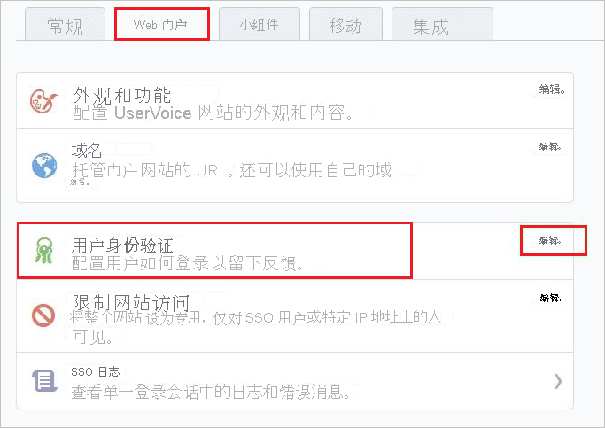
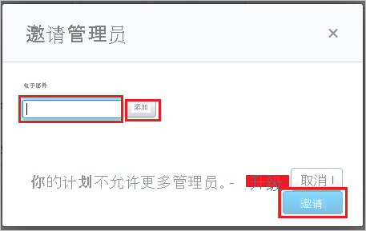

# 教程：Azure Active Directory 与 UserVoice 集成

本教程介绍如何将 UserVoice 与 Azure Active Directory (Azure AD) 集成。 将 UserVoice 与 Azure AD 集成后，可以：

* 在 Azure AD 中控制谁有权访问 UserVoice。
* 让用户使用其 Azure AD 帐户自动登录到 UserVoice。
* 在一个中心位置（Azure 门户）管理帐户。

## 必备条件

若要配置 Azure AD 与 UserVoice 的集成，需备齐以下项目：

* 一个 Azure AD 订阅。 如果没有 Azure AD 环境，可以获取一个[免费帐户](https://azure.microsoft.com/free/)。
* 已启用 UserVoice 单一登录的订阅。

## 方案描述

本教程会在测试环境中配置和测试 Azure AD 单一登录。

* UserVoice 支持 SP 发起的 SSO。

## 从库中添加 UserVoice

要配置 UserVoice 与 Azure AD 的集成，需要从库中将 UserVoice 添加到托管 SaaS 应用列表。

1. 使用工作或学校帐户或个人 Microsoft 帐户登录到 Azure 门户。
1. 在左侧导航窗格中，选择“Azure Active Directory”服务  。
1. 导航到“企业应用程序”，选择“所有应用程序”   。
1. 若要添加新的应用程序，请选择“新建应用程序”。
1. 在“从库中添加”部分的搜索框中，键入“UserVoice”。
1. 从结果面板中选择“UserVoice”，然后添加该应用。 在该应用添加到租户时等待几秒钟。

## 配置并测试 UserVoice 的 Azure AD SSO

使用名为 B.Simon 的测试用户配置和测试 UserVoice 的 Azure AD SSO。 若要使 SSO 正常工作，需要在 Azure AD 用户与 UserVoice 中的相关用户之间建立关联。

若要配置并测试 UserVoice 的 Azure AD SSO，请执行以下步骤：

1. **[配置 Azure AD SSO](#configure-azure-ad-sso)** - 使用户能够使用此功能。
    1. **[创建 Azure AD 测试用户](#create-an-azure-ad-test-user)** - 使用 B. Simon 测试 Azure AD 单一登录。
    1. **[分配 Azure AD 测试用户](#assign-the-azure-ad-test-user)** - 使 B. Simon 能够使用 Azure AD 单一登录。
1. [配置 UserVoice SSO](#configure-uservoice-sso) - 在应用程序端配置单一登录设置。
    1. [创建 UserVoice 测试用户](#create-uservoice-test-user) - 在 UserVoice 中创建 B.Simon 的对应用户，并将其关联到用户的 Azure AD 表示形式。
1. **[测试 SSO](#test-sso)** - 验证配置是否正常工作。

## 配置 Azure AD SSO

按照下列步骤在 Azure 门户中启用 Azure AD SSO。

1. 在 Azure 门户的 UserVoice 应用程序集成页上，找到“管理”部分并选择“单一登录”。
1. 在“选择单一登录方法”页上选择“SAML” 。
1. 在“设置 SAML 单一登录”页面上，单击“基本 SAML 配置”旁边的铅笔图标以编辑设置 。

   

4. 在“基本 SAML 配置”部分中，按照以下步骤操作：

    a. 在“标识符(实体 ID)”文本框中，使用以下模式键入 URL：`https://<TENANT_NAME>.UserVoice.com`

    b. 在“登录 URL”文本框中，使用以下模式键入 URL：`https://<TENANT_NAME>.UserVoice.com` 

    > [!NOTE]
    > 这些不是实际值。 使用实际标识符和登录 URL 更新这些值。 请联系 [UserVoice 客户端支持团队](https://www.uservoice.com/)获取这些值。 还可以参考 Azure 门户中的“基本 SAML 配置”  部分中显示的模式。

5. 在“SAML 签名证书”  部分中，单击“编辑”  按钮以打开“SAML 签名证书”  对话框。

    

6. 在“SAML 签名证书”部分中，复制 **指纹** 并将其保存在计算机上。

    

7. 在“设置 UserVoice”部分，根据要求复制相应的 URL。 

    

### 创建 Azure AD 测试用户 

在本部分，我们将在 Azure 门户中创建名为 B.Simon 的测试用户。

1. 在 Azure 门户的左侧窗格中，依次选择“Azure Active Directory”、“用户”和“所有用户”  。
1. 选择屏幕顶部的“新建用户”。
1. 在“用户”属性中执行以下步骤：
   1. 在“名称”字段中，输入 `B.Simon`。  
   1. 在“用户名”字段中输入 username@companydomain.extension。 例如，`B.Simon@contoso.com`。
   1. 选中“显示密码”复选框，然后记下“密码”框中显示的值。
   1. 单击“创建”。

### 分配 Azure AD 测试用户

在本部分，你将通过授予 B.Simon 访问 UserVoice 的权限，使其能够使用 Azure 单一登录。

1. 在 Azure 门户中，依次选择“企业应用程序”、“所有应用程序”。 
1. 在应用程序列表中，选择“UserVoice”  。
1. 在应用的概述页中，找到“管理”部分，选择“用户和组” 。
1. 选择“添加用户”，然后在“添加分配”对话框中选择“用户和组”。
1. 在“用户和组”对话框中，从“用户”列表中选择“B.Simon”，然后单击屏幕底部的“选择”按钮。
1. 如果你希望将某角色分配给用户，可以从“选择角色”下拉列表中选择该角色。 如果尚未为此应用设置任何角色，你将看到选择了“默认访问权限”角色。
1. 在“添加分配”对话框中，单击“分配”按钮。

## 配置 UserVoice SSO

1. 在另一个 Web 浏览器窗口中，以管理员身份登录到 UserVoice 公司站点。

2. 在顶部工具栏中，单击“设置”，并从菜单中选择“Web 门户”。  
   
    

3. 在“Web 门户”  选项卡的“用户身份验证”  部分中，单击“编辑”  以打开“编辑用户身份验证”  对话框页
   
    

4. 在“编辑用户身份验证”  对话框页上，执行以下步骤：
   
    
   
    a. 单击“单一登录(SSO)”  。
 
    b. 将从 Azure 门户复制的“登录 URL”值粘贴到“SSO 远程登录”文本框中。  

    c. 将从 Azure 门户复制的“注销 URL”值粘贴到“SSO 远程注销”文本框中。  
 
    d. 将从 Azure 门户复制的“指纹”值粘贴到“当前证书 SHA1 指纹”文本框中 。
    
    e. 单击“保存身份验证设置”  。

### 创建 UserVoice 测试用户

为了使 Azure AD 用户能够登录到 UserVoice，必须将其预配到 UserVoice 中。 对于 UserVoice，需要手动执行预配。

### 若要预配用户帐户，请执行以下步骤：

1. 登录到 **UserVoice** 租户。

2. 转到“设置”  。
   
    

3. 单击 **“常规”** 。

4. 单击“代理和权限”  。
   
    

5. 单击“添加管理员”  。
   
    

6. 在“邀请管理员”  对话框中，执行以下步骤：
   
    
   
    a. 在“电子邮件”文本框中，键入要预配帐户的电子邮件地址，并单击“添加”  。
   
    b. 单击“邀请”。 

> [!NOTE]
> 可以使用 UserVoice 提供的任何其他 UserVoice 用户帐户创建工具或 API 来预配 Azure AD 用户帐户。

## 测试 SSO 

在本部分，你将使用以下选项测试 Azure AD 单一登录配置。 

* 在 Azure 门户中单击“测试此应用程序”。 这会重定向到 UserVoice 登录 URL，你可以从那里启动登录流。 

* 直接转到 UserVoice 登录 URL，并从那里启动登录流。

* 你可使用 Microsoft 的“我的应用”。 单击“我的应用”中的 UserVoice 磁贴时，会重定向到 UserVoice 登录 URL。 有关“我的应用”的详细信息，请参阅[“我的应用”简介](https://support.microsoft.com/account-billing/sign-in-and-start-apps-from-the-my-apps-portal-2f3b1bae-0e5a-4a86-a33e-876fbd2a4510)。

## 后续步骤

配置 UserVoice 后，可以强制实施会话控制，实时防止组织的敏感数据外泄和渗透。 会话控制从条件访问扩展而来。 [了解如何通过 Microsoft Cloud App Security 强制实施会话控制](/cloud-app-security/proxy-deployment-aad)。