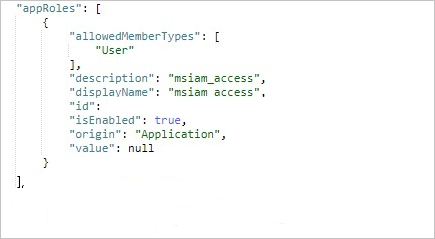

# <a name="tutorial-azure-ad-sso-integration-with-vida"></a>教程：Azure AD SSO 与 VIDA 集成

本教程介绍如何将 VIDA 与 Azure Active Directory (Azure AD) 集成。 将 VIDA 与 Azure AD 集成后，可以：

* 在 Azure AD 中控制谁有权访问 VIDA。
* 让用户使用其 Azure AD 帐户自动登录到 VIDA。
* 在一个中心位置（Azure 门户）管理帐户。

## <a name="prerequisites"></a>先决条件

若要开始操作，需备齐以下项目：

* 一个 Azure AD 订阅。 如果没有订阅，可以获取一个[免费帐户](https://azure.microsoft.com/free/)。
* 已启用 VIDA 单一登录 (SSO) 的订阅。

## <a name="scenario-description"></a>方案描述

本教程在测试环境中配置并测试 Azure AD SSO。

* VIDA 支持 SP 发起的 SSO。

* VIDA 支持实时用户预配。

## <a name="adding-vida-from-the-gallery"></a>从库中添加 VIDA

若要配置 VIDA 与 Azure AD 的集成，需要从库中将 VIDA 添加到托管 SaaS 应用列表。

1. 使用工作或学校帐户或个人 Microsoft 帐户登录到 Azure 门户。
1. 在左侧导航窗格中，选择“Azure Active Directory”服务  。
1. 导航到“企业应用程序”，选择“所有应用程序”   。
1. 若要添加新的应用程序，请选择“新建应用程序”。
1. 在“从库中添加”部分的搜索框中，键入“VIDA” 。
1. 在结果面板中选择“VIDA”，然后添加该应用。 在该应用添加到租户时等待几秒钟。


## <a name="configure-and-test-azure-ad-sso-for-vida"></a>配置并测试 VIDA 的 Azure AD SSO

使用名为 B.Simon 的测试用户配置并测试 VIDA 的 Azure AD SSO。 若要使 SSO 正常工作，需要在 Azure AD 用户与 VIDA 中的相关用户之间建立关联。

若要配置并测试 VIDA 的 Azure AD SSO，请执行以下步骤：

1. **[配置 Azure AD SSO](#configure-azure-ad-sso)** - 使用户能够使用此功能。
    1. **[创建 Azure AD 测试用户](#create-an-azure-ad-test-user)** - 使用 B. Simon 测试 Azure AD 单一登录。
    1. **[分配 Azure AD 测试用户](#assign-the-azure-ad-test-user)** - 使 B. Simon 能够使用 Azure AD 单一登录。
1. **[配置 VIDA SSO](#configure-vida-sso)** - 在应用程序端配置单一登录设置。
    1. **[创建 VIDA 测试用户](#create-vida-test-user)** - 在 VIDA 中创建 B.Simon 的对应用户，并将其链接到该用户在 Azure AD 中的表示形式。
1. **[测试 SSO](#test-sso)** - 验证配置是否正常工作。

## <a name="configure-azure-ad-sso"></a>配置 Azure AD SSO

按照下列步骤在 Azure 门户中启用 Azure AD SSO。

1. 在 Azure 门户中的“VIDA”应用程序集成页上，找到“管理”部分并选择“单一登录”。  
1. 在“选择单一登录方法”页上选择“SAML” 。
1. 在“设置 SAML 单一登录”页面上，单击“基本 SAML 配置”旁边的铅笔图标以编辑设置 。

   

1. 在“基本 SAML 配置”部分，输入以下字段的值：

    a. 在“标识符(实体 ID)”文本框中，键入值：`urn:amazon:cognito:sp:eu-west-2_IDmTxjGr6`
    
    b. 在“回复 URL”文本框中键入 URL：`https://vitruevida.auth.eu-west-2.amazoncognito.com/saml2/idpresponse`
    
    c. 在“登录 URL”文本框中，使用以下模式键入 URL： 
    
    `https://vitruevida.com/?teamid=<ID>&idp=<IDP_NAME>`

    > [!NOTE]
    > 登录 URL 值不是实际值。 请使用实际登录 URL 更新此值。 请联系 [VIDA 客户端支持团队](mailto:support@vitruehealth.com)获取该值。 还可以参考 Azure 门户中的“基本 SAML 配置”  部分中显示的模式。

1. VIDA 应用程序需要特定格式的 SAML 断言，这要求将自定义属性映射添加到 SAML 令牌属性配置。 以下屏幕截图显示了默认属性的列表。

    

1. 除了上述属性，VIDA 应用程序还要求在 SAML 响应中传递回更多的属性，如下所示。 这些属性也是预先填充的，但可以根据要求查看它们。
    
    | 名称 | 源属性|
    | ---------------- | --------- |
    | assignedroles | user.assignedroles |

1. 在“使用 SAML 设置单一登录”页的“SAML 签名证书”部分中找到“联合元数据 XML”，选择“下载”以下载该证书并将其保存在计算机上     。

    

1. 在“设置 VIDA”部分中，根据要求复制相应的 URL。

    

### <a name="create-an-azure-ad-test-user"></a>创建 Azure AD 测试用户

在本部分，我们将在 Azure 门户中创建名为 B.Simon 的测试用户。

1. 在 Azure 门户的左侧窗格中，依次选择“Azure Active Directory”、“用户”和“所有用户”  。
1. 选择屏幕顶部的“新建用户”。
1. 在“用户”属性中执行以下步骤：
   1. 在“名称”字段中，输入 `B.Simon`。  
   1. 在“用户名”字段中输入 username@companydomain.extension。 例如，`B.Simon@contoso.com`。
   1. 选中“显示密码”复选框，然后记下“密码”框中显示的值。
   1. 单击“创建”。

### <a name="assign-the-azure-ad-test-user"></a>分配 Azure AD 测试用户

在本部分中，将通过授予 B.Simon 访问 VIDA 的权限，允许其使用 Azure 单一登录。

1. 在 Azure 门户中，依次选择“企业应用程序”、“所有应用程序”。 
1. 在应用程序列表中选择“VIDA”。
1. 在应用的概述页中，找到“管理”部分，选择“用户和组” 。
1. 选择“添加用户”，然后在“添加分配”对话框中选择“用户和组”。
1. 在“用户和组”对话框中，从“用户”列表中选择“B.Simon”，然后单击屏幕底部的“选择”按钮。
1. 如果你希望将某角色分配给用户，可以从“选择角色”下拉列表中选择该角色。 如果尚未为此应用设置任何角色，你将看到选择了“默认访问权限”角色。
1. 在“添加分配”对话框中，单击“分配”按钮。  

## <a name="configure-role-based-single-sign-on-in-vida"></a>在 VIDA 中配置基于角色的单一登录

1. 若要将 VIDA 角色与 Azure AD 用户相关联，必须执行以下步骤在 Azure AD 中创建一个角色：

    a. 登录到 [Microsoft Graph 资源管理器](https://developer.microsoft.com/graph/graph-explorer)。

    b. 单击“修改权限”以获取创建角色所需的权限。 

    

    c. 从列表中选择以下权限，然后单击“修改权限”，如下图所示。 

    

    >[!NOTE]
    >授予权限后，再次登录到 Graph 资源管理器。

    d. 在“Graph 资源管理器”页上，从第一个下拉列表中选择“GET”，从第二个下拉列表中选择“beta”。   在下拉列表旁边的字段中输入 `https://graph.microsoft.com/beta/servicePrincipals`，然后单击“运行查询”。 

    

    >[!NOTE]
    >如果使用多个目录，可以在查询字段中输入 `https://graph.microsoft.com/beta/contoso.com/servicePrincipals`。

    e. 在“响应预览”部分，从“服务主体”中提取 appRoles 属性，供以后使用。 

    

    >[!NOTE]
    >在查询字段中输入 `https://graph.microsoft.com/beta/servicePrincipals/<objectID>` 可以找到 appRoles 属性。 请注意，`objectID` 是从 Azure AD 的“属性”页复制的对象 ID。 

    f. 返回 Graph 资源管理器，将方法从 **GET** 更改为 **PATCH**，将以下内容粘贴到“请求正文”部分，然后单击“运行查询”：  
    
   ```
   { 
   "appRoles": [
       {
           "allowedMemberTypes": [
           "User"
           ],
           "description": "User",
           "displayName": "User",
           "id": "18d14569-c3bd-439b-9a66-3a2aee01****",
           "isEnabled": true,
           "origin": "Application",
           "value": null
       },
       {
           "allowedMemberTypes": [
           "User"
           ],
           "description": "msiam_access",
           "displayName": "msiam_access",
           "id": "b9632174-c057-4f7e-951b-be3adc52****",
           "isEnabled": true,
           "origin": "Application",
           "value": null
       },
       {
       "allowedMemberTypes": [
           "User"
       ],
       "description": "VIDACompanyAdmin",
       "displayName": "VIDACompanyAdmin",
       "id": "293414bb-2215-48b4-9864-64520937d437",
       "isEnabled": true,
       "origin": "ServicePrincipal",
       "value": "VIDACompanyAdmin"
       },
       {
       "allowedMemberTypes": [
           "User"
       ],
       "description": "VIDATeamAdmin",
       "displayName": "VIDATeamAdmin",
       "id": "2884f1ae-5c0d-4afd-bf28-d7d11a3d7b2c",
       "isEnabled": true,
       "origin": "ServicePrincipal",
       "value": "VIDATeamAdmin"
       },
       {
       "allowedMemberTypes": [
           "User"
       ],
       "description": "VIDAUser",
       "displayName": "VIDAUser",
       "id": "37b3218c-0c06-484f-90e6-4390ce5a8787",
       "isEnabled": true,
       "origin": "ServicePrincipal",
       "value": "VIDAUser"
       }
   ]
   }
   ```
   > [!NOTE]
   > Azure AD 会在 SAML 响应中将这些角色的值作为声明值发送。 但是，对于修补操作，只能在 `msiam_access` 部分的后面添加新角色。 若要顺利完成创建过程，我们建议使用 ID 生成器（例如 GUID 生成器）实时生成 ID。

   g. 使用所需的角色修补“服务主体”后，请遵循本教程的“分配 Azure AD 测试用户”部分所述的步骤，将角色附加到 Azure AD 用户 (B.Simon)。

## <a name="configure-vida-sso"></a>配置 VIDA SSO

若要在 VIDA 端配置单一登录，需要将下载的“联合元数据 XML”以及从 Azure 门户复制的相应 URL 发送给 [VIDA 支持团队](mailto:support@vitruehealth.com)。 他们会对此进行设置，使两端的 SAML SSO 连接均正确设置。

### <a name="create-vida-test-user"></a>创建 VIDA 测试用户

在本部分中，我们会在 VIDA 中创建一个名为 Britta Simon 的用户。 VIDA 支持默认启用的实时用户预配。 此部分不存在任何操作项。 如果 VIDA 中尚不存在用户，身份验证后会创建一个新用户。

## <a name="test-sso"></a>测试 SSO 

在本部分，你将使用以下选项测试 Azure AD 单一登录配置。 

* 在 Azure 门户中单击“测试此应用程序”。 这样将会重定向到 VIDA 登录 URL，可在其中启动登录流。 

* 直接转到 VIDA 登录 URL，并从那里启动登录流。

* 你可使用 Microsoft 的“我的应用”。 在“我的应用”中单击 VIDA 磁贴时，会重定向到 VIDA 登录 URL。 有关“我的应用”的详细信息，请参阅[“我的应用”简介](../user-help/my-apps-portal-end-user-access.md)。

## <a name="next-steps"></a>后续步骤

配置 VIDA 后，可以强制实施会话控制，实时防止组织的敏感数据外泄和渗透。 会话控制从条件访问扩展而来。 [了解如何通过 Microsoft Cloud App Security 强制实施会话控制](/cloud-app-security/proxy-deployment-aad)。

