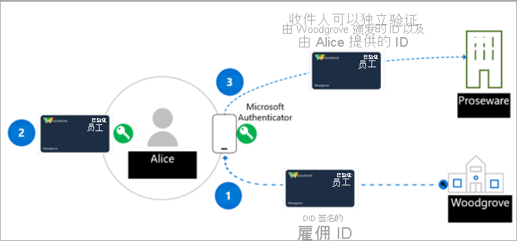

# <a name="introduction-to-azure-active-directory-verifiable-credentials-preview"></a>Azure Active Directory 可验证凭据简介（预览）

> [!IMPORTANT]
> 当前 Azure Active Directory 可验证凭据为公共预览版。
> 此预览版在提供时没有附带服务级别协议，不建议将其用于生产工作负荷。 某些功能可能不受支持或者受限。 有关详细信息，请参阅 [Microsoft Azure 预览版补充使用条款](https://azure.microsoft.com/support/legal/preview-supplemental-terms/)。

为接触一整套丰富的体验，我们的数字和实际生活越来越多地链接到我们使用的各种应用、服务和设备。 这种数字转换让我们能够与上百个公司和上千个其他用户交互，这是从前难以想象的事。

但身份数据也因此频繁暴露在安全漏洞之下。 这些漏洞会影响我们的社会生活、职业和经济状况。 Microsoft 相信有更好的方法。 每个人都有权拥有和控制标识，让用户能安全地存储其数字身份的元素并保留隐私。 本入门指南将介绍我们如何与多元社区联手构建一个开放、可信任、可互操作且基于标准的分散式身份识别 (DID) 解决方案，同时面向个人的组织。

## <a name="why-we-need-decentralized-identity"></a>为什么需要分散式身份识别 (DID)

如今，我们不管是工作还是生活都要用到数字身份，它存在于我们使用的每个应用、服务和设备当中。 它由我们所说的任何内容、所做的任何行为以及生活中的经历组成。购买活动入场券，检入旅馆，甚至午餐点单都会成为它的一部分。 当前，我们的身份和所有数字交互都由第三方拥有和控制，我们甚至意识不到他们中一些人的存在。

通常，用户向数个应用和设备同意授权。 此行为需要用户的高度警惕，跟踪谁有权访问哪些信息。 对企业来说，与消费者和合作伙伴的合作需要高度接触的业务流程，确保数据交换过程安全，保证所有参与方的隐私和安全。

我们相信，基于标准的分散式身份识别系统可以解放一种全新的体验，使用户和组织能够更好地控制其数据，并提高应用、设备和服务提供商的可信任和安全性。

## <a name="lead-with-open-standards"></a>领先的开放标准

我们致力于与客户、合作伙伴和社区密切合作，以解锁新一代基于用户体验的分散式身份识别，能与在此领域取得惊人贡献的个人和组织合作让我们分外激动。 如果要帮助 DID 系统成长，标准、技术组件和代码可交付结果必须是开源的并向所有人开放。

Microsoft 正在与分散式身份识别基金会 (DIF) 成员、W3C 凭据社区集团和更广泛的身份识别社区积极合作。 我们与这些集团合作制定和改进关键标准，并在我们的服务中实现了以下标准。

* [W3C 分散式身份识别方法](https://www.w3.org/TR/did-core/)
* [W3C 可验证凭据](https://www.w3.org/TR/vc-data-model/)
* [DIF Sidetree](https://identity.foundation/sidetree/spec/)
* [DIF 知名 DID 配置](https://identity.foundation/specs/did-configuration/)
* [DIF DID-SIOP](https://identity.foundation/did-siop/)
* [DIF 表示文交换](https://identity.foundation/presentation-exchange/)


## <a name="what-are-dids"></a>什么是 DID？

在了解 DID 之前，将它们与目前的身份识别系统进行比较更有助于理解。 电子邮件地址和社交网络 ID 是用于协作的友好别名，但现在会作为数据访问控制点存在于许多协作之外的方案中。 这会造成潜在的问题，因为外部方可以随时删除对这些 ID 的访问权限。

分散标式身份识别方法 (DID) 不同。 DID 是植于类似 ION 去中心化系统上的用户生成、自拥有的全局唯一身份识别方法。 它们具有独特的特征，比如更好的防篡改保障、删减对抗和改动规避。 这些特征对于旨在提供自行所有权和用户控制的任何 ID 系统至关重要。 

Microsoft 的可验证凭据解决方案使用去中心化凭据 (DID)，以加密的方式签署身份验证，即信赖方（验证程序）需通过信息验证证明其是否为可验证凭据的所有者。 建议需要根据 Microsoft 产品/服务创建可验证凭据解决方案的用户对 DID 有一个基本的理解。

## <a name="what-are-verifiable-credentials"></a>什么是可验证凭据？

我们在日常生活中都会用到 ID。 我们用驾照证明我们有操纵汽车的能力。 大学颁发学位证书证明我们的教育水平。 在我们到达其他国家/地区的时候，我们用护照证明我们所属的主权国家/地区。 数据模型描述在互联网上工作时我们如何处理这类情形，但是是以尊重用户隐私的安全方式。 你可以在[可验证凭据数据模型 1.0](https://www.w3.org/TR/vc-data-model/)中获取更多信息。

简而言之，可验证凭据是由颁发者对使用者信息验证的声明组成的数据对象。 这些声明由架构标识，其中包括 DID、颁发者、和使用者。 颁发者的 DID 将创建数字签名作为验证此信息的证明。


## <a name="how-does-decentralized-identity-work"></a>分散式身份识别的工作原理是什么？

我们需要一种新的身份识别方式。 我们需要一种身份识别方式，它能将技术和标准结合在一起，表现出如自我所有权和删减对抗的身份识别特征。 使用现有的系统难以实现这些功能。

为了满足这些承诺，我们需要由七个关键创新构成的技术基础。 其中一个创新是用户拥有的标识符，由用户代理管理与此类标识符关联的密钥，以及经过加密的、用户控制的数据存储。


**1. W3C 分散式身份识别 (DID)** 用户独立于任何组织或政府创建、所有和控制 ID。 DID 是全局唯一的标识符，链接到分散式公钥基础结构 (DPKI)，其元数据由 JSON 文档组成，包含公钥材料、身份验证描述符和服务终结点。

**2. 去中心化系统：ION（身份覆盖网络）** ION 是基于完全确定性 Sidetree 协议的 2 层公开权限网络，无需特殊令牌、信任的验证程序或其他共识机制；操作仅需比特币时间链的线性进程。 我们有[开放源代码 npm 包](https://www.npmjs.com/package/@decentralized-identity/ion-tools)，使 ION 网络能够轻松地与你的应用和服务集成。 库中包括创建新的 DID、生成密钥并将 DID 定位到比特币区块链上。 

**3. DID 用户代理/钱包：Microsoft Authenticator 应用程序** 允许真人使用分散式身份识别和可验证凭据。 Authenticator 创建 DID，辅助可验证凭据的颁发和演示请求，并通过加密的钱包文件管理 DID 种子备份。

**4. Microsoft Resolver** 链接到 ION 节点的 API，使用此方法查找和解决 DID，```did:ion```并返回 DID 文档对象 (DDO)。 DDO 包含与 DID 关联的 DPKI 元数据，如公钥和服务终结点。 

**5. Azure Active Directory 可验证凭据服务**[W3C 可验证凭据](https://www.w3.org/TR/vc-data-model/)的颁发和验证 API 以及开源 SDK 由此方法签发```did:ion```。 允许身份所有者生成、提供和验证声明。 这构成了系统用户之间的信任基础。

## <a name="a-sample-scenario"></a>示例方案

用于说明 VC 工作原理的方案包括：

- Woodgrove Inc. 公司。
- Proseware，一家为 Woodgrove 员工提供折扣的公司。
- Alice，是 Woodgrove，Inc. 的员工，想获得 Proseware 的折扣


今天，Alice 提供用户名和密码，登录到了 Woodgrove 的网络环境。 Woodgrove 正在部署 VC 解决方案，以便用更易管理的方法让 Alice 能够证明她是 Woodgrove 的员工。 Proseware 使用的 VC 解决方案与 Woodgrove 的 VC 解决方案兼容，并接受 Woodgrove 作为雇佣方颁发的凭据证明。

凭据的颁发者 Woodgrove Inc. 创建了公钥和私钥。 公钥存储在 ION 上。 将公钥添加到基础结构中时，会在基于区块链的分散式帐本中记录该条目。 颁发者为 Alice 提供的是存储在钱包应用中的私钥。 每次 Alice 成功使用私钥时，都会在钱包应用中记录该事务。


## <a name="roles-in-a-verifiable-credential-solution"></a>可验证凭据解决方案中的角色 

可验证凭据解决方案中有三个主要参与者。 在下图中：

- 步骤 1，用户从颁发者那里请求可验证凭据。
- 步骤 2，凭据的颁发者会证实用户提供的证明是准确的，并创建一个使用其 DID 签名的可验证凭据，并且将用户的 DID 作为使用方。
- 在步骤 3，用户用他们的 DID 签署可验证展示 (VP)，并将其发送给验证程序。 然后，验证程序通过匹配 DPKI 中的公钥来验证凭据。

此方案中的角色是：



颁发者——颁发者是从用户处请求信息以创建颁发解决方案的组织。 信息用于验证用户的身份。 例如，Woodgrove，Inc. 提供一个颁发解决方案，使他们能够创建 (VC) 可验证凭据并将其分发给所有员工。 员工使用其用户名和密码登录 Authenticator 应用程序，该应用程序将 ID 令牌传递给颁发服务。 Woodgrove，Inc. 验证提交的 ID 令牌后，颁发解决方案会创建一个 VC，其中包含有关员工的声明，声明经过 Woodgrove，Inc. 的 DID 签名。 员工现在就有了一个由雇主签署的可验证凭据，其中包括员工的 DID 作为使用方的 DID。  

用户——用户是请求 VC 的人员或实体。 例如，Alice 是 Woodgrove，Inc. 的新员工，以前曾被颁发雇用可验证凭据作为证明。 当 Alice 需要提供雇用证明以便在 Proseware 上获得折扣时，她可以通过对可验证展示签名，以证明 Alice 是该 DID 的所有者，从而授予对 Authenticator 应用中的凭据的访问权限。 Proseware 能够验证由 Woodgrove，Inc. 颁发的凭据，而 Alice 就是凭据的所有者。 

验证方——验证方是需要验证一个或多个颁发者信任的声明的公司或实体。 例如，Proseware 相信 Woodgrove，Inc. 为验证其员工的身份做了充足的工作，并颁发真实、有效的 VC。 当 Alice 尝试对她工作所需的设备进行排序时，Proseware 将使用开放标准（如 SIOP 和“展示交换”）来请求用户凭据，证明他们是 Woodgrove，Inc. 的员工。例如，Proseware 可能会为 Alice 提供一个链接，该链接指向一个包含 QR 码的网站，需要她使用手机相机进行扫描。 这会为特定的 VC 启动请求，Authenticator 将分析该请求，并赋予 Alice 批准请求的能力，证明其雇佣 Proseware。 Proseware 可以使用可验证凭据服务 API 或 SDK 来验证可验证展示的真实性。 基于 Alice 提供的信息，他们就会为 Alice 提供折扣。 如果其他公司和组织知道 Woodgrove，Inc. 向其员工颁发 VCs，他们还可以创建一个验证解决方案，并使用 Woodgrove，Inc. 的可验证凭据，为 Woodgrove，Inc. 的员工提供专门优惠。

## <a name="next-steps"></a>后续步骤

了解 DID 和可验证凭据后，请按照入门文章或我们其中一篇讲述可验证凭据概念更多信息的文章自行体验。

- [开始使用可验证凭据](get-started-verifiable-credentials.md)
- [如何定制专属凭据](credential-design.md)
- [可验证凭据 FAQ](verifiable-credentials-faq.md)
