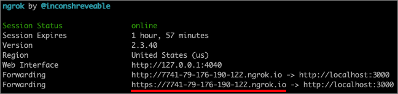

# <a name="issue-azure-ad-verifiable-credentials-from-an-application-preview"></a>从应用程序颁发 Azure AD 可验证凭据（预览）

在本教程中，你将从连接到 Azure Active Directory (Azure AD) 租户的本地计算机运行示例应用程序。 使用该应用程序，你将颁发已验证凭据专家卡并对其进行验证。

在本文中，学习如何：

> [!div class="checklist"]
>
> - 设置一个 Azure Blob 存储用于存储可验证凭据配置文件。
> - 创建并上传可验证凭据配置文件。
> - 在 Azure 中创建已验证凭据专家卡。
> - 收集凭据和环境详细信息来设置示例应用程序。
> - 将示例应用程序代码下载到本地计算机。
> - 使用已验证凭据专家卡和环境详细信息更新示例应用程序。
> - 运行示例应用程序并颁发第一张已验证凭据专家卡。
> - 验证已验证凭据专家卡。

下图说明了 Azure AD 可验证凭据体系结构和你配置的组件。


## <a name="prerequisites"></a>先决条件

- 在开始之前，有必要[为 Azure AD 可验证凭据设置租户](https://tbd-link-to-the-tenant-config-article/)。
- 若要克隆托管示例应用的存储库，请安装 [Git](https://git-scm.com/downloads)
- [Visual Studio Code](https://code.visualstudio.com/Download) 或其他代码编辑器
- [.NET 5.0](https://dotnet.microsoft.com/download/dotnet/5.0)
- [NGROK](https://ngrok.com/) 免费版。
- 安装了 Microsoft Authenticator 的移动设备
  - 已安装 Android 6.2108.5654 或更高版本。
  - 已安装 iOS 6.5.82 或更高版本。

## <a name="create-a-storage-account"></a>创建存储帐户

Azure Blob 存储是 Microsoft 提供的适用于云的对象存储解决方案。 在颁发可验证凭据时，Azure AD 可验证凭据服务使用 [Azure Blob 存储](/azure/storage/blobs/storage-blobs-introduction)来存储可验证凭据配置文件。

请按照以下步骤来创建和配置 Azure Blob 存储：

1. 如果你没有 Azure Blob 存储帐户，请[创建一个存储帐户](/azure/storage/common/storage-account-create)。
1. 创建存储帐户后，创建一个容器。 在存储帐户的左侧菜单中，滚动到“数据存储”部分，然后选择“容器” 。
1. 选择“+ 容器”。 
1. 键入新容器的名称。 容器名称必须小写，必须以字母或数字开头，并且只能包含字母、数字和短划线 (-) 字符。 例如“vc-container”。
1. 将“公共访问级别”设置为“专用”（非匿名访问） 。
1. 选择“创建”。  

    以下屏幕截图演示了如何创建容器：  

   

## <a name="grant-access-to-the-container"></a>授予对容器的访问权限

创建容器后，请为已登录的用户授予适当的角色分配，以便他们能够访问存储 Blob 中的文件。

1. 在容器列表中，选择“vc-container”。

1. 在菜单中选择“访问控制(IAM)”。

1. 依次选择“+ 添加”和“添加角色分配” 

     

1. 在“添加角色分配”页面：

    1. 对于“角色”，选择“存储 Blob 数据读取者” 。

    1. 对于“将访问权限分配给”，选择“用户、组或服务主体” 

    1. 然后，搜索用于执行这些步骤的帐户并将其选中。

        

>[!IMPORTANT]
>默认情况下，容器创建者会被分配到“所有者”角色。 只有“所有者”角色是不够的。 你的帐户需要“存储 Blob 数据读取器”角色。 有关详细信息，请参阅[使用 Azure 门户分配用于访问 Blob 和队列数据的 Azure 角色](/azure/storage/blobs/assign-azure-role-data-access)。

### <a name="upload-the-configuration-files"></a>上传配置文件

Azure AD 可验证凭据服务使用两个 JSON 配置文件 -“规则”和“显示文件”。 

- 规则文件描述了可验证凭据的重要属性。 具体来说，它描述了向为主体（用户）颁发可验证凭据之前他们需要提供的声明。 
- 显示文件用于控制凭据的品牌以及声明的样式。

在本部分，你要将示例规则和显示文件上传到存储中。 若要详细了解如何自定义这些文件，请参阅[如何自定义可验证凭据](credential-design.md)。

若要上传配置文件，请执行以下步骤：

1. 复制以下 JSON，将内容保存到名为 VerifiedCredentialExpertDisplay.json 的文件中。

    ```json
    {
      "default": {
        "locale": "en-US",
        "card": {
          "title": "Verified Credential Expert",
          "issuedBy": "Microsoft",
          "backgroundColor": "#2E4053",
          "textColor": "#ffffff",
          "logo": {
            "uri": "https://didcustomerplayground.blob.core.windows.net/public/VerifiedCredentialExpert_icon.png",
            "description": "Verified Credential Expert Logo"
          },
          "description": "Use your verified credential to prove to anyone that you know all about verifiable credentials."
        },
        "consent": {
          "title": "Do you want to get your Verified Credential?",
          "instructions": "Sign in with your account to get your card."
        },
        "claims": {
          "vc.credentialSubject.firstName": {
            "type": "String",
            "label": "First name"
          },
          "vc.credentialSubject.lastName": {
            "type": "String",
            "label": "Last name"
          }
        }
      }
    }
    ```

1. 复制以下 JSON，将内容保存到名为 VerifiedCredentialExpertRules.json 的文件中。 下列可验证凭据定义了其中的几个简单声明：firstName 和 lastName。

    ```json
    {
      "attestations": {
        "idTokens": [
          {
            "id": "https://self-issued.me",
            "mapping": {
              "firstName": { "claim": "$.given_name" },
              "lastName": { "claim": "$.family_name" }
            },
            "configuration": "https://self-issued.me",
            "client_id": "",
            "redirect_uri": ""
          }
        ]
      },
      "validityInterval": 2592001,
      "vc": {
        "type": [ "VerifiedCredentialExpert" ]
      }
    }
    ```
    
1. 在 Azure 门户中，导航到[你创建的](#create-a-storage-account) Azure Blob 存储容器。

1. 在左侧菜单中，选择“容器”来显示其包含的 Blob 的列表。 然后，选择此前创建的“vc-container”。

1. 选择“上传”按钮打开“上传”边栏选项卡，并浏览本地文件系统，找到要上传的文件。 选择“VerifiedCredentialExpertDisplay.json”和“VerifiedCredentialExpertRules.json”文件。  然后选择“上传”，将文件上传到容器中。

## <a name="create-the-verifiable-credential-expert-card-in-azure"></a>在 Azure 中创建可验证凭据专家卡

在此步骤中，你将使用 Azure AD 可验证凭据创建可验证凭据专家卡。 创建已验证凭据后，Azure AD 租户可将此凭据颁发给启动可验证凭据颁发过程的用户。

1. 使用 [ Azure 门户](https://portal.azure.com/)主搜索输入来搜索可验证凭据。 然后，选择“可验证凭据(预览版)”。
1. [设置租户](verifiable-credentials-configure-tenant.md)后，应会显示“创建新凭据”选项的屏幕。 如果该屏幕未打开，或者你想要创建更多凭据，请在左侧菜单中选择“凭据”。 然后选择“+ 添加凭据”。
1. 请在“创建新凭据”页中，执行以下操作：

    1. 输入“VerifiedCredentialExpert”作为凭据名称 。 该名称用于在门户中识别可验证凭据。 它作为可验证凭据协定的一部分。

    1. 选择在其中创建了 Azure Blob 存储的 Azure AD订阅。

    1. 在“显示文件”下，选择“显示文件” 。 在“存储帐户”部分，选择“vc-container”。 然后，选择 VerifiedCredentialExpertDisplay.json 文件并单击“选择” 。

    1. 在“规则文件”下，选择“规则文件” 。 在“存储帐户”部分，选择“vc-container”。 然后，选择 VerifiedCredentialExpertRules.json 文件并单击“选择” 。

    以下屏幕截图演示了如何创建新凭据：

    

1. 在“创建新凭据”屏幕上，选择“创建”。

## <a name="gather-credentials-and-environment-details-to-set-up-your-sample-application"></a>收集凭据和环境详细信息来设置示例应用程序

获得新凭据后，你将收集有关环境和已创建凭据的一些信息。 设置示例应用程序时，会用到这些信息。

1. 从可验证凭据中选择“凭据”，然后从凭据列表中选择之间创建的 VerifiedCredentialExpert。

    

1. 复制颁发凭据 URL。 此 URL 是规则和显示文件的组合。 它是 Authenticator 在显示为用户可验证凭据颁发要求之前评估的 URL。 请记下它供将来使用。

1. 复制去中心化标识符，并记下它供将来使用。

1. 复制租户 ID 并记下它供将来使用。 以下屏幕截图演示了如何复制所需的值：

    

## <a name="download-the-sample-code"></a>下载示例代码

示例应用程序在 .NET 中提供，代码保留在 GitHub 存储库中。 可从 GitHub 的[此处](https://github.com/Azure-Samples/active-directory-verifiable-credentials-dotnet)下载我们的示例代码，或将存储库克隆到本地计算机：


```bash
git clone git@github.com:Azure-Samples/active-directory-verifiable-credentials-dotnet.git
```

## <a name="configure-the-verifiable-credentials-app"></a>配置可验证凭据应用

为你创建的已注册应用程序创建客户端密码。 该示例应用程序请求令牌时使用客户端密码来证明其身份。

1. 导航到 Azure Active Directory 中的“应用注册”页 

1. 选择此前创建的“verifiable-credentials-app”应用程序。

1. 选择可用于查看应用注册详细信息的名称

1. 复制“应用程序(客户端) ID”并保存它供以后使用。  

     

1. 在应用注册详细信息中，从主菜单的“管理”下选择“证书和机密” 。

1. 选择“新建客户端密码”

    1. 在“说明”框中输入客户端密码的说明（例如 vc-sample-secret） 。

    1. 在“过期时间”下，选择密码的有效期（例如 6 个月），然后选择“添加” 。

    1. 记下机密的“值”。 在稍后的步骤中将使用此值进行配置。 该密码值将只显示这一次，你也无法通过其他任何方式检索，因此请在该值显示时立即将其记下来。

此时，你应该具有了设置示例应用程序所需的全部必需信息。

## <a name="update-the-sample-application"></a>更新示例应用程序

现在，对示例应用的颁发者代码进行修改，以便用可验证凭据 URL 更新它。 此步骤使你可以使用自己的租户颁发可验证凭据。

1. 在 active-directory-verifiable-credentials-dotnet-main 文件夹下，打开 Visual Studio Code，然后选择 1.asp-net-core-api-idtokenhint 文件夹中的项目。

1. 在项目根文件夹下，打开 appsettings.json 文件。 此文件包含 Azure AD 可验证凭据的相关信息。 使用之前在上述步骤中记录的信息更新以下属性

    1. 租户 ID：你的租户 ID
    1. 客户端 ID：你的客户端 ID
    1. 客户端密码：你的客户端 ID
    1. IssuerAuthority：你的去中心化标识符
    1. VerifierAuthority：你的去中心化标识符
    1. 凭据清单：你的颁发凭据 URL

1. 保存 appsettings.json 文件。

下面的 JSON 演示了一个完整的 appsettings.json 文件

```json
{
  "AppSettings": {
    "Endpoint": "https://beta.did.msidentity.com/v1.0/{0}/verifiablecredentials/request",
    "VCServiceScope": "bbb94529-53a3-4be5-a069-7eaf2712b826/.default",
    "Instance": "https://login.microsoftonline.com/{0}",

    "TenantId": "12345678-0000-0000-0000-000000000000",
    "ClientId": "33333333-0000-0000-0000-000000000000",
    "ClientSecret": "123456789012345678901234567890",
    "CertificateName": "[Or instead of client secret: Enter here the name of a certificate (from the user cert store) as registered with your application]",
    "IssuerAuthority": "did:ion:EiCcn9dz_OC6HY60AYBXF2Dd8y5_2UYIx0Ni6QIwRarjzg:eyJkZWx0YSI6eyJwYXRjaGVzIjpbeyJhY3Rpb24iOiJyZXBsYWNlIiwiZG9jdW1lbnQiOnsicHVibGljS2V5cyI6W3siaWQiOiJzaWdfN2U4MmYzNjUiLCJwdWJsaWNLZXlKd2siOnsiY3J2Ijoic2VjcDI1NmsxIiwia3R5IjoiRUMiLCJ4IjoiaUo0REljV09aWVA...",
    "VerifierAuthority": " did:ion:EiCcn9dz_OC6HY60AYBXF2Dd8y5_2UYIx0Ni6QIwRarjzg:eyJkZWx0YSI6eyJwYXRjaGVzIjpbeyJhY3Rpb24iOiJyZXBsYWNlIiwiZG9jdW1lbnQiOnsicHVibGljS2V5cyI6W3siaWQiOiJzaWdfN2U4MmYzNjUiLCJwdWJsaWNLZXlKd2siOnsiY3J2Ijoic2VjcDI1NmsxIiwia3R5IjoiRUMiLCJ4IjoiaUo0REljV09aWVA...",
    "CredentialManifest":  "https://beta.did.msidentity.com/v1.0/12345678-0000-0000-0000-000000000000/verifiableCredential/contracts/VerifiedCredentialExpert"
  }
}
```

## <a name="issuing-your-first-verified-expert-card"></a>颁发你的首张已验证专家卡

现在，你已准备好运行示例应用程序来颁发首张已验证专家卡。

1. 在 Visual Studio Code 中，运行 Verifiable_credentials_DotNet 项目。 或者从命令行界面运行以下命令：

    ```bash
    cd active-directory-verifiable-credentials-dotnet/1. asp-net-core-api-idtokenhint  dotnet build "asp-net-core-api-idtokenhint.csproj" -c Debug -o .\\bin\\Debug\\netcoreapp3.  dotnet run
    ```

1. 在其他终端中，运行以下命令。 此命令会运行 [ngrok](https://ngrok.com/) 在 3000 上设置一个 URL，并使其在 Internet 上公开可用。

    ```bash
    ngrok http 3000
    ```

    >[!NOTE]
    > 在某些计算机上，可能需要以格式 `./ngrok http 3000` 运行命令

1. 打开 ngrok 生成的 HTTPS URL。

     

1. 在 Web 浏览器中，选择“获取凭据”。

     

1. 使用移动设备，通过 Authenticator 应用扫描 QR 码。 你还可直接从照相机扫描 QR 码，这会为你打开 Authenticator 应用。

    

1. 此时，你将看到警告消息显示此应用或网站可能有风险，请选择“高级”。

     

1. 在出现“网站有风险”的警告时，选择“仍然继续(不安全)”。 你会看到此警告，因为你的域未关联到你的 DID。 若要验证域，请按照[将域关联到去中心化标识符 (DID)](how-to-dnsbind.md) 一文中的指南操作。 对于本教程，可跳过域注册，选择“仍然继续(不安全)”。

     

1. 系统将提示你输入在扫描 QR 码的屏幕中显示的 PIN 码。 PIN 用于为颁发有效负载添加额外的保护层。 每次显示颁发 QR 码时，都会随机生成 PIN 码。

     

1. 输入 PIN 编号后，会显示“添加凭据”屏幕。 请注意在屏幕顶部，可看到红色的“未验证”消息。 此警告与上面提到的域验证相关。

1. 选择“添加”以接受新的可验证凭据。

    

1. 恭喜！ 你现在拥有已验证凭据专家可验证凭据。

    

返回到示例应用。 其中显示凭据已成功颁发。

  

## <a name="verifying-the-verified-expert-card"></a>对已验证的专家卡进行验证

现在，你已准备好再次运行示例应用程序来对已验证的专家卡验证。

1. 点击浏览器中的后退按钮，返回到示例应用主页。

1. 选择“验证凭据”。  

   

1. 使用 Authenticator 应用扫描 QR 码，或者直接通过移动相机进行扫描。

1. 看到警告消息显示此应用或网站可能有风险时，请选择“高级”。 然后，选择“仍然继续(不安全)”。

1. 选择“允许”来批准呈现请求。

    

1. 批准呈现请求后，可以看到请求已获得批准。 还可查看日志。 若要查看日志，请选择可验证凭据：  

    

1. 然后，选择“最新历史记录”。  

    

1. “最新活动”会显示可验证凭据的最新活动。

    

1. 返回到示例应用。 它显示了收到的可验证凭据的表示形式。  
    

## <a name="verifiable-credential-names&quot;></a>可验证凭据名称 

可验证凭据包含 Megan Bowen 用作凭据中的名字和姓氏值。 这些值在示例应用程序中进行了硬编码，并在有效负载中颁发时添加到了可验证凭据。 

在真实案例场景下，应用程序将从标识提供程序中提取用户详细信息。 以下代码片段显示了在示例应用程序中的哪里设置名称。 在随后的示例中，我们将向你展示如何将值直接从标识提供程序注入到可验证凭据中。

```csharp
//file: IssuerController.cs
[HttpGet(&quot;/api/issuer/issuance-request")]
public async Task<ActionResult> issuanceRequest()
  {
    ...

    // Here you could change the payload manifest and change the first name and last name.
    payload["issuance"]["claims"]["given_name"] = "Megan";
    payload["issuance"]["claims"]["family_name"] = "Bowen";
    ...
}
  ```

## <a name="next-steps"></a>后续步骤

本文介绍了如何执行以下操作：

> [!div class="checklist"]
> * 配置 Azure AD 可验证凭据服务
> * 使用同一个 Azure AD 租户颁发和验证凭据

在[下一步](verifiable-credentials-configure-verifier.md)中，你将了解第三方应用程序（也称为依赖方应用程序）如何通过其自己的 Azure AD 租户可验证凭据 API 服务来验证你的凭据。
