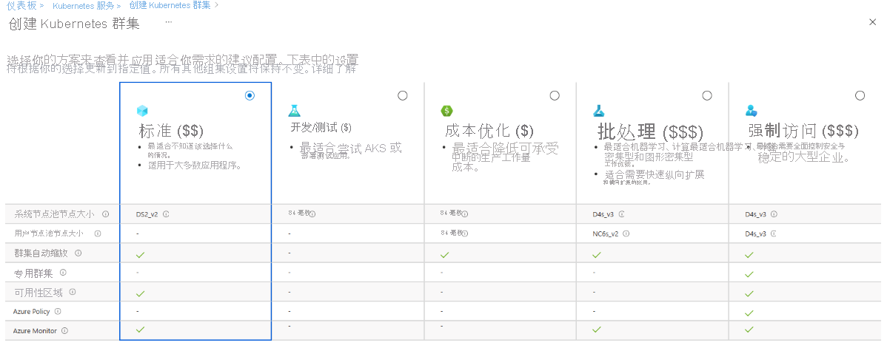
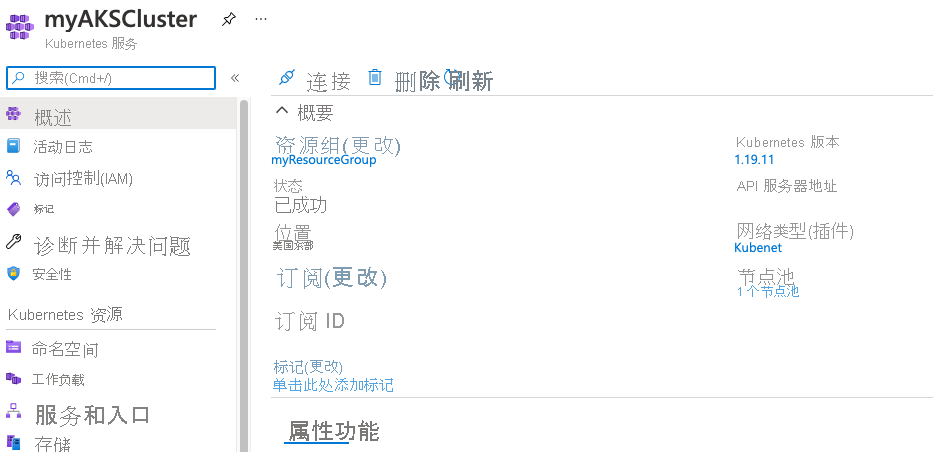
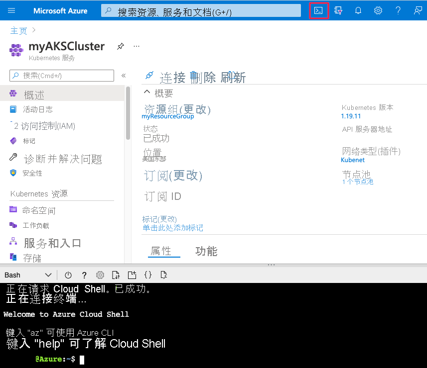
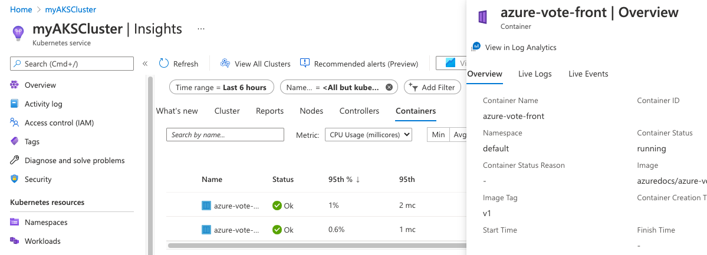

# <a name="quickstart-deploy-an-azure-kubernetes-service-aks-cluster-using-the-azure-portal"></a>快速入门：使用 Azure 门户部署 Azure Kubernetes 服务 (AKS) 群集

Azure Kubernetes 服务 (AKS) 是可用于快速部署和管理群集的托管式 Kubernetes 服务。 在本快速入门中，请执行以下操作：
* 使用 Azure 门户部署 AKS 群集。 
* 在该群集中运行一个包含 Web 前端和 Redis 实例的多容器应用程序。 
* 监视运行应用程序的群集和 Pod 的运行状况。


本快速入门假设读者基本了解 Kubernetes 的概念。 有关详细信息，请参阅 [Azure Kubernetes 服务 (AKS) 的 Kubernetes 核心概念][kubernetes-concepts]。

如果没有 Azure 订阅，请在开始之前创建一个[免费帐户](https://azure.microsoft.com/free/?WT.mc_id=A261C142F)。

## <a name="prerequisites"></a>先决条件

在 [https://portal.azure.com](https://portal.azure.com) 中登录 Azure 门户。

## <a name="create-an-aks-cluster"></a>创建 AKS 群集

1. 在 Azure 门户菜单上或在“主页”中，选择“创建资源”。

2. 选择“容器” > “Kubernetes 服务”。

3. 在“基本信息”页面上，配置以下选项：
    - **项目详细信息**： 
        * 选择一个 Azure 订阅。
        * 选择或创建一个 Azure **资源组**，例如 *myResourceGroup*。
    - **群集详细信息**： 
        * 确保“预设配置”为“Standard ($$)”。 有关预设配置的详细信息，请参阅 [Azure 门户中的群集配置预设][preset-config]。
        * 输入 **Kubernetes 群集名称**，例如 *myAKSCluster*。 
        * 选择 AKS 群集的“区域”和“Kubernetes 版本” 。
    - **主节点池**： 
        * 保持选中默认值。
    
    

    > [!NOTE]
    > 创建群集时，可以通过选择“查看所有预设配置”并选择其他选项来更改预设配置。
    > 

4. 在完成时选择“下一步:节点池”。

5. 保留默认的“节点池”选项。 单击屏幕底部的“下一步:身份验证”。
    > [!CAUTION]
    > 新建的 Azure AD 服务主体可能需要几分钟时间才能完成传播并可供使用，这会导致 Azure 门户中出现“找不到服务主体”错误和验证失败。 如果遇到这种麻烦，请参阅[我们的故障排除文章](troubleshooting.md#received-an-error-saying-my-service-principal-wasnt-found-or-is-invalid-when-i-try-to-create-a-new-cluster)获取缓解措施。

6. 在“身份验证”页上，配置以下选项：
    - 通过以下方式之一创建新的群集标识：
        * 在“身份验证”字段中保留“系统分配的托管标识”，或 
        * 选择“服务主体”以使用服务主体。 
            * 选择“(新)默认服务主体”以创建默认服务主体，或
            * 选择“配置服务主体”以使用现有的服务主体。 需要提供现有主体的 SPN 客户端 ID 和机密。
    - 启用 Kubernetes 基于角色的访问控制 (Kubernetes RBAC) 选项，以便更精细地控制对部署在 AKS 群集中的 Kubernetes 资源的访问权限。

    默认情况下将使用“基本”网络，并且会启用适用于容器的 Azure Monitor。 

7. 验证完成后，依次单击“查看 + 创建”、“创建”。 


8. 创建 AKS 群集需要几分钟时间。 部署完成后，通过以下任一方式导航到你的资源：
    * 单击“转到资源”，或
    * 浏览到 AKS 群集资源组并选择 AKS 资源。 
        * 下面显示了示例群集仪表板：浏览到“myResourceGroup”并选择“myAKSCluster”资源。 

        

## <a name="connect-to-the-cluster"></a>连接到群集

若要管理 Kubernetes 群集，请使用 Kubernetes 命令行客户端 [kubectl][kubectl]。 如果使用的是 Azure Cloud Shell，则 `kubectl` 已安装。 

1. 使用 Azure 门户顶部的 `>_` 按钮打开 Cloud Shell。

    

    > [!NOTE]
    > 若要在本地 shell 安装中执行这些操作：
    > 1. 验证是否已安装 Azure CLI。
    > 2. 通过 `az login` 命令连接到 Azure。

2. 使用 [az aks get-credentials][az-aks-get-credentials] 命令将 `kubectl` 配置为连接到你的 Kubernetes 群集。 以下命令将下载凭据，并将 Kubernetes CLI 配置为使用这些凭据。

    ```azurecli
    az aks get-credentials --resource-group myResourceGroup --name myAKSCluster
    ```

3. 使用 `kubectl get` 命令返回群集节点的列表，以此验证与群集之间的连接。

    ```console
    kubectl get nodes
    ```

    输出显示在上一步骤中创建的单个节点。 确保节点状态为 *Ready*：

    ```output
    NAME                                STATUS   ROLES   AGE   VERSION
    aks-agentpool-12345678-vmss000000   Ready    agent   23m   v1.19.11
    aks-agentpool-12345678-vmss000001   Ready    agent   24m   v1.19.11
    ```

## <a name="run-the-application"></a>运行应用程序

Kubernetes 清单文件定义群集的所需状态，例如，要运行哪些容器映像。 

在本快速入门中，你将使用清单来创建运行 Azure Vote 应用程序所需的所有对象。 此清单包含两个 Kubernetes 部署：
* 示例 Azure Vote Python 应用程序。
* 一个 Redis 实例。 

此外，还会创建两个 Kubernetes 服务：
* Redis 实例的内部服务。
* 用于通过 Internet 访问 Azure Vote 应用程序的外部服务。

1. 在 Cloud Shell 中，使用编辑器创建名为 `azure-vote.yaml` 的文件，例如：
    * `code azure-vote.yaml`
    * `nano azure-vote.yaml` 或 
    * `vi azure-vote.yaml`. 

1. 复制以下 YAML 定义：

    ```yaml
    apiVersion: apps/v1
    kind: Deployment
    metadata:
      name: azure-vote-back
    spec:
      replicas: 1
      selector:
        matchLabels:
          app: azure-vote-back
      template:
        metadata:
          labels:
            app: azure-vote-back
        spec:
          nodeSelector:
            "kubernetes.io/os": linux
          containers:
          - name: azure-vote-back
            image: mcr.microsoft.com/oss/bitnami/redis:6.0.8
            env:
            - name: ALLOW_EMPTY_PASSWORD
              value: "yes"
            resources:
              requests:
                cpu: 100m
                memory: 128Mi
              limits:
                cpu: 250m
                memory: 256Mi
            ports:
            - containerPort: 6379
              name: redis
    ---
    apiVersion: v1
    kind: Service
    metadata:
      name: azure-vote-back
    spec:
      ports:
      - port: 6379
      selector:
        app: azure-vote-back
    ---
    apiVersion: apps/v1
    kind: Deployment
    metadata:
      name: azure-vote-front
    spec:
      replicas: 1
      selector:
        matchLabels:
          app: azure-vote-front
      template:
        metadata:
          labels:
            app: azure-vote-front
        spec:
          nodeSelector:
            "kubernetes.io/os": linux
          containers:
          - name: azure-vote-front
            image: mcr.microsoft.com/azuredocs/azure-vote-front:v1
            resources:
              requests:
                cpu: 100m
                memory: 128Mi
              limits:
                cpu: 250m
                memory: 256Mi
            ports:
            - containerPort: 80
            env:
            - name: REDIS
              value: "azure-vote-back"
    ---
    apiVersion: v1
    kind: Service
    metadata:
      name: azure-vote-front
    spec:
      type: LoadBalancer
      ports:
      - port: 80
      selector:
        app: azure-vote-front
    ```

1. 使用 `kubectl apply` 命令部署应用程序，并指定 YAML 清单的名称：

    ```console
    kubectl apply -f azure-vote.yaml
    ```

    输出显示已成功创建的部署和服务：

    ```output
    deployment "azure-vote-back" created
    service "azure-vote-back" created
    deployment "azure-vote-front" created
    service "azure-vote-front" created
    ```

## <a name="test-the-application"></a>测试应用程序

应用程序运行时，Kubernetes 服务将向 Internet 公开应用程序前端。 此过程可能需要几分钟才能完成。

若要监视进度，请将 `kubectl get service` 命令与 `--watch` 参数配合使用。

```console
kubectl get service azure-vote-front --watch
```

`azure-vote-front` 服务的 **EXTERNAL-IP** 输出最初显示为 *pending*。

```output
NAME               TYPE           CLUSTER-IP   EXTERNAL-IP   PORT(S)        AGE
azure-vote-front   LoadBalancer   10.0.37.27   <pending>     80:30572/TCP   6s
```

在 **EXTERNAL-IP** 地址从 *pending* 更改为实际公共 IP 地址后，请使用 `CTRL-C` 来停止 `kubectl` 监视进程。 以下示例输出显示向服务分配了有效的公共 IP 地址：


```output
azure-vote-front   LoadBalancer   10.0.37.27   52.179.23.131   80:30572/TCP   2m
```

若要查看 Azure Vote 应用的实际效果，请打开 Web 浏览器并转到服务的外部 IP 地址。


## <a name="monitor-health-and-logs"></a>监视运行状况和日志

创建群集后，适用于容器的 Azure Monitor 便已启用。 用于容器的 Azure Monitor 提供 AKS 群集以及该群集上运行的 Pod 的运行状况指标。

指标数据需在几分钟后才会填充到 Azure 门户中。 若要查看 Azure Vote Pod 的当前运行状况、运行时间和资源使用情况：

1. 浏览回到 Azure 门户中的 AKS 资源。
1. 在左侧的“监视”下，选择“见解”。 
1. 在顶部选择“+ 添加筛选器”。
1. 选择“命名空间”作为属性，然后选择 *\<All but kube-system\>* 。
1. 选择“容器”以查看容器。

将显示 `azure-vote-back` 和 `azure-vote-front` 容器，如以下示例中所示：



若要查看 `azure-vote-front` pod 的日志，请从右侧的“azure-vote-front | 概述”区域选择“在 Log Analytics 中查看”。 这些日志包括容器中的 *stdout* 和 *stderr* 流。


## <a name="delete-cluster"></a>删除群集

为了避免产生 Azure 费用，请清理不需要的资源。 在 AKS 群集仪表板上选择“删除”按钮。 也可以在 Cloud Shell 中使用 [az aks delete][az-aks-delete] 命令：

```azurecli
az aks delete --resource-group myResourceGroup --name myAKSCluster --no-wait
```
> [!NOTE]
> 删除群集时，AKS 群集使用的 Azure Active Directory 服务主体不会被删除。 有关如何删除服务主体的步骤，请参阅 [AKS 服务主体的注意事项和删除][sp-delete]。
> 
> 如果你使用了托管标识，则该标识由平台托管，不需要删除。

## <a name="get-the-code"></a>获取代码

本快速入门使用现有的容器映像创建了 Kubernetes 部署。 [GitHub 上提供了][azure-vote-app]相关的应用程序代码、Dockerfile 和 Kubernetes 清单文件。

## <a name="next-steps"></a>后续步骤

在本快速入门中，你部署了一个 Kubernetes 群集，然后在其中部署了多容器应用程序。 访问 AKS 群集的 Kubernetes Web 仪表板。


若要通过浏览完整的示例（包括构建应用程序、从 Azure 容器注册表进行部署、更新正在运行的应用程序，以及缩放和升级群集）来了解有关 AKS 的更多信息，请继续阅读 Kubernetes 群集教程。

> [!div class="nextstepaction"]
> [AKS 教程][aks-tutorial]

<!-- LINKS - external -->
[azure-vote-app]: https://github.com/Azure-Samples/azure-voting-app-redis.git
[kubectl]: https://kubernetes.io/docs/user-guide/kubectl/
[kubectl-apply]: https://kubernetes.io/docs/reference/generated/kubectl/kubectl-commands#apply
[kubectl-get]: https://kubernetes.io/docs/reference/generated/kubectl/kubectl-commands#get
[kubernetes-documentation]: https://kubernetes.io/docs/home/

<!-- LINKS - internal -->
[kubernetes-concepts]: concepts-clusters-workloads.md
[az-aks-get-credentials]: /cli/azure/aks#az_aks_get_credentials
[az-aks-delete]: /cli/azure/aks#az_aks_delete
[aks-monitor]: ../azure-monitor/containers/container-insights-overview.md
[aks-network]: ./concepts-network.md
[aks-tutorial]: ./tutorial-kubernetes-prepare-app.md
[http-routing]: ./http-application-routing.md
[preset-config]: ./quotas-skus-regions.md#cluster-configuration-presets-in-the-azure-portal
[sp-delete]: kubernetes-service-principal.md#additional-considerations