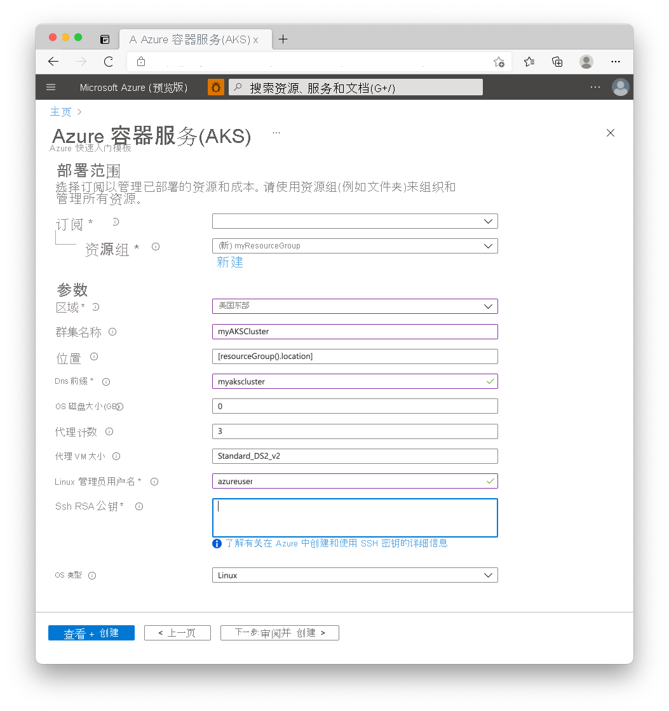

# <a name="quickstart-deploy-an-azure-kubernetes-service-aks-cluster-using-an-arm-template"></a>快速入门：使用 ARM 模板部署 Azure Kubernetes 服务 (AKS) 群集

Azure Kubernetes 服务 (AKS) 是可用于快速部署和管理群集的托管式 Kubernetes 服务。 在本快速入门中，请执行以下操作：
* 使用 Azure 资源管理器模板部署 AKS 群集。 
* 在该群集中运行一个包含 Web 前端和 Redis 实例的多容器应用程序。 


[!INCLUDE [About Azure Resource Manager](../../includes/resource-manager-quickstart-introduction.md)]

本快速入门假设读者基本了解 Kubernetes 的概念。 有关详细信息，请参阅 [Azure Kubernetes 服务 (AKS) 的 Kubernetes 核心概念][kubernetes-concepts]。

如果你的环境满足先决条件，并且你熟悉如何使用 ARM 模板，请选择“部署到 Azure”按钮。 Azure 门户中会打开模板。

[](https://portal.azure.com/#create/Microsoft.Template/uri/https%3A%2F%2Fraw.githubusercontent.com%2FAzure%2Fazure-quickstart-templates%2Fmaster%2Fquickstarts%2Fmicrosoft.kubernetes%2Faks%2Fazuredeploy.json)

[!INCLUDE [quickstarts-free-trial-note](../../includes/quickstarts-free-trial-note.md)]

[!INCLUDE [azure-cli-prepare-your-environment.md](../../includes/azure-cli-prepare-your-environment.md)]

- 本文需要 Azure CLI 版本 2.0.61 或更高版本。 如果使用 Azure Cloud Shell，则最新版本已安装。

- 若要使用资源管理器模板创建 AKS 群集，请提供 SSH 公钥。 如果需要此资源，请参阅以下部分；否则请跳到[查看模板](#review-the-template)部分。

### <a name="create-an-ssh-key-pair"></a>创建 SSH 密钥对

若要访问 AKS 节点，请使用通过 `ssh-keygen` 命令生成的 SSH 密钥对（公钥和私钥）进行连接。 默认情况下，这些文件在 *~/.ssh* 目录中创建。 运行 `ssh-keygen` 命令会覆盖给定位置中同名的任何 SSH 密钥对。

1. 在浏览器中访问 [https://shell.azure.com](https://shell.azure.com) 以打开 Cloud Shell。

1. 运行 `ssh-keygen` 命令。 以下示例使用 RSA 加密和 2048 位长度创建 SSH 密钥对：

    ```console
    ssh-keygen -t rsa -b 2048
    ```

有关创建 SSH 密钥的详细信息，请参阅[在 Azure 中创建和管理用于身份验证的 SSH 密钥][ssh-keys]。

## <a name="review-the-template"></a>查看模板

本快速入门中使用的模板来自 [Azure 快速入门模板](https://azure.microsoft.com/resources/templates/aks/)。

:::code language="json" source="~/quickstart-templates/quickstarts/microsoft.kubernetes/aks/azuredeploy.json":::

有关更多 AKS 示例，请参阅 [AKS 快速入门模板][aks-quickstart-templates]站点。

## <a name="deploy-the-template"></a>部署模板

1. 选择以下按钮登录到 Azure 并打开一个模板。

    [](https://portal.azure.com/#create/Microsoft.Template/uri/https%3A%2F%2Fraw.githubusercontent.com%2FAzure%2Fazure-quickstart-templates%2Fmaster%2Fquickstarts%2Fmicrosoft.kubernetes%2Faks%2Fazuredeploy.json)

2. 选择或输入以下值。

    对于本快速入门，请保留“OS 磁盘大小(GB)”、“代理计数”、“代理 VM 大小”、“OS 类型”和“Kubernetes 版本”的默认值。     为以下模板参数提供自己的值：

    * 订阅：选择 Azure 订阅。
    * 资源组：选择“新建”。 输入资源组的唯一名称（例如 *myResourceGroup*），然后选择“确定”。
    * 位置：选择一个位置，例如“美国东部”。
    * **群集名称**：输入 AKS 群集的唯一名称，例如 *myAKSCluster*。
    * **DNS 前缀**：输入群集的唯一 DNS 前缀，例如 *myakscluster*。
    * **Linux 管理员用户名**：输入一个用户名用于通过 SSH 进行连接，例如 *azureuser*。
    * **SSH RSA 公钥**：复制并粘贴 SSH 密钥对的 *public* 部分（默认为 *~/.ssh/id_rsa.pub* 的内容）。

    

3. 选择“查看 + 创建”  。

创建 AKS 群集需要几分钟时间。 等待群集成功部署，然后转到下一步骤。

## <a name="validate-the-deployment"></a>验证部署

### <a name="connect-to-the-cluster"></a>连接到群集

若要管理 Kubernetes 群集，请使用 Kubernetes 命令行客户端 [kubectl][kubectl]。 如果使用的是 Azure Cloud Shell，则 `kubectl` 已安装。 

1. 在本地使用 [az aks install-cli][az-aks-install-cli] 命令安装 `kubectl`：

    ```azurecli
    az aks install-cli
    ```

2. 使用 [az aks get-credentials][az-aks-get-credentials] 命令将 `kubectl` 配置为连接到你的 Kubernetes 群集。 此命令将下载凭据，并将 Kubernetes CLI 配置为使用这些凭据。

    ```azurecli-interactive
    az aks get-credentials --resource-group myResourceGroup --name myAKSCluster
    ```

3. 使用 [kubectl get][kubectl-get] 命令验证与群集之间的连接。 此命令将返回群集节点的列表。

    ```console
    kubectl get nodes
    ```

    输出将显示前面步骤中创建的节点。 确保所有节点的状态为“就绪”：

    ```output
    NAME                       STATUS   ROLES   AGE     VERSION
    aks-agentpool-41324942-0   Ready    agent   6m44s   v1.12.6    
    aks-agentpool-41324942-1   Ready    agent   6m46s   v1.12.6
    aks-agentpool-41324942-2   Ready    agent   6m45s   v1.12.6
    ```

### <a name="run-the-application"></a>运行应用程序

[Kubernetes 清单文件][kubernetes-deployment]定义群集的所需状态，例如，要运行哪些容器映像。 

在本快速入门中，你将使用清单来创建运行 [Azure Vote 应用程序][azure-vote-app]所需的所有对象。 此清单包含两个 [Kubernetes 部署][kubernetes-deployment]：
* 示例 Azure Vote Python 应用程序。
* 一个 Redis 实例。 

此外，还会创建两个 [Kubernetes 服务][kubernetes-service]：
* Redis 实例的内部服务。
* 用于通过 Internet 访问 Azure Vote 应用程序的外部服务。

1. 创建名为 `azure-vote.yaml` 的文件。
    * 如果使用 Azure Cloud Shell，可以使用 `vi` 或 `nano` 来创建此文件，就像在虚拟或物理系统中操作一样
1. 复制以下 YAML 定义：

    ```yaml
    apiVersion: apps/v1
    kind: Deployment
    metadata:
      name: azure-vote-back
    spec:
      replicas: 1
      selector:
        matchLabels:
          app: azure-vote-back
      template:
        metadata:
          labels:
            app: azure-vote-back
        spec:
          nodeSelector:
            "beta.kubernetes.io/os": linux
          containers:
          - name: azure-vote-back
            image: mcr.microsoft.com/oss/bitnami/redis:6.0.8
            env:
            - name: ALLOW_EMPTY_PASSWORD
              value: "yes"
            resources:
              requests:
                cpu: 100m
                memory: 128Mi
              limits:
                cpu: 250m
                memory: 256Mi
            ports:
            - containerPort: 6379
              name: redis
    ---
    apiVersion: v1
    kind: Service
    metadata:
      name: azure-vote-back
    spec:
      ports:
      - port: 6379
      selector:
        app: azure-vote-back
    ---
    apiVersion: apps/v1
    kind: Deployment
    metadata:
      name: azure-vote-front
    spec:
      replicas: 1
      selector:
        matchLabels:
          app: azure-vote-front
      template:
        metadata:
          labels:
            app: azure-vote-front
        spec:
          nodeSelector:
            "beta.kubernetes.io/os": linux
          containers:
          - name: azure-vote-front
            image: mcr.microsoft.com/azuredocs/azure-vote-front:v1
            resources:
              requests:
                cpu: 100m
                memory: 128Mi
              limits:
                cpu: 250m
                memory: 256Mi
            ports:
            - containerPort: 80
            env:
            - name: REDIS
              value: "azure-vote-back"
    ---
    apiVersion: v1
    kind: Service
    metadata:
      name: azure-vote-front
    spec:
      type: LoadBalancer
      ports:
      - port: 80
      selector:
        app: azure-vote-front
    ```

1. 使用 [kubectl apply][kubectl-apply] 命令部署应用程序，并指定 YAML 清单的名称：

    ```console
    kubectl apply -f azure-vote.yaml
    ```

    输出显示已成功创建的部署和服务：

    ```output
    deployment "azure-vote-back" created
    service "azure-vote-back" created
    deployment "azure-vote-front" created
    service "azure-vote-front" created
    ```

### <a name="test-the-application"></a>测试应用程序

应用程序运行时，Kubernetes 服务将向 Internet 公开应用程序前端。 此过程可能需要几分钟才能完成。

使用带有 `--watch` 参数的 [kubectl get service][kubectl-get] 命令来监视进度。

```console
kubectl get service azure-vote-front --watch
```

`azure-vote-front` 服务的 **EXTERNAL-IP** 输出最初显示为 *pending*。

```output
NAME               TYPE           CLUSTER-IP   EXTERNAL-IP   PORT(S)        AGE
azure-vote-front   LoadBalancer   10.0.37.27   <pending>     80:30572/TCP   6s
```

在 **EXTERNAL-IP** 地址从 *pending* 更改为实际公共 IP 地址后，请使用 `CTRL-C` 来停止 `kubectl` 监视进程。 以下示例输出显示向服务分配了有效的公共 IP 地址：

```output
azure-vote-front   LoadBalancer   10.0.37.27   52.179.23.131   80:30572/TCP   2m
```

若要查看 Azure Vote 应用的实际效果，请打开 Web 浏览器并转到服务的外部 IP 地址。


## <a name="clean-up-resources"></a>清理资源

为了避免产生 Azure 费用，请清理不需要的资源。 可以使用 [az group delete][az-group-delete] 命令删除资源组、容器服务及所有相关资源。

```azurecli-interactive
az group delete --name myResourceGroup --yes --no-wait
```

> [!NOTE]
> 删除群集时，AKS 群集使用的 Azure Active Directory 服务主体不会被删除。 有关如何删除服务主体的步骤，请参阅 [AKS 服务主体的注意事项和删除][sp-delete]。
> 
> 如果你使用了托管标识，则该标识由平台托管，不需要删除。

## <a name="get-the-code"></a>获取代码

本快速入门使用现有的容器映像创建了 Kubernetes 部署。 [GitHub 上提供了][azure-vote-app]相关的应用程序代码、Dockerfile 和 Kubernetes 清单文件。

## <a name="next-steps"></a>后续步骤

在本快速入门中，你部署了一个 Kubernetes 群集，然后在其中部署了多容器应用程序。 [访问 AKS 群集的 Kubernetes Web 仪表板][kubernetes-dashboard]。

若要详细了解 AKS 并演练部署示例的完整代码，请继续阅读“Kubernetes 群集”教程。

> [!div class="nextstepaction"]
> [AKS 教程][aks-tutorial]

<!-- LINKS - external -->
[azure-vote-app]: https://github.com/Azure-Samples/azure-voting-app-redis.git
[kubectl]: https://kubernetes.io/docs/user-guide/kubectl/
[kubectl-apply]: https://kubernetes.io/docs/reference/generated/kubectl/kubectl-commands#apply
[kubectl-get]: https://kubernetes.io/docs/reference/generated/kubectl/kubectl-commands#get
[azure-dev-spaces]: /previous-versions/azure/dev-spaces/
[aks-quickstart-templates]: https://azure.microsoft.com/resources/templates/?term=Azure+Kubernetes+Service

<!-- LINKS - internal -->
[kubernetes-concepts]: concepts-clusters-workloads.md
[aks-monitor]: ../azure-monitor/containers/container-insights-onboard.md
[aks-tutorial]: ./tutorial-kubernetes-prepare-app.md
[az-aks-browse]: /cli/azure/aks#az_aks_browse
[az-aks-create]: /cli/azure/aks#az_aks_create
[az-aks-get-credentials]: /cli/azure/aks#az_aks_get_credentials
[az-aks-install-cli]: /cli/azure/aks#az_aks_install_cli
[az-group-create]: /cli/azure/group#az_group_create
[az-group-delete]: /cli/azure/group#az_group_delete
[azure-cli-install]: /cli/azure/install-azure-cli
[sp-delete]: kubernetes-service-principal.md#additional-considerations
[azure-portal]: https://portal.azure.com
[kubernetes-deployment]: concepts-clusters-workloads.md#deployments-and-yaml-manifests
[kubernetes-service]: concepts-network.md#services
[kubernetes-dashboard]: kubernetes-dashboard.md
[ssh-keys]: ../virtual-machines/linux/create-ssh-keys-detailed.md
[az-ad-sp-create-for-rbac]: /cli/azure/ad/sp#az_ad_sp_create_for_rbac