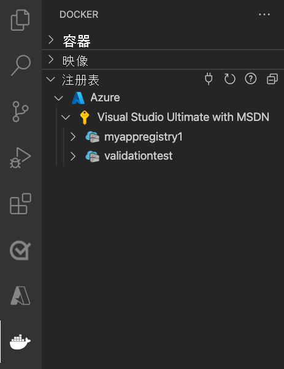

# <a name="run-a-custom-container-in-azure"></a>在 Azure 中运行自定义容器

::: zone pivot="container-windows"
[Azure 应用服务](overview.md)在 Windows 上提供预定义的应用程序堆栈，例如在 IIS 上运行的 ASP.NET 或 Node.js。 预配置的 Windows 容器环境锁定了操作系统，使其无法进行管理访问、软件安装、全局程序集缓存更改等操作。 有关详细信息，请参阅 [Azure 应用服务上的操作系统功能](operating-system-functionality.md)。 如果应用程序需要的访问权限超出了预配置环境的允许，则可改为部署自定义 Windows 容器。

本快速入门介绍如何通过 Visual Studio 将 Windows 映像中的 ASP.NET 应用部署到 [Docker Hub](https://hub.docker.com/)。 你将在 Azure 应用服务中的某个自定义容器内运行该应用。

> [!NOTE]
> Windows 容器仅限于 Azure 文件存储，当前不支持 Azure Blob。


## <a name="prerequisites"></a>先决条件

为完成此教程：

- <a href="https://hub.docker.com/" target="_blank">注册 Docker 中心帐户</a>
- <a href="https://docs.docker.com/docker-for-windows/install/" target="_blank">安装用于 Windows 的 Docker</a>。
- <a href="/virtualization/windowscontainers/quick-start/quick-start-windows-10" target="_blank">将 Docker 切换为运行 Windows 容器</a>。
- <a href="https://www.visualstudio.com/downloads/" target="_blank">安装 Visual Studio 2019</a>，其中包含 **ASP.NET 和 web 开发** 以及 **Azure 开发** 工作负载。 如果已安装 Visual Studio 2019：

    - 通过选择“帮助” > “检查更新”，在 Visual Studio 中安装最新更新。
    - 在 Visual Studio 中，通过选择“工具” > “获取工具和功能”，添加工作负载。

## <a name="create-an-aspnet-web-app"></a>创建 ASP.NET Web 应用

按照以下步骤创建 ASP.NET Web 应用：

1. 打开 Visual Studio，然后选择“创建新项目”。

1. 在“创建新项目”中，找到并选择用于 C# 的 **ASP.NET Web 应用程序(.NET Framework)** ，然后选择“下一步”。

1. 在“配置新项目”中，将应用程序命名为“myfirstazurewebapp”，然后选择“创建”。

   

1. 可将任何类型的 ASP.NET Web 应用部署到 Azure。 对于本快速入门，请选择“MVC”模板。

1. 选择“Docker 支持”，并确保身份验证设置为“无身份验证”。  选择“创建”。

   

1. 如果 _Dockerfile_ 文件未自动打开，则从解决方案资源管理器中打开。

1. 需要使用[受支持的父映像](configure-custom-container.md#supported-parent-images)。 通过将 `FROM` 行替换为以下代码，更改父映像，并保存文件：

   ```dockerfile
   FROM mcr.microsoft.com/dotnet/framework/aspnet:4.7.2-windowsservercore-ltsc2019
   ```

1. 在 Visual Studio 菜单中，选择“调试” > “开始执行(不调试)”以在本地运行 Web 应用。 

   

## <a name="publish-to-docker-hub"></a>发布到 Docker 中心

1. 在解决方案资源管理器中右键单击“myfirstazurewebapp”项目，然后选择“发布”  。

1. 选择“应用服务”，然后选择“发布”。

1. 在“选取发布目标”中选择“容器注册表”和“Docker Hub”，然后单击“发布”。   

   

1. 提供 Docker Hub 帐户凭据，然后选择“保存”。

   等待部署完成。 “发布”页现在会显示稍后要使用的存储库名称。

   

1. 复制此存储库名称待以后使用。

## <a name="create-a-windows-container-app"></a>创建 Windows 容器应用

1. 登录 [Azure 门户]( https://portal.azure.com)。

1. 在 Azure 门户的左上角选择“创建资源”。

1. 在“常用服务”下，选择“Web 应用”下的“创建”。

1. 在“创建 Web 应用”中，选择你的订阅和一个资源组。 如果需要，可以创建新的资源组。

1. 提供一个应用名称（例如 win-container-demo）。 在“发布”项中选择“Docker 容器” ，选择“Windows”作为“操作系统”。 在完成时选择“下一步:Docker”以继续。

   

1. 对于“映像源”，请选择“Docker Hub”；对于“映像和标记”，请输入在[发布到 Docker Hub](#publish-to-docker-hub) 中复制的存储库名称。  

   

    如果用于 Web 应用程序的自定义映像位于其他位置，例如位于 [Azure 容器注册表](../container-registry/index.yml)中或任何其他的专用存储库中，则可在这里对其进行配置。

1. 选择“查看和创建”，然后选择“创建”并等待 Azure 创建所需的资源。 

## <a name="browse-to-the-container-app"></a>浏览到容器应用

Azure 操作完成后，会显示通知框。


1. 单击“转到资源”。

1. 在此资源的概述中，单击“URL”旁边的链接。

此时会打开一个如下所示的新浏览器页面：


等待数分钟，然后再次尝试，直到显示默认 ASP.NET 主页：


祝贺你！ 你正在 Azure 应用服务中运行你的第一个自定义 Windows 容器。

## <a name="see-container-start-up-logs"></a>查看容器启动日志

加载 Windows 容器可能需要一些时间。 若要查看进度，请通过将 \<app_name> 替换为应用的名称，导航到以下 URL。
```
https://<app_name>.scm.azurewebsites.net/api/logstream
```

流式传输的日志如下所示：

```
2018-07-27T12:03:11  Welcome, you are now connected to log-streaming service.
27/07/2018 12:04:10.978 INFO - Site: win-container-demo - Start container succeeded. Container: facbf6cb214de86e58557a6d073396f640bbe2fdec88f8368695c8d1331fc94b
27/07/2018 12:04:16.767 INFO - Site: win-container-demo - Container start complete
27/07/2018 12:05:05.017 INFO - Site: win-container-demo - Container start complete
27/07/2018 12:05:05.020 INFO - Site: win-container-demo - Container started successfully
```

## <a name="update-locally-and-redeploy"></a>在本地更新并重新部署

1. 在 Visual Studio 的“解决方案资源管理器”中，打开“视图” > “主页” > “Index.cshtml”。   

1. 在顶部附近找到 `<div class="jumbotron">` HTML 标记，将整个元素替换为以下代码：

   ```html
   <div class="jumbotron">
       <h1>ASP.NET in Azure!</h1>
       <p class="lead">This is a simple app that we've built that demonstrates how to deploy a .NET app to Azure App Service.</p>
   </div>
   ```

1. 若要重新部署到 Azure，请在解决方案资源管理器中右键单击“myfirstazurewebapp”项目，然后选择“发布”  。

1. 在发布页上，选择“发布”并等待发布完成。

1. 若要指示应用服务从 Docker 中心拉取新映像，请重启应用。 返回门户中的应用页，单击“重启” > “是”。

   

再次[浏览到容器应用](#browse-to-the-container-app)。 刷新网页时，应用应会先还原到“正在启动”页，然后在几分钟后再次显示更新的网页。


## <a name="next-steps"></a>后续步骤

> [!div class="nextstepaction"]
> [迁移到 Azure 中的 Windows 容器](tutorial-custom-container.md)

或者，查看其他资源：

> [!div class="nextstepaction"]
> [配置自定义容器](configure-custom-container.md)

::: zone-end  

::: zone pivot="container-linux"
Linux 上的应用服务在 Linux 上提供预定义的应用程序堆栈，并支持特定语言，例如 .NET、PHP、Node.js 等。 还可使用自定义 Docker 映像，于尚未在 Azure 中定义的应用程序堆栈中运行 Web 应用。 本快速入门介绍如何将[Azure 容器注册表](../container-registry/index.yml) (ACR) 中的映像部署到应用服务。

## <a name="prerequisites"></a>先决条件

* 一个 [Azure 帐户](https://azure.microsoft.com/free/?utm_source=campaign&utm_campaign=vscode-tutorial-docker-extension&mktingSource=vscode-tutorial-docker-extension)
* [Docker](https://www.docker.com/community-edition)
* [Visual Studio Code](https://code.visualstudio.com/)
* [适用于 VS Code 的 Azure 应用服务扩展](https://marketplace.visualstudio.com/items?itemName=ms-azuretools.vscode-azureappservice)。 可以使用此扩展在 Azure 平台即服务 (PaaS) 上创建、管理和部署 Linux Web 应用。
* [适用于 VS Code 的 Docker 扩展](https://marketplace.visualstudio.com/items?itemName=ms-azuretools.vscode-docker)。 可以使用此扩展简化本地 Docker 映像和命令的管理，并将生成的应用映像部署到 Azure。

## <a name="create-a-container-registry"></a>创建容器注册表

本快速入门使用 Azure 容器注册表作为所选注册表。 你可以随意使用其他注册表，但步骤可能略有不同。

按照[快速入门：使用 Azure 门户创建专用容器注册表](../container-registry/container-registry-get-started-portal.md)中的说明创建容器注册表。

> [!IMPORTANT]
> 请确保在创建 Azure 容器注册表时将“管理员用户”选项设为“启用”。 也可以在 Azure 门户中从注册表页的“访问密钥”部分进行设置。 应用服务访问需要此设置。

## <a name="sign-in"></a>登录

1. 启动 Visual Studio Code。 
1. 在[活动栏](https://code.visualstudio.com/docs/getstarted/userinterface)中选择 Azure 徽标，导航到“应用服务”资源管理器，然后选择“登录到 Azure”，并按照说明进行操作。

    

1. 在底部的[状态栏](https://code.visualstudio.com/docs/getstarted/userinterface)中，验证 Azure 帐户电子邮件地址。 在“应用服务”资源管理器中，应显示你的订阅。

1. 在活动栏中，选择 Docker 徽标。 在“注册表”资源管理器中，验证是否显示所创建的容器注册表。

    

## <a name="check-prerequisites"></a>检查先决条件

验证是否已安装并运行 Docker。 以下命令将显示 Docker 版本（如果它正在运行）。

```bash
docker --version
```

## <a name="create-and-build-image"></a>创建和生成映像

1. 在 Visual Studio Code 中，打开一个空文件夹并添加一个名为 `Dockerfile` 的文件。 在 Dockerfile 中，根据所需的语言框架粘贴内容：

# <a name="net"></a>[.NET](#tab/dotnet)

<!-- https://mcr.microsoft.com/v2/appsvc%2Fdotnetcore/tags/list -->
```dockerfile
FROM mcr.microsoft.com/appsvc/dotnetcore:lts

ENV PORT 8080
EXPOSE 8080

ENV ASPNETCORE_URLS "http://*:${PORT}"

ENTRYPOINT ["dotnet", "/defaulthome/hostingstart/hostingstart.dll"]
```

在此 Dockerfile 中，父映像是应用服务的内置 .NET 容器之一。 可以[在 GenerateDockerFiles/dotnetcore 下的 Azure-App-Service/ImageBuilder GitHub 存储库中](https://github.com/Azure-App-Service/ImageBuilder/tree/master/GenerateDockerFiles/dotnetcore)找到它的源文件。 它的 [Dockerfile](https://github.com/Azure-App-Service/ImageBuilder/blob/master/GenerateDockerFiles/dotnetcore/debian-9/Dockerfile) 将一个简单的 .NET 应用复制到 `/defaulthome/hostingstart` 中。 Dockerfile 只需启动该应用即可。

# <a name="nodejs"></a>[Node.js](#tab/node)

<!-- https://mcr.microsoft.com/v2/appsvc%2Fnode/tags/list -->
```dockerfile
FROM mcr.microsoft.com/appsvc/node:10-lts

ENV HOST 0.0.0.0
ENV PORT 8080
EXPOSE 8080

ENTRYPOINT ["pm2", "start", "--no-daemon", "/opt/startup/default-static-site.js"]
```

在此 Dockerfile 中，父映像是应用服务的内置 Node.js 容器之一。 可以[在 GenerateDockerFiles/node/node-template 下的 Azure-App-Service/ImageBuilder GitHub 存储库中](https://github.com/Azure-App-Service/ImageBuilder/tree/master/GenerateDockerFiles/node/node-template)找到它的源文件。 它的 [Dockerfile](https://github.com/Azure-App-Service/ImageBuilder/blob/master/GenerateDockerFiles/node/node-template/Dockerfile) 将一个简单的 Node.js 应用复制到 `/opt/startup` 中。 Dockerfile 只需使用父映像已安装的 PM2 启动该应用。

# <a name="python"></a>[Python](#tab/python)

<!-- https://mcr.microsoft.com/v2/appsvc%2Fpython/tags/list -->
```dockerfile
FROM mcr.microsoft.com/appsvc/python:latest

ENV PORT 8080
EXPOSE 8080

ENTRYPOINT ["gunicorn", "--timeout", "600", "--access-logfile", "'-'", "--error-logfile", "'-'", "--chdir=/opt/defaultsite", "application:app"]
```

在此 Dockerfile 中，父映像是应用服务的内置 Python 容器之一。 可以[在 GenerateDockerFiles/python/template-3.9 下的 Azure-App-Service/ImageBuilder GitHub 存储库中](https://github.com/Azure-App-Service/ImageBuilder/tree/master/GenerateDockerFiles/python/template-3.9)找到它的源文件。 它的 [Dockerfile](https://github.com/Azure-App-Service/ImageBuilder/blob/master/GenerateDockerFiles/python/template-3.9/Dockerfile) 将一个简单的 Python 应用复制到 `/opt/defaultsite` 中。 Dockerfile 只需使用父映像已安装的 Gunicorn 启动该应用。

# <a name="java"></a>[Java](#tab/java)

<!-- https://mcr.microsoft.com/v2/azure-app-service%2Fjava/tags/list -->
```dockerfile
FROM mcr.microsoft.com/azure-app-service/java:11-java11_stable

ENV PORT 80
EXPOSE 80

ENTRYPOINT ["java", "-Dserver.port=80", "-jar", "/tmp/appservice/parkingpage.jar"]
```

在此 Dockerfile 中，父映像是应用服务的内置 Java 容器之一。 可以[在 java/tree/dev/java11-alpine 下的 Azure-App-Service/java GitHub 存储库中](https://github.com/Azure-App-Service/java/tree/dev/java11-alpine)找到它的源文件。 它的 [Dockerfile](https://github.com/Azure-App-Service/java/blob/dev/java11-alpine/Dockerfile) 将一个简单的 Java 应用复制到 `/tmp/appservice` 中。 Dockerfile 只需启动该应用即可。

-----

2. [打开命令面板](https://code.visualstudio.com/docs/getstarted/userinterface#_command-palette)，然后键入“Docker Images: Build Image”。 按“Enter”运行该命令。

3. 在映像标记框中，按以下格式指定所需标记：`<acr-name>.azurecr.io/<image-name>/<tag>`，其中 `<acr-name>` 是所创建的容器注册表的名称。 按 **Enter**。

4. 映像完成生成后，请单击“映像”资源管理器顶部的“刷新”，并验证映像是否已成功生成 。

    

## <a name="deploy-to-container-registry"></a>部署到容器注册表

1. 在活动栏中，单击 Docker 图标。 在“映像”资源管理器中，找到刚刚生成的映像。
1. 展开映像，右键单击所需的标记，然后单击“推送”。
1. 确保映像标记以 `<acr-name>.azurecr.io` 开头，然后按 Enter。
1. 当 Visual Studio Code 将映像推送到容器注册表后，请单击“注册表”资源管理器顶部的“刷新”，并验证映像是否已成功推送 。

    

## <a name="deploy-to-app-service"></a>部署到应用服务

1. 在“注册表”资源管理器中，展开映像，右键单击标记，然后单击“将映像部署到 Azure 应用服务”。
1. 按照提示选择订阅、全局唯一的应用名称、资源组和应用服务计划。 选择“B1 基本”作为“定价层”，并选择你附近的区域。

部署之后，你的应用将在 `http://<app-name>.azurewebsites.net` 上可用。

“资源组”是 Azure 中所有应用程序资源的命名集合。 例如，资源组可以包含对网站、数据库和 Azure 函数的引用。

应用服务计划定义用于托管网站的物理资源。 此快速入门在 Linux 基础结构上使用“基本”托管计划，这意味着该站点将与其他网站一起托管在 Linux 计算机上。 如果开始使用“基本”计划，则可以使用 Azure 门户进行扩展，使你的计算机是在计算机上运行的唯一站点。 有关定价，请参阅[应用服务定价](https://azure.microsoft.com/pricing/details/app-service/linux)。

## <a name="browse-the-website"></a>浏览网站

“输出”面板显示部署操作的状态。 操作完成后，单击弹出通知中的“打开站点”，在浏览器中打开站点。

> [!div class="nextstepaction"]
> [我遇到了问题](https://www.research.net/r/PWZWZ52?tutorial=quickstart-docker&step=deploy-app)

## <a name="next-steps"></a>后续步骤

祝贺你，你现已成功完成本快速入门。

应用服务应用在每次启动时，都会从容器注册表进行拉取。 如果你要重新生成映像，只需将其推送到容器注册表，应用会在重启时拉取更新的映像。 若要指示应用立即拉入更新的映像，请重启应用。

> [!div class="nextstepaction"]
> [配置自定义容器](configure-custom-container.md)

> [!div class="nextstepaction"]
> [自定义容器教程](tutorial-custom-container.md)

> [!div class="nextstepaction"]
> [多容器应用教程](tutorial-multi-container-app.md)

其他 Azure 扩展：

* [Cosmos DB](https://marketplace.visualstudio.com/items?itemName=ms-azuretools.vscode-cosmosdb)
* [Azure Functions](https://marketplace.visualstudio.com/items?itemName=ms-azuretools.vscode-azurefunctions)
* [Azure CLI 工具](https://marketplace.visualstudio.com/items?itemName=ms-vscode.azurecli)
* [Azure 资源管理器工具](https://marketplace.visualstudio.com/items?itemName=msazurermtools.azurerm-vscode-tools)
* [Azure 工具](https://marketplace.visualstudio.com/items?itemName=ms-vscode.vscode-node-azure-pack)扩展包包含上述所有扩展。

::: zone-end
