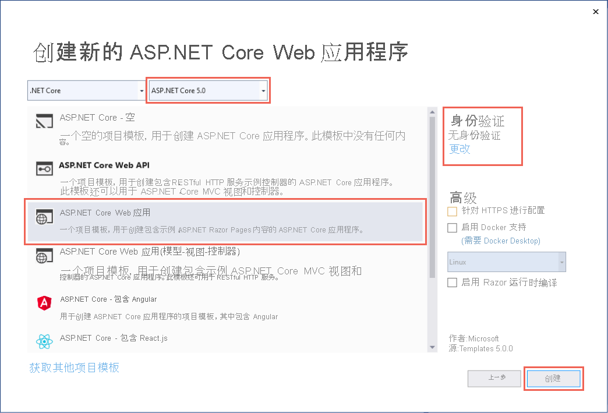
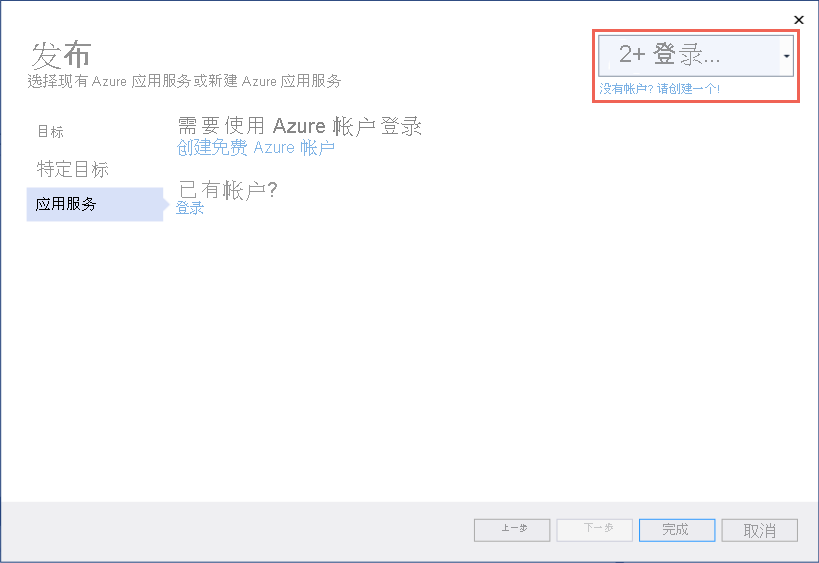
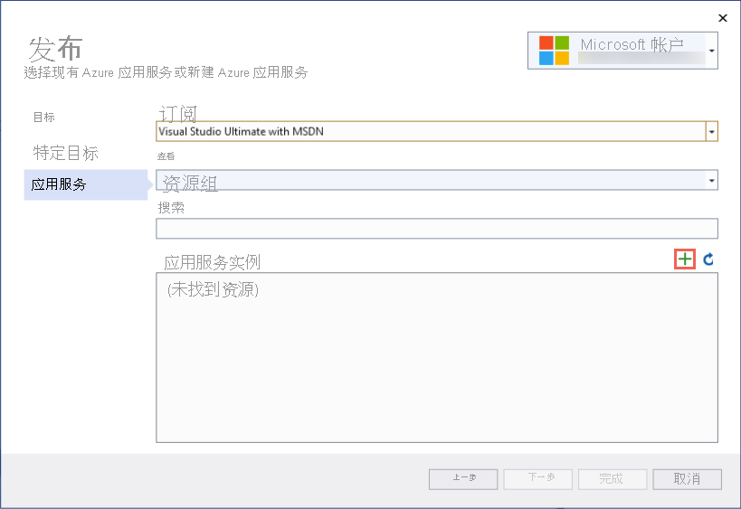
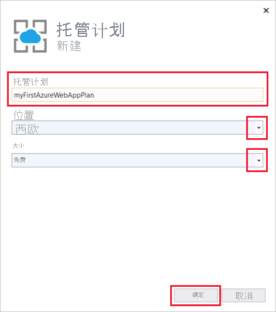
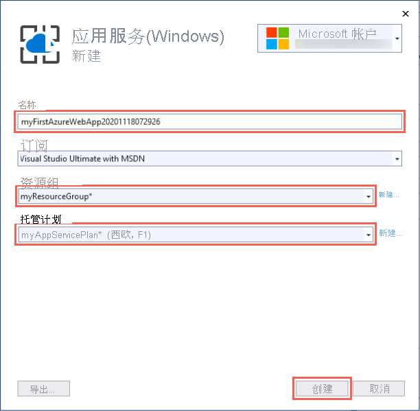
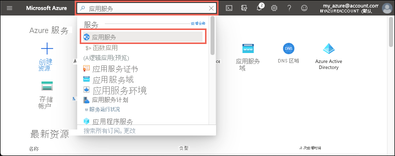
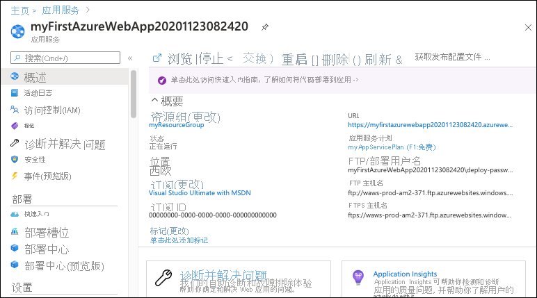
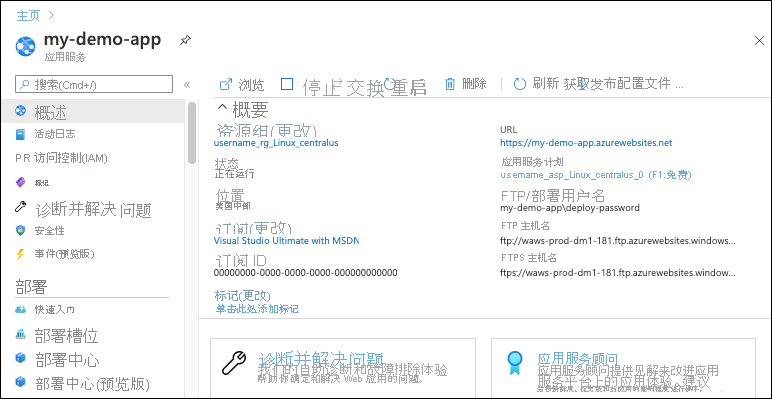

# <a name="quickstart-create-an-aspnet-core-web-app-in-azure"></a>快速入门：在 Azure 中创建 ASP.NET Core Web 应用

::: zone pivot="platform-windows"  

在本快速入门中，你将学习如何创建你第一个 ASP.NET Core Web 应用并将其部署到 <abbr title="一项基于 HTTP 的服务，用于托管 Web 应用程序、REST API 和移动后端应用程序。">Azure 应用服务</abbr>. 应用服务支持 .NET 5.0 应用。

完成后，你将拥有一个 Azure <abbr title="可作为一个单元进行管理的相关 Azure 资源的逻辑容器。">资源组</abbr>，该组中有一个 <abbr title="指定托管应用的 Web 服务器场的位置、大小和功能的计划。">应用服务计划</abbr> 和一个 <abbr title="Web 应用的表示形式，其中包含应用代码、DNS 主机名、证书和相关资源。">应用服务应用</abbr> ，而该应用具有一个已部署的示例 ASP.NET Core 应用程序。

<hr/> 

## <a name="1-prepare-your-environment"></a>1.准备环境

- 获取一个 Azure 帐户，它要具有有效 <abbr title="在 Azure 中管理资源的基本组织结构，通常与组织中的个人或部门相关联。">订阅</abbr>. [免费创建帐户](https://azure.microsoft.com/free/dotnet/)。
- 安装带有 ASP.NET 和 Web 开发工作负载的 <a href="https://www.visualstudio.com/downloads/" target="_blank">Visual Studio 2019</a> 。

<details>
<summary>已安装 Visual Studio 2019？</summary>
如果已安装 Visual Studio 2019：

<ul>
<li>选择“帮助”&gt;“检查更新”，在 Visual Studio 中安装最新更新。 最新的更新包含 .NET 5.0 SDK。</li>
<li>选择“工具”&gt;“获取工具和功能”，添加工作负载。</li>
</ul>
</details>

<hr/> 

## <a name="2-create-an-aspnet-core-web-app"></a>2.创建一个 ASP.NET Core Web 应用

1. 打开 Visual Studio 并选择“创建新项目”。

1. 在“创建新项目”中选择“ASP.NET Core Web 应用程序”，确认“C#”列在所选内容的语言中，然后选择“下一步”。

1. 在“配置新项目”中，将 Web 应用程序项目命名为 *myFirstAzureWebApp*，然后选择“创建”。

   

1. 对于 .NET 5.0 应用，请在下拉列表中选择“ASP.NET Core 5.0”。 否则，请使用默认值。

1. 可将任何类型的 ASP.NET Core Web 应用部署到 Azure，但对于本快速入门，请选择“ASP.NET Core Web 应用”模板。 确保“身份验证”设置为“无身份验证”，并且未选择其他选项。 然后选择“创建”。

    
   
1. 在 Visual Studio 菜单中，选择“调试” > “开始执行(不调试)”以在本地运行 Web 应用。

   

<hr/> 

## <a name="3-publish-your-web-app"></a>3.发布 Web 应用

1. 在“解决方案资源管理器”中右键单击“myFirstAzureWebApp”项目，然后选择“发布”。 

1. 在“发布”中，选择“Azure”，然后单击“下一步”  。

1. 你的选项取决于你是否已登录 Azure 以及是否有一个链接到 Azure 帐户的 Visual Studio 帐户。 选择“添加帐户”或“登录”以登录 Azure 订阅。 如果你已经登录，请选择所需的帐户。

   

1. 在“应用服务实例”的右侧，单击“+” 。

   

1. 对于“订阅”，请接受列出的订阅，或从下拉列表中选择一个新订阅。

1. 对于“资源组”，选择“新建”。 在“新资源组名称”中，输入“myResourceGroup”并选择“确定”。 

1. 对于“托管计划”，请选择“新建”。 

1. 在“托管计划:新建”对话框中，输入下表中指定的值：

   | 设置  | 建议的值 |
   | -------- | --------------- |
   | **托管计划**  | *myFirstAzureWebAppPlan* |
   | **位置**      | “西欧” |
   | **大小**          | *免费* |
   
   

1. 在“名称”中，输入唯一的应用名称。

    <details>
        <summary>可使用哪些字符？</summary>
        有效的字符是 a-z、A-Z、0-9 和 -。 可以接受自动生成的唯一名称。 Web 应用的 URL 为 http://<code>&lt;app-name&gt;.azurewebsites.net</code>，其中 <code>&lt;app-name&gt;</code> 是应用名称。
    </details>

1. 选择“创建”以创建 Azure 资源。 

   

1. 等待向导完成 Azure 资源的创建。 选择“完成”关闭向导。

1. 在“发布”页面中，单击“发布”以部署项目 。 

    <details>
        <summary>Visual Studio 有何作用？</summary>
        Visual Studio 将生成、打包应用并将其发布到 Azure，然后在默认浏览器中启动该应用。
    </details>

   

<hr/> 

## <a name="4-update-the-app-and-redeploy"></a>4.更新应用并重新部署

1. 在 **解决方案资源管理器** 中你的项目下，打开“页” > “Index.cshtml”。

1. 将整个 `<div>` 标记替换为以下代码：

   ```html
   <div class="jumbotron">
       <h1>ASP.NET in Azure!</h1>
       <p class="lead">This is a simple app that we've built that demonstrates how to deploy a .NET app to Azure App Service.</p>
   </div>
   ```

1. 若要重新部署到 Azure，请在“解决方案资源管理器”中右键单击“myFirstAzureWebApp”项目，然后选择“发布”。

1. 在“发布”摘要页中选择“发布” 。

   <!--  -->

    发布完成后，Visual Studio 将启动浏览器并转到 Web 应用的 URL。

    

<hr/> 

## <a name="5-manage-the-azure-app"></a>5.管理 Azure 应用

1. 转到 [Azure 门户](https://portal.azure.com)，搜索并选择“应用服务”。

    
    
1. 在“应用服务”页上，选择 Web 应用的名称。

    :::image type="content" source="./media/quickstart-dotnetcore/select-app-service.png" alt-text="“应用程序服务”页面的屏幕截图，显示已选择一个示例 Web 应用。":::

1. Web 应用的“概述”页包含用于基本管理（例如浏览、停止、启动、重启和删除）的选项。 左侧菜单提供用于配置应用的更多页面。

    
    
<hr/> 

## <a name="6-clean-up-resources"></a>6.清理资源

1. 从 Azure 门户菜单或“主页”页上，选择“资源组” 。 然后，在“资源组”页上，选择“myResourceGroup” 。

1. 在“myResourceGroup”页中，确保列出的资源是要删除的资源。 

1. 选择“删除资源组”  ，在文本框中键入“myResourceGroup”  以确认，然后选择“删除”  。

<hr/> 

## <a name="next-steps"></a>后续步骤

请继续学习下一篇文章，了解如何创建 .NET Core 应用并将其连接到 SQL 数据库：

- [将 ASP.NET Core 与 SQL 数据库配合使用](tutorial-dotnetcore-sqldb-app.md)
- [配置 ASP.NET Core 应用](configure-language-dotnetcore.md)

::: zone-end  

::: zone pivot="platform-linux"
本快速入门演示如何在 Linux 应用服务中创建 [.NET Core](/aspnet/core/) 应用 <abbr title="Linux 应用服务使用 Linux 操作系统，提供高度可缩放的自修补 Web 托管服务。">Linux 上的应用服务</abbr>. 使用 [Azure CLI](/cli/azure/get-started-with-azure-cli) 创建应用，并使用 Git 将 .NET Core 代码部署到该应用。

<hr/> 

## <a name="1-prepare-your-environment"></a>1.准备环境

- 获取具有有效订阅的 Azure 帐户。 [免费创建帐户](https://azure.microsoft.com/free/dotnet/)。
- 安装最新的 <a href="https://dotnet.microsoft.com/download/dotnet-core/3.1" target="_blank">.NET Core 3.1 SDK</a> 或 <a href="https://dotnet.microsoft.com/download/dotnet/5.0" target="_blank">.NET 5.0 SDK</a>。
- <a href="/cli/azure/install-azure-cli" target="_blank">安装最新的 Azure CLI</a>。

[存在问题？请告诉我们。](https://aka.ms/DotNetAppServiceLinuxQuickStart)

<hr/> 

## <a name="2-create-the-app-locally"></a>2.在本地创建应用

1. 运行 `mkdir hellodotnetcore` 可创建目录。

    ```bash
    mkdir hellodotnetcore
    ```

1. 运行 `cd hellodotnetcore` 可更改目录。 

    ```bash
    cd hellodotnetcore
    ```

1. 运行 `dotnet new web` 可创建新的 .NET Core 应用。

    ```bash
    dotnet new web
    ```

<hr/> 

## <a name="3-run-the-app-locally"></a>3.在本地运行应用

1. 运行 `dotnet run` 可查看将其部署到 Azure 时的显示效果。

    ```bash
    dotnet run
    ```
    
1. 打开 Web 浏览器并导航到 `http://localhost:5000` 处的应用。


[存在问题？请告诉我们。](https://aka.ms/DotNetAppServiceLinuxQuickStart)

<hr/> 

## <a name="4-sign-into-azure"></a>4.登录 Azure

运行 `az login` 可登录到 Azure。

```azurecli
az login
```

[存在问题？请告诉我们。](https://aka.ms/DotNetAppServiceLinuxQuickStart)

<hr/> 

## <a name="5-deploy-the-app"></a>5.部署应用

1. 在本地文件夹中运行 `az webapp up`。 将 \<app-name\> 替换为全局唯一名称。

    ```azurecli
    az webapp up --sku F1 --name <app-name> --os-type linux
    ```
    
    <details>
    <summary>疑难解答</summary>
    <ul>
    <li>如果无法识别 <code>az</code> 命令，请确保已按照<a href="#1-prepare-your-environment">准备环境</a>中所述安装了 Azure CLI。</li>
    <li>将 <code>&lt;app-name&gt;</code> 替换为在整个 Azure 中均唯一的名称（有效字符为 <code>a-z</code>、<code>0-9</code> 和 <code>-</code>）<em></em>。 良好的模式是结合使用公司名称和应用标识符。</li>
    <li><code>--sku F1</code> 参数在“免费”定价层上创建 Web 应用。 省略此参数可使用更快的高级层，这会按小时计费。</li>
    <li>可以选择包含参数 <code>--location &lt;location-name&gt;</code>，其中 <code>&lt;location-name&gt;</code> 是可用的 Azure 区域。 可以运行 <a href="/cli/azure/appservice#az_appservice_list_locations"><code>az account list-locations</code></a> 命令来检索 Azure 帐户的允许区域列表。</li>
    </ul>
    </details>
    
1. 等待命令完成。 这可能需要几分钟时间，最后会显示“可在 http://&lt;app-name&gt;.azurewebsites.net 启动应用”。

    <details>
    <summary><code>az webapp up</code> 有何作用？</summary>
    <p><code>az webapp up</code> 命令执行以下操作：</p>
    <ul>
    <li>创建一个默认的资源组。</li>
    <li>创建一个默认的应用服务计划。</li>
    <li>使用指定名称<a href="/cli/azure/webapp#az_webapp_create">创建应用服务应用</a>。</li>
    <li><a href="/azure/app-service/deploy-zip">使用 Zip</a> 将文件从当前工作目录部署到应用。</li>
    <li>运行时，它会提供有关资源创建、日志记录和 ZIP 部署的消息。</li>
    </ul>
    </details>
    
# <a name="net-core-31"></a>[.NET Core 3.1](#tab/netcore31)


# <a name="net-50"></a>[.NET 5.0](#tab/net50)


---

[存在问题？请告诉我们。](https://aka.ms/DotNetAppServiceLinuxQuickStart)

<hr/> 

## <a name="6-browse-to-the-app"></a>6.浏览到应用

使用 Web 浏览器浏览到已部署的应用程序。

```bash
http://<app_name>.azurewebsites.net
```


[存在问题？请告诉我们。](https://aka.ms/DotNetAppServiceLinuxQuickStart)

<hr/> 

## <a name="7-update-and-redeploy-the-code"></a>7.更新并重新部署代码

1. 打开本地目录中的 Startup.cs 文件。 

1. 对方法调用 `context.Response.WriteAsync` 中的文本稍作更改。

    ```csharp
    await context.Response.WriteAsync("Hello Azure!");
    ```
    
1. 保存所做更改。

1. 运行 `az webapp up` 以重新部署：

    ```azurecli
    az webapp up --os-type linux
    ```
    
    <details>
    <summary><code>az webapp up</code> 此时有何作用？</summary>
    首次运行该命令时，它会将应用名称、资源组和应用服务计划从项目根目录保存到 <i>.azure/config</i> 文件。 再次从项目根目录运行它时，它将使用 <i>.azure/config</i> 中保存的值，检测是否已存在应用服务资源，并再次执行 Zip 部署。
    </details>
    
1. 部署完成后，在之前打开的浏览器窗口中点击“刷新”。

    
    
[存在问题？请告诉我们。](https://aka.ms/DotNetAppServiceLinuxQuickStart)

<hr/> 

## <a name="8-manage-your-new-azure-app"></a>8.管理新的 Azure 应用

1. 转到 <a href="https://portal.azure.com" target="_blank">Azure 门户</a>。

1. 在左侧菜单中单击 **应用程序服务**，然后单击 Azure 应用的名称。

    :::image type="content" source="./media/quickstart-dotnetcore/portal-app-service-list-up.png" alt-text="“应用程序服务”的屏幕截图，显示已选择一个示例 Azure 应用。":::

1. 在概述页面中，可执行浏览、停止、启动、重启和删除等基本管理任务。 左侧菜单提供了用于配置应用的不同页面。 

    
    
<hr/> 

## <a name="9-clean-up-resources"></a>9.清理资源

运行 `az group delete --name myResourceGroup` 以删除资源组。

```azurecli-interactive
az group delete --name myResourceGroup
```

[存在问题？请告诉我们。](https://aka.ms/DotNetAppServiceLinuxQuickStart)

<hr/> 

## <a name="next-steps"></a>后续步骤

- [教程：将 ASP.NET Core 应用与 SQL 数据库配合使用](tutorial-dotnetcore-sqldb-app.md)
- [配置 ASP.NET Core 应用](configure-language-dotnetcore.md)

::: zone-end
