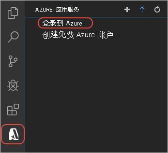

# <a name="create-a-nodejs-web-app-in-azure"></a>在 Azure 中创建 Node.js Web 应用

本快速入门介绍如何创建第一个 Node.js ([Express](https://www.expressjs.com)) 应用并将其部署到 [Azure 应用服务](overview.md)。 应用服务支持 Linux 和 Windows 上各种版本的 Node.js。 

本快速入门在免费层中配置应用服务应用，不会产生 Azure 订阅费用。

## <a name="set-up-your-initial-environment"></a>设置初始环境

:::zone target="docs" pivot="development-environment-vscode"

- 具有活动订阅的 Azure 帐户。 [免费创建帐户](https://azure.microsoft.com/free/?utm_source=campaign&utm_campaign=vscode-tutorial-app-service-extension&mktingSource=vscode-tutorial-app-service-extension)。
- 安装 [Node.js 和 npm](https://nodejs.org)。 运行命令 `node --version` 验证是否已安装 Node.js。
- 安装 [Visual Studio Code](https://code.visualstudio.com/)。
- Visual Studio Code 的 [Azure 应用服务扩展](https://marketplace.visualstudio.com/items?itemName=ms-azuretools.vscode-azureappservice)。
 <!-- - <a href="https://git-scm.com/" target="_blank">Install Git</a> -->

::: zone-end

:::zone target="docs" pivot="development-environment-cli"

- 具有活动订阅的 Azure 帐户。 [免费创建帐户](https://azure.microsoft.com/free/?utm_source=campaign&utm_campaign=vscode-tutorial-app-service-extension&mktingSource=vscode-tutorial-app-service-extension)。
- 安装 [Node.js 和 npm](https://nodejs.org)。 运行命令 `node --version` 验证是否已安装 Node.js。
- 安装 <a href="/cli/azure/install-azure-cli" target="_blank">Azure CLI</a>，使用它可以在任何 shell 中运行命令来预配和配置 Azure 资源。

::: zone-end

## <a name="create-your-nodejs-application"></a>创建 Node.js 应用程序

在本步骤中，需要创建一个 Node.js 应用程序，并确保它在计算机上正常运行。

> [!TIP]
> 如果已完成 [Node.js 教程](https://code.visualstudio.com/docs/nodejs/nodejs-tutorial)，可直接跳转到[部署到 Azure](#deploy-to-azure)。

1. 使用 [Express 生成器](https://expressjs.com/starter/generator.html)创建一个简单的 Node.js 应用程序，该生成器默认随 Node.js 和 NPM 一起安装。

    ```bash
    npx express-generator myExpressApp --view pug
    ```

1. 更改为应用程序的目录并安装 NPM 包。

    ```bash
    cd myExpressApp
    npm install
    ```

1. 启动开发服务器。

    ```bash
    npm start
    ```

1. 在浏览器中导航到 `http://localhost:3000`。 你应看到与下面类似的内容：

    

:::zone target="docs" pivot="development-environment-vscode"
> [!div class="nextstepaction"]
> [我遇到了问题](https://www.research.net/r/PWZWZ52?tutorial=node-deployment-azure-app-service&step=create-app)
::: zone-end

## <a name="deploy-to-azure"></a>“部署到 Azure”

在继续之前，请确保已安装并配置了所有必备组件。

> [!NOTE]
> 若要使 Node.js 应用程序在 Azure 中运行，应用程序需要侦听 `PORT` 环境变量提供的端口。 在生成的 Express 应用中，此环境变量已在启动脚本 bin/www 中（搜索 `process.env.PORT`）使用。
>

:::zone target="docs" pivot="development-environment-vscode"

#### <a name="sign-in-to-azure"></a>登录 Azure

1. 在终端中，确保位于 myExpressApp 目录，然后通过以下命令启动 Visual Studio Code：

    ```bash
    code .
    ```

1. 在 Visual Studio Code 的[活动栏](https://code.visualstudio.com/docs/getstarted/userinterface)上，选择 Azure 徽标。

1. 在“应用服务”资源管理器中，选择“登录到 Azure...”，然后按照说明进行操作 。

    在 Visual Studio Code 中，状态栏中应会显示你的 Azure 电子邮件地址，并且“AZURE 应用服务”资源管理器中应会显示你的订阅。

    

> [!div class="nextstepaction"]
> [我遇到了问题](https://www.research.net/r/PWZWZ52?tutorial=node-deployment-azure-app-service&step=getting-started)

#### <a name="configure-the-app-service-app-and-deploy-code"></a>配置应用服务应用并部署代码

1. 在应用服务资源管理器中，选择“部署到 Web 应用”图标 。

    :::image type="content" source="media/quickstart-nodejs/deploy.png" alt-text="Visual Studio Code 中 Azure 应用服务的屏幕截图，其中显示了已选择的蓝色箭头图标。":::
        
1. 选择 myExpressApp 文件夹。

# <a name="deploy-to-linux"></a>[部署到 Linux](#tab/linux)

3. 选择“创建新 Web 应用”。 默认情况下使用 Linux 容器。
1. 键入 Web 应用的全局唯一名称，然后按 **Enter**。 该名称必须在整个 Azure 中保持唯一，且只能使用字母数字字符（“A-Z”、“a-z”和“0-9”）和连字符（“-”）。
1. 在“选择运行时堆栈”中，选择所需的 Node.js 版本。 建议使用 **LTS** 版本。
1. 在“选择定价层”中，选择“免费(F1)”并等待资源在 Azure 中完成预配。
1. 在弹出窗口“始终将工作区‘myExpressApp’部署到 \<app-name>”中，选择“是” 。 这样，只要在同一工作区中，Visual Studio Code 便可以每次部署到同一应用服务应用。

    当 Visual Studio Code 预配 Azure 资源并部署代码时，它会显示[进度通知](https://code.visualstudio.com/api/references/extension-guidelines#notifications)。

1. 部署完成后，从通知弹出窗口中选择“浏览网站”。 浏览器应显示 Express 默认页。

# <a name="deploy-to-windows"></a>[部署到 Windows](#tab/windows)

3. 选择“创建新 Web 应用...高级”。
1. 键入 Web 应用的全局唯一名称，然后按 **Enter**。 该名称必须在整个 Azure 中保持唯一，且只能使用字母数字字符（“A-Z”、“a-z”和“0-9”）和连字符（“-”）。
1. 选择“创建新的资源组”，然后输入资源组的名称，例如“AppServiceQS-rg”。
1. 选择所需的 Node.js 版本。 建议使用 **LTS** 版本。
1. 选择 **Windows** 作为操作系统。
1. 选择要为应用提供服务的位置。 例如“欧洲西部”。
1. 选择“创建新的应用服务计划”，输入该计划的名称（例如“AppServiceQS-plan”），然后选择“F1 免费”作为定价层。
1. 对于“为应用选择 Application Insights 资源”，选择“暂时跳过”，然后等待资源在 Azure 中完成预配 。
1. 在弹出窗口“始终将工作区‘myExpressApp’部署到 \<app-name>”中，选择“是” 。 这样，只要在同一工作区中，Visual Studio Code 便可以每次部署到同一应用服务应用。

    当 Visual Studio Code 预配 Azure 资源并部署代码时，它会显示[进度通知](https://code.visualstudio.com/api/references/extension-guidelines#notifications)。

    > [!NOTE]
    > 部署完成后，Azure 应用还未运行，因为项目根目录没有 web.config。请按照其余步骤自动生成它。 有关详细信息，请参阅[无权查看此目录或页](configure-language-nodejs.md#you-do-not-have-permission-to-view-this-directory-or-page)。

1. 在 Visual Studio Code 的应用服务资源管理器中，展开新应用的节点，右键单击“应用程序设置”，然后选择“添加新设置”  ：

    

1. 为设置键输入 `SCM_DO_BUILD_DURING_DEPLOYMENT`。
1. 为设置值输入 `true`。

    此应用设置在部署时启用生成自动化，自动检测启动脚本并生成 web.config 脚本。

1. 在应用服务资源管理器中，再次选择“部署到 Web 应用”图标，然后再次单击“部署”进行确认  。
1. 等待部署完成，然后在通知弹出窗口中选择“浏览网站”。 浏览器应显示 Express 默认页。

-----

> [!div class="nextstepaction"]
> [我遇到了问题](https://www.research.net/r/PWZWZ52?tutorial=node-deployment-azure-app-service&step=deploy-app)

::: zone-end

:::zone target="docs" pivot="development-environment-cli"

在终端中，确保位于 myExpressApp 目录，然后使用 `az webapp up` 命令部署本地文件夹 (myExpressApp) 中的代码 ：

# <a name="deploy-to-linux"></a>[部署到 Linux](#tab/linux)

```azurecli
az webapp up --sku F1 --name <app-name>
```

# <a name="deploy-to-windows"></a>[部署到 Windows](#tab/windows)

```azurecli
az webapp up --sku F1 --name <app-name> --os-type Windows
```

-----

- 如果无法识别 `az` 命令，请确保按照[设置初始环境](#set-up-your-initial-environment)中所述安装 Azure CLI。
- 将 `<app_name>` 替换为在整个 Azure 中均唯一的名称（有效字符为 `a-z`、`0-9` 和 `-`）。 良好的模式是结合使用公司名称和应用标识符。
- `--sku F1` 参数在“免费”定价层上创建 Web 应用而不会产生费用。
- 可以选择包含参数 `--location <location-name>`，其中 `<location_name>` 是可用的 Azure 区域。 可以运行 [`az account list-locations`](/cli/azure/appservice#az_appservice_list_locations) 命令来检索 Azure 帐户的允许区域列表。
- 默认情况下，命令会为 Node.js 创建 Linux 应用。 若要改为创建 Windows 应用，请使用 `--os-type` 参数。 
- 如果看到错误“无法自动检测应用的运行时堆栈”，请确保在 myExpressApp 目录中运行命令（请参阅[使用 az webapp up 排查自动检测问题](https://github.com/Azure/app-service-linux-docs/blob/master/AzWebAppUP/runtime_detection.md)）。

此命令可能需要花费几分钟时间完成。 运行时，它提供以下相关信息：创建资源组、应用服务计划、应用资源、配置日志记录以及执行 ZIP 部署。 然后，它将显示消息“可以在 http://&lt;app-name&gt;.azurewebsites.net（这是 Azure 上应用的 URL）启动应用”。

<pre>
The webapp '&lt;app-name>' doesn't exist
Creating Resource group '&lt;group-name>' ...
Resource group creation complete
Creating AppServicePlan '&lt;app-service-plan-name>' ...
Creating webapp '&lt;app-name>' ...
Configuring default logging for the app, if not already enabled
Creating zip with contents of dir /home/cephas/myExpressApp ...
Getting scm site credentials for zip deployment
Starting zip deployment. This operation can take a while to complete ...
Deployment endpoint responded with status code 202
You can launch the app at http://&lt;app-name>.azurewebsites.net
{
  "URL": "http://&lt;app-name>.azurewebsites.net",
  "appserviceplan": "&lt;app-service-plan-name>",
  "location": "centralus",
  "name": "&lt;app-name>",
  "os": "&lt;os-type>",
  "resourcegroup": "&lt;group-name>",
  "runtime_version": "node|10.14",
  "runtime_version_detected": "0.0",
  "sku": "FREE",
  "src_path": "//home//cephas//myExpressApp"
}
</pre>

[!include [az webapp up command note](../../includes/app-service-web-az-webapp-up-note.md)]

::: zone-end

## <a name="redeploy-updates"></a>重新部署更新

可以通过在 Visual Studio Code 中进行编辑、保存文件，然后重新部署到 Azure 应用来部署对此应用的更改。 例如：

1. 在示例项目中，打开 views/index.pug 并更改

    ```PUG
    p Welcome to #{title}
    ```

    to
    
    ```PUG
    p Welcome to Azure!
    ```

:::zone target="docs" pivot="development-environment-vscode"

2. 在应用服务资源管理器中，再次选择“部署到 Web 应用”图标，然后再次单击“部署”进行确认  。

1. 等待部署完成，然后在通知弹出窗口中选择“浏览网站”。 应会看到 `Welcome to Express` 消息已更改为 `Welcome to Azure!`。

::: zone-end

:::zone target="docs" pivot="development-environment-cli"

2. 保存更改，然后再次使用 `az webapp up` 命令（无需参数）重新部署应用：

    ```azurecli
    az webapp up
    ```
    
    此命令使用本地缓存在 .azure/config 文件中的值，例如应用名称、资源组和应用服务计划。
    
1. 部署完成后，刷新网页 `http://<app-name>.azurewebsites.net`。 应会看到 `Welcome to Express` 消息已更改为 `Welcome to Azure!`。

::: zone-end

## <a name="stream-logs"></a>流式传输日志

:::zone target="docs" pivot="development-environment-vscode"

可以在 Visual Studio Code 输出窗口中直接从 Azure 应用流式传输日志输出（对 `console.log()` 的调用）。

1. 在“应用服务”资源管理器中，右键单击应用节点，然后选择“开始流式传输日志” 。

    

1. 如果系统要求重新启动应用，请单击“是”。 重启应用后，Visual Studio Code 输出窗口将会打开，其中包含与日志流建立的连接。 

1. 几秒钟后，输出窗口将看到一条消息，指出已连接到日志流服务。 可以通过刷新浏览器中的页面来生成更多输出活动。

    <pre>
    Connecting to log stream...
    2020-03-04T19:29:44  Welcome, you are now connected to log-streaming service. The default timeout is 2 hours.
    Change the timeout with the App Setting SCM_LOGSTREAM_TIMEOUT (in seconds).
    </pre>

> [!div class="nextstepaction"]
> [我遇到了问题](https://www.research.net/r/PWZWZ52?tutorial=node-deployment-azure-app-service&step=tailing-logs)

::: zone-end

:::zone target="docs" pivot="development-environment-cli"

可以访问应用内和运行应用的容器所生成的控制台日志。 日志包括通过调用 `console.log()` 生成的任何输出。

若要流式传输日志，请运行 [az webapp log tail](/cli/azure/webapp/log#az_webapp_log_tail) 命令：

```azurecli
az webapp log tail
```

此命令使用 .azure/config 文件中缓存的资源组名称。

还可以在 `az webapp up` 命令中包含 `--logs` 参数，以在部署时自动打开日志流。

在浏览器中刷新应用以生成控制台日志，其中包括描述对应用的 HTTP 请求的消息。 如果未立即显示输出，请在 30 秒后重试。

若要随时停止日志流式处理，请在终端中按 Ctrl+C。

::: zone-end

## <a name="clean-up-resources"></a>清理资源

:::zone target="docs" pivot="development-environment-vscode"

在前面的步骤中，你在资源组中创建了 Azure 资源。 此快速入门中的创建步骤会将所有资源放在此资源组中。 若要进行清理，只需删除资源组。


1. 在 Visual Studio 的 Azure 扩展中，展开“资源组”资源管理器。

1. 展开订阅，右键单击之前创建的资源组，然后选择“删除”。

    :::image type="content" source="media/quickstart-nodejs/clean-up.png" alt-text="Visual Studio Code 导航的屏幕截图，其中显示了用于删除包含应用服务资源的选项。":::

1. 出现提示时，请输入要删除的资源组的名称以确认删除。 确认后，资源组将被删除，并且在完成后会显示一条[通知](https://code.visualstudio.com/api/references/extension-guidelines#notifications)。

> [!div class="nextstepaction"]
> [我遇到了问题](https://www.research.net/r/PWZWZ52?tutorial=node-deployment-azure-app-service&step=clean-up)

::: zone-end

:::zone target="docs" pivot="development-environment-cli"

在前面的步骤中，你在资源组中创建了 Azure 资源。 资源组根据位置得名，例如“appsvc_rg_Linux_CentralUS”。

如果你认为将来不再需要这些资源，请运行以下命令删除资源组：

```azurecli
az group delete --no-wait
```

此命令使用 .azure/config 文件中缓存的资源组名称。

`--no-wait` 参数允许此命令在操作完成之前返回。

::: zone-end

## <a name="next-steps"></a>后续步骤

祝贺你，你现已成功完成本快速入门！

> [!div class="nextstepaction"]
> [教程：使用 MongoDB 的 Node.js 应用](tutorial-nodejs-mongodb-app.md)

> [!div class="nextstepaction"]
> [配置 Node.js 应用](configure-language-nodejs.md)

查看其他 Azure 扩展。

* [Cosmos DB](https://marketplace.visualstudio.com/items?itemName=ms-azuretools.vscode-cosmosdb)
* [Azure Functions](https://marketplace.visualstudio.com/items?itemName=ms-azuretools.vscode-azurefunctions)
* [Docker 工具](https://marketplace.visualstudio.com/items?itemName=PeterJausovec.vscode-docker)
* [Azure CLI 工具](https://marketplace.visualstudio.com/items?itemName=ms-vscode.azurecli)
* [Azure 资源管理器工具](https://marketplace.visualstudio.com/items?itemName=msazurermtools.azurerm-vscode-tools)

或安装 [Node Pack for Azure](https://marketplace.visualstudio.com/items?itemName=ms-vscode.vscode-node-azure-pack) 扩展包获取所有这些工具。
