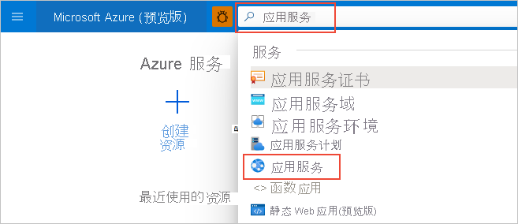
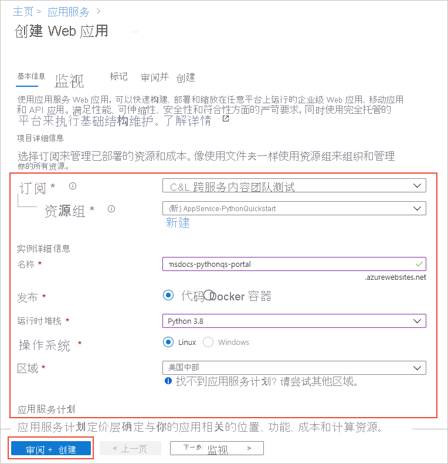
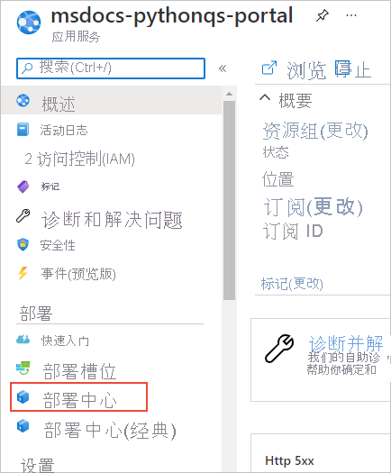
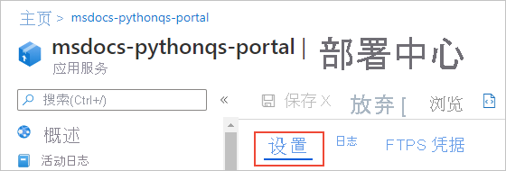
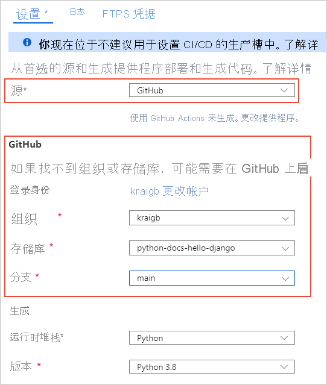
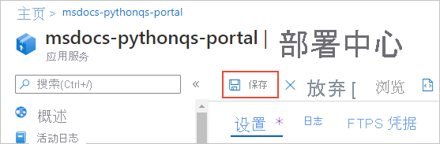
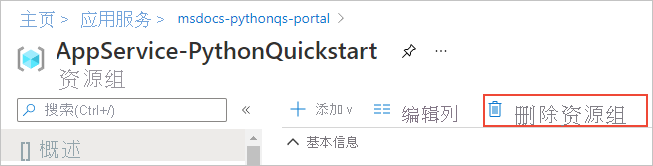

# 快速入门：使用 Linux 上的 Azure 应用服务（Azure 门户）创建 Python 应用

在本快速入门中，需将 Python Web 应用部署到 [Linux 上的应用服务](overview.md#app-service-on-linux)，该版本提供了一项高度可缩放、自我修补的 Azure Web 托管服务。 使用 Azure 门户，通过 Flask 或 Django 框架部署示例。 你配置的 Web 应用使用的是基本应用服务层，这会在 Azure 订阅中产生很少的费用。

## 配置帐户

- 如果没有具备有效订阅的 Azure 帐户，请[免费创建一个帐户](https://azure.microsoft.com/free/?ref=microsoft.com&utm_source=microsoft.com&utm_medium=docs&utm_campaign=visualstudio)。

- 如果没有 GitHub 帐户，请访问 [github.com](https://github.com) 创建一个帐户。 

## 创建示例 GitHub 存储库分支

1. 打开 [github.com](https://github.com) 并登录。

1. 导航至下列任一示例存储库：
    - [Flask Hello World](https://github.com/Azure-Samples/python-docs-hello-world)
    - [Django Hello World](https://github.com/Azure-Samples/python-docs-hello-django)

1. 在 GitHub 页面右上角，选择“创建分支”，以在自己的 GitHub 帐户中创建存储库副本：

    

    拥有访问包含存储库的 GitHub 组织的权限，方可使用 Azure。 在自己的 GitHub 帐户中创建示例分支，即可自动获得必要的访问权限，亦可对代码进行更改。

## 预配应用服务 Web 应用

应用服务 Web 应用是向其部署代码的 Web 服务器。

1. 打开 Azure 门户（网址为 [https://portal.azure.com](https://portal.azure.com)），并根据需要进行登录。

1. 在 Azure 门户顶部的搜索栏中，输入“应用服务”，然后选择“应用服务”。

    

1. 在“应用服务”页面上，选择“+ 添加”：

    

1. 在“创建 Web 应用”页面上，执行以下操作：
    
    | 字段 | 操作 |
    | --- | --- |
    | 订阅 | 选择要使用的 Azure 订阅。 |
    | 资源组 | 在下拉菜单中选择“新建”。 在弹出窗口中，输入“AppService-PythonQuickstart” 并选择“确定”。 |
    | 名称 | 输入在所有 Azure 中都唯一的名称，通常使用个人名称或公司名称的组合，例如 contoso-testapp-123。 |
    | 发布 | 选择“代码”。 |
    | 运行时堆栈 | 选择 Python 3.8。 |
    | 操作系统 | 选择 Linux（Python 仅在 Linux 上受支持）。 |
    | Region | 选择你附近的区域。 |
    | Linux 计划 | 选择一个现有的应用服务计划，或使用“新建”创建一个新计划。 建议使用“基本 B1”计划。 |

    

1. 在页面底部，选择“查看 + 创建”，查看详细信息，然后选择“创建”。

1. 完成预配后，选择“转到资源”，以导航到新应用服务页面。 此时，Web 应用仅包含一个默认页面，因此下一步是部署示例代码。

遇到问题？ [请告诉我们](https://aka.ms/FlaskPortalQuickstartHelp)。

## 部署示例代码

1. 在 Azure 门户的“Web 应用”页面上，选择“部署中心”：
    
    

1. 在“部署中心”页面上，选择“设置”选项卡（如果尚未打开）：

    

1. 在“源提供程序”下，选择 GitHub，然后在显示的 GitHub 窗体上执行以下操作：

    | 字段 | 操作 |
    | --- | --- |
    | 登录身份为 | 如果尚未登录 GitHub，请立即登录，或根据需要选择*“更改帐户”。 |
    | 组织 | 如有需要，请选择 GitHub 组织。 |
    | 存储库 | 选择之前创建分支的示例存储库的名称，即 python-docs-hello-world (Flask) 或 python-docs-hello-django (Django)。 |
    | 分支 | 选择“主要”。 |

    

1. 在页面顶部，选择“保存”以应用设置：

    

1. 选择“日志”选项卡以查看部署状态。 生成并部署示例需要几分钟时间，在此过程中，将显示其他日志。 完成后，日志反映的状态应为“成功（活动）”：

    

遇到问题？ [请告诉我们](https://aka.ms/FlaskPortalQuickstartHelp)。

## 浏览到应用

1. 部署完成后，在左侧菜单中选择“概述”以返回到 Web 应用的主页。

1. 选择包含 Web 应用地址的 URL：

    

1. 验证应用的输出是否为“Hello, World!”：

    

遇到问题？ 请先参阅[故障排除指南](configure-language-python.md#troubleshooting)，如果问题未能解决，请[告诉我们](https://aka.ms/FlaskPortalQuickstartHelp)。

## 更改和重新部署

由于已将应用服务连接至存储库，因此，提交至源存储库的更改会自动部署到 Web 应用中。

1. 你可以直接在 GitHub 上创建分支的存储库中进行更改，亦可在本地克隆存储库，进行更改并提交，然后将更改推送至 GitHub。 这两种方法都可对连接至应用服务的存储库进行更改。

1. 在创建分支的存储库中，将应用的消息从“Hello, World!” 改为“Hello, Azure!” 如下所示：
    - Flask（python-docs-hello-world 示例）：更改 application.py 文件第 6 行的文本字符串。
    - Django（python-docs-hello-django 示例）：更改 hello 文件夹内 views.py 文件第 5 行的文本字符串。

1. 将更改提交至存储库。

    如果你使用的是本地克隆，还需要将这些更改推送至 GitHub。

1. 在 Web 应用的 Azure 门户上，返回到“部署中心”，选择“日志”选项卡，并注意正在进行的新部署活动。

1. 部署完成后，返回到 Web 应用的“概述”页面，再次打开 Web 应用的 URL，并观察应用中的更改：

    

遇到问题？ 请先参阅[故障排除指南](configure-language-python.md#troubleshooting)，如果问题未能解决，请[告诉我们](https://aka.ms/FlaskCLIQuickstartHelp)。

## 清理资源

在先前步骤中，已在名为“AppService-PythonQuickstart”的资源组（显示在 Web 应用的“概述”*页面上）中创建 Azure 资源。 如果将 Web 应用保持运行状态，则会产生一些持续成本（请参阅[应用服务定价](https://azure.microsoft.com/pricing/details/app-service/linux/)）。

如果今后无需这些资源，请在 Web 应用的“概述”页面上选择资源组的名称，导航到“资源组概述”。 选择“删除资源组”，然后按提示进行操作。

遇到问题？ [请告诉我们](https://aka.ms/FlaskCLIQuickstartHelp)。

## 后续步骤

> [!div class="nextstepaction"]
> [教程：使用 PostgreSQL 的 Python (Django) Web 应用](/azure/developer/python/tutorial-python-postgresql-app-portal)

> [!div class="nextstepaction"]
> [配置 Python 应用](configure-language-python.md)

> [!div class="nextstepaction"]
> [将用户登录添加到 Python Web 应用](../active-directory/develop/quickstart-v2-python-webapp.md)

> [!div class="nextstepaction"]
> [教程：在自定义容器中运行 Python 应用](tutorial-custom-container.md)
