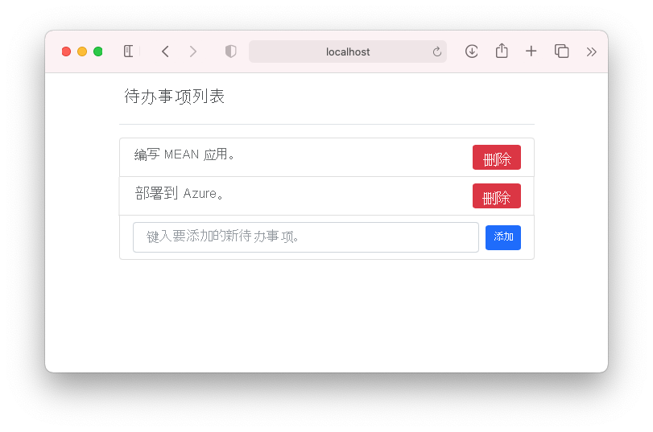
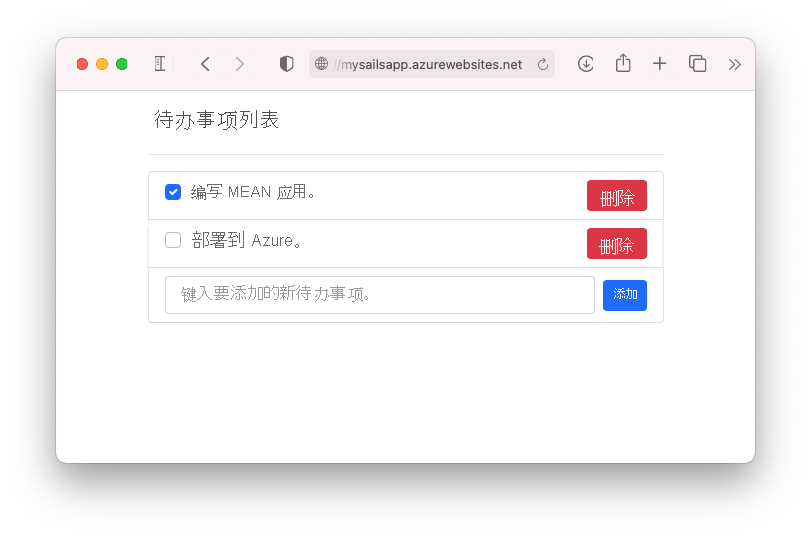

# <a name="tutorial-build-a-nodejs-and-mongodb-app-in-azure"></a>教程：在 Azure 中生成 Node.js 和 MongoDB 应用

::: zone pivot="platform-windows"  

[Azure 应用服务](overview.md)提供高度可缩放、自修复的 Web 托管服务。 本教程演示如何在 Windows 上的应用服务中创建 Node.js 应用，并将其连接至 MongoDB 数据库。 完成操作后，将拥有一个在 [Azure 应用服务](overview.md)上运行的 MEAN 应用程序（MongoDB、Express、AngularJS 和 Node.js）。 示例应用程序结合使用了 [Sails.js](https://sailsjs.com/) 和 [Angular 12](https://angular.io/)。

::: zone-end

::: zone pivot="platform-linux"


[Azure 应用服务](overview.md)使用 Linux 操作系统，提供高度可缩放的自修补 Web 托管服务。 本教程演示如何在 Linux 上的应用服务中创建 Node.js 应用，在本地将其连接到 MongoDB 数据库，然后将其部署到 Azure Cosmos DB 用于 MongoDB 的 API 中的数据库。 完成操作后，将拥有一个在 Linux 应用服务中运行的 MEAN 应用程序（MongoDB、Express、AngularJS 和 Node.js）。 示例应用程序结合使用了 [Sails.js](https://sailsjs.com/) 和 [Angular 12](https://angular.io/)。

::: zone-end


学习内容：

> [!div class="checklist"]
> * 在 Azure 中创建 MongoDB 数据库
> * 将 Node.js 应用连接到 MongoDB
> * 将应用部署到 Azure
> * 更新数据模型并重新部署应用
> * 从 Azure 流式传输诊断日志
> * 在 Azure 门户中管理应用

[!INCLUDE [quickstarts-free-trial-note](../../includes/quickstarts-free-trial-note.md)]

## <a name="prerequisites"></a>先决条件

为完成此教程：

- [安装 Git](https://git-scm.com/)
- [安装 Node.js 和 NPM](https://nodejs.org/)
[!INCLUDE [azure-cli-prepare-your-environment-no-header.md](../../includes/azure-cli-prepare-your-environment-no-header.md)] 

## <a name="create-local-nodejs-app"></a>创建本地 Node.js 应用

在此步骤中，将设置本地 Node.js 项目。

### <a name="clone-the-sample-application"></a>克隆示例应用程序

在终端窗口中，通过 `cd` 转到工作目录。  

运行下列命令，克隆示例存储库。 

```bash
git clone https://github.com/Azure-Samples/mean-todoapp.git
```

> [!NOTE]
> 有关如何创建示例应用的信息，请参阅 [https://github.com/Azure-Samples/mean-todoapp](https://github.com/Azure-Samples/mean-todoapp)。

### <a name="run-the-application"></a>运行应用程序

运行以下命令，安装所需的包并启动应用程序。

```bash
cd mean-todoapp
npm install
node app.js --alter
```

当应用完全加载后，将看到以下类似消息：

<pre>
debug: -------------------------------------------------------
debug: :: Fri Jul 09 2021 13:10:34 GMT+0200 (Central European Summer Time)

debug: Environment : development
debug: Port        : 1337
debug: -------------------------------------------------------
</pre>

在浏览器中导航至 `http://localhost:1337` 。 添加几个待办事项。

MEAN 示例应用程序将用户数据存储在数据库中。 它默认使用基于磁盘的开发数据库。 如果你可以创建和查看待办事项，则表示你的应用正在读取和写入数据。



在终端按 `Ctrl+C`，随时停止 Node.js。 

## <a name="create-production-mongodb"></a>创建生产 MongoDB

在此步骤中，会在 Azure 中创建 MongoDB 数据库。 应用部署到 Azure 后，它将使用该云数据库。

对于 MongoDB，本教程使用了 [Azure Cosmos DB](/azure/cosmos-db/)。 Cosmos DB 支持 MongoDB 客户端连接。

### <a name="create-a-resource-group"></a>创建资源组

[!INCLUDE [Create resource group](../../includes/app-service-web-create-resource-group-no-h.md)] 

### <a name="create-a-cosmos-db-account"></a>创建 Cosmos DB 帐户

> [!NOTE]
> 在本教程中，在你自己的 Azure 订阅中创建 Azure Cosmos DB 数据库需付费。 若要使用七天免费的 Azure Cosmos DB 帐户，可以使用[免费试用 Azure Cosmos DB](https://azure.microsoft.com/try/cosmosdb/) 体验。 直接单击 MongoDB 磁贴中的“创建”按钮即可在 Azure 上创建免费的 MongoDB 数据库。 创建数据库以后，请在门户中导航到“连接字符串”，然后检索 Azure Cosmos DB 连接字符串，以便在本教程的后面使用。
>

在 Cloud Shell 中，使用 [`az cosmosdb create`](/cli/azure/cosmosdb#az_cosmosdb_create) 命令创建 Cosmos DB 帐户。

在下面的命令中，用唯一 Cosmos DB 名称替换 \<cosmosdb-name> 占位符。 此名称用作 Cosmos DB 终结点 `https://<cosmosdb-name>.documents.azure.com/` 的一部分，因此需要在 Azure 中的所有 Cosmos DB 帐户中具有唯一性。 它只能包含小写字母、数字及连字符(-)，长度必须为 3 到 50 个字符。

```azurecli-interactive
az cosmosdb create --name <cosmosdb-name> --resource-group myResourceGroup --kind MongoDB
```

--kind MongoDB 参数启用 MongoDB 客户端连接。

创建 Cosmos DB 帐户后，Azure CLI 会显示类似于以下示例的信息：

<pre>
{
  "apiProperties": {
    "serverVersion": "3.6"
  },
  "backupPolicy": {
    "periodicModeProperties": {
      "backupIntervalInMinutes": 240,
      "backupRetentionIntervalInHours": 8,
      "backupStorageRedundancy": "Geo"
    },
    "type": "Periodic"
  },
  "capabilities": [
    {
      "name": "EnableMongo"
    }
  ],
  "connectorOffer": null,
  "consistencyPolicy": {
    "defaultConsistencyLevel": "Session",
    "maxIntervalInSeconds": 5,
    "maxStalenessPrefix": 100
  },
  "cors": [],
  "databaseAccountOfferType": "Standard",
  "defaultIdentity": "FirstPartyIdentity",
  "disableKeyBasedMetadataWriteAccess": false,
  "documentEndpoint": "https://&lt;cosmosdb-name&gt;.documents.azure.com:443/",
  ...
  &lt; Output truncated for readability &gt;
}
</pre>

## <a name="connect-app-to-production-mongodb"></a>将应用连接到生产 MongoDB

在此步骤中，你将使用 MongoDB 连接字符串将示例应用程序连接到刚刚创建的 Cosmos DB 数据库。 

### <a name="retrieve-the-database-key"></a>检索数据库键

要连接至到 Cosmos DB 数据库，需要数据库键。 在 Cloud Shell 中，使用 [`az cosmosdb keys list`](/cli/azure/cosmosdb#az_cosmosdb_keys_list) 命令检索主键。

```azurecli-interactive
az cosmosdb keys list --name <cosmosdb-name> --resource-group myResourceGroup
```

Azure CLI 显示类似于以下示例的信息：

<pre>
{
  "primaryMasterKey": "RS4CmUwzGRASJPMoc0kiEvdnKmxyRILC9BWisAYh3Hq4zBYKr0XQiSE4pqx3UchBeO4QRCzUt1i7w0rOkitoJw==",
  "primaryReadonlyMasterKey": "HvitsjIYz8TwRmIuPEUAALRwqgKOzJUjW22wPL2U8zoMVhGvregBkBk9LdMTxqBgDETSq7obbwZtdeFY7hElTg==",
  "secondaryMasterKey": "Lu9aeZTiXU4PjuuyGBbvS1N9IRG3oegIrIh95U6VOstf9bJiiIpw3IfwSUgQWSEYM3VeEyrhHJ4rn3Ci0vuFqA==",
  "secondaryReadonlyMasterKey": "LpsCicpVZqHRy7qbMgrzbRKjbYCwCKPQRl0QpgReAOxMcggTvxJFA94fTi0oQ7xtxpftTJcXkjTirQ0pT7QFrQ=="
}
</pre>

复制 `primaryMasterKey` 的值。 下一步需要用到此信息。

<a name="devconfig"></a>
### <a name="configure-the-connection-string-in-your-sample-application"></a>在示例应用程序中配置连接字符串

在本地存储库的 config/datastores.js 中，将现有内容替换为以下代码并保存更改。

```javascript
module.exports.datastores = {
  default: {
    adapter: 'sails-mongo',
    url: process.env.MONGODB_URI,
    ssl: true,
  },
};
```

`ssl: true` 选项是必需的，因为 [Cosmos DB 需要 TLS/SSL](../cosmos-db/connect-mongodb-account.md#connection-string-requirements)。 `url` 设置为某个环境变量，接下来你将设置该变量。 

在终端中设置 `MONGODB_URI` 环境变量。 请务必将两个 \<cosmosdb-name> 占位符替换为你的 Cosmos DB 数据库名称，将 \<cosmosdb-key> 占位符替换为在前一步骤中复制的密钥。

```bash
export MONGODB_URI=mongodb://<cosmosdb-name>:<cosmosdb-key>@<cosmosdb-name>.documents.azure.com:10250/todoapp
```

> [!NOTE]
> 此连接字符串遵循 [Sails.js 文档](https://sailsjs.com/documentation/reference/configuration/sails-config-datastores#?the-connection-url)中定义的格式。

### <a name="test-the-application-with-mongodb"></a>使用 MongoDB 测试应用程序

在本地终端窗口中，再次运行 `node app.js --alter`。

```bash
node app.js --alter
```

再次导航到 `http://localhost:1337`。 如果你可以创建和查看待办事项，则表示你的应用正在使用 Azure 中的 Cosmos DB 数据库读取和写入数据。 

在终端中，通过键入 `Ctrl+C` 停止 Node.js。 

## <a name="deploy-app-to-azure"></a>将应用部署到 Azure

在此步骤中，将连接了 MongoDB 的 Node.js 应用程序部署至 Azure 应用服务。

### <a name="configure-a-deployment-user"></a>配置部署用户

[!INCLUDE [Configure deployment user](../../includes/configure-deployment-user-no-h.md)]

### <a name="create-an-app-service-plan"></a>创建应用服务计划

::: zone pivot="platform-windows"  

在 Cloud Shell 中，使用 [`az appservice plan create`](/cli/azure/appservice/plan) 命令创建一个应用服务计划。

以下示例在 B1 定价层中创建名为 `myAppServicePlan` 的应用服务计划：

```azurecli-interactive
az appservice plan create --name myAppServicePlan --resource-group myResourceGroup --sku B1
```

创建应用服务计划后，Azure CLI 会显示类似于以下示例的信息：

<pre>
{ 
  "freeOfferExpirationTime": null,
  "geoRegion": "UK West",
  "hostingEnvironmentProfile": null,
  "hyperV": false,
  "id": "/subscriptions/0000-0000/resourceGroups/myResourceGroup/providers/Microsoft.Web/serverfarms/myAppServicePlan",
  "isSpot": false,
  "isXenon": false,
  "kind": "app",
  "location": "ukwest",
  "maximumElasticWorkerCount": 1,
  "maximumNumberOfWorkers": 0,
  &lt; JSON data removed for brevity. &gt;
} 
</pre>

::: zone-end

::: zone pivot="platform-linux"

在 Cloud Shell 中，使用 [`az appservice plan create`](/cli/azure/appservice/plan) 命令创建一个应用服务计划。

<!-- [!INCLUDE [app-service-plan](app-service-plan.md)] -->

以下示例在 B1 定价层中创建名为 `myAppServicePlan` 的应用服务计划：

```azurecli-interactive
az appservice plan create --name myAppServicePlan --resource-group myResourceGroup --sku B1 --is-linux
```

创建应用服务计划后，Azure CLI 会显示类似于以下示例的信息：

<pre>
{ 
  "freeOfferExpirationTime": null,
  "geoRegion": "West Europe",
  "hostingEnvironmentProfile": null,
  "id": "/subscriptions/0000-0000/resourceGroups/myResourceGroup/providers/Microsoft.Web/serverfarms/myAppServicePlan",
  "kind": "linux",
  "location": "West Europe",
  "maximumNumberOfWorkers": 1,
  "name": "myAppServicePlan",
  &lt; JSON data removed for brevity. &gt;
  "targetWorkerSizeId": 0,
  "type": "Microsoft.Web/serverfarms",
  "workerTierName": null
} 
</pre>

::: zone-end

<a name="create"></a>
### <a name="create-a-web-app"></a>创建 Web 应用

::: zone pivot="platform-windows"  

[!INCLUDE [Create web app](../../includes/app-service-web-create-web-app-nodejs-no-h.md)] 

::: zone-end

::: zone pivot="platform-linux"

[!INCLUDE [Create web app](../../includes/app-service-web-create-web-app-nodejs-linux-no-h.md)] 

::: zone-end

### <a name="configure-an-environment-variable"></a>配置环境变量

请记住，示例应用程序已配置为使用 `config/datastores.js` 中的 `MONGODB_URI` 环境变量。 在应用服务中，使用一个[应用设置](configure-common.md#configure-app-settings)注入此变量。 

若要设置应用设置，请在 Cloud Shell 中使用 [`az webapp config appsettings set`](/cli/azure/webapp/config/appsettings#az_webapp_config_appsettings_set) 命令。 

以下示例在 Azure 应用中配置 `MONGODB_URI` 应用设置。 替换占位符 \<app-name>、\<cosmosdb-name> 和 \<cosmosdb-key>。

```azurecli-interactive
az webapp config appsettings set --name <app-name> --resource-group myResourceGroup --settings MONGODB_URI='mongodb://<cosmosdb-name>:<cosmosdb-key>@<cosmosdb-name>.documents.azure.com:10250/todoapp' DEPLOYMENT_BRANCH='main'
```

> [!NOTE]
> `DEPLOYMENT_BRANCH` 是一个特殊的应用设置，它告知部署引擎你要部署到应用服务中的哪个 Git 分支。

### <a name="push-to-azure-from-git"></a>从 Git 推送到 Azure

[!INCLUDE [app-service-plan-no-h](../../includes/app-service-web-git-push-to-azure-no-h.md)]

::: zone pivot="platform-windows"

<pre>
Enumerating objects: 5, done.
Counting objects: 100% (5/5), done.
Delta compression using up to 8 threads
Compressing objects: 100% (3/3), done.
Writing objects: 100% (3/3), 318 bytes | 318.00 KiB/s, done.
Total 3 (delta 2), reused 0 (delta 0), pack-reused 0
remote: Updating branch 'main'.
remote: Updating submodules.
remote: Preparing deployment for commit id '4eb0ca7190'.
remote: Generating deployment script.
remote: Running deployment command...
remote: Handling node.js deployment.
remote: Creating app_offline.htm
remote: KuduSync.NET from: 'D:\home\site\repository' to: 'D:\home\site\wwwroot'
remote: Copying file: 'package.json'
remote: Deleting app_offline.htm
remote: Looking for app.js/server.js under site root.
remote: Using start-up script app.js
remote: Generated web.config.
.
.
.
remote: Deployment successful.
To https://&lt;app-name&gt;.scm.azurewebsites.net/&lt;app-name&gt;.git
 * [new branch]      main -> main
</pre>

> [!TIP]
> 在 Git 部署过程中，部署引擎将运行 `npm install --production` 作为其生成自动化的一部分。
>
> - 根据 `package.json` 中的定义，`postinstall` 脚本将由 `npm install` 选取，该脚本运行 `ng build` 以生成 Angular 的生产文件，并将其部署到 [assets](https://sailsjs.com/documentation/concepts/assets) 文件夹中。
> - `package.json` 中的 `scripts` 可以使用 `node_modules/.bin` 中安装的工具。 由于 `npm install` 也安装了 `node_modules/.bin/ng`，因此你可以使用它来部署 Angular 客户端文件。 在 Azure 应用服务中，这种 npm 行为完全相同。
> `package.json` 中 `devDependencies` 下的包未安装。 生产环境中所需的任何包都需要移到 `dependencies` 下。
>
> 如果应用需要绕过默认自动化并运行自定义自动化，请参阅[运行 Grunt/Bower/Gulp](configure-language-nodejs.md#run-gruntbowergulp)。

::: zone-end

::: zone pivot="platform-linux"

<pre>
Enumerating objects: 5, done.
Counting objects: 100% (5/5), done.
Delta compression using up to 8 threads
Compressing objects: 100% (3/3), done.
Writing objects: 100% (3/3), 347 bytes | 347.00 KiB/s, done.
Total 3 (delta 2), reused 0 (delta 0), pack-reused 0
remote: Deploy Async
remote: Updating branch 'main'.
remote: Updating submodules.
remote: Preparing deployment for commit id 'f776be774a'.
remote: Repository path is /home/site/repository
remote: Running oryx build...
remote: Operation performed by Microsoft Oryx, https://github.com/Microsoft/Oryx
remote: You can report issues at https://github.com/Microsoft/Oryx/issues
remote: 
remote: Oryx Version: 0.2.20210420.1, Commit: 85c6e9278aae3980b86cb1d520aaad532c814ed7, ReleaseTagName: 20210420.1
remote: 
remote: Build Operation ID: |qwejn9R4StI=.5e8a3529_
remote: Repository Commit : f776be774a3ea8abc48e5ee2b5132c037a636f73
.
.
.
remote: Deployment successful.
remote: Deployment Logs : 'https://&lt;app-name&gt;.scm.azurewebsites.net/newui/jsonviewer?view_url=/api/deployments/a6fcf811136739f145e0de3be82ff195bca7a68b/log'
To https://&lt;app-name&gt;.scm.azurewebsites.net/&lt;app-name&gt;.git
   4f7e3ac..a6fcf81  main -> main
</pre>

> [!TIP]
> 在 Git 部署过程中，部署引擎将运行 `npm install` 作为其生成自动化的一部分。
>
> - 根据 `package.json` 中的定义，`postinstall` 脚本将由 `npm install` 选取，该脚本运行 `ng build` 以生成 Angular 的生产文件，并将其部署到 [assets](https://sailsjs.com/documentation/concepts/assets) 文件夹中。
> - `package.json` 中的 `scripts` 可以使用 `node_modules/.bin` 中安装的工具。 由于 `npm install` 也安装了 `node_modules/.bin/ng`，因此你可以使用它来部署 Angular 客户端文件。 在 Azure 应用服务中，这种 npm 行为完全相同。
> 生成自动化完成后，整个已完成的存储库即已复制到 `/home/site/wwwroot` 文件夹，而你的应用也存放在该文件夹中。
>
> 如果应用需要绕过默认自动化并运行自定义自动化，请参阅[运行 Grunt/Bower/Gulp](configure-language-nodejs.md#run-gruntbowergulp)。

::: zone-end

### <a name="browse-to-the-azure-app"></a>转到 Azure 应用 

使用 Web 浏览器转到已部署的应用。 

```bash 
https://<app-name>.azurewebsites.net 
``` 

如果你可以在浏览器中创建和查看待办事项，则表示 Azure 中的示例应用已与 MongoDB (Cosmos DB) 数据库建立连接。 


**祝贺你！** 正在 Azure 应用服务中运行数据驱动的 Node.js 应用。

## <a name="update-data-model-and-redeploy"></a>更新数据模型和重新部署

在此步骤中，将对 `Todo` 数据模型进行一些更改，并将更改发布至 Azure。

### <a name="update-the-server-side-model"></a>更新服务器端模型

在 Sails.js 中，只需更改数据模型即可更改服务器端模型和 API 代码，因为 [Sails.js 默认已定义了模型的通用路由](https://sailsjs.com/documentation/concepts/blueprints/blueprint-routes#?restful-routes)。 

在本地存储库中，打开 api/models/Todo.js 并添加 `done` 属性。 完成后，架构代码应该如下所示：

```javascript
module.exports = {

  attributes: {
    value: {type: 'string'},
    done: {type: 'boolean', defaultsTo: false}
  },

};
```

### <a name="update-the-client-code"></a>更新客户端代码

需要修改三个文件：客户端模型、HTML 模板和组件文件。 

打开 client/src/app/todo.ts 并添加 `done` 属性。 完成后，模型将如下所示：

```typescript
export class Todo {
    id!: String;
    value!: String;
    done!: Boolean;
}
```

打开 client/src/app/app.component.html。 紧靠在唯一一个 `<span>` 元素的上方添加以下代码，以在每个待办事项的开头添加一个复选框：

```html
<input class="form-check-input me-2" type="checkbox" [checked]="todo.done" (click)="toggleDone(todo.id, i)" [disabled]="isProcessing">
```

打开 client/src/app/app.component.ts。 紧靠在最后一个右大括号 (`}`) 的上方插入以下方法。 单击复选框时，上述模板代码将调用此方法，从而更新服务器端数据。

```typescript
toggleDone(id:any, i:any) {
  console.log("Toggled checkbox for " + id);
  this.isProcessing = true;
  this.Todos[i].done = !this.Todos[i].done;
  this.restService.updateTodo(id, this.Todos[i])
  .subscribe((res) => {
      console.log('Data updated successfully!');
      this.isProcessing = false;
    }, (err) => {
      console.log(err);
      this.Todos[i].done = !this.Todos[i].done;
  });
}
```

### <a name="test-your-changes-locally"></a>在本地测试更改

在本地终端窗口中，使用 `package.json` 中定义的生成脚本编译已更新的 Angular 客户端代码。

```bash
npm run build
```

再次使用 `node app.js --alter` 测试更改。 由于更改了服务器端模型，因此 `--alter` 标志允许 `Sails.js` 更改 Cosmos DB 数据库中的数据结构。

```bash
node app.js --alter
```

导航到 `http://localhost:1337`。 现在，待办事项的前面应会出现一个复选框。 选中或清除复选框时，Azure 中的 Cosmos DB 数据库将会更新，指示该待办事项已完成。


在终端中，通过键入 `Ctrl+C` 停止 Node.js。 

### <a name="publish-changes-to-azure"></a>发布对 Azure 所做的更改

在本地终端窗口中，提交在 Git 中所做的更改，然后将代码更改推送到 Azure。

```bash
git commit -am "added done field"
git push azure main
```

`git push` 完成后，请导航到 Azure 应用，并试用新功能。



如果先前添加过任何文章，现在仍能看到它们。 Cosmos DB 中的现有数据没有丢失。 同时，对数据架构的更新和现有数据都将保持不变。

## <a name="stream-diagnostic-logs"></a>流式传输诊断日志 

::: zone pivot="platform-windows"  

当 Node.js 应用程序在 Azure 应用服务中运行时，可以将控制台日志通过管道传输到终端。 如此，可以获得相同的诊断消息，以便调试应用程序错误。

若要启动日志流式处理，请在 Cloud Shell 中使用 [`az webapp log tail`](/cli/azure/webapp/log#az_webapp_log_tail) 命令。

```azurecli-interactive
az webapp log tail --name <app-name> --resource-group myResourceGroup
``` 

启动日志流式处理后，请在浏览器中刷新 Azure 应用，以获取一些 Web 流量。 现在将看到通过管道传送到终端的控制台日志。

通过键入 `Ctrl+C`，随时停止日志流式处理。 

::: zone-end

::: zone pivot="platform-linux"

[!INCLUDE [Access diagnostic logs](../../includes/app-service-web-logs-access-no-h.md)]

::: zone-end

## <a name="manage-your-azure-app"></a>管理 Azure 应用

转到 [Azure 门户](https://portal.azure.com)查看创建的应用。

在左侧菜单中单击“应用服务”，然后单击 Azure 应用的名称。


默认情况下，门户将显示应用的“概述”页。 在此页中可以查看应用的运行状况。 在此处还可以执行基本的管理任务，例如浏览、停止、启动、重新启动和删除。 该页左侧的选项卡显示可以打开的不同配置页。


[!INCLUDE [cli-samples-clean-up](../../includes/cli-samples-clean-up.md)]

<a name="next"></a>
## <a name="next-steps"></a>后续步骤

你已了解：

> [!div class="checklist"]
> * 在 Azure 中创建 MongoDB 数据库
> * 将 Node.js 应用连接到 MongoDB
> * 将应用部署到 Azure
> * 更新数据模型并重新部署应用
> * 将日志从 Azure 流式传输到终端
> * 在 Azure 门户中管理应用

转到下一教程，了解如何向应用映射自定义 DNS 名称。

> [!div class="nextstepaction"] 
> [将现有的自定义 DNS 名称映射到 Azure 应用服务](app-service-web-tutorial-custom-domain.md)

或者，查看其他资源：

> [!div class="nextstepaction"]
> [配置 Node.js 应用](configure-language-nodejs.md)
