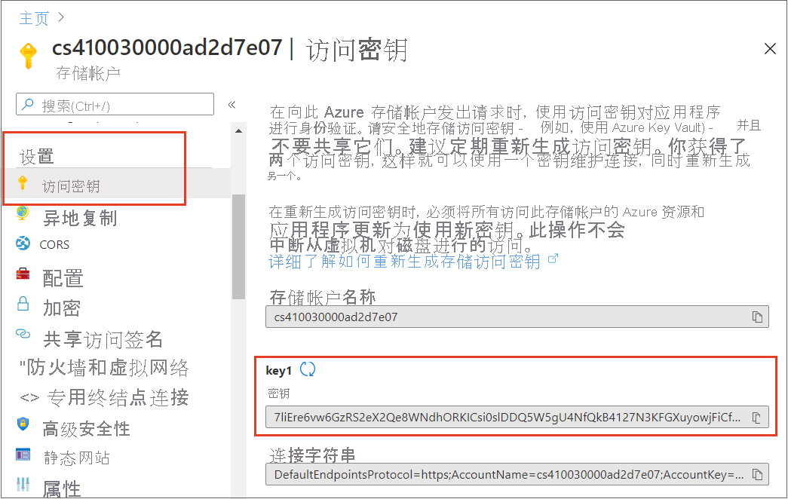

# <a name="tutorial-get-started-with-the-azure-webjobs-sdk-for-event-driven-background-processing"></a>教程：开始使用 Azure WebJobs SDK 进行事件驱动的后台处理

开始使用用于 Azure 应用服务的 Azure WebJobs SDK，使 Web 应用能够运行后台任务和计划的任务，并对事件做出响应。 

使用 Visual Studio 2019 创建一个 .NET Core 控制台应用，该应用使用 WebJobs SDK 来响应 Azure 存储队列消息，在本地运行项目，最后将该项目部署到 Azure。

在本教程中，您将学习如何执行以下操作：

> [!div class="checklist"]
> * 创建控制台应用
> * 添加函数
> * 本地测试
> * 部署到 Azure
> * 启用 Application Insights 日志记录
> * 添加输入/输出绑定

## <a name="prerequisites"></a>必备条件

* 包含“Azure 开发”工作负载的 Visual Studio 2019。 [安装 Visual Studio 2019](/visualstudio/install/)。

* 具有活动订阅的 Azure 帐户。 [免费创建帐户](https://azure.microsoft.com/free/dotnet)。

## <a name="create-a-console-app"></a>创建控制台应用
在本部分，你首先将在 Visual Studio 2019 中创建一个项目。 接下来，你将添加用于 Azure 开发和代码发布的工具，以及用于侦听触发器和调用函数的函数。 最后，你将设置控制台日志记录，以禁用旧式监视工具，并启用采用默认筛选设置的控制台提供程序。 

>[!NOTE]  
>本文中的过程经验证可以创建能够在 .NET Core 3.1 上运行的 .NET Core 控制台应用。

### <a name="create-a-project"></a>创建项目

1. 在 Visual Studio 中，选择“文件” > “新建” > “项目”。

1. 在“创建新项目”下，依次选择“控制台应用程序(C#)”、“下一步”  。

1. 在“配置新项目”下，将项目命名为“WebJobsSDKSample”，然后选择“下一步”。

1. 选择目标框架，然后选择“创建” 。 已使用 .NET Core 3.1 对本教程进行了验证。

### <a name="install-webjobs-nuget-packages"></a>安装 WebJobs NuGet 包

安装最新的 WebJobs NuGet 包。 此包包含 Microsoft.Azure.WebJobs (WebJobs SDK)，可让你将函数代码发布到 Azure 应用服务中的 WebJobs。

1. 安装 [Microsoft.Azure.WebJobs.Extensions NuGet 包](https://www.nuget.org/packages/Microsoft.Azure.WebJobs.Extensions/)的 3.x 最新稳定版本。

2. 在 Visual Studio 中，转到“工具” > “NuGet 包管理器” 。

3. 选择“包管理器控制台”。 你将看到 NuGet cmdlet 列表、文档链接和 `PM>` 入口点。

4. 在以下命令中，请将 `<3_X_VERSION>` 替换为在步骤 1 中找到的当前版本号。 

     ```powershell
     Install-Package Microsoft.Azure.WebJobs.Extensions -version <3_X_VERSION>
     ```
5. 在“包管理器控制台”中执行该命令。 随后将显示扩展列表，并自动安装这些扩展。 
  
### <a name="create-the-host"></a>创建主机

主机是函数的运行时容器，它侦听触发器并调用函数。 以下步骤创建一个实现 [`IHost`](/dotnet/api/microsoft.extensions.hosting.ihost) 的主机，它是 ASP.NET Core 中的通用主机。

1. 选择“Program.cs”选项卡并添加以下 `using` 语句：

    ```cs
    using System.Threading.Tasks;
    using Microsoft.Extensions.Hosting;
    ```

1. 另外，在“Program.cs”下，请将 `Main` 方法替换为以下代码：

    ```cs
    static async Task Main()
    {
        var builder = new HostBuilder();
        builder.ConfigureWebJobs(b =>
                {
                    b.AddAzureStorageCoreServices();
                });
        var host = builder.Build();
        using (host)
        {
            await host.RunAsync();
        }
    }
    ```

在 ASP.NET Core 中，通过调用 [`HostBuilder`](/dotnet/api/microsoft.extensions.hosting.hostbuilder) 实例上的方法来设置主机配置。 有关详细信息，请参阅 [.NET 通用主机](/aspnet/core/fundamentals/host/generic-host)。 `ConfigureWebJobs` 扩展方法初始化 WebJobs 主机。 在 `ConfigureWebJobs` 中初始化特定的绑定扩展（例如“存储”绑定扩展），并设置这些扩展的属性。  

### <a name="enable-console-logging"></a>启用控制台日志记录

设置使用 [ASP.NET Core 日志记录框架](/aspnet/core/fundamentals/logging)的控制台日志记录。 此框架 (Microsoft.Extensions.Logging) 包含一个使用各种内置日志记录提供程序和第三方日志记录提供程序的 API。

1. 获取 [`Microsoft.Extensions.Logging.Console`NuGet 包](https://www.nuget.org/packages/Microsoft.Extensions.Logging.Console/)的最新稳定版本，其中包含 `Microsoft.Extensions.Logging`。

2. 在以下命令中，请将 `<3_X_VERSION>` 替换为在步骤 1 中找到的当前版本号。 每种类型的 NuGet 包都有唯一的版本号。

   ```powershell
   Install-Package Microsoft.Extensions.Logging.Console -version <3_X_VERSION>
   ```
3. 在“包管理器控制台”中，填写当前版本号并执行该命令。 随后将显示扩展列表，并自动安装这些扩展。 

4. 在“Program.cs”选项卡下，添加以下 `using` 语句：

   ```cs
   using Microsoft.Extensions.Logging;
   ```
5. 仍旧在“Program.cs”下，将 [`ConfigureLogging`](/dotnet/api/microsoft.aspnetcore.hosting.webhostbuilderextensions.configurelogging) 方法添加到 `Build` 命令前面的 [`HostBuilder`](/dotnet/api/microsoft.extensions.hosting.hostbuilder) 中。 [`AddConsole`](/dotnet/api/microsoft.extensions.logging.consoleloggerextensions.addconsole) 方法将控制台日志记录添加到配置中。

    ```cs
    builder.ConfigureLogging((context, b) =>
    {
        b.AddConsole();
    });
    ```

    现在，`Main` 方法如下所示：

    ```cs
    static async Task Main()
    {
        var builder = new HostBuilder();
        builder.ConfigureWebJobs(b =>
                {
                    b.AddAzureStorageCoreServices();
                });
        builder.ConfigureLogging((context, b) =>
                {
                    b.AddConsole();
                });
        var host = builder.Build();
        using (host)
        {
            await host.RunAsync();
        }
    }
    ```

    添加此方法后产生以下变化：

    * 禁用[仪表板日志记录](https://github.com/Azure/azure-webjobs-sdk/wiki/Queues#logs)。 仪表板是一个旧式监视工具，不建议对高吞吐量生产方案使用仪表板日志记录。
    * 使用默认[筛选](webjobs-sdk-how-to.md#log-filtering)添加控制台提供程序。

现在即可添加由到达 Azure 存储队列的消息触发的函数。

## <a name="add-a-function"></a>添加函数

函数是按计划运行的代码单元，可以基于事件触发或按需运行。 触发器侦听服务事件。 在 WebJobs SDK 的上下文中，“触发”不是指部署模式。 使用该 SDK 创建的事件驱动的 WebJobs 或计划的 WebJobs 应始终部署为启用了“始终可用”的连续 WebJobs。 

在本部分，你将创建一个由 Azure 存储队列中的消息触发的函数。 首先，需要添加绑定扩展以连接到 Azure 存储。

### <a name="install-the-storage-binding-extension"></a>安装存储绑定扩展

从 WebJobs SDK 版本 3 开始，若要连接到 Azure 存储服务，必须安装一个独立的“存储”绑定扩展包。 

1. 获取 [Microsoft.Azure.WebJobs.Extensions.Storage](https://www.nuget.org/packages/Microsoft.Azure.WebJobs.Extensions.Storage) NuGet 包的最新稳定版本，即 3.x 版。

1. 在以下命令中，请将 `<3_X_VERSION>` 替换为在步骤 1 中找到的当前版本号。 每种类型的 NuGet 包都有唯一的版本号。 

    ```powershell
    Install-Package Microsoft.Azure.WebJobs.Extensions.Storage -Version <3_X_VERSION>
    ```
1. 在“包管理器控制台”中，在 `PM>` 入口点下执行该命令，其中带有最新的版本号。

1. 仍旧在“Program.cs”中，在 [`HostBuilder`](/dotnet/api/microsoft.extensions.hosting.hostbuilder) 实例（在 `Build` 命令的前面）的 `ConfigureWebJobs` 扩展方法中添加 `AddAzureStorage` 方法，以初始化“存储”扩展。 此时，`ConfigureWebJobs` 方法如下所示：

    ```cs
    builder.ConfigureWebJobs(b =>
    {
        b.AddAzureStorageCoreServices();
        b.AddAzureStorage();
    });
    ```
1. 实例化 `builder` 后，在 `Main` 方法中添加以下代码：

    ```csharp
    builder.UseEnvironment(EnvironmentName.Development);
     ```

    在[开发模式](webjobs-sdk-how-to.md#host-development-settings)下运行可减少[队列轮询指数退避](../azure-functions/functions-bindings-storage-queue-trigger.md?tabs=csharp#polling-algorithm)，这种退避可能会显著增加运行时查找消息和调用函数所需的时间。 完成开发和测试后，应删除此代码行或切换到 `Production`。 

    `Main` 方法现在应如以下示例所示：

    ```csharp
    static async Task Main()
    {
        var builder = new HostBuilder();
        builder.UseEnvironment(EnvironmentName.Development);
        builder.ConfigureWebJobs(b =>
        {
            b.AddAzureStorageCoreServices();
        });
        builder.ConfigureLogging((context, b) =>
        {
            b.AddConsole();
        });
        builder.ConfigureWebJobs(b =>
        {
            b.AddAzureStorageCoreServices();
            b.AddAzureStorage();
        });
        var host = builder.Build();
        using (host)
        {
            await host.RunAsync();
        }
    }
    ```

### <a name="create-a-queue-triggered-function"></a>创建队列触发的函数

`QueueTrigger` 特性告知运行时，在名为 `queue` 的 Azure 存储队列中写入新消息时，应调用此函数。 队列消息的内容将提供给 `message` 参数中的方法代码。 在方法的正文中处理触发器数据。 在此示例中，代码只是记录消息。

1. 在解决方案资源管理器中，右键单击项目并选择“添加” > “新建项”，然后选择“类”  。 

2. 将新的 C# 类文件命名为“Functions.cs”，然后选择“添加”。

3. 在 Functions.cs 中，将生成的模板替换为以下代码：
    
    ```cs
    using Microsoft.Azure.WebJobs;
    using Microsoft.Extensions.Logging;
    
    namespace WebJobsSDKSample
    {
        public class Functions
        {
            public static void ProcessQueueMessage([QueueTrigger("queue")] string message, ILogger logger)
            {
                logger.LogInformation(message);
            }
        }
    }
    ```

    应该将 Functions 类标记为 `public static`，以便运行时访问和执行方法。 在上面的代码示例中，将消息添加到名为 `queue` 的队列后，将执行该函数，并将 `message` 字符串写入日志。 受监视的队列位于接下来要创建的默认 Azure 存储帐户中。
   
`message` 参数不一定要是字符串。 也可以绑定到 JSON 对象、字节数组或 [CloudQueueMessage](/dotnet/api/microsoft.azure.storage.queue.cloudqueuemessage) 对象。 [参阅队列触发器用法](../azure-functions/functions-bindings-storage-queue-trigger.md?tabs=csharp#usage)。 每个绑定类型（例如队列、Blob 或表）具有一组可以绑定到的不同参数类型。

### <a name="create-an-azure-storage-account"></a>创建 Azure 存储帐户

本地运行的 Azure 存储模拟器没有 WebJobs SDK 所需的部分功能。 你将在 Azure 中创建一个存储帐户，并将项目配置为使用该帐户。 

若要了解如何创建常规用途 v2 存储帐户，请参阅[创建 Azure 存储帐户](../storage/common/storage-account-create.md?tabs=azure-portal)。

### <a name="locate-and-copy-your-connection-string"></a>找到并复制你的连接字符串
需要使用连接字符串来配置存储。 请记下此连接字符串，以便在后续步骤中使用。

1. 在 [Azure 门户](https://portal.azure.com)中，导航到你的存储帐户并选择“设置”。
1. 在“设置”中选择“访问密钥” 。
1. 选择“key1”下的“连接字符串”对应的“复制到剪贴板”图标  。

     

### <a name="configure-storage-to-run-locally"></a>将存储配置为在本地运行

WebJobs SDK 在 Azure 的“应用程序设置”中查找存储连接字符串。 在本地运行时，它会在本地配置文件或环境变量中查找此值。

1. 右键单击项目，选择“添加” > “新建项”，然后选择“JavaScript JSON 配置文件”，将新文件命名为“appsettings.json”文件，然后选择“添加”  。 

1. 在新文件中添加 `AzureWebJobsStorage` 字段，如以下示例所示：

    ```json
    {
        "AzureWebJobsStorage": "{storage connection string}"
    }
    ```

1. 将 {storage connection string} 替换为先前复制的连接字符串。

1. 在解决方案资源管理器中选择“appsettings.json”文件，在“属性”窗口中将“复制到输出目录”操作设置为“如果较新则复制”  。

由于此文件包含连接字符串机密，因此请不要将它存储在远程代码存储库中。 将项目发布到 Azure 后，可以在 Azure 应用服务中的应用内添加相同的连接字符串应用设置。

## <a name="test-locally"></a>本地测试

在本地生成并运行项目，并创建一个消息队列来触发函数。

1. 在 Visual Studio 的“Cloud Explorer”中，展开新存储帐户所在的节点，然后右键单击“队列” 。

1. 选择“创建队列”。

1. 输入 *queue* 作为队列名称，然后选择“确定”。

   

1. 右键单击新队列所在的节点，然后选择“打开”。

1. 选择“添加消息”图标。

   

1. 在“添加消息”对话框中，输入 *Hello World!*  作为 **消息正文**，然后选择“确定”。 现在，队列中会出现一条消息。

   

1. 按 **Ctrl+F5** 运行项目。

   控制台会显示运行时找到了你的函数。 由于在 `ProcessQueueMessage` 函数中使用了 `QueueTrigger` 属性，因此 WeJobs 运行时会侦听名为 `queue` 的队列中的消息。 在此队列中找到新消息时，运行时将调用该函数，并传入消息字符串值。

1. 返回到“队列”窗口并刷新。 消息已消失，因为已由本地运行的函数处理了。

1. 关闭控制台窗口。 

现在可将 WebJobs SDK 项目发布到 Azure。

## <a name="deploy-to-azure"></a><a name="deploy-as-a-webjob"></a>部署到 Azure

在部署过程中，你将创建一个要在其中运行函数的应用服务实例。 将 .NET Core 控制台应用发布到 Azure 中的应用服务时，该应用会自动作为 Web 作业运行。 若要详细了解发布过程，请参阅[使用 Visual Studio 开发和部署 WebJob](webjobs-dotnet-deploy-vs.md)。

### <a name="create-azure-resources"></a>创建 Azure 资源

[!INCLUDE [webjobs-publish-net-core](../../includes/webjobs-publish-net-core.md)]

### <a name="enable-always-on"></a>启用 Always On

对于连续 Web 作业，应在站点中启用“始终可用”设置，使 Web 作业能够正常运行。 如果不启用“始终可用”，则运行时在处于非活动状态几分钟后将进入空闲状态。 

1. 在“发布”页中，选择“托管”上方的省略号图标以显示“托管配置文件部分操作”，然后选择“在 Azure 门户中打开”   。  

1. 在“设置”下，选择“配置” > “常规设置”，将“始终可用”设置为“打开”，然后选择“保存”和“继续”以重启站点      。

### <a name="publish-the-project"></a>发布项目

在 Azure 中创建 Web 应用后，接下来可以发布 WebJobs 项目了。 

1. 在“发布”页中的“托管”下，选择编辑按钮并将“Web 作业类型”更改为 `Continuous`，然后选择“保存”   。 这可以确保在将消息添加到队列时 Web 作业保持运行。 触发的 Web 作业通常仅用于手动 Webhook。 

1. 选择“发布”页右上角的“发布”按钮 。 操作完成后，该 Web 作业将在 Azure 上运行。

### <a name="create-a-storage-connection-app-setting"></a>创建存储连接应用设置

需要在 Azure 中创建你在 appsettings.json 配置文件中本地使用的相同存储连接字符串设置。 这样就可以更安全地存储连接字符串   

1. 在“发布”配置文件页中，选择“托管”上方的省略号图标以显示“托管配置文件部分操作”，然后选择“管理 Azure 应用服务设置”   。

1. 在“应用程序设置”中，选择“+ 添加设置” 。

1. 在“新应用设置名称”中键入 `AzureWebJobsStorage`，然后选择“确定” 。 
 
1. 在“远程”中，粘贴本地设置中的连接字符串，然后选择“确定” 。 

现已在 Azure 中的应用内设置了连接字符串。

### <a name="trigger-the-function-in-azure"></a>触发 Azure 中的函数

1. 请务必不要在本地运行。 如果控制台窗口仍处于打开状态，请将其关闭。 否则，本地实例可能是处理所创建的任何队列消息的第一个实例。

1. 在 Visual Studio 的“队列”页中，像以前一样向队列添加消息。

1. 刷新“队列”页后新消息消失，因为它已由 Azure 中运行的函数处理。

## <a name="enable-application-insights-logging"></a>启用 Application Insights 日志记录

在 Azure 中运行 Web 作业时，无法通过查看控制台输出来监视函数执行。 若要监视 Web 作业，应在发布项目时创建关联的 [Application Insights](../azure-monitor/app/app-insights-overview.md) 实例。

### <a name="create-an-application-insights-instance"></a>创建 Application Insights 实例

1. 在“发布”配置文件页中，选择“托管”上方的省略号图标以显示“托管配置文件部分操作”，然后选择“在 Azure 门户中打开”   。

1. 在 Web 应用中的“设置”下，依次选择“Application Insights”、“打开 Application Insights”  。

1. 验证为实例生成的“资源名称”以及“位置”，然后选择“应用”  。 

1. 在“设置”下，选择“配置”并验证是否已创建新的 `APPINSIGHTS_INSTRUMENTATIONKEY` 。 此密钥用于将 Web 作业实例连接到 Application Insights。   

若要利用 [Application Insights](../azure-monitor/app/app-insights-overview.md) 日志记录，还需要更新日志记录代码。

### <a name="install-the-application-insights-extension"></a>安装 Application Insights 扩展

1. 获取 [Microsoft.Azure.WebJobs.Logging.ApplicationInsights](https://www.nuget.org/packages/Microsoft.Azure.WebJobs.Logging.ApplicationInsights) NuGet 包的最新稳定版本，即版本 3.x。

2. 在以下命令中，请将 `<3_X_VERSION>` 替换为在步骤 1 中找到的当前版本号。 每种类型的 NuGet 包都有唯一的版本号。 

    ```powershell
    Install-Package Microsoft.Azure.WebJobs.Logging.ApplicationInsights -Version <3_X_VERSION>
    ```
3. 在“包管理器控制台”中，在 `PM>` 入口点下执行该命令，其中带有最新的版本号。

### <a name="initialize-the-application-insights-logging-provider"></a>初始化 Application Insights 日志记录提供程序

打开 Program.cs，并在 `ConfigureLogging` 中的 `AddConsole` 调用后面添加以下初始化表达式：

```csharp
// If the key exists in settings, use it to enable Application Insights.
string instrumentationKey = context.Configuration["APPINSIGHTS_INSTRUMENTATIONKEY"];
if (!string.IsNullOrEmpty(instrumentationKey))
{
    b.AddApplicationInsightsWebJobs(o => o.InstrumentationKey = instrumentationKey);
}
```

`Main` 方法代码现在应如以下示例所示： 

```csharp
static async Task Main()
{
    var builder = new HostBuilder();
    builder.UseEnvironment(EnvironmentName.Development);
    builder.ConfigureWebJobs(b =>
            {
                b.AddAzureStorageCoreServices();
                b.AddAzureStorage();
            });
    builder.ConfigureLogging((context, b) =>
            {
                b.AddConsole();

                // If the key exists in settings, use it to enable Application Insights.
                string instrumentationKey = context.Configuration["APPINSIGHTS_INSTRUMENTATIONKEY"];
                if (!string.IsNullOrEmpty(instrumentationKey))
                {
                    b.AddApplicationInsightsWebJobs(o => o.InstrumentationKey = instrumentationKey);
                }
            });
    var host = builder.Build();
    using (host)
    {
        await host.RunAsync();
    }
}
```

此代码使用默认的[筛选](webjobs-sdk-how-to.md#log-filtering)设置来初始化 Application Insights 日志记录提供程序。 在本地运行时，所有信息和更高级别日志都会同时写入控制台和 Application Insights。

### <a name="republish-the-project-and-trigger-the-function-again"></a>重新发布项目并再次触发函数

1. **在“解决方案资源管理器”** 中，右键单击该项目并选择“发布”。

1. 像[前面](#test-locally)所做的那样，使用 Visual Studio 中的 Cloud Explorer 创建队列消息，不过这次要输入“Hello App Insights!” 作为消息文本。

1. 在“发布”配置文件页中，选择“托管”上方的省略号图标以显示“托管配置文件部分操作”，然后选择“在 Azure 门户中打开”   。

1. 在 Web 应用中的“设置”下，依次选择“Application Insights”、“查看 Application Insights 数据”  。

1. 依次选择“搜索”、“查看过去 24 小时的所有数据” 。

   

1. 如果未看到“Hello App Insights!” 消息，请定期选择“刷新”几分钟。 日志不会立即显示，因为 Application Insights 客户端需要花费一些时间来刷新它处理的日志。

   

## <a name="add-inputoutput-bindings&quot;></a>添加输入/输出绑定

绑定可以简化用于读取和写入数据的代码。 输入绑定可以简化读取数据的代码。 输出绑定可以简化写入数据的代码。  

### <a name=&quot;add-input-binding&quot;></a>添加输入绑定

输入绑定可以简化读取数据的代码。 对于本示例，队列消息是 Blob 的名称，你将使用该名称来查找和读取 Azure 存储中的 Blob。

1. 在 *Functions.cs* 中，将 `ProcessQueueMessage` 方法替换为以下代码：

   ```cs
   public static void ProcessQueueMessage(
       [QueueTrigger(&quot;queue")] string message,
       [Blob("container/{queueTrigger}", FileAccess.Read)] Stream myBlob,
       ILogger logger)
   {
       logger.LogInformation($"Blob name:{message} \n Size: {myBlob.Length} bytes");
   }
   ```

   在此代码中，`queueTrigger` 是[绑定表达式](../azure-functions/functions-bindings-expressions-patterns.md)，意味着它将在运行时解析为不同的值。  在运行时，它具有队列消息的内容。

1. 添加 `using`：

   ```cs
   using System.IO;
   ```

1. 在存储帐户中创建 Blob 容器。

   a. 在 Visual Studio 的“Cloud Explorer”中，展开你的存储帐户所在的节点，右键单击“Blob”，然后选择“创建 Blob 容器”  。

   b. 在“创建 Blob 容器”对话框中，输入“container”作为容器名称，然后选择“确定”。

1. 将 *Program.cs* 文件上传到 Blob 容器。 （此处使用的文件用作示例；可以上传任何文本文件，并使用该文件的名称创建队列消息。）

   a. 在“Cloud Explorer”中，双击创建的容器所在的节点。

   b. 在“容器”窗口中，选择“上传”按钮 。

   

   c. 找到并选择“Program.cs”，然后选择“确定”。

1. 在前面创建的队列中创建队列消息，并使用 *Program.cs* 作为消息的文本。

   

1. 在本地运行项目

   该队列消息会触发函数，而该函数又会读取 Blob 并记录其长度。 控制台输出如下所示：

   ```console
   Found the following functions:
   ConsoleApp1.Functions.ProcessQueueMessage
   Job host started
   Executing 'Functions.ProcessQueueMessage' (Reason='New queue message detected on 'queue'.', Id=5a2ac479-de13-4f41-aae9-1361f291ff88)
   Blob name:Program.cs
   Size: 532 bytes
   Executed 'Functions.ProcessQueueMessage' (Succeeded, Id=5a2ac479-de13-4f41-aae9-1361f291ff88)
   ```
### <a name="add-an-output-binding"></a>添加输出绑定

输出绑定可以简化写入数据的代码。 本示例在前一个示例的基础上做了修改，它会写入 Blob 的副本，而不是记录其大小。 Blob 存储绑定包含在我们之前安装的 Azure 存储扩展包中。

1. 将 `ProcessQueueMessage` 方法替换为以下代码：

   ```cs
   public static void ProcessQueueMessage(
       [QueueTrigger("queue")] string message,
       [Blob("container/{queueTrigger}", FileAccess.Read)] Stream myBlob,
       [Blob("container/copy-{queueTrigger}", FileAccess.Write)] Stream outputBlob,
       ILogger logger)
   {
       logger.LogInformation($"Blob name:{message} \n Size: {myBlob.Length} bytes");
       myBlob.CopyTo(outputBlob);
   }
   ```

1. 创建另一个队列消息，并使用 *Program.cs* 作为消息的文本。

1. 在本地运行项目

   该队列消息会触发函数，而该函数又会读取 Blob、记录其长度并创建新 Blob。 控制台输出相同，但在转到 Blob 容器窗口并选择“刷新”时，会看到名为 *copy-Program.cs* 的新 Blob。

### <a name="republish-the-project"></a>重新发布项目

1. **在“解决方案资源管理器”** 中，右键单击该项目并选择“发布”。

1. 在“发布”对话框中，确保当前配置文件已选中，然后选择“发布” 。 “输出”窗口中会详细显示发布结果。
 
1. 通过再次将某个文件上传到 Blob 容器，并将一条消息添加到与所上传文件同名的队列，来验证 Azure 中的函数。 将会看到，该消息已从队列中删除，并且 Blob 容器中创建了该文件的副本。 

## <a name="next-steps"></a>后续步骤

本教程介绍了如何创建、运行和部署 WebJobs SDK 3.x 项目。

> [!div class="nextstepaction"]
> [详细了解 WebJobs SDK](webjobs-sdk-how-to.md)