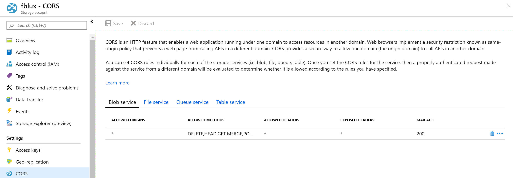

<!-- markdownlint-disable MD001 -->
<!-- markdownlint-disable MD024 -->
<!-- markdownlint-disable MD033 -->
<!-- markdownlint-disable MD034 -->
<!-- markdownlint-disable MD029 -->
# 表单识别器入门

使用表单识别器示例工具，开始使用表单识别器。 Azure 表单识别器是一种认知服务，可让你使用机器学习技术构建自动化数据处理软件。 从表单文档中识别并提取文本、键/值对、选择标记、表数据等内容；该服务将输出结构化数据，其中包括原始文件中的关系。 你可通过示例工具、REST API 或 SDK 使用表单识别器。 按照以下步骤，通过示例工具试用表单识别器。

使用表单识别器执行以下操作：

* 分析布局
* 使用预生成模型（发票、收据和 ID 文档）进行分析
* 训练并分析自定义表单

## 先决条件

若要完成本快速入门，必须具备以下条件：

* Azure 订阅 - [免费创建订阅](https://azure.microsoft.com/free/cognitive-services)
* 拥有 Azure 订阅后，在 Azure 门户中<a href="https://ms.portal.azure.com/#create/Microsoft.CognitiveServicesFormRecognizer"  title="创建表单识别器资源"  target="_blank">创建表单识别器资源 </a>，获取密钥和终结点。
  * 可以使用免费定价层 (`F0`) 试用该服务，然后再升级到付费层进行生产。
* （可选）下载并解压缩以下快速入门示例文档

## 创建表单识别器资源

[!INCLUDE [create resource](../includes/create-resource.md)]

## 分析布局

从文档中提取文本、表、选择标记和结构。

1. 转到[表单识别器示例工具](https://fott-2-1.azurewebsites.net/)
2. 在示例工具主页上，选择“使用布局获取文本、表和选择标记”

     :::image type="content" source="../media/label-tool/layout-1.jpg" alt-text="布局表单识别器工具的连接设置。":::

3. 将 {need Endpoint} 替换为从表单识别器订阅中获取的终结点。

4. 将 {need apiKey} 替换为从表单识别器资源中获取的订阅密钥。

    :::image type="content" source="../media/label-tool/layout-2.jpg" alt-text="布局表单识别器工具的连接设置。":::

5. 选择源 URL，粘贴示例文档 `https://raw.githubusercontent.com/Azure-Samples/cognitive-services-REST-api-samples/master/curl/form-recognizer/layout-page-001.jpg` 的以下 URL，然后单击“提取”按钮。

1. 单击“运行布局”，表单识别器示例标记工具将调用分析布局 API 并分析文档。

1. 查看结果 - 查看突出显示的提取的文本、检测到的选择标记和表。

    :::image type="content" source="../media/label-tool/layout-3.jpg" alt-text="表单识别器工具的连接设置。":::

1. 下载 JSON 输出文件，查看详细的布局结果。
     * “readResults”节点包含每一行文本，及其各自在页面上的边界框位置。
     * “selectionMarks”节点显示每个选择标记（复选框、单选框），并显示其状态是“已选中”还是“未选中”。
     * “pageResults”部分包含提取的表。 对于每个表，将会提取文本、行和列索引、行和列跨距、边界框等。

## 使用预生成模型（发票、收据、ID…）进行分析

使用表单识别器预生成模型从发票、销售收据、标识文档或名片中提取文本、表和键值对。

1. 转到[表单识别器示例工具](https://fott-2-1.azurewebsites.net/)
2. 在示例工具主页上，选择“使用预生成模型获取数据”

    :::image type="content" source="../media/label-tool/prebuilt-1.jpg" alt-text="分析表单识别器布局的结果":::

3. 选择源 URL

4. 从以下选项中选择要分析的文件：

    * 账单图像的 URL。 在本快速入门中，可使用[示例发票文档](https://raw.githubusercontent.com/Azure/azure-sdk-for-python/master/sdk/formrecognizer/azure-ai-formrecognizer/samples/sample_forms/forms/Invoice_1.pdf)。
    * 回执图像的 URL。 在本快速入门中，可使用[示例 ID 文档](https://raw.githubusercontent.com/Azure-Samples/cognitive-services-REST-api-samples/master/curl/form-recognizer/id-license.jpg)。
    * 回执图像的 URL。 在本快速入门中，可使用[示例收据图像](https://raw.githubusercontent.com/Azure-Samples/cognitive-services-REST-api-samples/master/curl/form-recognizer/contoso-allinone.jpg)。
    * 名片图像的 URL。 在本快速入门中，可使用[示例名片图像](https://raw.githubusercontent.com/Azure/azure-sdk-for-python/master/sdk/formrecognizer/azure-ai-formrecognizer/samples/sample_forms/business_cards/business-card-english.jpg)。

5. 将 {need Endpoint} 替换为从表单识别器订阅中获取的终结点。

6. 将 {need apiKey} 替换为从表单识别器资源中获取的订阅密钥。

    :::image type="content" source="../media/label-tool/prebuilt-3.jpg" alt-text="预生成表单识别器工具的连接设置。":::

7. 根据要分析和选择的文档类型，选择要分析的表单类型：发票、收据、名片或 ID。

8. 单击“运行分析”。 表单识别器示例标记工具将调用分析预生成 API 并分析文档。
9. 查看结果 - 查看提取的键值对、明细项目、突出显示的提取的文本和检测到的表。

    :::image type="content" source="../media/label-tool/prebuilt-2.jpg" alt-text="分析表单识别器预生成发票的结果":::

10. 下载 JSON 输出文件，查看详细结果。

    * “readResults”节点包含每一行文本，及其各自在页面上的边界框位置。
    * “selectionMarks”节点显示每个选择标记（复选框、单选框），并显示其状态是“已选中”还是“未选中”。
    * “pageResults”部分包含提取的表。 对于每个表，将会提取文本、行和列索引、行和列跨距、边界框等。
    * “documentResults”字段包含文档中相关度最高部分的键/值对信息和明细项目信息。

## 训练自定义表单模型

训练为文档定制的自定义表单模型。 使用表单识别器自定义功能从文档中提取文本、表、选择标记和键值对。

### 训练自定义表单模型的先决条件

* 包含一组训练数据的 Azure 存储 Blob 容器。 首先，请确保所有训练文档的格式相同。 如果有多种格式的表单，请根据通用格式将它们组织到子文件夹中。 对于本快速入门，可使用[示例数据集](https://github.com/Azure-Samples/cognitive-services-REST-api-samples/blob/master/curl/form-recognizer/sample_data_without_labels.zip)（下载并解压缩 sample_data.zip）的“训练”文件夹下的文件。
* 在 Azure 存储 Blob 上配置跨域资源共享 (CORS)，在存储帐户上启用 CORS。 在 Azure 门户中选择你的存储帐户，然后在左侧窗格中选择“CORS”选项卡。 在底部行上，填写以下值。 选择顶部的“保存”。   

  * 允许的来源 = *
  * 允许的方法 = \[全选\]
  * 允许的标头 = *
  * 公开的标头 = *
  * 最长时间 = 200

> [!div class="mx-imgBorder"]
> 

### 使用示例标记工具

1. 转到[表单识别器示例工具](https://fott-2-1.azurewebsites.net/)

1. 在示例工具主页上，选择“使用自定义表单通过标签训练模型并获取键值对”

    :::image type="content" source="../media/label-tool/custom-1.jpg" alt-text="训练自定义模型。":::

2. 选择“新建项目”

#### 创建新项目

配置项目设置，在字段中填写以下值：

* **显示名称** - 项目显示名称
* **安全令牌** - 某些项目设置可以包含敏感值，如 API 密钥或其他共享机密。 每个项目都会生成一个安全令牌，可用于加密/解密敏感项目设置。 可以在左侧导航栏底部选择齿轮图标，然后在“应用程序设置”中找到安全令牌。

* **源连接** - 示例标记工具将连接到源（上传的原始表单）和目标（创建的标签和输出数据）。 可以在项目之间设置和共享连接。 它们使用可扩展的提供程序模型，因此你可以轻松地添加新的源/目标提供程序。 创建新连接，单击“添加连接”按钮。 在字段中填写以下值：
  * **显示名称** - 连接显示名称。
  * **说明** - 项目说明。
  * **SAS URL** - Azure Blob 存储容器的共享访问签名 (SAS) URL。

  * [!INCLUDE [get SAS URL](../includes/sas-instructions.md)]

   :::image type="content" source="../media/quickstarts/get-sas-url.png" alt-text="SAS 位置。":::

* **文件夹路径** -（可选）如果源表单位于 blob 容器上的某个文件夹中，请在此处指定文件夹名称
* **表单识别器服务 Uri** - 表单识别器终结点 URL。
* **API 密钥** - 表单识别器订阅密钥。
* **说明** -（可选）项目说明

    :::image type="content" source="../media/label-tool/connections.png"  alt-text="连接设置":::

#### 标记表单

  :::image type="content" source="../media/label-tool/new-project.png"  alt-text="“新建项目”页":::

创建或打开项目时，会打开主标记编辑器窗口。 标记编辑器由三部分组成：

* 一个可调整大小的预览窗格，其中包含源连接中的可滚动表单列表。
* 可以应用标记的主编辑器窗格。
* 通过标记编辑器窗格，用户可以修改、锁定、重新排序和删除标记。

##### 标识文本和标签

在左侧窗格中选择“对所有文件运行 OCR”，以获取每个文档的文本和表布局信息。 标记工具将在每个文本元素周围绘制边界框。

标记工具还将显示已自动提取的表。 选择文档左侧的表/网格图标可查看提取的表。 在本快速入门中，由于表内容是自动提取的，因此我们不会对表内容进行标记，而是依靠自动提取。

  :::image type="content" source="../media/label-tool/table-extraction.png" alt-text="示例标记工具中的表可视化效果。":::

##### 将标签应用于文本

接下来创建标记（标签），并将其应用到希望模型分析的文本元素。 请注意，示例标签数据集包含已标记的字段，我们将添加另一个字段。

1. 首先，使用标记编辑器窗格来创建要识别的新标记。
   1. 选择 **+** 创建新标记。
   1. 输入标记名称。 添加“总计”标记
   1. 按 Enter 保存标记。
1. 在主编辑器中，从突出显示的文本元素中选择值总计。
1. 选择要应用到值的“总计”标记，或按相应的键盘键。 数字键已分配为前 10 个标记的热键。 可以使用标记编辑器窗格中的向上和向下箭头图标对标记进行重新排序。

    > [!Tip]
    > 在标记窗体时，请记住以下提示：
    >
    > * 只能将一个标记应用到所选的每个文本元素。
    > * 每页只能应用每个标记一次。 如果某个值多次显示在同一窗体中，将为每个实例创建不同的标记。 例如：“invoice# 1”、“invoice# 2”等。
    > * 标记不能跨页。
    > * 按照值在窗体中的显示方式标记值；不要尝试使用两个不同的标记将值拆分为两个部分。 例如，即使某个地址字段跨越多行，也应使用单个标记对其进行标记。
    > * 不要在标记的字段中包含键 &mdash; 仅包含值。
    > * 系统应会自动检测表数据，最终的输出 JSON 文件的“pageResults”部分中将提供这些数据。 但如果模型无法检测到所有表数据，你也可以对模型进行标记和训练以检测表，请参阅如何训练并标记 << 操作说明路径 >>
    > * 使用 + 右侧的按钮搜索、重命名、重新排序和删除标记。
    > * 若要在不删除标记本身的情况下删除已应用的标记，请在文档视图上选择带标记的矩形，并按 Delete 键。
    >

按照上述步骤在示例数据集中标记至少五个表单。

  :::image type="content" source="../media/label-tool/custom-1.jpg" alt-text="标记示例。":::

#### 训练自定义模型

在左侧窗格中选择“训练”图标打开“训练”页。 然后选择“训练”按钮开始训练模型。 训练过程完成后，你将看到以下信息：

* **模型 ID** - 已创建和训练的模型的 ID。 每个训练调用都将创建一个具有自己的 ID 的新模型。 将此字符串复制到安全位置；如果要通过 [REST API](./client-library.md?pivots=programming-language-rest-api) 或[客户端库](./client-library.md)进行预测调用，则需要使用此字符串。
* **平均准确度** - 模型的平均准确性。 可以通过标记更多表单并重新训练来创建新的模型，从而提高模型准确度。 我们建议先标记五个表单、分析并测试结果，然后根据需要添加更多表单。
* 标记列表，以及每个标记的估计准确度。

    :::image type="content" source="../media/label-tool/custom-3.jpg" alt-text="训练视图工具。":::

    

#### 分析自定义表单

选择左侧的“分析”（灯泡）图标来测试模型。 选择源“本地文件”。 浏览该文件，然后从你在测试文件夹中解压缩的示例数据集中选择一个文件。 再选择“运行分析”按钮，获取表单的键/值对、文本和表预测值。 该工具将在边界框中应用标记，并报告每个标记的置信度。

   :::image type="content" source="../media/analyze.png" alt-text="训练视图。":::

## 后续步骤

在本快速入门中，你已学习如何使用表单识别器示例工具试用布局、预生成和训练自定义模型，以及通过手动标记的数据分析自定义表单。 接下来，你可尝试使用客户端库 SDK 或 REST API 来使用表单识别器。

> [!div class="nextstepaction"]
> [浏览表单识别器客户端库 SDK 和 REST API 快速入门](client-library.md)
