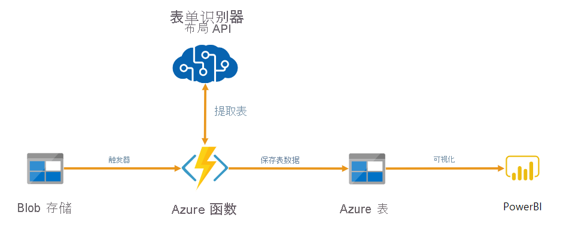
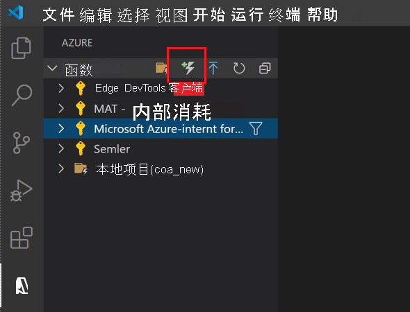
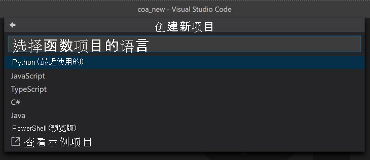
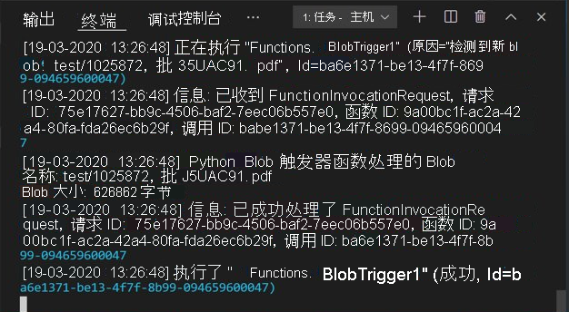

# <a name="tutorial-use-an-azure-function-to-process-stored-documents"></a>教程：使用 Azure 函数处理存储的文档

可以使用表单识别器作为通过 Azure Functions 生成的自动化数据处理管道的一部分。 本指南将介绍如何使用 Azure 函数来处理已上传到 Azure Blob 存储容器的文档。 此工作流使用表单识别器布局服务从存储的文档中提取表数据，然后将表数据以 .csv 文件形式保存到 Azure 中。 然后，你可以使用 Microsoft Power BI（本指南未介绍）来显示数据。

> [!div class="mx-imgBorder"]
> 

在本教程中，你将了解如何执行以下操作：

> [!div class="checklist"]
> * 创建 Azure 存储帐户
> * 创建 Azure Functions 项目
> * 从上传的表单中提取布局数据
> * 将布局数据上传到 Azure 存储

## <a name="prerequisites"></a>先决条件

* Azure 订阅 - [免费创建订阅](https://azure.microsoft.com/free/cognitive-services)
* 在 Azure 门户中<a href="https://ms.portal.azure.com/#create/Microsoft.CognitiveServicesFormRecognizer"  title="创建表单识别器资源"  target="_blank">创建表单识别器资源<span class="docon docon-navigate-external x-hidden-focus"></span></a>，以获取表单识别器密钥和终结点。 部署后，单击“转到资源”。
  * 需要从创建的资源获取密钥和终结点，以便将应用程序连接到表单识别器 API。 你稍后会在快速入门中将密钥和终结点粘贴到下方的代码中。
  * 可以使用免费定价层 (`F0`) 试用该服务，然后再升级到付费层进行生产。
* 要分析的本地 PDF 文档。 可以下载并使用此[示例文档](https://github.com/Azure-Samples/cognitive-services-REST-api-samples/blob/master/curl/form-recognizer/sample-layout.pdf)。
* 已安装 [Python 3.8.x](https://www.python.org/downloads/)。
* 已安装 [Azure 存储资源管理器](https://azure.microsoft.com/features/storage-explorer/)。
* 已安装 [Azure Functions Core Tools](../../azure-functions/functions-run-local.md?tabs=windows%2ccsharp%2cbash#install-the-azure-functions-core-tools)。
* 已安装带有以下扩展的 Visual Studio Code：
  * [Azure Functions 扩展](/azure/developer/python/tutorial-vs-code-serverless-python-01#visual-studio-code-python-and-the-azure-functions-extension)
  * [Python 扩展](https://code.visualstudio.com/docs/python/python-tutorial#_install-visual-studio-code-and-the-python-extension)

## <a name="create-an-azure-storage-account"></a>创建 Azure 存储帐户

在 Azure 门户中[创建 Azure 存储帐户](https://ms.portal.azure.com/#create/Microsoft.StorageAccount-ARM)。 选择“StorageV2”作为帐户类型。

在左侧窗格中选择“CORS”选项卡，并删除现有的 CORS 策略（如果有）。

部署后，创建名为 **test** 和 **output** 的两个空 Blob 存储容器。

## <a name="create-an-azure-functions-project"></a>创建 Azure Functions 项目

打开 Visual Studio Code。 如果已安装 Azure Functions 扩展，则会在左侧导航窗格中看到 Azure 徽标。 选择该文件夹。 创建一个新项目，并根据提示创建本地文件夹 **coa_new** 用于包含该项目。




系统将提示你配置一些设置：
* 在“选择语言”提示中，选择“Python”。
* 在“选择模板”提示中，选择“Azure Blob 存储触发器”。 然后为默认的触发器指定名称。
* 在“选择设置”提示中，选择创建新的本地应用设置。
* 选择包含已创建的存储帐户的 Azure 订阅。 然后需要输入存储容器的名称（在本例中为 `test/{name}`）
* 选择在当前窗口中打开项目。 



完成这些步骤后，VSCode 将使用一个 *\_\_init\_\_.py* Python 脚本添加新的 Azure 函数项目。 将文件上传到 **test** 存储容器时将触发此脚本，但它不会执行任何操作。

## <a name="test-the-function"></a>测试函数

按 F5 运行基本函数。 VSCode 将提示你选择要对接到的存储帐户。 选择创建的存储帐户，然后继续操作。

打开 Azure 存储资源管理器并将示例 PDF 文档上传到 Test 容器。 然后检查 VSCode 终端。 该脚本应会记录它已由 PDF 上传操作触发。




在继续操作之前停止脚本。

## <a name="add-form-processing-code"></a>添加表单处理代码

接下来，将你自己的代码添加到 Python 脚本，以调用表单识别器服务，并使用表单识别器[布局 API](concept-layout.md) 分析上传的文档。

在 VSCode 中导航到函数的 *requirements.txt* 文件。 此文件定义脚本的依赖项。 将以下 Python 包添加到该文件：

```
cryptography
azure-functions
azure-storage-blob
azure-identity
requests
pandas
numpy
```

然后打开 *\_\_init\_\_.py* 脚本。 添加以下 `import` 语句：

```Python
import logging
from azure.storage.blob import BlobServiceClient
import azure.functions as func
import json
import time
from requests import get, post
import os
from collections import OrderedDict
import numpy as np
import pandas as pd
```

可将生成的 `main` 函数保留原样。 稍后你要将自己的自定义代码添加到此函数中。

```python
# This part is automatically generated
def main(myblob: func.InputStream):
    logging.info(f"Python blob trigger function processed blob \n"
    f"Name: {myblob.name}\n"
    f"Blob Size: {myblob.length} bytes")
```

以下代码块针对上传的文档调用表单识别器[分析布局](https://westus.dev.cognitive.microsoft.com/docs/services/form-recognizer-api-v2-1/operations/AnalyzeLayoutAsync) API。 填写终结点和密钥值。 

```Python
# This is the call to the Form Recognizer endpoint
    endpoint = r"Your Form Recognizer Endpoint"
    apim_key = "Your Form Recognizer Key"
    post_url = endpoint + "/formrecognizer/v2.1/Layout/analyze"
    source = myblob.read()

    headers = {
    # Request headers
    'Content-Type': 'application/pdf',
    'Ocp-Apim-Subscription-Key': apim_key,
        }

    text1=os.path.basename(myblob.name)
```
---

> [!IMPORTANT]
> 转到 Azure 门户。 如果在“先决条件”部分中创建的表单识别器资源已成功部署，请单击“后续步骤”下的“转到资源”按钮  。 在资源的“密钥和终结点”页的“资源管理”下可以找到密钥和终结点 。 
>
> 完成后，请记住将密钥从代码中删除，并且永远不要公开发布该密钥。 对于生产环境，请使用安全方法来存储和访问凭据。 有关详细信息，请参阅[认知服务安全性](../../cognitive-services/cognitive-services-security.md)一文。

接下来，添加代码以查询服务并获取返回的数据。 


```Python
resp = requests.post(url = post_url, data = source, headers = headers)
    if resp.status_code != 202:
        print("POST analyze failed:\n%s" % resp.text)
        quit()
    print("POST analyze succeeded:\n%s" % resp.headers)
    get_url = resp.headers["operation-location"]

    wait_sec = 25
    
    time.sleep(wait_sec)
    # The layout API is async therefore the wait statement
    
    resp =requests.get(url = get_url, headers = {"Ocp-Apim-Subscription-Key": apim_key})
    
    resp_json = json.loads(resp.text)
    
    
    status = resp_json["status"]
    
    
    if status == "succeeded":
        print("Layout Analysis succeeded:\n%s")
        results=resp_json
    else:
        print("GET Layout results failed:\n%s")
        quit()

    results=resp_json
```

然后添加以下代码以连接到 Azure 存储的 output 容器。 填写你自己的存储帐户名称和密钥值。 可以在 Azure 门户中你的存储资源的“访问密钥”选项卡上获得该密钥。

```Python
# This is the connection to the blob storage, with the Azure Python SDK
    blob_service_client = BlobServiceClient.from_connection_string("DefaultEndpointsProtocol=https;AccountName="Storage Account Name";AccountKey="storage account key";EndpointSuffix=core.windows.net")
    container_client=blob_service_client.get_container_client("output")
```

以下代码分析返回的表单识别器响应，构造一个 .csv 文件，然后将其上传到 output 容器。 


> [!IMPORTANT]
> 你可能需要编辑此代码，使之与你自己的表单文档结构相符。

```Python
# The code below is how I extract the json format into tabular data 
    # Please note that you need to adjust the code below to your form structure
    # It probably won't work out-of-box for your specific form
    pages = results["analyzeResult"]["pageResults"]

    def make_page(p):
        res=[]
        res_table=[]
        y=0
        page = pages[p]
        for tab in page["tables"]:
            for cell in tab["cells"]:
                res.append(cell)
                res_table.append(y)
            y=y+1
    
        res_table=pd.DataFrame(res_table)
        res=pd.DataFrame(res)
        res["table_num"]=res_table[0]
        h=res.drop(columns=["boundingBox","elements"])
        h.loc[:,"rownum"]=range(0,len(h))
        num_table=max(h["table_num"])
        return h, num_table, p

    h, num_table, p= make_page(0)   

    for k in range(num_table+1):
        new_table=h[h.table_num==k]
        new_table.loc[:,"rownum"]=range(0,len(new_table))
        row_table=pages[p]["tables"][k]["rows"]
        col_table=pages[p]["tables"][k]["columns"]
        b=np.zeros((row_table,col_table))
        b=pd.DataFrame(b)
        s=0
        for i,j in zip(new_table["rowIndex"],new_table["columnIndex"]):
            b.loc[i,j]=new_table.loc[new_table.loc[s,"rownum"],"text"]
            s=s+1

```

最后，最后一个代码块将提取的表和文本数据上传到 Blob 存储元素。

```Python
    # Here is the upload to the blob storage
    tab1_csv=b.to_csv(header=False,index=False,mode='w')
    name1=(os.path.splitext(text1)[0]) +'.csv'
    container_client.upload_blob(name=name1,data=tab1_csv)
```

## <a name="run-the-function"></a>运行函数

再次按 F5 运行函数。 使用 Azure 存储资源管理器将一个示例 PDF 表单上传到 Test 存储容器。 此操作应会触发脚本的运行，然后 output 容器中应会显示生成的 .csv 文件（以表的形式显示）。

可将此容器连接到 Power BI，以便为其包含的数据创建丰富的可视化效果。

## <a name="next-steps"></a>后续步骤

在本教程中，你已学习如何使用一个以 Python 编写的 Azure 函数来自动处理上传的 PDF 文档，并以一种更易于阅读数据的格式输出其内容。 接下来，请学习如何使用 Power BI 显示数据。

> [!div class="nextstepaction"]
> [Microsoft Power BI](https://powerbi.microsoft.com/integrations/azure-table-storage/)

* [什么是表单识别器？](overview.md)
* 详细了解[布局 API](concept-layout.md)