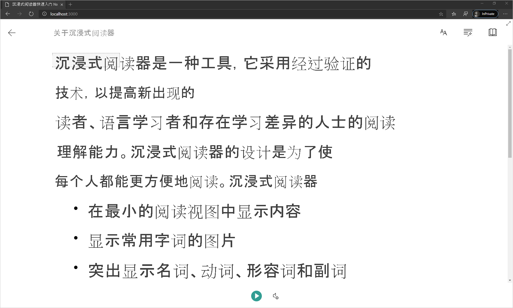

[沉浸式阅读器](https://www.onenote.com/learningtools)是一款经过广泛设计的工具，它实现了可靠的技术，旨在提高新的读者、语言学习者和有学习差异（如阅读障碍）的用户的阅读理解能力。 你可在应用程序中使用沉浸式阅读器来隔离文本，以改进焦点、显示常用词的图片、突出显示语音的各个部分、大声朗读所选文本、实时翻译字词和短语等等。

在本快速入门中，你将从头开始构建一个 Web 应用，并使用沉浸式阅读器客户端库集成沉浸式阅读器。 [GitHub](https://github.com/microsoft/immersive-reader-sdk/tree/master/js/samples/quickstart-nodejs) 提供了此快速入门的完整工作示例。

## <a name="prerequisites"></a>先决条件

* Azure 订阅 - [免费创建订阅](https://azure.microsoft.com/free/cognitive-services)
* 为 Azure Active Directory 身份验证配置的沉浸式阅读器资源。 按照[这些说明](../../how-to-create-immersive-reader.md)进行设置。 在配置环境属性时，将需要在此处创建的一些值。 将会话的输出保存到文本文件中，以供将来参考。
* [Node.js](https://nodejs.org/) 和 [Yarn](https://yarnpkg.com)
* IDE 如 [Visual Studio Code](https://code.visualstudio.com/)

## <a name="create-a-nodejs-web-app-with-express"></a>使用 Express 创建 Node.js Web 应用程序

使用 `express-generator` 工具创建 Node.js Web 应用程序。

```bash
npm install express-generator -g
express --view=pug quickstart-nodejs
cd quickstart-nodejs
```

安装 yarn 依赖项，并添加 `request` 和 `dotenv` 依赖项，以便在后续快速入门中使用。

```bash
yarn
yarn add request
yarn add dotenv
```

使用以下命令安装 axios 和 qs 库 ：

```bash
npm install axios qs
```

## <a name="set-up-authentication"></a>设置身份验证

### <a name="configure-authentication-values"></a>配置身份验证值

在项目的根目录中创建一个名为 _.env_ 的新文件。 将以下代码粘贴到其中，并提供在创建沉浸式阅读器资源时给出的值。
请勿包含引号或“{”和“}”字符。

```text
TENANT_ID={YOUR_TENANT_ID}
CLIENT_ID={YOUR_CLIENT_ID}
CLIENT_SECRET={YOUR_CLIENT_SECRET}
SUBDOMAIN={YOUR_SUBDOMAIN}
```

请确保不要将此文件提交到源代码管理中，因为它包含不应公开的机密。

接下来，打开 app.js 并将以下内容添加到文件顶部。 这会将 .env 文件中定义的属性作为环境变量加载到 Node 中。

```javascript
require('dotenv').config();
```

### <a name="update-the-router-to-acquire-the-token"></a>更新路由器以获取令牌

打开 _routes\index.js_ 文件，并将自动生成的代码替换为以下代码。

此代码创建一个 API 终结点，该终结点使用服务主体密码获取 Azure AD 身份验证令牌。 它还检索子域。 然后它返回一个包含令牌和子域的对象。

```javascript
var axios = require('axios');
var express = require('express');
var router = express.Router();
var qs = require('qs');

/* GET home page. */
router.get('/', function(req, res, next) {
  res.render('index', { title: 'Express' });
});

router.get('/GetTokenAndSubdomain', function(req, res) {
    try {
        var config ={
            headers: {
                'content-type': 'application/x-www-form-urlencoded'
            }
        }
        var data = {
            grant_type: 'client_credentials',
            client_id: process.env.CLIENT_ID,
            client_secret: process.env.CLIENT_SECRET,
            resource: 'https://cognitiveservices.azure.com/'
        };
        var url = `https://login.windows.net/${process.env.TENANT_ID}/oauth2/token`
        console.log(qs.stringify(data));
        axios.post(url, qs.stringify(data), config)
        .then(function (response) {
            var token = response.data.access_token;
            var subdomain = process.env.SUBDOMAIN;
            return res.send({token, subdomain});
        })
        .catch(function (response) {
            if (response.status !== 200) {
                return res.send({error :  "Unable to acquire Azure AD token. Check the debugger for more information."})
            }
        });
    } catch (error) {
        console.log(error);
        return res.status(500).send('CogSvcs IssueToken error');
    }
});

module.exports = router;
```

**GetTokenAndSubdomain** API 终结点应在某种形式的身份验证（例如，[OAuth](https://oauth.net/2/)）后进行保护，以防止未经授权的用户获取令牌以用于沉浸式阅读器服务和计费；该工作超出了本快速入门的范围。

## <a name="add-sample-content"></a>添加示例内容

现在，我们将向此 Web 应用添加示例内容。 打开 _views\index.pug_，并将自动生成的代码替换为以下示例：

```pug
doctype html
html
   head
      title Immersive Reader Quickstart Node.js

      link(rel='icon', href='data:;base64,iVBORw0KGgo=')

      link(rel='stylesheet', href='https://stackpath.bootstrapcdn.com/bootstrap/3.4.1/css/bootstrap.min.css')

      // A polyfill for Promise is needed for IE11 support.
      script(src='https://cdn.jsdelivr.net/npm/promise-polyfill@8/dist/polyfill.min.js')

      script(src='https://contentstorage.onenote.office.net/onenoteltir/immersivereadersdk/immersive-reader-sdk.1.1.0.js')
      script(src='https://code.jquery.com/jquery-3.3.1.min.js')

      style(type="text/css").
        .immersive-reader-button {
          background-color: white;
          margin-top: 5px;
          border: 1px solid black;
          float: right;
        }
   body
      div(class="container")
        button(class="immersive-reader-button" data-button-style="iconAndText" data-locale="en")

        h1(id="ir-title") About Immersive Reader
        div(id="ir-content" lang="en-us")
          p Immersive Reader is a tool that implements proven techniques to improve reading comprehension for emerging readers, language learners, and people with learning differences. The Immersive Reader is designed to make reading more accessible for everyone. The Immersive Reader

            ul
                li Shows content in a minimal reading view
                li Displays pictures of commonly used words
                li Highlights nouns, verbs, adjectives, and adverbs
                li Reads your content out loud to you
                li Translates your content into another language
                li Breaks down words into syllables

          h3 The Immersive Reader is available in many languages.

          p(lang="es-es") El Lector inmersivo está disponible en varios idiomas.
          p(lang="zh-cn") 沉浸式阅读器支持许多语言
          p(lang="de-de") Der plastische Reader ist in vielen Sprachen verfügbar.
          p(lang="ar-eg" dir="rtl" style="text-align:right") يتوفر \"القارئ الشامل\" في العديد من اللغات.

script(type="text/javascript").
  function getTokenAndSubdomainAsync() {
        return new Promise(function (resolve, reject) {
            $.ajax({
                url: "/GetTokenAndSubdomain",
                type: "GET",
                success: function (data) {
                    if (data.error) {
                        reject(data.error);
                    } else {
                        resolve(data);
                    }
                },
                error: function (err) {
                    reject(err);
                }
            });
        });
    }

    $(".immersive-reader-button").click(function () {
        handleLaunchImmersiveReader();
    });

    function handleLaunchImmersiveReader() {
        getTokenAndSubdomainAsync()
            .then(function (response) {
                const token = response["token"];
                const subdomain = response["subdomain"];
                // Learn more about chunk usage and supported MIME types https://docs.microsoft.com/azure/cognitive-services/immersive-reader/reference#chunk
                const data = {
                    title: $("#ir-title").text(),
                    chunks: [{
                        content: $("#ir-content").html(),
                        mimeType: "text/html"
                    }]
                };
                // Learn more about options https://docs.microsoft.com/azure/cognitive-services/immersive-reader/reference#options
                const options = {
                    "onExit": exitCallback,
                    "uiZIndex": 2000
                };
                ImmersiveReader.launchAsync(token, subdomain, data, options)
                    .catch(function (error) {
                        alert("Error in launching the Immersive Reader. Check the console.");
                        console.log(error);
                    });
            })
            .catch(function (error) {
                alert("Error in getting the Immersive Reader token and subdomain. Check the console.");
                console.log(error);
            });
    }

    function exitCallback() {
        console.log("This is the callback function. It is executed when the Immersive Reader closes.");
    }
```

请注意，所有文本都有一个 **lang** 属性，该属性描述了文本的语言。 此属性可帮助沉浸式阅读器提供相关的语言和语法功能。

## <a name="build-and-run-the-app"></a>生成并运行应用

我们的 Web 应用现已准备就绪。 运行以下命令以启动该应用：

```bash
npm start
```

打开浏览器并导航到 _http://localhost:3000_ 。 应该看到以下内容：


## <a name="launch-the-immersive-reader"></a>启动沉浸式阅读器

单击“沉浸式阅读器”按钮时，将会看到沉浸式阅读器随页面上的内容一起启动。



## <a name="next-steps"></a>后续步骤

> [!div class="nextstepaction"]
> [创建资源并配置 AAD](../../how-to-create-immersive-reader.md)