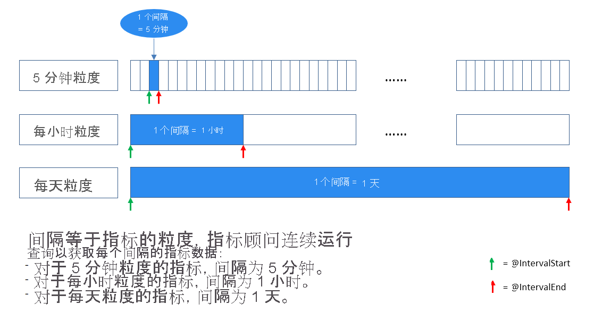

# 包含常见词汇和概念的指标顾问术语表

本文档介绍指标顾问中使用的技术术语。 通过本文可以了解使用服务时可能遇到的常见概念和对象。

## 数据馈送

> [!NOTE]
> 多个指标可以共享相同的数据源，甚至可以共享相同的数据馈送。

数据馈送是指标顾问从数据源（如 Cosmos DB 或 SQL 服务器）中引入的内容。 数据馈送包含以下行：
* 时间戳
* 零个或多个维度
* 一个或多个度量值。 

## 间隔
指标需要根据业务需求按某种粒度进行监视。 例如，业务关键性能指标 (KPI) 按天的粒度进行监视。 但是，服务性能指标常常按分钟/小时的粒度进行监视。 因此，从源收集指标数据的频率各有不同。

“指标顾问”按每个时间间隔持续获取指标数据，该时间间隔等同于指标的粒度。 “指标顾问”每次在此特定时间间隔内运行编写的查询并引入数据。 根据此数据引入机制，查询脚本不应返回数据库中存在的所有指标数据，而需将结果限制为单个时间间隔内。

<!--  -->

## 指标

指标是一种可量化的度量值，用于监视和评估特定业务流程的状态。 它可以是划分为多个维度的多个时序值的组合。 例如，Web 运行状况指标可能包含用户数和 en-us 市场的维度  。

## 维度

维度是一个或多个分类值。 这些值的组合标识特定的单变量时序，例如国家/地区、语言、租户等等。

## 多维度指标

什么是多维度指标？ 让我们使用两个示例。 

业务收入

假设你有业务收入数据。 时序数据可能如下所示：

| 时间戳 | 类别 | 市场 | 收入 |
| ----------|----------|--------|----- |
| 2020-6-1 | 食物 | US | 1000 |
| 2020-6-1 | 服装 | US | 2000 |
| 2020-6-2 | 食物 | 英国 | 800 | 
| ...      | ...  |... | ... |

在此示例中，“类别”和“市场”是维度 。 收入是关键绩效指标 (KPI)，可以分为不同的类别和/或市场，也可以聚合。 例如，所有市场的食品的收入。
 
复杂应用程序的错误计数

假设你有应用程序中记录的错误数的数据。 时序数据可能如下所示：

| 时间戳 | 应用程序组件 | 区域 | 错误计数 |
| ----------|----------|--------|----- |
| 2020-6-1 | 员工数据库 | 欧洲西部 | 9000 |
| 2020-6-1 | 消息队列 | 美国东部 | 1000 |
| 2020-6-2 | 消息队列 | 美国东部 | 8000| 
| ...      | ...           | ...     |  ...|

在此示例中，“应用程序组件”和“区域”是维度 。 错误计数是 KPI，可以分为不同的类别和/或市场，也可以聚合。 例如，所有区域中消息队列的错误计数。

## 测量

度量值是指标的基本或单位特定术语和可量化的值。

## 时序

时序是按时间顺序编制索引（或列出或绘制）的一系列数据点。 时序通常是在连续的、均匀间距的时间点生成的序列。 它是一系列离散时间数据。

在指标顾问中，特定维度组合上的一个指标的值称为一个系列。

## 粒度

粒度指示数据源处生成数据点的频率。 例如“每日”、“每小时”。

## 引入数据的时间 (UTC)

引入数据的时间 (UTC) 是你希望指标顾问开始从数据源中引入数据的时间。 数据源必须在指定的引入开始时间有数据。

## 置信度边界

> [!NOTE]
> 置信度边界不是用于查找异常的唯一度量。 检测模型可能将此边界外的数据点标记为正常。 

在指标顾问中，置信度边界表示使用的算法的敏感度，并用于筛选掉过于敏感的异常。 在 Web 门户上，置信度边界显示为透明蓝色带。 带内的所有点都被视为正常点。

指标顾问提供工具来调整使用的算法的敏感度。 有关更多信息，请参阅[操作指南：配置指标并微调检测配置](how-tos/configure-metrics.md)。

## 挂钩

通过指标顾问，可以创建和订阅实时警报。 这些警报[使用挂钩](how-tos/alerts.md)通过 Internet 发送。

## 异常事件

将检测配置应用于指标后，每当配置中任何序列出现异常时，都会生成事件。 在大型数据集中，这可能非常庞大，因此指标顾问将指标中的一系列异常归入事件。 该服务还将评估严重性，并提供用于[诊断事件](how-tos/diagnose-an-incident.md)的工具。

### 诊断树

在指标顾问中，可以对指标应用异常检测，然后指标顾问会自动监视所有维度组合的所有时序。 每当检测到任何异常时，指标顾问都会将异常聚合到事件中。
事件发生后，指标顾问将提供诊断树（包含涉及的异常的层次结构），并标识影响最大的异常。 每个事件都有一个根本原因异常，这是树的顶部节点。

### 异常分组

指标顾问提供查找具有类似模式的相关时序的功能。 它还可以提供有关针对其他维度影响的更深入见解并关联多种异常。

### 时序比较

可以选择多个时序来比较单个可视化中的趋势。 这提供了一个清晰且富有见解的方式来查看和比较相关系列。

## 检测配置

>[!Note]
>检测配置仅在单个指标中应用。

在指标顾问 Web 门户上查看指标时，左侧面板上会列出检测配置（如敏感度、自动推迟和方向）。 参数可以调整并应用于此指标内的所有系列。

检测配置是每个时序所需的，它可以确定时序中的点是否为异常。 指标顾问将在你首次载入数据时为整个指标设置默认配置。 

此外，还可以通过对一组序列或特定序列应用优化参数来优化配置。 一个时序只能应用一个配置：
* 应用于特定序列的配置将覆盖组的配置
* 组的配置将覆盖应用于整个指标的配置。

指标顾问提供若干[检测方法](how-tos/configure-metrics.md#anomaly-detection-methods)，你可以使用逻辑运算符来组合它们。

### 智能检测

使用多个机器学习算法的异常检测。

敏感度：用于调整异常检测的容差的数值。 直观而言，值越高，时序的上限和下限越窄。

### 硬阈值

上限或下限以外的值是异常。

**最小值**：下限

**最大值**：上限

### 变化阈值

使用上一个点值确定此点是否为异常。

变化百分比：与上一个点相比，如果变化百分比大于此参数，则当前点是异常。

变化所涉及的点：要回顾的点数。

### 通用参数

方向：仅当偏差发生的方向为“上”和/或“下”时，点为异常  。

在此之前不是有效异常：某一数据点仅在该点之前的指定百分比的数据点也是异常的情况下是异常。

## 警报设置

警报设置确定哪些异常应触发警报。 可以使用不同的设置设置多个警报。 例如，可以为业务影响较小的异常创建警报，也可以创建更重要的警报。

还可以跨指标创建警报。 例如，仅在两个指定的指标有异常时触发的警报。

### 警报范围

警报范围是指警报的适用范围。 下面有四个选择：

所有序列的异常：为指标中所有序列中的异常触发警报。

序列组中的异常：仅针对序列组特定维度中的异常触发警报。 指定维度的数量应小于维度总数。

偏好序列中的异常：仅对添加为偏好的异常触发警报。 可以选择一组系列作为每个检测配置的偏好。

所有序列的前 N 个异常：将仅针对前 N 个序列中的异常触发警报。 可以设置参数以指定要考虑的时间戳数，以及其中必须有多少异常才能发送警报。

### 严重性

严重性是指指标顾问用于描述事件严重性的等级，其中包括“高”、“中”和“低”  。

目前，指标顾问使用以下因素来衡量警报严重性：
1. 指标中异常的值比例和数量比例。
1. 异常的置信度。
1. 你偏好的设置也会增加严重性。

### 自动推迟

某些异常是暂时性问题，尤其是对于小粒度指标。 可以推迟特定数量的时间点的警报。 如果在特定数量的点内发现异常，则不会触发任何警报。 自动推迟的行为可以在指标级别或序列级别上设置。

推迟的行为可以在指标级别或序列级别上设置。

## 数据馈送设置

### 引入时间偏移

默认情况下，根据粒度（如“每日”）对数据进行引入。 通过使用正整数，可以使用指定值延迟数据引入。 通过使用负数，可以使用指定值提前引入数据。

### 每分钟最大引入

如果数据源支持有限的并发，请设置此参数。 否则保留默认设置。

### 多长时间后停止重试

如果数据引入失败，指标顾问将在一段时间后自动重试。 该时段的开始是发生第一次数据引入的时间。 重试时段的长度根据粒度定义。 如果使用默认值 (`-1`)，则将根据粒度确定重试时长：

| 粒度       | 多长时间后停止重试           |
| :------------ | :--------------- |
| 每日、自定义（>= 1 天）、每周、每月、每年     | 7 天          |
| 每小时、自定义（< 1 天）       | 72 小时 |

### 最小重试间隔

重试从源拉取数据时，可以指定最小间隔。 如果使用默认值 (`-1`)，则将根据粒度确定重试间隔：

| 粒度       | 最小重试间隔           |
| :------------ | :--------------- |
| 每日、自定义（>= 1 天）、每周、每月     | 30 分钟          |
| 每小时、自定义（< 1 天）      | 10 分钟 |
| 每年 | 1 天          |

### 宽限期

> [!Note]
> 宽限期从常规引入时间开始，再加上指定的引入时间偏移。
    
宽限期是指标顾问将继续从数据源提取数据，但不会触发任何警报的时间段。 如果在宽限期后未引入任何数据，则将触发“数据馈送不可用”警报。

### 推迟警报数量

当此选项设置为零时，每个不可用的时间戳都将触发警报。 当设置为非零值时，如果未提取任何数据，将推迟指定数量的不可用警报。

## 数据馈送权限

有两个角色用于管理数据馈送权限：管理员和查看者 。 

* 管理员可以完全控制其中的数据馈送和指标。 他们可以激活、暂停、删除数据馈送，以及更新源和配置。 管理员通常是指标的所有者。

* 查看者可以查看数据馈赠或指标，但无法做出更改。 

## 后续步骤
- [指标顾问概述](overview.md)
- [使用 Web 门户](quickstarts/web-portal.md)
