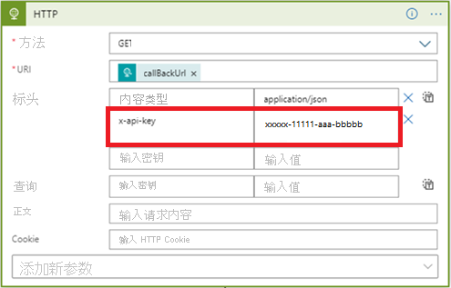

# <a name="tutorial-enable-anomaly-notification-in-metrics-advisor"></a>教程：在指标顾问中启用异常通知 

<!-- 2. Introductory paragraph 
Required. Lead with a light intro that describes, in customer-friendly language, 
what the customer will learn, or do, or accomplish. Answer the fundamental “why 
would I want to do this?” question. Keep it short.
-->


<!-- 3. Tutorial outline 
Required. Use the format provided in the list below.
-->

在本教程中，你将了解：

> [!div class="checklist"]
> * 如何在指标顾问中创建挂钩
> * 如何通过 Azure 逻辑应用发送通知
> * 如何 Microsoft 团队发送通知
> * 如何通过 SMTP 服务器发送通知

<!-- 4. Prerequisites 
Required. First prerequisite is a link to a free trial account if one exists. If there 
are no prerequisites, state that no prerequisites are needed for this tutorial.
-->

## <a name="prerequisites"></a>必备条件
### <a name="create-a-metrics-advisor-resource"></a>创建指标顾问资源

若要探索指标顾问的功能，需要在 Azure 门户中<a href="https://go.microsoft.com/fwlink/?linkid=2142156"  title="创建指标顾问资源"  target="_blank">创建指标顾问资源</a>，以部署你的指标顾问实例。

### <a name="create-a-hook-in-metrics-advisor"></a>如何在指标顾问中创建挂钩
指标顾问中的挂钩是一个桥梁，让客户能够订阅指标异常并通过不同通道发送通知。 指标顾问中有四种挂钩： 
    
- 电子邮件挂钩
- Webhook
- Teams 挂钩
- Azure DevOps 挂钩

每个挂钩类型对应一个通知异常情况时使用的特定通道。 

<!-- 5. H2s
Required. Give each H2 a heading that sets expectations for the content that follows. 
Follow the H2 headings with a sentence about how the section contributes to the whole.
-->

## <a name="send-notifications-with-logic-apps-teams-and-smtp"></a>使用逻辑应用、Teams 和 SMTP 发送通知

#### <a name="logic-apps"></a>[逻辑应用](#tab/logic)

### <a name="send-email-notification-by-using-azure-logic-apps"></a>使用逻辑应用发送电子邮件通知

<!-- Introduction paragraph -->
指标顾问中支持两个发送电子邮件通知的常见选项。 一个是使用 Webhook 和 Azure 逻辑应用发送电子邮件警报，另一个是设置 SMTP 服务器并使用它直接发送电子邮件警报。 本部分重点介绍第一个选项，对于没有可用 SMTP 服务器的客户来说，此选项更容易操作。

**步骤 1.** 在指标顾问中创建 Webhook

Webhook 是指标顾问服务中所有可用信息的入口点，在触发警报时会调用用户提供的 API。 所有警报都可以通过 Webhook 发送。

在指标顾问的工作区中选择“挂钩”选项卡，然后选择“创建挂钩”按钮。 选择“Webhook”的挂钩类型。 填写必需的参数，然后选择“确定”。 有关详细步骤，请参阅[创建 Webhook](../how-tos/alerts.md#web-hook)。

需要额外填写一个“终结点”参数，这可以在完成下面的步骤 3 后完成。 


**步骤 2.** 创建逻辑应用资源

在 [Azure 门户](https://portal.azure.com)中，按照[创建逻辑应用](../../../logic-apps/quickstart-create-first-logic-app-workflow.md)中的说明创建一个空逻辑应用。 看到“逻辑应用设计器”时，请返回本教程。


**步骤 3.** 添加一个“收到 HTTP 请求时”触发器

- Azure 逻辑应用使用各种操作来触发定义的工作流。 在本用例中，使用“收到 HTTP 请求时”触发器。 

- 在“收到 HTTP 请求时”对话框中，选择“使用示例有效负载生成架构”。 

    

    将以下示例 JSON 复制到文本框中，然后选择“完成”。

    ```json
    {
    "properties": {
        "value": {
            "items": {
                "properties": {
                    "alertInfo": {
                        "properties": {
                            "alertId": {
                                "type": "string"
                            },
                            "anomalyAlertingConfigurationId": {
                                "type": "string"
                            },
                            "createdTime": {
                                "type": "string"
                            },
                            "modifiedTime": {
                                "type": "string"
                            },
                            "timestamp": {
                                "type": "string"
                            }
                        },
                        "type": "object"
                    },
                    "alertType": {
                        "type": "string"
                    },
                    "callBackUrl": {
                        "type": "string"
                    },
                    "hookId": {
                        "type": "string"
                    }
                },
                "required": [
                    "hookId",
                    "alertType",
                    "alertInfo",
                    "callBackUrl"
                ],
                "type": "object"
            },
            "type": "array"
        }
    },
    "type": "object"
     }
    ```

- 选择此方法作为“POST”，然后选择“保存”。 现在可以查看 HTTP 请求触发器的 URL。 选择复制图标以复制它，并填写回步骤 1 中的“终结点”中。 

    

**步骤 4.** 使用“HTTP”操作添加下一步

通过 Webhook 推送的信号仅包含时间戳、alertID、configurationID 等有限信息。需使用信号中提供的回调 URL 查询详细信息。 此步骤是查询详细的警报信息。  

- 选择一个“GET”方法
- 从“URI”中的“动态内容”列表中选择“callBackURL”。
- 在“标头”中输入“Content-Type”的密钥，并输入“application/json”的值
- 在“标头”中输入“x-api-key”的密钥，单击指标顾问工作区中的“API 密钥”选项卡来获取密钥。 此步骤的目的是为了确保工作流具有足够的 API 调用权限。

    

**步骤 5.** 添加下一步到“分析 JSON” 

需要分析 API 的响应，以便更轻松地设置电子邮件内容的格式。 
 
> [!NOTE] 
> 本教程仅分享一个简明示例，最终的电子邮件格式还需要进一步设计。 

- 从“内容”中的“动态内容”列表中选择"正文"
- 选择“使用示例有效负载生成架构”。 将以下示例 JSON 复制到文本框中，然后选择“完成”。

```json
{
    "properties": {
        "@@nextLink": {},
        "value": {
            "items": {
                "properties": {
                    "properties": {
                        "properties": {
                            "IncidentSeverity": {
                                "type": "string"
                            },
                            "IncidentStatus": {
                                "type": "string"
                            }
                        },
                        "type": "object"
                    },
                    "rootNode": {
                        "properties": {
                            "createdTime": {
                                "type": "string"
                            },
                            "detectConfigGuid": {
                                "type": "string"
                            },
                            "dimensions": {
                                "properties": {
                                },
                                "type": "object"
                            },
                            "metricGuid": {
                                "type": "string"
                            },
                            "modifiedTime": {
                                "type": "string"
                            },
                            "properties": {
                                "properties": {
                                    "AnomalySeverity": {
                                        "type": "string"
                                    },
                                    "ExpectedValue": {}
                                },
                                "type": "object"
                            },
                            "seriesId": {
                                "type": "string"
                            },
                            "timestamp": {
                                "type": "string"
                            },
                            "value": {
                                "type": "number"
                            }
                        },
                        "type": "object"
                    }
                },
                "required": [
                    "rootNode",
                    "properties"
                ],
                "type": "object"
            },
            "type": "array"
        }
    },
    "type": "object"
}
```

**步骤 6.** 添加下一步到“创建 HTML 表格”

API 调用返回了一些信息，但根据你的方案不同，并非所有信息都很有用。 选择你关注并想要包含在警报电子邮件中的项。 

下面是一个 HTML 表格示例，其中选择在警报电子邮件中包含“timestamp”、“metricGUID”和“dimension”。


**步骤 7.** 将最后一个步骤添加到“发送电子邮件”

发送电子邮件时有几个选项，包括 Microsoft 托管的产品/服务和第三方产品/服务。 客户可能需要具有适合所选选项的租户/帐户。 例如，选择"Office 365 Outlook"作为服务器时。 将启动登录过程以构建连接和授权。 将建立 API 连接以使用电子邮件服务器发送警报。 

在电子邮件的“正文”和“主题”中填写你想要包含的内容，并在“收件人”中填写电子邮件地址。 


                                                                   
#### <a name="teams-channel"></a>[Teams 通道](#tab/teams)
                                           
### <a name="send-anomaly-notification-through-a-microsoft-teams-channel"></a>通过 Microsoft Teams 通道发送异常通知                            
本部分将演练通过 Microsoft Teams 通道发送异常通知的做法。 这有助于实现团队成员协作分析指标顾问检测到的异常情况。 该工作流易于配置，并且没有大量先决条件。 
                                               


**步骤 1.** 将“传入 Webhook”连接器添加到 Teams 通道

- 导航到需要接收通知的 Teams 通道，选择“...”（更多选项）。 
- 在下拉列表中，选择“连接器”。 在新对话框中，搜索“传入 Webhook”，然后单击“添加”。

        

- 如果无法查看“连接器”选项，请联系 Teams 组负责人。 选择“管理团队”，然后选择顶部的“设置”选项卡，并检查是否选中了“允许成员创建、更新和删除连接器”设置。

        

- 输入连接器的名称，你也可以上传图像并以此作为头像。 选择“创建”，然后将传入的 Webhook 连接器成功添加到通道。 系统会在对话框底部生成 URL，请务必选择“复制”，然后选择“完成”。 

     

**步骤 2.** 在指标顾问中创建新的“Teams 挂钩”

- 选择左侧导航栏中的“挂钩”选项卡，然后选择页面右上角的“创建挂钩”按钮。 
- 选择“Teams”挂钩类型，然后输入名称并粘贴从上一步中复制的 URL。 
- 选择“保存”。 

     

**步骤 3.** 将 Teams 挂钩应用于警报配置

浏览并选择一个已载入的数据馈送。 选择源中的指标，并打开指标详细信息页面。 你可以创建“警报配置”以订阅检测到并通过 Teams 通道通知的异常情况。 

选择“+”按钮，然后选择已创建的挂钩，填写其他字段并选择“保存”。 然后，就可以将 Teams 挂钩应用于警报配置。 所有新异常情况都将通过 Teams 通道通知。


#### <a name="smtp-e-mail"></a>[SMTP 电子邮件](#tab/smtp)

### <a name="send-email-notification-by-configuring-an-smtp-server"></a>通过配置 SMTP 服务器来发送电子邮件通知

本部分将介绍在检测到异常时使用 SMTP 服务器发送电子邮件通知的做法。 请确保具有可用的 SMTP 服务器，并且具有足够的权限来获取帐户名称和密码等参数。

**步骤 1.** 将你的帐户指定为“认知服务指标顾问管理员”角色  

- 具有订阅管理员或资源组管理员权限的用户需要导航到在 Azure 门户中创建的指标顾问资源，并选择“访问控制(IAM)”选项卡。
- 选择“添加角色分配”。
- 选取“认知服务指标顾问管理员”角色，然后选择帐户，如下图所示。
- 选择“保存”按钮，你已成功地添加为指标顾问资源的管理员。 请注意，上述所有操作都需要由订阅管理员或资源组管理员执行。 传播权限最多可能需要一分钟时间。 


**步骤 2.** 在指标顾问工作区中配置 SMTP 服务器

完成上述步骤后，你已成功添加为指标顾问资源的管理员。 传播权限可能需要几分钟时间。 然后登录到指标顾问工作区，此时你应该能够在左侧导航面板中查看名为“电子邮件设置”的新选项卡。 选择它并继续配置。 

要填写的参数： 

- SMTP 服务器名称（“必填”）：填写 SMTP 服务器提供程序的名称，大多数服务器名称的格式为“smtp.domain.com”或“mail.domain.com”。 以 Office365 为例，应设置为“smtp.office365.com”。 
- SMTP 服务器端口 （“必填”）：端口 587 是在新式 Web 上提交 SMTP 时的默认端口。 虽然也可以使用其他端口来提交（下文会提供更多信息），但你应始终使用端口 587 作为默认值，并且仅在情况不允许时（如主机因故阻止端口 587 时）才使用其他端口。
- 电子邮件发件人（“必填”）：这是负责发送电子邮件的实际电子邮件帐户。 可能需要填写发件人的帐户名和密码。 可以为一个帐户设置配额阈值，规定一分钟内发送警报电子邮件的最大数目。 如果在一分钟内可能有大量警报需要发送，则可以设置多个发件人，但至少应设置一个帐户。 
- 发件人代表（可选）：如果配置了多个发件人，但想要让警报电子邮件看起来是从一个帐户发送。 你可以使用此字段来调整。 但请注意，你可能需要向发件人授权，以允许代表其帐户发送电子邮件。  
- 默认抄送（可选）：设置一个所有警报电子邮件都会抄送的默认电子邮件地址。 

下方示例显示配置好的 SMTP 服务器：


**步骤 3.** 在指标顾问中创建电子邮件挂钩

成功配置 SMTP 服务器后，就可以在指标顾问的“挂钩”选项卡中创建“电子邮件挂钩”了。 有关创建“电子邮件挂钩”的详细信息，请参阅[关于警报的文章](../how-tos/alerts.md#email-hook)，并按步骤完成操作。

**步骤 4.** 将电子邮件挂钩应用于警报配置

 选择一个已载入的数据馈送，在源中选择一个指标，并打开指标详细信息页面。 你可以创建“警报配置”，以订阅检测到并通过电子邮件发送的异常情况。 

选择“+”按钮，然后选择已创建的挂钩，填写其他字段并选择“保存”。 现在，你已使用自定义警报配置成功设置了电子邮件挂钩，所有新的异常情况都将通过这个使用 SMTP 服务器的挂钩报告。 


---

## <a name="next-steps"></a>后续步骤

转到下一篇文章，了解创建方法。
> [!div class="nextstepaction"]
> [写入有效查询](write-a-valid-query.md)

<!--
Remove all the comments in this template before you sign-off or merge to the 
main branch.
-->
