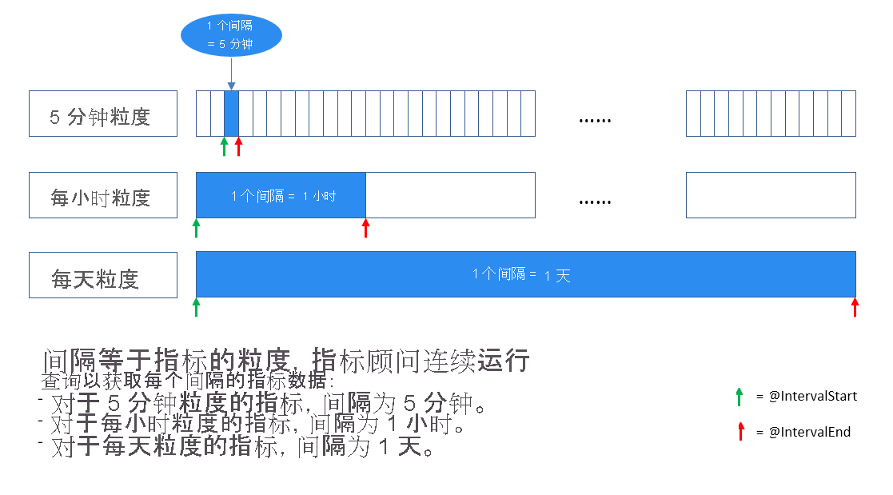

<!--
Remove all the comments in this template before you sign-off or merge to the 
main branch.
-->

<!--
This template provides the basic structure of a tutorial article.
See the [tutorial guidance](contribute-how-to-mvc-tutorial.md) in the contributor guide.

To provide feedback on this template contact 
[the templates workgroup](mailto:templateswg@microsoft.com).
-->

<!-- 1. H1 
Required. Start with "Tutorial: ". Make the first word following "Tutorial: " a 
verb.
-->

# <a name="tutorial-write-a-valid-query-to-onboard-metrics-data"></a>教程：编写有效查询以加入指标数据

<!-- 2. Introductory paragraph 
Required. Lead with a light intro that describes, in customer-friendly language, 
what the customer will learn, or do, or accomplish. Answer the fundamental “why 
would I want to do this?” question. Keep it short.
-->


<!-- 3. Tutorial outline 
Required. Use the format provided in the list below.
-->

在本教程中，你将了解：

> [!div class="checklist"]
> * 如何编写有效的数据加入查询
> * 常见错误及其规避方法

<!-- 4. Prerequisites 
Required. First prerequisite is a link to a free trial account if one exists. If there 
are no prerequisites, state that no prerequisites are needed for this tutorial.
-->

## <a name="prerequisites"></a>必备条件

### <a name="create-a-metrics-advisor-resource"></a>创建“指标顾问”资源

若要探索“指标顾问”的功能，需要在 Azure 门户中<a href="https://go.microsoft.com/fwlink/?linkid=2142156"  title="创建“指标顾问”资源"  target="_blank">创建“指标顾问”资源</a>，以部署“指标顾问”实例。

<!-- 5. H2s
Required. Give each H2 a heading that sets expectations for the content that follows. 
Follow the H2 headings with a sentence about how the section contributes to the whole.
-->

## <a name="data-schema-requirements"></a>数据架构要求
<!-- Introduction paragraph -->

[!INCLUDE [data schema requirements](../includes/data-schema-requirements.md)]


## <a name="span-idingestion-workhow-does-data-ingestion-work-in-metrics-advisorspan"></a><span id="ingestion-work">“指标顾问”中的数据引入原理</span>

通常有两种方法将指标加入“指标顾问”：
<!-- Introduction paragraph -->
- 将指标预先聚合到预期的架构中，并将数据存储到某些文件中。 在加入过程中填写路径模板，“指标顾问”将从该路径持续获取新文件，并对指标执行检测。 这是针对 Azure Data Lake 和 Azure Blob 存储等数据源的常见做法。
- 如果要从 Azure SQL Server、Azure 数据资源管理器或其他源等支持使用查询脚本的数据源中引入数据，则需要确保正确构造查询。 本文将指导如何编写有效的查询以按预期加入指标数据。 


### <a name="what-is-an-interval"></a>什么是时间间隔？

指标需要根据业务需求按某种粒度进行监视。 例如，业务关键性能指标 (KPI) 按天的粒度进行监视。 但是，服务性能指标常常按分钟/小时的粒度进行监视。 因此，从源收集指标数据的频率各有不同。 

“指标顾问”按每个时间间隔持续获取指标数据，该时间间隔等同于指标的粒度。 “指标顾问”每次在此特定时间间隔内运行编写的查询并引入数据。 根据此数据引入机制，查询脚本不应返回数据库中存在的所有指标数据，而需将结果限制为单个时间间隔内。



## <a name="how-to-write-a-valid-query"></a>如何编写有效查询？
<!-- Introduction paragraph -->
### <a name="span-iduse-parameters-use-intervalstart-and-intervalend-to-limit-query-resultsspan"></a><span id="use-parameters"> 使用 @IntervalStart 和 @IntervalEnd 限制查询结果</span>

 为了帮助实现这一点，提供两个在查询中使用的参数： **@IntervalStart** 和 **@IntervalEnd** 。 

每次运行查询时，都会将 @IntervalStart 和 @IntervalEnd 自动更新为最新的时间间隔时间戳并获取相应的指标数据。 @IntervalEnd 始终分配为 @IntervalStart + 1 的粒度。 

下面是针对 Azure SQL Server 正确使用这两个参数的示例： 

```SQL
SELECT [timestampColumnName] AS timestamp, [dimensionColumnName], [metricColumnName] FROM [sampleTable] WHERE [timestampColumnName] >= @IntervalStart and [timestampColumnName] < @IntervalEnd;
```

采用这种方式编写查询脚本后，指标的时间戳应在每个查询结果的时间间隔内。 “指标顾问”会自动将时间戳与指标粒度对齐。 

### <a name="span-iduse-aggregation-use-aggregation-functions-to-aggregate-metricsspan"></a><span id="use-aggregation"> 使用聚合函数来聚合指标</span>

通常情况下，客户数据源中包含许多列，但并不是所有列都可以作为维度去监视或纳入。 客户可以使用聚合函数来聚合指标并仅包含有意义的列作为维度。

在下面的示例中，客户的数据源包含超过 10 列的数据，但只有少量列有意义且需要包含并聚合到要监视的指标中。 

| TS | 市场 | 设备 OS | 类别 | ... | Measure1 | Measure2 | Measure3 |
| ----------|--------|-----------|----------|-----|----------|----------|----------|
| 2020-09-18T12:23:22Z | 纽约 | iOS | 太阳眼镜 | ...| 43242 | 322 | 54546|
| 2020-09-18T12:27:34Z | 北京 | Android | 包包 | ...| 3333 | 126 | 67677 |
| ...

如果客户想要按小时粒度监视“Measure1”，并选择“Market”和“Category”作为维度，以下示例介绍了如何正确使用聚合函数来实现此目的： 

- SQL 示例： 

    ```sql
        SELECT dateadd(hour, datediff(hour, 0, TS),0) as NewTS
        ,Market
        ,Category
        ,sum(Measure1) as M1
        FROM [dbo].[SampleTable] where TS >= @IntervalStart and TS < @IntervalEnd
        group by Market, Category, dateadd(hour, datediff(hour, 0, TS),0)
    ```
- Azure 数据资源管理器示例：

    ```kusto
        SampleTable
        | where TS >= @IntervalStart and TS < @IntervalEnd
        | summarize M1 = sum(Measure1) by Market, Category, NewTS = startofhour(TS)
    ```    

> [!Note]
> 在上例中，客户想要按小时的粒度监视指标，但原始时间戳 (TS) 不匹配。 在聚合语句中，需要对时间戳执行一个过程使其按小时对齐，并生成一个名为“NewTS”的新时间戳列。 


## <a name="common-errors-during-onboarding"></a>加入过程中的常见错误

- **错误：** 在查询结果中找到多个时间戳值

    这是常见错误，原因是未将查询结果限制在某个时间间隔内。 例如，如果按天的粒度监视指标，当查询返回的结果如下所示时，则出现此错误： 

    
    
    包含多个时间戳值，且这些值不在指标的同一个时间间隔中（一天）。 请查看[“指标顾问”中的数据引入原理](#ingestion-work)，了解“指标顾问”将获取每个指标时间间隔内的指标数据。 然后，请确保在查询中使用 **@IntervalStart** 和 **@IntervalEnd** ，以将结果限制在一个时间间隔内。 有关详细指导和示例，请查看[使用 @IntervalStart 和 @IntervalEnd 限制查询结果](#use-parameters)。 


- **错误：** 在一个指标时间间隔内的同一个维度组合中发现重复的指标值
    
    在一个时间间隔内，“指标顾问”只应为同一维度组合提供一个指标值。 例如，如果按天的粒度监视指标，当查询返回的结果如下所示时，则出现此错误：

    

    有关详细指导和示例，请参阅[使用聚合函数来聚合指标](#use-aggregation)。 

<!-- 7. Next steps
Required: A single link in the blue box format. Point to the next logical tutorial 
in a series, or, if there are no other tutorials, to some other cool thing the 
customer can do. 
-->

## <a name="next-steps"></a>后续步骤

转到下一篇文章，了解如何创建。
> [!div class="nextstepaction"]
> [启用异常通知](enable-anomaly-notification.md)

<!--
Remove all the comments in this template before you sign-off or merge to the 
main branch.
