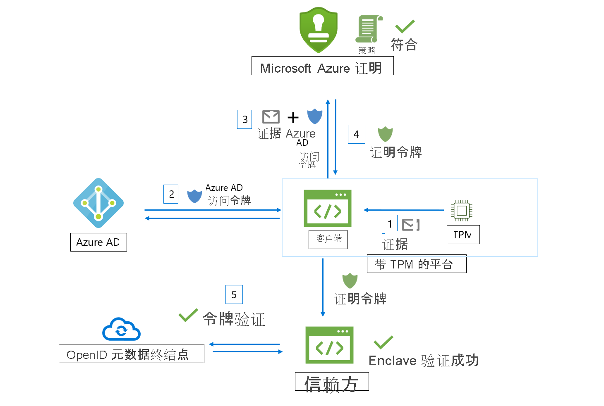

# 工作流

Microsoft Azure 证明接收来自 enclave 的证据，并根据 Azure 安全基准和可配置策略评估证据。 成功验证后，Azure 证明会生成证明令牌来确认 enclave 的可信度。

Azure 证明工作流涉及以下参与者：

- **信赖方**：该组件依赖 Azure 证明来验证 enclave 有效性。 
- **客户端**：该组件从 enclave 收集信息并将请求发送到 Azure 证明。 
- **Azure 证明**：该组件接受来自客户端的 enclave 证据，对其进行验证，然后将证明令牌返回给客户端

## Intel® Software Guard Extensions (SGX) enclave 验证工作流

下面是典型的 SGX enclave 证明工作流的一般步骤（使用 Azure 证明）：

1. 客户端从 enclave 收集证据。 证据是有关 enclave 环境和在 enclave 内运行的客户端库的信息。
1. 客户端具有引用 Azure 证明实例的 URI。 客户端将证据发送到 Azure 证明。 提交给提供程序的确切信息取决于 enclave 类型。
1. Azure 证明对提交的信息进行验证，并根据配置的策略对其进行评估。 如果验证成功，Azure 证明会颁发证明令牌并将其返回给客户端。 如果此步骤失败，Azure 证明会向客户端报告一个错误。 
1. 客户端会将证明令牌发送给信赖方。 信赖方将调用 Azure 证明的公钥元数据终结点来检索签名证书。 然后验证证明令牌的签名，并确保 enclave 可信度。 

> [!Note]
> 在 [2018-09-01-preview](https://github.com/Azure/azure-rest-api-specs/tree/master/specification/attestation/data-plane/Microsoft.Attestation/stable/2018-09-01-preview) API 版本中发送证明请求时，客户端需要将证据连同 Azure AD 访问令牌一起发送到 Azure 证明。

## 受信任的平台模块 (TPM) enclave 验证工作流

下面是典型的 TPM enclave 证明工作流的一般步骤（使用 Azure 证明）：

1.  在设备/平台启动时，各种启动加载程序和启动服务会测量由 TPM 支持并安全存储（TCG 日志）的事件。
2.  客户端从设备和 TPM Quote 收集 TCG 日志，作为证明的证据。
3.  客户端具有引用 Azure 证明实例的 URI。 客户端将证据发送到 Azure 证明。 提交给提供程序的确切信息取决于平台。
4.  Azure 证明对提交的信息进行验证，并根据配置的策略对其进行评估。 如果验证成功，Azure 证明会颁发证明令牌并将其返回给客户端。 如果此步骤失败，Azure 证明会向客户端报告一个错误。 客户端与证明服务之间的通信由 Azure 证明 TPM 协议决定。
5.  客户端随后会将证明令牌发送给信赖方。 信赖方将调用 Azure 证明的公钥元数据终结点来检索签名证书。 然后，信赖方会验证证明令牌的签名，并确保这些平台可信。

## 后续步骤
- [如何创作证明策略并对其签名](author-sign-policy.md)
- [使用 PowerShell 设置 Azure 证明](quickstart-powershell.md)
