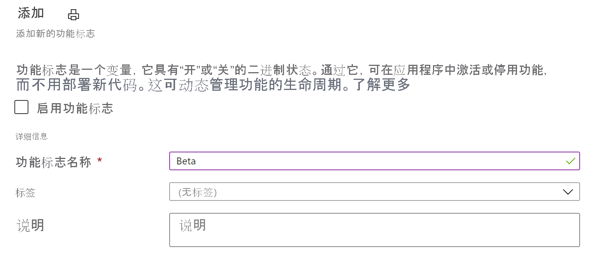

# <a name="quickstart-add-feature-flags-to-an-azure-functions-app"></a>快速入门：向 Azure Functions 应用添加功能标志

在该快速入门中，你将创建一个 Azure Functions 应用并在其中使用功能标志。 可使用 Azure 应用程序配置中的功能管理集中存储所有功能标志并控制其状态。

.NET 功能管理库使用功能标志支持扩展该框架。 这些库在 .NET 配置系统的基础上构建。 它们通过其 .NET 配置提供程序与应用程序配置集成。

## <a name="prerequisites"></a>先决条件

- Azure 订阅 - [创建免费帐户](https://azure.microsoft.com/free/)
- 包含 **Azure 开发** 工作负载的 [Visual Studio 2019](https://visualstudio.microsoft.com/vs)。
- [Azure Functions 工具](../azure-functions/functions-develop-vs.md#check-your-tools-version)

## <a name="create-an-app-configuration-store"></a>创建应用配置存储区

[!INCLUDE [azure-app-configuration-create](../../includes/azure-app-configuration-create.md)]

7. 选择“功能管理器” > “+添加”以添加名为 `Beta` 的功能标志。  

    > [!div class="mx-imgBorder"]
    > 

    暂时不定义 `label` 和 `Description`。

8. 选择“应用”  以保存新功能标志。

## <a name="create-a-functions-app"></a>创建 Functions 应用

[!INCLUDE [Create a project using the Azure Functions template](../../includes/functions-vstools-create.md)]

## <a name="connect-to-an-app-configuration-store"></a>连接到应用程序配置存储区

此项目将[ .NET Azure Functions 中使用依赖项注入](../azure-functions/functions-dotnet-dependency-injection.md)。 它将 Azure 应用程序配置添加为存储功能标志的额外配置源。

1. 右键单击项目，然后选择“管理 NuGet 包”  。 在“浏览”选项卡中，搜索以下 NuGet 包并将其添加到项目中。
   - [Microsoft.Extensions.Configuration.AzureAppConfiguration](https://www.nuget.org/packages/Microsoft.Extensions.Configuration.AzureAppConfiguration/) 版本 4.1.0 或更高版本
   - [Microsoft.FeatureManagement](https://www.nuget.org/packages/Microsoft.FeatureManagement/) 版本 2.2.0 或更高版本
   - [Microsoft.Azure.Functions.Extensions](https://www.nuget.org/packages/Microsoft.Azure.Functions.Extensions/) 版本 1.1.0 或更高版本 

2. 使用以下代码添加新文件 Startup.cs。 它定义了一个名为 `Startup` 的类，该类实现了 `FunctionsStartup` 抽象类。 程序集属性用于指定 Azure Functions 启动期间使用的类型名称。

    ```csharp
    using System;
    using Microsoft.Azure.Functions.Extensions.DependencyInjection;
    using Microsoft.Extensions.Configuration;
    using Microsoft.FeatureManagement;

    [assembly: FunctionsStartup(typeof(FunctionApp.Startup))]

    namespace FunctionApp
    {
        class Startup : FunctionsStartup
        {
            public override void ConfigureAppConfiguration(IFunctionsConfigurationBuilder builder)
            {
            }

            public override void Configure(IFunctionsHostBuilder builder)
            {
            }
        }
    }
    ```


3. 更新 `ConfigureAppConfiguration` 方法，并通过调用 `AddAzureAppConfiguration()` 将 Azure 应用程序配置提供程序添加为额外的配置源。 

   `UseFeatureFlags()` 方法告知提供程序加载功能标志。 在重新检查更改之前，所有功能标志的默认缓存过期时间为 30 秒。 可以通过设置传递给 `UseFeatureFlags` 方法的 `FeatureFlagsOptions.CacheExpirationInterval` 属性来更新过期时间间隔。 

    ```csharp
    public override void ConfigureAppConfiguration(IFunctionsConfigurationBuilder builder)
    {
        builder.ConfigurationBuilder.AddAzureAppConfiguration(options =>
        {
            options.Connect(Environment.GetEnvironmentVariable("ConnectionString"))
                   .Select("_")
                   .UseFeatureFlags();
        });
    }
    ```
   > [!TIP]
   > 如果不想将除功能标志以外的任何配置加载到应用程序中，可以调用 `Select("_")` 只加载不存在的伪键“_”。 默认情况下，如果未调用 `Select` 方法，则将加载应用程序配置存储中的所有配置键值。

4. 更新 `Configure` 方法，通过依赖项注入使 Azure 应用程序配置服务和功能管理器可用。

    ```csharp
    public override void Configure(IFunctionsHostBuilder builder)
    {
        builder.Services.AddAzureAppConfiguration();
        builder.Services.AddFeatureManagement();
    }
    ```

5. 打开 Function1.cs，并添加以下命名空间。

    ```csharp
    using System.Linq;
    using Microsoft.FeatureManagement;
    using Microsoft.Extensions.Configuration.AzureAppConfiguration;
    ```

   添加一个构造函数，用于通过依赖项注入获得 `_featureManagerSnapshot` 和 `IConfigurationRefresherProvider` 实例。 在 `IConfigurationRefresherProvider` 中，你可以获得 `IConfigurationRefresher` 的实例。

    ```csharp
    private readonly IFeatureManagerSnapshot _featureManagerSnapshot;
    private readonly IConfigurationRefresher _configurationRefresher;

    public Function1(IFeatureManagerSnapshot featureManagerSnapshot, IConfigurationRefresherProvider refresherProvider)
    {
        _featureManagerSnapshot = featureManagerSnapshot;
        _configurationRefresher = refresherProvider.Refreshers.First();
    }
    ```

6. 更新 `Run` 方法，根据功能标志的状态更改显示的消息的值。

   在函数调用开始时调用 `TryRefreshAsync` 方法以刷新功能标志。 如果未到达缓存过期时间范围，则将是一个 no-op 操作。 如果希望在不阻止当前函数调用的情况下刷新功能标志，请删除 `await` 运算符。 在这种情况下，以后的函数调用将获得更新的值。

    ```csharp
    [FunctionName("Function1")]
    public async Task<IActionResult> Run(
        [HttpTrigger(AuthorizationLevel.Anonymous, "get", "post", Route = null)] HttpRequest req,
        ILogger log)
    {
        log.LogInformation("C# HTTP trigger function processed a request.");

        await _configurationRefresher.TryRefreshAsync();

        string message = await _featureManagerSnapshot.IsEnabledAsync("Beta")
                ? "The Feature Flag 'Beta' is turned ON"
                : "The Feature Flag 'Beta' is turned OFF";

        return (ActionResult)new OkObjectResult(message);
    }
    ```

## <a name="test-the-function-locally"></a>在本地测试函数

1. 设置一个名为 ConnectionString 的环境变量，其中值是之前在“访问密钥”下的应用程序配置存储中检索到的连接字符串 。 如果使用 Windows 命令提示符，则请运行以下命令并重启命令提示符，这样更改才会生效：

    ```cmd
        setx ConnectionString "connection-string-of-your-app-configuration-store"
    ```

    如果使用 Windows PowerShell，请运行以下命令：

    ```azurepowershell
        $Env:ConnectionString = "connection-string-of-your-app-configuration-store"
    ```

    如果使用 macOS 或 Linux，则请运行以下命令：

    ```bash
        export ConnectionString='connection-string-of-your-app-configuration-store'
    ```

1. 按 F5 测试函数。 如果系统提示，请按 Visual Studio 的请求下载和安装 Azure Functions Core (CLI) 工具。 你还需要启用防火墙例外，这样工具才能处理 HTTP 请求。

1. 从 Azure Functions 运行时输出复制函数的 URL。

    

1. 将 HTTP 请求的 URL 粘贴到浏览器的地址栏。 下图显示了指出功能标志 `Beta` 已被禁用的响应。 

    

1. 登录 [Azure 门户](https://portal.azure.com)。 选择“所有资源”，然后选择你创建的应用程序配置存储区。

1. 选择“功能管理器”，将“Beta”密钥的状态更改为“启用”。

1. 多次刷新浏览器。 当缓存的功能标志在 30 秒后过期时，页面应该已经更改，以指示功能标志 `Beta` 已打开，如下图所示。
 
    

> [!NOTE]
> 本教程中使用的示例代码可从 [Azure 应用程序配置 GitHub 存储库](https://github.com/Azure/AppConfiguration/tree/master/examples/DotNetCore/AzureFunction)下载。

## <a name="clean-up-resources"></a>清理资源

[!INCLUDE [azure-app-configuration-cleanup](../../includes/azure-app-configuration-cleanup.md)]

## <a name="next-steps"></a>后续步骤

在本快速入门中，你创建了一个功能标志，并通过 [Microsoft.FeatureManagement](/dotnet/api/microsoft.featuremanagement) 库将它用于 Azure Functions 应用。

- 详细了解[功能管理](./concept-feature-management.md)
- [管理功能标志](./manage-feature-flags.md)
- [使用条件功能标志](./howto-feature-filters-aspnet-core.md)
- [为目标受众启用分阶段推出功能](./howto-targetingfilter-aspnet-core.md)
- [在 Azure Functions 应用中使用动态配置](./enable-dynamic-configuration-azure-functions-csharp.md)