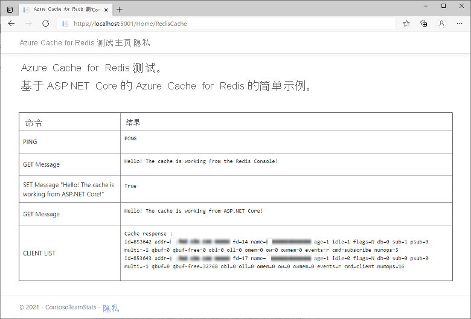

# <a name="quickstart-use-azure-cache-for-redis-with-an-aspnet-core-web-app"></a>快速入门：将 Azure Cache for Redis 与 ASP.NET Core Web 应用配合使用 

在本快速入门中，我们将 Azure Cache for Redis 引入到一个 ASP.NET Core Web 应用程序中，该应用程序会连接到 Azure Cache for Redis 以在缓存中存储和检索数据。

## <a name="skip-to-the-code-on-github"></a>跳到 GitHub 上的代码

如果要直接跳到代码，请参阅 GitHub 上的 [ASP.NET Core 快速入门](https://github.com/Azure-Samples/azure-cache-redis-samples/tree/main/quickstart/aspnet-core)。

## <a name="prerequisites"></a>先决条件

- Azure 订阅 - [创建免费帐户](https://azure.microsoft.com/free/)
- [.NET Core SDK](https://dotnet.microsoft.com/download)

## <a name="create-a-cache"></a>创建缓存

[!INCLUDE [redis-cache-create](includes/redis-cache-create.md)]

[!INCLUDE [redis-cache-access-keys](includes/redis-cache-access-keys.md)]

记下 **主机名** 和 **主** 访问密钥。 稍后将使用这些值来构造 *CacheConnection* 机密。

## <a name="create-an-aspnet-core-web-app"></a>创建一个 ASP.NET Core Web 应用

打开一个新的命令窗口并执行以下命令来创建新的 ASP.NET Core Web 应用 (Model-View-Controller)：

```dotnetcli
dotnet new mvc -o ContosoTeamStats
```

在命令窗口中，切换到新的“ContosoTeamStats”项目目录。

[!INCLUDE[Add Secret Manager support to an ASP.NET Core project](../../includes/azure-app-configuration-add-secret-manager.md)]

执行以下命令将 *Microsoft.Extensions.Configuration.UserSecrets* 包添加到项目：

```dotnetcli
dotnet add package Microsoft.Extensions.Configuration.UserSecrets
```

执行以下命令来还原包：

```dotnetcli
dotnet restore
```

在命令窗口中，在替换你的缓存名称和主访问密钥的占位符（包括尖括号）后，执行以下命令来存储名为 *CacheConnection* 的新机密：

```dotnetcli
dotnet user-secrets set CacheConnection "<cache name>.redis.cache.windows.net,abortConnect=false,ssl=true,allowAdmin=true,password=<primary-access-key>"
```

## <a name="configure-the-cache-client"></a>配置缓存客户端

在本部分，我们要将应用程序配置为使用适用于 .NET 的 [StackExchange.Redis](https://github.com/StackExchange/StackExchange.Redis) 客户端。

在命令窗口的“ContosoTeamStats”项目目录中执行以下命令：

```dotnetcli
dotnet add package StackExchange.Redis
```

完成安装后，*StackExchange.Redis* 缓存客户端可供与项目一起使用。

## <a name="update-the-homecontroller-and-layout"></a>更新 HomeController 和布局

将以下 `using` 语句添加到 Controllers\HomeController.cs：

```csharp
using System.Net.Sockets;
using System.Text;
using System.Threading;

using Microsoft.Extensions.Configuration;

using StackExchange.Redis;
```

将：

```csharp
private readonly ILogger<HomeController> _logger;

public HomeController(ILogger<HomeController> logger)
{
    _logger = logger;
}
```

替换为：

```csharp
private readonly ILogger<HomeController> _logger;
private static IConfiguration Configuration { get; set; }

public HomeController(ILogger<HomeController> logger, IConfiguration configuration)
{
    _logger = logger;
    if (Configuration == null)
        Configuration = configuration;
}
```

将以下成员添加到 `HomeController` 类，使之支持针对新缓存运行某些命令的新 `RedisCache` 操作。

```csharp
public ActionResult RedisCache()
{
    ViewBag.Message = "A simple example with Azure Cache for Redis on ASP.NET Core.";

    IDatabase cache = GetDatabase();

    // Perform cache operations using the cache object...

    // Simple PING command
    ViewBag.command1 = "PING";
    ViewBag.command1Result = cache.Execute(ViewBag.command1).ToString();

    // Simple get and put of integral data types into the cache
    ViewBag.command2 = "GET Message";
    ViewBag.command2Result = cache.StringGet("Message").ToString();

    ViewBag.command3 = "SET Message \"Hello! The cache is working from ASP.NET Core!\"";
    ViewBag.command3Result = cache.StringSet("Message", "Hello! The cache is working from ASP.NET Core!").ToString();

    // Demonstrate "SET Message" executed as expected...
    ViewBag.command4 = "GET Message";
    ViewBag.command4Result = cache.StringGet("Message").ToString();

    // Get the client list, useful to see if connection list is growing...
    // Note that this requires allowAdmin=true in the connection string
    ViewBag.command5 = "CLIENT LIST";
    StringBuilder sb = new StringBuilder();
    var endpoint = (System.Net.DnsEndPoint)GetEndPoints()[0];
    IServer server = GetServer(endpoint.Host, endpoint.Port);
    ClientInfo[] clients = server.ClientList();

    sb.AppendLine("Cache response :");
    foreach (ClientInfo client in clients)
    {
        sb.AppendLine(client.Raw);
    }

    ViewBag.command5Result = sb.ToString();

    return View();
}

private const string SecretName = "CacheConnection";

private static long lastReconnectTicks = DateTimeOffset.MinValue.UtcTicks;
private static DateTimeOffset firstErrorTime = DateTimeOffset.MinValue;
private static DateTimeOffset previousErrorTime = DateTimeOffset.MinValue;

private static readonly object reconnectLock = new object();

// In general, let StackExchange.Redis handle most reconnects,
// so limit the frequency of how often ForceReconnect() will
// actually reconnect.
public static TimeSpan ReconnectMinFrequency => TimeSpan.FromSeconds(60);

// If errors continue for longer than the below threshold, then the
// multiplexer seems to not be reconnecting, so ForceReconnect() will
// re-create the multiplexer.
public static TimeSpan ReconnectErrorThreshold => TimeSpan.FromSeconds(30);

public static int RetryMaxAttempts => 5;

private static Lazy<ConnectionMultiplexer> lazyConnection = CreateConnection();

public static ConnectionMultiplexer Connection
{
    get
    {
        return lazyConnection.Value;
    }
}

private static Lazy<ConnectionMultiplexer> CreateConnection()
{
    return new Lazy<ConnectionMultiplexer>(() =>
    {
        string cacheConnection = Configuration[SecretName];
        return ConnectionMultiplexer.Connect(cacheConnection);
    });
}

private static void CloseConnection(Lazy<ConnectionMultiplexer> oldConnection)
{
    if (oldConnection == null)
        return;

    try
    {
        oldConnection.Value.Close();
    }
    catch (Exception)
    {
        // Example error condition: if accessing oldConnection.Value causes a connection attempt and that fails.
    }
}

/// <summary>
/// Force a new ConnectionMultiplexer to be created.
/// NOTES:
///     1. Users of the ConnectionMultiplexer MUST handle ObjectDisposedExceptions, which can now happen as a result of calling ForceReconnect().
///     2. Don't call ForceReconnect for Timeouts, just for RedisConnectionExceptions or SocketExceptions.
///     3. Call this method every time you see a connection exception. The code will:
///         a. wait to reconnect for at least the "ReconnectErrorThreshold" time of repeated errors before actually reconnecting
///         b. not reconnect more frequently than configured in "ReconnectMinFrequency"
/// </summary>
public static void ForceReconnect()
{
    var utcNow = DateTimeOffset.UtcNow;
    long previousTicks = Interlocked.Read(ref lastReconnectTicks);
    var previousReconnectTime = new DateTimeOffset(previousTicks, TimeSpan.Zero);
    TimeSpan elapsedSinceLastReconnect = utcNow - previousReconnectTime;

    // If multiple threads call ForceReconnect at the same time, we only want to honor one of them.
    if (elapsedSinceLastReconnect < ReconnectMinFrequency)
        return;

    lock (reconnectLock)
    {
        utcNow = DateTimeOffset.UtcNow;
        elapsedSinceLastReconnect = utcNow - previousReconnectTime;

        if (firstErrorTime == DateTimeOffset.MinValue)
        {
            // We haven't seen an error since last reconnect, so set initial values.
            firstErrorTime = utcNow;
            previousErrorTime = utcNow;
            return;
        }

        if (elapsedSinceLastReconnect < ReconnectMinFrequency)
            return; // Some other thread made it through the check and the lock, so nothing to do.

        TimeSpan elapsedSinceFirstError = utcNow - firstErrorTime;
        TimeSpan elapsedSinceMostRecentError = utcNow - previousErrorTime;

        bool shouldReconnect =
            elapsedSinceFirstError >= ReconnectErrorThreshold // Make sure we gave the multiplexer enough time to reconnect on its own if it could.
            && elapsedSinceMostRecentError <= ReconnectErrorThreshold; // Make sure we aren't working on stale data (e.g. if there was a gap in errors, don't reconnect yet).

        // Update the previousErrorTime timestamp to be now (e.g. this reconnect request).
        previousErrorTime = utcNow;

        if (!shouldReconnect)
            return;

        firstErrorTime = DateTimeOffset.MinValue;
        previousErrorTime = DateTimeOffset.MinValue;

        Lazy<ConnectionMultiplexer> oldConnection = lazyConnection;
        CloseConnection(oldConnection);
        lazyConnection = CreateConnection();
        Interlocked.Exchange(ref lastReconnectTicks, utcNow.UtcTicks);
    }
}

// In real applications, consider using a framework such as
// Polly to make it easier to customize the retry approach.
private static T BasicRetry<T>(Func<T> func)
{
    int reconnectRetry = 0;
    int disposedRetry = 0;

    while (true)
    {
        try
        {
            return func();
        }
        catch (Exception ex) when (ex is RedisConnectionException || ex is SocketException)
        {
            reconnectRetry++;
            if (reconnectRetry > RetryMaxAttempts)
                throw;
            ForceReconnect();
        }
        catch (ObjectDisposedException)
        {
            disposedRetry++;
            if (disposedRetry > RetryMaxAttempts)
                throw;
        }
    }
}

public static IDatabase GetDatabase()
{
    return BasicRetry(() => Connection.GetDatabase());
}

public static System.Net.EndPoint[] GetEndPoints()
{
    return BasicRetry(() => Connection.GetEndPoints());
}

public static IServer GetServer(string host, int port)
{
    return BasicRetry(() => Connection.GetServer(host, port));
}
```

打开 Views\Shared\\_Layout.cshtml。

将：

```cshtml
<a class="navbar-brand" asp-area="" asp-controller="Home" asp-action="Index">ContosoTeamStats</a>
```

替换为：

```cshtml
<a class="navbar-brand" asp-area="" asp-controller="Home" asp-action="RedisCache">Azure Cache for Redis Test</a>
```

## <a name="add-a-new-rediscache-view-and-update-the-styles"></a>添加新的 RedisCache 视图并更新样式

创建新文件 Views\Home\RedisCache.cshtml，其中包含以下内容：

```cshtml
@{
    ViewBag.Title = "Azure Cache for Redis Test";
}

<h2>@ViewBag.Title.</h2>
<h3>@ViewBag.Message</h3>
<br /><br />
<table border="1" cellpadding="10" class="redis-results">
    <tr>
        <th>Command</th>
        <th>Result</th>
    </tr>
    <tr>
        <td>@ViewBag.command1</td>
        <td><pre>@ViewBag.command1Result</pre></td>
    </tr>
    <tr>
        <td>@ViewBag.command2</td>
        <td><pre>@ViewBag.command2Result</pre></td>
    </tr>
    <tr>
        <td>@ViewBag.command3</td>
        <td><pre>@ViewBag.command3Result</pre></td>
    </tr>
    <tr>
        <td>@ViewBag.command4</td>
        <td><pre>@ViewBag.command4Result</pre></td>
    </tr>
    <tr>
        <td>@ViewBag.command5</td>
        <td><pre>@ViewBag.command5Result</pre></td>
    </tr>
</table>
```

将以下行添加到 wwwroot\css\site.css：

```css
.redis-results pre {
  white-space: pre-wrap;
}
```

## <a name="run-the-app-locally"></a>在本地运行应用

在命令窗口中执行以下命令来生成应用：

```dotnetcli
dotnet build
```

然后，使用以下命令来运行应用：

```dotnetcli
dotnet run
```

在 Web 浏览器中浏览到 `https://localhost:5001`。

在网页的导航栏中选择“Azure Cache for Redis 测试”，以测试缓存访问。

在下面的示例中，可以看到 `Message` 键以前有一个缓存值，该值是使用 Azure 门户中的 Redis 控制台设置的。 应用更新了该缓存值。 应用还执行了 `PING` 和 `CLIENT LIST` 命令。



## <a name="clean-up-resources"></a>清理资源

如果想要继续学习下一篇教程，可以保留本快速入门中创建的资源，以便重复使用。

如果已完成快速入门示例应用程序，可以删除本快速入门中创建的 Azure 资源，以免产生费用。

> [!IMPORTANT]
> 删除资源组的操作不可逆。 删除资源组时，包含在其中的所有资源会被永久删除。 请确保不会意外删除错误的资源组或资源。 如果在现有资源组（其中包含要保留的资源）中为托管此示例而创建了相关资源，可从左侧逐个删除这些资源，而不是删除资源组。

### <a name="to-delete-a-resource-group"></a>删除资源组的步骤

1. 登录到 [Azure 门户](https://portal.azure.com)，然后选择“资源组”。

2. 在“按名称筛选...”框中键入资源组的名称。 本文的说明使用了名为 *TestResources* 的资源组。 在资源组的结果列表中选择“...”，然后选择“删除资源组” 。

    

系统会要求确认是否删除资源组。 键入资源组的名称进行确认，然后选择“删除”。

片刻之后，将会删除该资源组及其所有资源。

## <a name="next-steps"></a>后续步骤

若要了解如何部署到 Azure，请参阅：

> [!div class="nextstepaction"]
> [教程：在 Azure 应用服务中生成 ASP.NET Core 和 SQL 数据库应用](../app-service/tutorial-dotnetcore-sqldb-app.md)

若要了解如何将缓存连接机密存储在 Azure Key Vault 中，请参阅：

> [!div class="nextstepaction"]
> [ASP.NET Core 中的 Azure Key Vault 配置提供程序](/aspnet/core/security/key-vault-configuration)

想要将缓存从较低层级扩展到较高层级？

> [!div class="nextstepaction"]
> [如何缩放用于 Redis 的 Azure 缓存](./cache-how-to-scale.md)

希望优化并节省云支出？

> [!div class="nextstepaction"]
> [使用成本管理开始分析成本](../cost-management-billing/costs/quick-acm-cost-analysis.md?WT.mc_id=costmanagementcontent_docsacmhorizontal_-inproduct-learn)