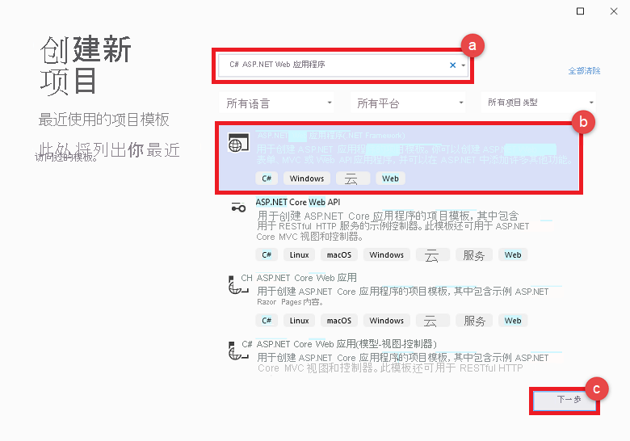

# <a name="quickstart-use-azure-cache-for-redis-with-an-aspnet-web-app"></a>快速入门：将 Azure Redis 缓存与 ASP.NET Web 应用配合使用

在本快速入门中，将使用 Visual Studio 2019 创建一个 ASP.NET Web 应用程序，该应用程序连接到 Azure Redis 缓存以存储和检索缓存中的数据。 然后，将该应用部署到 Azure 应用服务。

## <a name="skip-to-the-code-on-github"></a>跳到 GitHub 上的代码

如果要直接跳到代码，请参阅 GitHub 上的 [ASP.NET 快速入门](https://github.com/Azure-Samples/azure-cache-redis-samples/tree/main/quickstart/aspnet)。

## <a name="prerequisites"></a>先决条件

- Azure 订阅 - [创建免费帐户](https://azure.microsoft.com/free/dotnet)
- [Visual Studio 2019](https://www.visualstudio.com/downloads/)，其中包含 **ASP.NET 和 Web 开发** 以及 **Azure 开发** 工作负载。

## <a name="create-the-visual-studio-project"></a>创建 Visual Studio 项目

1. 打开 Visual Studio，然后选择“文件” > “新建” > “项目”。  

2. 在“创建新项目”对话框中执行以下步骤：

    

    a. 在搜索框中，输入 _C# ASP.NET Web 应用程序_。

    b. 选择“ASP.NET Web 应用程序(.NET Framework)”。

    c. 选择“下一步”。

3. 在“项目名称”框中，为项目提供一个名称。 在此示例中，我们使用了 **ContosoTeamStats**。

4. 验证是否已选择“.NET Framework 4.6.1”或更高版本。

5. 选择“创建”。

6. 选择“MVC”作为项目类型。

7. 对于“身份验证”设置，请确保指定“不进行身份验证”。  默认的“身份验证”设置可能因 Visual Studio 版本而异。 若要对其进行更改，请选择“更改身份验证”，然后选择“不进行身份验证”。 

8. 选择“创建”来创建项目。

## <a name="create-a-cache"></a>创建缓存

接下来，为应用创建缓存。

[!INCLUDE [redis-cache-create](includes/redis-cache-create.md)]

[!INCLUDE [redis-cache-access-keys](includes/redis-cache-access-keys.md)]

### <a name="to-edit-the-cachesecretsconfig-file"></a>编辑 *CacheSecrets.config* 文件的步骤

1. 在计算机上创建名为 *CacheSecrets.config* 的文件。将其放到不会连同示例应用程序的源代码一起签入的位置。 在本快速入门中，*CacheSecrets.config* 文件的路径为 *C:\AppSecrets\CacheSecrets.config*。

1. 编辑 *CacheSecrets.config* 文件。 然后添加以下内容：

    ```xml
    <appSettings>
        <add key="CacheConnection" value="<cache-name>.redis.cache.windows.net,abortConnect=false,ssl=true,allowAdmin=true,password=<access-key>"/>
    </appSettings>
    ```

1. 将 `<cache-name>` 替换为缓存主机名。

1. 将 `<access-key>` 替换缓存的主密钥。

    > [!TIP]
    > 在密钥轮换期间重新生成主访问密钥时，可以将辅助访问密钥用作备用密钥。
   >
1. 保存文件。

## <a name="update-the-mvc-application"></a>更新 MVC 应用程序

在本部分，请对应用程序进行更新，使之支持一个新视图，该视图显示针对 Azure Redis 缓存执行的一项简单测试。

- [使用缓存的应用设置更新 web.config 文件](#update-the-webconfig-file-with-an-app-setting-for-the-cache)
- 将应用程序配置为使用 StackExchange.Redis 客户端
- 更新 HomeController 和布局
- 添加新的 RedisCache 视图

### <a name="update-the-webconfig-file-with-an-app-setting-for-the-cache"></a>使用缓存的应用设置更新 web.config 文件

在本地运行应用程序时，将使用 CacheSecrets.config 中的信息连接到 Azure Redis 缓存实例。 稍后请将此应用程序部署到 Azure。 到时，请在 Azure 中配置一项应用设置，供应用程序用来检索缓存连接信息而不是此文件。

由于 *CacheSecrets.config* 文件未连同应用程序一起部署到 Azure，因此，只是在本地测试应用程序时才使用此文件。 请尽量安全地保管此信息，防止有人恶意访问缓存数据。

#### <a name="to-update-the-webconfig-file"></a>更新 *web.config* 文件的步骤

1. 在“解决方案资源管理器”中，双击“web.config”文件将其打开。

    

2. 在 *web.config* 文件中找到 `<appSetting>` 元素。 然后添加以下 `file` 属性。 如果使用了其他文件名或位置，请使用这些值来替换示例中显示的值。

- 之前： `<appSettings>`
- 之后：`<appSettings file="C:\AppSecrets\CacheSecrets.config">`

ASP.NET 运行时合并了外部文件的内容以及 `<appSettings>` 元素中的标记。 如果找不到指定的文件，运行时会忽略文件属性。 应用程序的源代码中将不包括机密（连接到缓存的连接字符串）。 将 Web 应用部署到 Azure 时，不会部署 CacheSecrets.config 文件。

### <a name="to-configure-the-application-to-use-stackexchangeredis"></a>将应用程序配置为使用 StackExchange.Redis 的步骤

1. 若要将应用配置为使用 Visual Studio 的 [StackExchange.Redis](https://github.com/StackExchange/StackExchange.Redis) NuGet 包，请选择“工具”>“NuGet 包管理器”>“包管理器控制台”。

2. 从 `Package Manager Console` 窗口运行以下命令：

    ```powershell
    Install-Package StackExchange.Redis
    ```

3. NuGet 程序包会为客户端应用程序下载并添加所需的程序集引用，以通过 StackExchange.Azure Redis 缓存客户端访问 Azure Redis 缓存。 如果更愿使用强命名版本的 `StackExchange.Redis` 客户端库，请安装 `StackExchange.Redis` 包。

### <a name="to-update-the-homecontroller-and-layout"></a>更新 HomeController 和布局的步骤

1. 在“解决方案资源管理器”中展开“Controllers”文件夹，然后打开“HomeController.cs”文件。 

2. 在文件的顶部，添加以下 `using` 语句。

    ```csharp
    using StackExchange.Redis;
    using System.Configuration;
    using System.Net.Sockets;
    using System.Text;
    using System.Threading;
    ```

3. 将以下成员添加到 `HomeController` 类，使之支持针对新缓存运行某些命令的新 `RedisCache` 操作。

    ```csharp
    public ActionResult RedisCache()
    {
        ViewBag.Message = "A simple example with Azure Cache for Redis on ASP.NET.";

        IDatabase cache = GetDatabase();

        // Perform cache operations using the cache object...

        // Simple PING command
        ViewBag.command1 = "PING";
        ViewBag.command1Result = cache.Execute(ViewBag.command1).ToString();

        // Simple get and put of integral data types into the cache
        ViewBag.command2 = "GET Message";
        ViewBag.command2Result = cache.StringGet("Message").ToString();

        ViewBag.command3 = "SET Message \"Hello! The cache is working from ASP.NET!\"";
        ViewBag.command3Result = cache.StringSet("Message", "Hello! The cache is working from ASP.NET!").ToString();

        // Demonstrate "SET Message" executed as expected...
        ViewBag.command4 = "GET Message";
        ViewBag.command4Result = cache.StringGet("Message").ToString();

        // Get the client list, useful to see if connection list is growing...
        // Note that this requires allowAdmin=true in the connection string
        ViewBag.command5 = "CLIENT LIST";
        StringBuilder sb = new StringBuilder();
        var endpoint = (System.Net.DnsEndPoint)GetEndPoints()[0];
        IServer server = GetServer(endpoint.Host, endpoint.Port);
        ClientInfo[] clients = server.ClientList();

        sb.AppendLine("Cache response :");
        foreach (ClientInfo client in clients)
        {
            sb.AppendLine(client.Raw);
        }

        ViewBag.command5Result = sb.ToString();

        return View();
    }

    private static long lastReconnectTicks = DateTimeOffset.MinValue.UtcTicks;
    private static DateTimeOffset firstErrorTime = DateTimeOffset.MinValue;
    private static DateTimeOffset previousErrorTime = DateTimeOffset.MinValue;

    private static readonly object reconnectLock = new object();

    // In general, let StackExchange.Redis handle most reconnects,
    // so limit the frequency of how often ForceReconnect() will
    // actually reconnect.
    public static TimeSpan ReconnectMinFrequency => TimeSpan.FromSeconds(60);

    // If errors continue for longer than the below threshold, then the
    // multiplexer seems to not be reconnecting, so ForceReconnect() will
    // re-create the multiplexer.
    public static TimeSpan ReconnectErrorThreshold => TimeSpan.FromSeconds(30);

    public static int RetryMaxAttempts => 5;

    private static Lazy<ConnectionMultiplexer> lazyConnection = CreateConnection();

    public static ConnectionMultiplexer Connection
    {
        get
        {
            return lazyConnection.Value;
        }
    }

    private static Lazy<ConnectionMultiplexer> CreateConnection()
    {
        return new Lazy<ConnectionMultiplexer>(() =>
        {
            string cacheConnection = ConfigurationManager.AppSettings["CacheConnection"].ToString();
            return ConnectionMultiplexer.Connect(cacheConnection);
        });
    }

    private static void CloseConnection(Lazy<ConnectionMultiplexer> oldConnection)
    {
        if (oldConnection == null)
            return;

        try
        {
            oldConnection.Value.Close();
        }
        catch (Exception)
        {
            // Example error condition: if accessing oldConnection.Value causes a connection attempt and that fails.
        }
    }

    /// <summary>
    /// Force a new ConnectionMultiplexer to be created.
    /// NOTES:
    ///     1. Users of the ConnectionMultiplexer MUST handle ObjectDisposedExceptions, which can now happen as a result of calling ForceReconnect().
    ///     2. Don't call ForceReconnect for Timeouts, just for RedisConnectionExceptions or SocketExceptions.
    ///     3. Call this method every time you see a connection exception. The code will:
    ///         a. wait to reconnect for at least the "ReconnectErrorThreshold" time of repeated errors before actually reconnecting
    ///         b. not reconnect more frequently than configured in "ReconnectMinFrequency"
    /// </summary>
    public static void ForceReconnect()
    {
        var utcNow = DateTimeOffset.UtcNow;
        long previousTicks = Interlocked.Read(ref lastReconnectTicks);
        var previousReconnectTime = new DateTimeOffset(previousTicks, TimeSpan.Zero);
        TimeSpan elapsedSinceLastReconnect = utcNow - previousReconnectTime;

        // If multiple threads call ForceReconnect at the same time, we only want to honor one of them.
        if (elapsedSinceLastReconnect < ReconnectMinFrequency)
            return;

        lock (reconnectLock)
        {
            utcNow = DateTimeOffset.UtcNow;
            elapsedSinceLastReconnect = utcNow - previousReconnectTime;

            if (firstErrorTime == DateTimeOffset.MinValue)
            {
                // We haven't seen an error since last reconnect, so set initial values.
                firstErrorTime = utcNow;
                previousErrorTime = utcNow;
                return;
            }

            if (elapsedSinceLastReconnect < ReconnectMinFrequency)
                return; // Some other thread made it through the check and the lock, so nothing to do.

            TimeSpan elapsedSinceFirstError = utcNow - firstErrorTime;
            TimeSpan elapsedSinceMostRecentError = utcNow - previousErrorTime;

            bool shouldReconnect =
                elapsedSinceFirstError >= ReconnectErrorThreshold // Make sure we gave the multiplexer enough time to reconnect on its own if it could.
                && elapsedSinceMostRecentError <= ReconnectErrorThreshold; // Make sure we aren't working on stale data (e.g. if there was a gap in errors, don't reconnect yet).

            // Update the previousErrorTime timestamp to be now (e.g. this reconnect request).
            previousErrorTime = utcNow;

            if (!shouldReconnect)
                return;

            firstErrorTime = DateTimeOffset.MinValue;
            previousErrorTime = DateTimeOffset.MinValue;

            Lazy<ConnectionMultiplexer> oldConnection = lazyConnection;
            CloseConnection(oldConnection);
            lazyConnection = CreateConnection();
            Interlocked.Exchange(ref lastReconnectTicks, utcNow.UtcTicks);
        }
    }

    // In real applications, consider using a framework such as
    // Polly to make it easier to customize the retry approach.
    private static T BasicRetry<T>(Func<T> func)
    {
        int reconnectRetry = 0;
        int disposedRetry = 0;

        while (true)
        {
            try
            {
                return func();
            }
            catch (Exception ex) when (ex is RedisConnectionException || ex is SocketException)
            {
                reconnectRetry++;
                if (reconnectRetry > RetryMaxAttempts)
                    throw;
                ForceReconnect();
            }
            catch (ObjectDisposedException)
            {
                disposedRetry++;
                if (disposedRetry > RetryMaxAttempts)
                    throw;
            }
        }
    }

    public static IDatabase GetDatabase()
    {
        return BasicRetry(() => Connection.GetDatabase());
    }

    public static System.Net.EndPoint[] GetEndPoints()
    {
        return BasicRetry(() => Connection.GetEndPoints());
    }

    public static IServer GetServer(string host, int port)
    {
        return BasicRetry(() => Connection.GetServer(host, port));
    }
    ```

4. 在 **解决方案资源管理器** 中，展开“视图” > “共享”文件夹。  然后打开 *_Layout.cshtml* 文件。

    将：

    ```csharp
    @Html.ActionLink("Application name", "Index", "Home", new { area = "" }, new { @class = "navbar-brand" })
    ```

    替换为：

    ```csharp
    @Html.ActionLink("Azure Cache for Redis Test", "RedisCache", "Home", new { area = "" }, new { @class = "navbar-brand" })
    ```

### <a name="to-add-a-new-rediscache-view"></a>添加新 RedisCache 视图的步骤

1. 在“解决方案资源管理器”中，展开“Views”文件夹，并右键单击“Home”文件夹。   选择“添加” > “视图...”。 

2. 在“添加视图”对话框中，输入 **RedisCache** 作为视图名称。 然后选择“添加”。

3. 将 *RedisCache.cshtml* 文件中的代码替换为以下代码：

    ```csharp
    @{
        ViewBag.Title = "Azure Cache for Redis Test";
    }

    <h2>@ViewBag.Title.</h2>
    <h3>@ViewBag.Message</h3>
    <br /><br />
    <table border="1" cellpadding="10">
        <tr>
            <th>Command</th>
            <th>Result</th>
        </tr>
        <tr>
            <td>@ViewBag.command1</td>
            <td><pre>@ViewBag.command1Result</pre></td>
        </tr>
        <tr>
            <td>@ViewBag.command2</td>
            <td><pre>@ViewBag.command2Result</pre></td>
        </tr>
        <tr>
            <td>@ViewBag.command3</td>
            <td><pre>@ViewBag.command3Result</pre></td>
        </tr>
        <tr>
            <td>@ViewBag.command4</td>
            <td><pre>@ViewBag.command4Result</pre></td>
        </tr>
        <tr>
            <td>@ViewBag.command5</td>
            <td><pre>@ViewBag.command5Result</pre></td>
        </tr>
    </table>
    ```

## <a name="run-the-app-locally"></a>在本地运行应用

默认情况下，项目配置为在 [IIS Express](/iis/extensions/introduction-to-iis-express/iis-express-overview) 本地托管应用，以进行测试和调试。

### <a name="to-run-the-app-locally"></a>在本地运行应用的步骤

1. 在 Visual Studio 中选择“调试” > “开始调试”，在本地生成并启动用于测试和调试的应用。 

2. 在浏览器中，选择导航栏上的“Azure Redis 缓存测试”。

3. 在下面的示例中，`Message` 键以前有一个缓存值，该值是在门户中使用 Azure Redis 缓存控制台设置的。 应用更新了该缓存值。 应用还执行了 `PING` 和 `CLIENT LIST` 命令。

    

## <a name="publish-and-run-in-azure"></a>在 Azure 中发布和运行

在本地成功测试应用后，即可将应用部署到 Azure 并在云中运行它。

### <a name="to-publish-the-app-to-azure"></a>将应用发布到 Azure 的步骤

1. 在 Visual Studio 中右键单击解决方案资源管理器中的项目节点， 然后选择“发布”。

    

2. 依次选择“Microsoft Azure 应用服务”、“新建”、“发布”。  

    

3. 在“创建应用服务”对话框中进行以下更改：

    | 设置 | 建议的值 | 说明 |
    | ------- | :---------------: | ----------- |
    | **应用名称** | 使用默认值。 | 应用名称是应用部署到 Azure 时对应的主机名。 如果需要让该名称保持唯一，可在其后添加一个时间戳后缀。 |
    | **订阅** | 选择自己的 Azure 订阅。 | 将对此订阅收取任何相关的托管费用。 如果有多个 Azure 订阅，请验证是否选择了所需的订阅。|
    | **资源组** | 使用在其中创建了此缓存的资源组（例如，*TestResourceGroup*）。 | 该资源组用于将所有资源作为一个组管理。 以后想要删除此应用时，可以直接删除该组。 |
    | **应用服务计划** | 选择“新建”，然后创建名为 *TestingPlan* 的新应用服务计划。 <br />使用创建缓存时所用的相同 **位置**。 <br />选择“免费”作为大小。 | 应用服务计划为要运行的 Web 应用定义一组计算资源。 |

    

4. 配置应用服务托管设置以后，请选择“创建”。

5. 监视 Visual Studio 中的“输出”窗口，了解发布状态。 发布应用后，系统会记录应用的 URL：

    

### <a name="add-the-app-setting-for-the-cache"></a>为缓存添加应用设置

发布新应用以后，请添加新应用设置。 此设置用于存储缓存连接信息。

#### <a name="to-add-the-app-setting"></a>添加应用设置的步骤

1. 在 Azure 门户顶部的搜索栏中键入应用名称，查找刚创建的新应用。

    

2. 为应用添加名为 **CacheConnection** 的新应用设置，用于连接到缓存。 使用在 *CacheSecrets.config* 文件中为 `CacheConnection` 配置的相同值。 该值包含缓存主机名和访问密钥。

    

### <a name="run-the-app-in-azure"></a>在 Azure 中运行应用

在浏览器中，转到应用的 URL。 该 URL 显示在 Visual Studio 输出窗口的发布操作结果中。 此外，在 Azure 门户中，所创建应用的概览页上也提供了该 URL。

选择导航栏上的“Azure Redis 缓存测试”以测试缓存访问。


## <a name="clean-up-resources"></a>清理资源

如果想要继续学习下一篇教程，可以保留本快速入门中创建的资源，以便重复使用。

如果已完成快速入门示例应用程序，可以删除本快速入门中创建的 Azure 资源，以免产生费用。

> [!IMPORTANT]
> 删除资源组的操作不可逆。 删除资源组时，包含在其中的所有资源会被永久删除。 请确保不会意外删除错误的资源组或资源。 如果在现有资源组（其中包含要保留的资源）中为托管此示例而创建了相关资源，可从左侧逐个删除这些资源，而不是删除资源组。

### <a name="to-delete-a-resource-group"></a>删除资源组的步骤

1. 登录到 [Azure 门户](https://portal.azure.com)，然后选择“资源组”。

2. 在“按名称筛选...”框中键入资源组的名称。 本文的说明使用了名为 *TestResources* 的资源组。 在资源组的结果列表中选择“...”，然后选择“删除资源组” 。

    

系统会要求确认是否删除资源组。 键入资源组的名称进行确认，然后选择“删除”。

片刻之后，将会删除该资源组及其所有资源。

## <a name="next-steps"></a>后续步骤

下一个教程会在一个更真实的场景中使用 Azure Redis 缓存来改善应用的性能。 请更新此应用程序，以便使用 ASP.NET 和数据库的缓存端模式来缓存排行榜结果。

> [!div class="nextstepaction"]
> [在 ASP.NET 中创建缓存端排行榜](cache-web-app-cache-aside-leaderboard.md)
