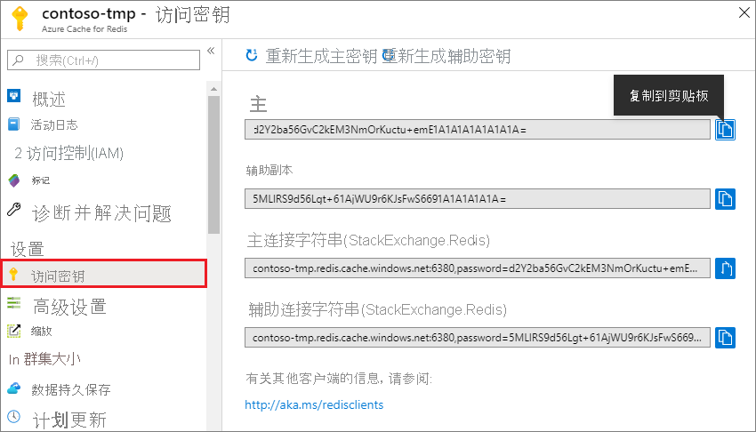
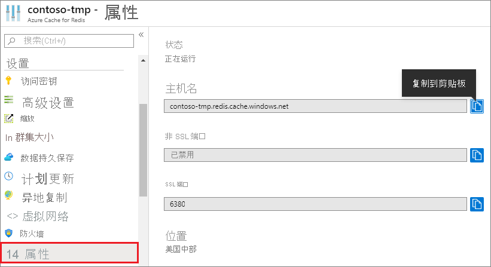

### 从 Azure 门户检索主机名、端口和访问密钥

若要连接到某个 Azure Cache for Redis 实例，缓存客户端需要该缓存的主机名、端口和密钥。 在某些客户端中，这些项的名称可能略有不同。 可以从 [Azure 门户](https://portal.azure.com)检索主机名、端口和访问密钥。

- 若要获取访问密钥，请在缓存的左侧导航中选择“访问密钥”。  
  
  

- 若要获取主机名和端口，请在缓存的左侧导航栏中选择“属性”。  主机名的格式为 \<DNS name>.redis.cache.windows.net。

  

