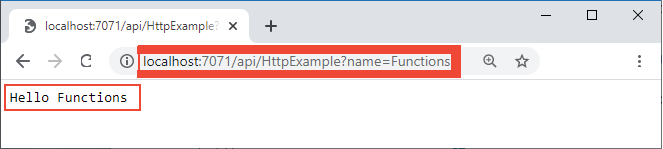
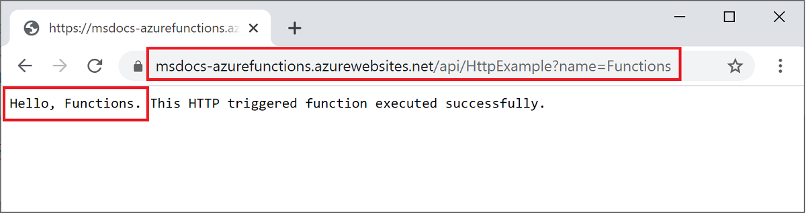

# <a name="quickstart-create-a-python-function-in-azure-from-the-command-line"></a>快速入门：在 Azure 中通过命令行创建 Python 函数

> [!div class="op_single_selector" title1="选择你的函数语言： "]
> - [Python](create-first-function-cli-python.md)
> - [C#](create-first-function-cli-csharp.md)
> - [Java](create-first-function-cli-java.md)
> - [JavaScript](create-first-function-cli-node.md)
> - [PowerShell](create-first-function-cli-powershell.md)
> - [TypeScript](create-first-function-cli-typescript.md)

在本文中，你将使用命令行工具创建响应 HTTP 请求的 Python 函数。 在本地测试代码之后，将其部署到 Azure Functions 的 <abbr title="一种运行时计算环境，其中服务器的所有详细信息对应用程序开发人员来说都是透明的，这简化了部署和管理代码的过程。">无服务器</abbr> 环境 <abbr title="为应用程序提供低成本无服务器计算环境的 Azure 服务。">Azure Functions</abbr>.

完成本快速入门会从你的 Azure 帐户中扣取最多几美分的费用。

本文还提供了[基于 Visual Studio 代码的版本](create-first-function-vs-code-python.md)。

## <a name="1-configure-your-environment"></a>1.配置环境

在开始之前，必须满足以下条件：

+ 具有有效订阅的 Azure <abbr title="用于维护 Azure 使用情况计费信息的配置文件。">account</abbr> 帐户 <abbr title="在 Azure 中管理资源的基本组织结构，通常与组织中的个人或部门相关联。">订阅</abbr>. [免费创建帐户](https://azure.microsoft.com/free/?ref=microsoft.com&utm_source=microsoft.com&utm_medium=docs&utm_campaign=visualstudio)。

+ [Azure Functions Core Tools](functions-run-local.md#v2) 版本 3.x。 
  
+ 使用 <abbr title="一组跨平台命令行工具，用于在本地开发计算机中使用 Azure 资源，是使用 Azure 门户的替代方法。">Azure CLI</abbr> 或 <abbr title="一个 PowerShell 模块，提供用于在本地开发计算机中使用 Azure 资源的命令，是使用 Azure 门户的替代方法。">Azure PowerShell</abbr> 创建 Azure 资源：

    + [Azure CLI](/cli/azure/install-azure-cli) 版本 2.4 或更高版本。

    + [Azure PowerShell](/powershell/azure/install-az-ps) 版本 5.0 或更高版本。

+ 版本 3.x 的 Azure Functions 支持的 [Python 3.8（64 位）](https://www.python.org/downloads/release/python-382/)、[Python 3.7（64 位）](https://www.python.org/downloads/release/python-375/)、[Python 3.6（64 位）](https://www.python.org/downloads/release/python-368/)。

### <a name="11-prerequisite-check"></a>1.1 先决条件检查

验证你的先决条件，这取决于你是使用 Azure CLI 还是使用 Azure PowerShell 创建 Azure 资源：

# <a name="azure-cli"></a>[Azure CLI](#tab/azure-cli)

+ 在终端或命令窗口中，运行 `func --version` 以查看 <abbr title="用于在本地计算机上使用 Azure Functions 的命令行工具集。">Azure Functions Core Tools</abbr> 的版本是否为 3.x。

+ 运行 `az --version` 以检查 Azure CLI 版本是否为 2.4 或更高版本。

+ 运行 `az login` 登录到 Azure 并验证活动订阅。

+ 运行 `python --version` (Linux/macOS) 或 `py --version` (Windows)，以检查 Python 版本是否报告 3.8.x、3.7.x 或 3.6.x。

# <a name="azure-powershell"></a>[Azure PowerShell](#tab/azure-powershell)

+ 在终端或命令窗口中，运行 `func --version` 以查看 <abbr title="用于在本地计算机上使用 Azure Functions 的命令行工具集。">Azure Functions Core Tools</abbr> 的版本是否为 3.x。

+ 运行 `(Get-Module -ListAvailable Az).Version` 并验证版本是否为 5.0 或更高版本。 

+ 运行 `Connect-AzAccount` 登录到 Azure 并验证活动订阅。

+ 运行 `python --version` (Linux/macOS) 或 `py --version` (Windows)，以检查 Python 版本是否报告 3.8.x、3.7.x 或 3.6.x。

---

<br/>

---

## <a name="2-create-and-activate-a-virtual-environment"></a>2.<a name="create-venv"></a>创建并激活虚拟环境

在适当的文件夹中，运行以下命令以创建并激活一个名为 `.venv` 的虚拟环境。 请务必使用受 Azure Functions 支持的 Python 3.8、3.7 或 3.6。

# <a name="bash"></a>[bash](#tab/bash)

```bash
python -m venv .venv
```

```bash
source .venv/bin/activate
```

如果 Python 未在 Linux 分发版中安装 venv 包，请运行以下命令：

```bash
sudo apt-get install python3-venv
```

# <a name="powershell"></a>[PowerShell](#tab/powershell)

```powershell
py -m venv .venv
```

```powershell
.venv\scripts\activate
```

# <a name="cmd"></a>[Cmd](#tab/cmd)

```cmd
py -m venv .venv
```

```cmd
.venv\scripts\activate
```

---

所有后续命令将在这个已激活的虚拟环境中运行。 

<br/>

---

## <a name="3-create-a-local-function-project"></a>3.创建本地函数项目

在本部分，你将使用 Python 创建一个本地 <abbr title="一个逻辑容器，它用于一个或多个可同时部署和管理的单独函数。">Azure Functions 项目</abbr> 。 项目中的每个函数都响应特定的 <abbr title="调用函数代码的事件类型，例如 HTTP 请求、队列消息或特定时间。">触发器</abbr>.

1. 运行 `func init` 命令，在名为 LocalFunctionProj 的文件夹中创建使用指定运行时的函数项目：  

    ```console
    func init LocalFunctionProj --python
    ```

1. 导航到项目文件夹：

    ```console
    cd LocalFunctionProj
    ```
    
    <br/>
    <details>
    <summary><strong>在 LocalFunctionProj 文件夹中创建了哪些内容？</strong></summary>
    
    此文件夹包含项目的各个文件，其中包括名为 [local.settings.json](functions-develop-local.md#local-settings-file) 和 [host.json](functions-host-json.md) 的配置文件。 由于 *local.settings.json* 可以包含从 Azure 下载的机密，因此，默认情况下，该文件会从 *.gitignore* 文件的源代码管理中排除。
    </details>

1. 使用以下命令将函数添加到项目：

    ```console
    func new --name HttpExample --template "HTTP trigger" --authlevel "anonymous"
    ```   
    `--name` 参数是函数的唯一名称 (HttpExample)。

    `--template` 参数指定函数的触发器 (HTTP)。
    
    `func new` 创建与函数名称匹配的子文件夹，该子文件夹包含一个含有函数代码的 \_\_init\_\_.py 文件和一个名为 function.json 的配置文件 。

    <br/>    
    <details>
    <summary><strong>__init__.py 的代码</strong></summary>
    
    *\_\_init\_\_.py* 包含一个根据 *function.json* 中的配置触发的 `main()` Python 函数。
    
    :::code language="python" source="~/functions-quickstart-templates/Functions.Templates/Templates/HttpTrigger-Python/__init__.py":::
    
    对于 HTTP 触发器，该函数将接收 *function.json* 中定义的变量 `req` 中的请求数据。 `req` 是 [azure.functions.HttpRequest 类](/python/api/azure-functions/azure.functions.httprequest)的实例。 在 *function.json* 中定义为 `$return` 的返回对象是 [azure.functions.HttpResponse 类](/python/api/azure-functions/azure.functions.httpresponse)的一个实例。 要了解详细信息，请参阅 [Azure Functions HTTP 触发器和绑定](./functions-bindings-http-webhook.md?tabs=python)。
    </details>

    <br/>
    <details>
    <summary><strong>function.json 的代码</strong></summary>

    function.json 是一个配置文件，它定义了函数的 <abbr title="函数和其他资源之间的声明性连接。 输入绑定为函数提供数据；输出绑定向其他资源提供来自函数的数据。">输入和输出绑定</abbr> ，包括触发器类型。
    
    如果需要，可以更改 `scriptFile` 以调用不同的 Python 文件。
    
    :::code language="json" source="~/functions-quickstart-templates/Functions.Templates/Templates/HttpTrigger-Python/function.json":::
    
    每个绑定都需要一个方向、类型和唯一的名称。 HTTP 触发器具有类型为 [`httpTrigger`](functions-bindings-http-webhook-trigger.md) 的输入绑定和类型为 [`http`](functions-bindings-http-webhook-output.md) 的输出绑定。    
    </details>

<br/>

---

## <a name="4-run-the-function-locally"></a>4.在本地运行函数

1. 通过从 LocalFunctionProj  文件夹启动本地 Azure Functions 运行时主机来运行函数：

    ```
    func start
    ```

    在输出的末尾，应显示以下行： 
    
    <pre class="is-monospace is-size-small has-padding-medium has-background-tertiary has-text-tertiary-invert">
    ...
    
    Now listening on: http://0.0.0.0:7071
    Application started. Press Ctrl+C to shut down.
    
    Http Functions:
    
            HttpExample: [GET,POST] http://localhost:7071/api/HttpExample
    ...
    
    </pre>
    
    <br/>
    <details>
    <summary><strong>在输出中看不到 HttpExample</strong></summary>

    如果 HttpExample 未出现，则可能是在项目的根文件夹外启动了主机。 在这种情况下，请按 <kbd>Ctrl+C</kbd> 停止主机，导航到项目的根文件夹，然后重新运行上一命令。
    </details>

1. 将此输出中 HttpExample 函数的 URL 复制到浏览器，并追加查询字符串 ?name=<YOUR_NAME>，使完整 URL 类似于 http://localhost:7071/api/HttpExample?name=Functions  。 浏览器应会显示类似于 Hello Functions 的消息：

    

1. 当你发出请求时，启动项目时所在的终端还会显示日志输出。

1. 完成后，请按 <kbd>Ctrl+C</kbd> 并选择 <kbd>y</kbd> 以停止函数主机。

<br/>

---

## <a name="5-create-supporting-azure-resources-for-your-function"></a>5.创建函数的支持性 Azure 资源

在将函数代码部署到 Azure 之前，需要通过使用以下命令创建一个 <abbr title="相关 Azure 资源的逻辑容器，可将其作为一个单元进行管理。">资源组</abbr>、一个 <abbr title="包含所有 Azure 存储数据对象的帐户。 存储帐户为存储数据提供唯一的命名空间。">存储帐户</abbr>和一个 <abbr title="在 Azure 中托管无服务器函数的云资源，它提供运行函数的基础计算环境。">函数应用</abbr> ：

1. 请登录到 Azure（如果尚未这样做）：

    # <a name="azure-cli"></a>[Azure CLI](#tab/azure-cli)
    ```azurecli
    az login
    ```

    使用 [az login](/cli/azure/reference-index#az_login) 命令登录到 Azure 帐户。

    # <a name="azure-powershell"></a>[Azure PowerShell](#tab/azure-powershell) 
    ```azurepowershell
    Connect-AzAccount
    ```

    使用 [Connect-AzAccount](/powershell/module/az.accounts/connect-azaccount) cmdlet 登录到 Azure 帐户。

    ---

1. 在 `westeurope` 区域中创建名为 `AzureFunctionsQuickstart-rg` 的资源组。 

    # <a name="azure-cli"></a>[Azure CLI](#tab/azure-cli)
    
    ```azurecli
    az group create --name AzureFunctionsQuickstart-rg --location westeurope
    ```
 
    [az group create](/cli/azure/group#az_group_create) 命令可创建资源组。 通常在附近的 <abbr title="对在其中分配资源的特定 Azure 数据中心的地理引用。">region</abbr> 中创建资源组和资源（使用从 `az account list-locations` 命令返回的可用区域）。

    # <a name="azure-powershell"></a>[Azure PowerShell](#tab/azure-powershell)

    ```azurepowershell
    New-AzResourceGroup -Name AzureFunctionsQuickstart-rg -Location westeurope
    ```

    [New-AzResourceGroup](/powershell/module/az.resources/new-azresourcegroup) 命令可创建资源组。 通常，你会在从 [Get-AzLocation](/powershell/module/az.resources/get-azlocation) cmdlet 返回的、离你近的某个可用区域中创建资源组和资源。

    ---

    不能在同一资源组中托管 Linux 和 Windows 应用。 如果名为 `AzureFunctionsQuickstart-rg` 的现有资源组有 Windows 函数应用或 Web 应用，必须使用其他资源组。

1. 在资源组和区域中创建常规用途 Azure 存储帐户：

    # <a name="azure-cli"></a>[Azure CLI](#tab/azure-cli)

    ```azurecli
    az storage account create --name <STORAGE_NAME> --location westeurope --resource-group AzureFunctionsQuickstart-rg --sku Standard_LRS
    ```

    [az storage account create](/cli/azure/storage/account#az_storage_account_create) 命令可创建存储帐户。 

    # <a name="azure-powershell"></a>[Azure PowerShell](#tab/azure-powershell)

    ```azurepowershell
    New-AzStorageAccount -ResourceGroupName AzureFunctionsQuickstart-rg -Name <STORAGE_NAME> -SkuName Standard_LRS -Location westeurope
    ```

    [New-AzStorageAccount](/powershell/module/az.storage/new-azstorageaccount) cmdlet 可创建存储帐户。

    ---

    将 `<STORAGE_NAME>` 替换为适合自己且 <abbr title="在全球各地的所有 Azure 客户使用的所有存储帐户中，该名称都是唯一的。 例如，可使用个人姓名/公司名称、应用程序名称和数字标识符的组合，例如 contosobizappstorage20。">在 Azure 存储中唯一的名称</abbr>. 名称只能包含 3 到 24 个数字和小写字母字符。 `Standard_LRS` 指定 [Functions 支持](storage-considerations.md#storage-account-requirements)的常规用途帐户。
    
    在本快速入门中使用的存储帐户只会产生几美分的费用。

1. 在 Azure 中创建函数应用：

    # <a name="azure-cli"></a>[Azure CLI](#tab/azure-cli)
        
    ```azurecli
    az functionapp create --resource-group AzureFunctionsQuickstart-rg --consumption-plan-location westeurope --runtime python --runtime-version 3.8 --functions-version 3 --name <APP_NAME> --storage-account <STORAGE_NAME> --os-type linux
    ```
    
    [az functionapp create](/cli/azure/functionapp#az_functionapp_create) 命令可在 Azure 创建函数应用。 如果使用的是 Python 3.7 或 3.6，请将 `--runtime-version` 分别更改为 `3.7` 或 `3.6`。
    
    # <a name="azure-powershell"></a>[Azure PowerShell](#tab/azure-powershell)
    
    ```azurepowershell
    New-AzFunctionApp -Name <APP_NAME> -ResourceGroupName AzureFunctionsQuickstart-rg -StorageAccount <STORAGE_NAME> -FunctionsVersion 3 -RuntimeVersion 3.8 -Runtime python -Location 'West Europe'
    ```
    
    [New-AzFunctionApp](/powershell/module/az.functions/new-azfunctionapp) cmdlet 可在 Azure 中创建函数应用。 如果使用的是 Python 3.7 或 3.6，请将 `-RuntimeVersion` 分别更改为 `3.7` 或 `3.6`。

    ---
    
    将 `<STORAGE_NAME>` 替换为上一步中使用的帐户的名称。

    将 `<APP_NAME>` 替换为 <abbr title="该名称在全球各地的所有 Azure 客户中都必须是唯一的。 例如，可使用个人姓名/组织名称、应用程序名称和数字标识符的组合，例如 contoso-bizapp-func-20。">适合自己的全球唯一名称</abbr>. `<APP_NAME>` 也是函数应用的默认 DNS 域。 
    
    <br/>
    <details>
    <summary><strong>Azure 上预配的资源的成本是多少？</strong></summary>

    此命令将创建一个函数应用，该应用在 [Azure Functions 消耗计划](functions-scale.md#overview-of-plans)下指定的语言运行时中运行，根据本教程产生的用量，此操作是免费的。 该命令还会在同一资源组中预配关联的 Azure Application Insights 实例，可以使用它来监视函数应用和查看日志。 有关详细信息，请参阅[监视 Azure Functions](functions-monitoring.md)。 该实例在激活之前不会产生费用。
    </details>

<br/>

---

## <a name="6-deploy-the-function-project-to-azure"></a>6.将函数项目部署到 Azure

在 Azure 中成功创建函数应用后，便可以使用 [func azure functionapp publish](functions-run-local.md#project-file-deployment) 命令部署本地函数项目。  

在以下示例中，请将 `<APP_NAME>` 替换为你的应用的名称。

```console
func azure functionapp publish <APP_NAME>
```

`publish` 命令显示类似于以下输出的结果（为简洁起见，示例中的结果已截断）：

<pre class="is-monospace is-size-small has-padding-medium has-background-tertiary has-text-tertiary-invert">
...

Getting site publishing info...
Creating archive for current directory...
Performing remote build for functions project.

...

Deployment successful.
Remote build succeeded!
Syncing triggers...
Functions in msdocs-azurefunctions-qs:
    HttpExample - [httpTrigger]
        Invoke url: https://msdocs-azurefunctions-qs.azurewebsites.net/api/httpexample
</pre>

<br/>

---

## <a name="7-invoke-the-function-on-azure"></a>7.在 Azure 上调用函数

由于函数使用 HTTP 触发器，因此，可以通过在浏览器中或使用 curl 等工具，向此函数的 URL 发出 HTTP 请求来调用它 <abbr title="用于生成对 URL 的 HTTP 请求的命令行工具；请参阅 https://curl.se/">curl</abbr>. 

# <a name="browser"></a>[浏览器](#tab/browser)

将 `publish` 命令的输出中显示的完整调用 URL 复制到浏览器的地址栏，并追加查询参数 &name=Functions 。 浏览器显示的输出应与本地运行函数时显示的输出类似。



# <a name="curl"></a>[curl](#tab/curl)

结合调用 URL 运行 [`curl`](https://curl.haxx.se/)，并追加参数 &name=Functions 。 该命令的输出应是文本“Hello Functions”。


---

### <a name="71-view-real-time-streaming-logs"></a>7.1 查看实时流式处理日志

运行以下命令以在 Azure 门户中查看 Application Insights 中的准实时[流式处理日志](functions-run-local.md#enable-streaming-logs)：

```console
func azure functionapp logstream <APP_NAME> --browser
```

将 `<APP_NAME>` 替换为你的函数应用的名称。

在单独的终端窗口或浏览器中，再次调用远程函数。 终端中显示了 Azure 中函数执行的详细日志。 

<br/>

---

## <a name="8-clean-up-resources"></a>8.清理资源

如果继续[后续步骤](#next-steps)并添加 <abbr title="一种将函数与存储队列关联，以确保函数可在队列上创建消息的方法。 ">Azure 存储队列输出绑定</abbr>，请将所有资源保存到正确位置，以便根据已完成的工作进行操作。

否则，请使用以下命令删除资源组及其包含的所有资源，以免产生额外的费用。

 # <a name="azure-cli"></a>[Azure CLI](#tab/azure-cli)

```azurecli
az group delete --name AzureFunctionsQuickstart-rg
```

# <a name="azure-powershell"></a>[Azure PowerShell](#tab/azure-powershell)

```azurepowershell
Remove-AzResourceGroup -Name AzureFunctionsQuickstart-rg
```

<br/>

---

## <a name="next-steps"></a>后续步骤

> [!div class="nextstepaction"]
> [连接到 Azure 存储队列](functions-add-output-binding-storage-queue-cli.md?pivots=programming-language-python)

[存在问题？请告诉我们。](https://aka.ms/python-functions-qs-survey)
