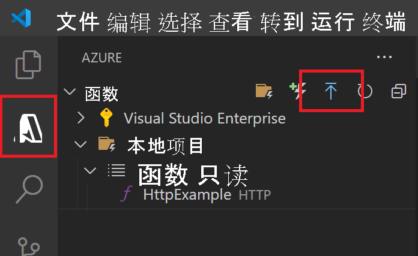

# 快速入门：在 Azure 中使用 Visual Studio Code 创建 Java 函数

[!INCLUDE [functions-language-selector-quickstart-vs-code](../../includes/functions-language-selector-quickstart-vs-code.md)]

使用 Visual Studio Code 来创建一个响应 HTTP 请求的 Java 函数。 在本地测试代码，然后将代码部署到 Azure Functions 的无服务器环境。

完成本快速入门会在你的 Azure 帐户中产生最多几美分的费用 <abbr title="用于维护 Azure 使用情况计费信息的配置文件。">Azure 帐户</abbr>.

如果 Visual Studio Code 不是首选开发工具，请查看面向使用 [Maven](create-first-function-cli-java.md)、[Gradle](./functions-create-first-java-gradle.md) 和 [IntelliJ IDEA](/azure/developer/java/toolkit-for-intellij/quickstart-functions) 的 Java 开发人员的类似教程。

## 1.准备环境

在开始之前，请确保已满足下列要求：

+ 具有有效订阅的 Azure 帐户 <abbr title="在 Azure 中管理资源的基本组织结构，通常与组织中的个人或部门关联。">订阅</abbr>. [免费创建帐户](https://azure.microsoft.com/free/?ref=microsoft.com&utm_source=microsoft.com&utm_medium=docs&utm_campaign=visualstudio)。

+ [Java 开发人员工具包](/azure/developer/java/fundamentals/java-support-on-azure)版本 8 或 11。

+ [Apache Maven](https://maven.apache.org) 3.0 或更高版本。

+ 安装在某个[受支持的平台](https://code.visualstudio.com/docs/supporting/requirements#_platforms)上的 [Visual Studio Code](https://code.visualstudio.com/)。

+ [Java 扩展包](https://marketplace.visualstudio.com/items?itemName=vscjava.vscode-java-pack)  

+ Visual Studio Code 的 [Azure Functions 扩展](https://marketplace.visualstudio.com/items?itemName=ms-azuretools.vscode-azurefunctions)。

 

## 2.创建本地 Functions 项目

1. 在活动栏中选择 Azure 图标，然后在“Azure: Functions”区域中选择“创建新项目...”图标  。

    

1. 为项目工作区选择一个目录位置，然后勾选“选择” 。

1. 根据提示提供以下信息：

    + **选择函数项目的语言**：选择`Java`。

    + **选择 Java 的版本**：选择在 Azure 中运行函数的 Java 版本 `Java 8` 或 `Java 11`。 选择已在本地验证的 Java 版本。

    + **提供组 ID**：选择`com.function`。

    + **提供项目 ID**：选择`myFunction`。

    + **提供版本**：选择`1.0-SNAPSHOT`。

    + **提供包名称**：选择`com.function`。

    + **提供应用名称**：选择`myFunction-12345`。

    + **授权级别**：选择 `Anonymous`，这使任何人都可以调用你的函数终结点。

    + **选择打开项目的方式**：选择`Add to workspace`。

 

<strong>无法创建函数项目？</strong>

在创建本地 Functions 项目时，要解决的最常见的问题是：
* 未安装 Azure Functions 扩展。 

 

## 3.在本地运行函数

1. 按 <kbd>F5</kbd> 启动函数应用项目。

1. 在终端，可看到正在本地运行的函数的 URL 终结点。

    

1. 运行 Core Tools 后，转到“Azure:Functions”区域。 在“Functions”下，展开“本地项目” > “Functions”  。 右键单击 (Windows) 或按 <kbd>Ctrl -</kbd> 单击 (macOS) `HttpExample` 函数，然后选择“立即执行函数...”。

    :::image type="content" source="../../includes/media/functions-run-function-test-local-vs-code/execute-function-now.png" alt-text="立即在 Visual Studio Code 中执行函数":::

1. 在“输入请求正文”中，你将看到请求消息正文值 `{ "name": "Azure" }`。 按 <kbd>Enter</kbd> 将此请求消息发送给函数。  

1. 当函数在本地执行并返回响应时，Visual Studio Code 中将引发通知。 函数执行的相关信息将显示在“终端”面板中。

1. 按 Ctrl + C 停止 Core Tools 并断开调试器的连接<kbd></kbd>。

 

<strong>无法在本地运行函数？</strong>

在运行本地 Functions 项目时，要解决的最常见的问题是：
* 未安装 Core Tools。 
*  如果在 Windows 上运行时遇到问题，请确保用于 Visual Studio Code 的默认终端 shell 未设置为“WSL Bash”。 

 

## 4.登录 Azure

若要发布应用，请登录 Azure。 如果已登录，请转到下一部分。

1. 在活动栏中选择“Azure”图标，然后在“Azure: Functions”区域中选择“登录 Azure...” 。

    

1. 在浏览器中出现提示时，请选择你的 Azure 帐户，并使用你的 Azure 帐户凭据登录 。

1. 成功登录后，关闭新的浏览器窗口，然后返回 Visual Studio Code。

 

## 5.将项目发布到 Azure

首次部署代码时，需在 Azure 订阅中创建函数资源。

1. 在活动栏中选择“Azure”图标，然后在“Azure:函数”区域中，选择“部署到函数应用...”按钮。

    

1. 根据提示提供以下信息：

    + **选择文件夹**：选择包含你的函数应用的文件夹。 

    + **选择订阅**：选择要使用的订阅。 如果只有一个订阅，则不会看到此项。

    + **在 Azure 中选择函数应用**：选择`Create new Function App`。

    + **输入函数应用的全局唯一名称**：在 URL 路径中键入在 Azure 中唯一的名称。 验证键入的名称，确保它在全局唯一。

    - **选择新资源的位置**：为了获得更好的性能，请选择你附近的 [区域](https://azure.microsoft.com/regions/)。

1. 创建函数应用并应用了部署包之后，会显示一个通知。 选择“查看输出”，查看创建和部署结果。

    

 

<strong>无法发布函数？</strong>

在本部分中，创建了 Azure 资源，还将本地代码部署到了函数应用。 如果操作失败：

* 请查看输出中的错误信息。 此外，还可点击右下角的响铃图标查看输出。 
* 你是否已发布到现有的函数应用？ 该操作会在 Azure 中覆盖该应用的内容。

 

<strong>创建了哪些资源？</strong>

完成后，将使用基于函数应用名称的名称在订阅中创建以下 Azure 资源：

* **资源组**：资源组是同一区域中相关资源的逻辑容器。
* **Azure 存储帐户**：存储资源可维护项目的状态和其他信息。
* **消耗计划**：消耗计划定义无服务器函数应用的基础主机。
* **函数应用**：函数应用提供执行函数代码的环境并将函数分组为一个逻辑单元。
* **Application Insights**：Application Insights 跟踪无服务器函数的使用情况。

 

## 6.在 Azure 中运行函数

1. 返回到“Azure：函数”区域（位于侧栏中），然后展开你的订阅、新的函数应用和“函数”。 右键单击 (Windows) 或按 <kbd>Ctrl -</kbd> 单击 (macOS) `HttpExample` 函数，然后选择“立即执行函数...”。

    :::image type="content" source="../../includes/media/functions-vs-code-run-remote/execute-function-now.png" alt-text="立即在 Azure 的 Visual Studio Code 中执行函数":::

1. 在“输入请求正文”中，你将看到请求消息正文值 `{ "name": "Azure" }`。 按 Enter 将此请求消息发送给函数。  

1. 当函数在 Azure 中执行并返回响应时，Visual Studio Code 中将引发通知。

 

## 7.清理资源

如果不打算继续执行[后续步骤](#next-steps)，请删除函数应用及其资源，以避免产生任何后续成本。

1. 在 Visual Studio Code 的“活动”栏中选择“Azure”图标，然后在侧边栏中选择“Functions”区域。
1. 选择函数应用，然后右键单击并选择“删除函数应用...”。

 

## 后续步骤

通过添加输出绑定 <abbr title="Azure 存储中一种将函数与存储队列关联，以确保函数可在队列上创建消息的方法。">来扩展函数</abbr>. 此绑定将 HTTP 请求中的字符串写入 Azure 队列存储队列中的消息。

> [!div class="nextstepaction"]
> [连接到 Azure 存储队列](functions-add-output-binding-storage-queue-vs-code.md?pivots=programming-language-java)
