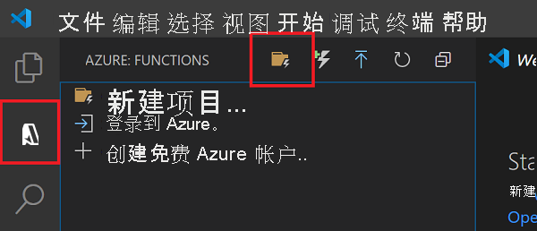
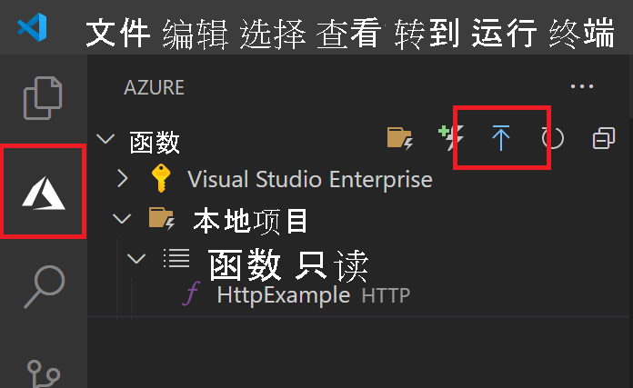

# <a name="quickstart-create-a-javascript-function-in-azure-using-visual-studio-code"></a>快速入门：在 Azure 中使用 Visual Studio Code 创建 JavaScript 函数

[!INCLUDE [functions-language-selector-quickstart-vs-code](../../includes/functions-language-selector-quickstart-vs-code.md)]

使用 Visual Studio Code 来创建一个响应 HTTP 请求的 JavaScript 函数。 在本地测试代码，然后将代码部署到 Azure Functions 的无服务器环境。

完成本快速入门会从你的 Azure 帐户中扣取最多几美分的费用。

本文还有一个[基于 CLI 的版本](create-first-function-cli-node.md)。

## <a name="configure-your-environment"></a>配置环境

在开始之前，请确保已满足下列要求：

+ 具有活动订阅的 Azure 帐户。 [免费创建帐户](https://azure.microsoft.com/free/?ref=microsoft.com&utm_source=microsoft.com&utm_medium=docs&utm_campaign=visualstudio)。

+ [Node.js 10.14.1+](https://nodejs.org/)。 可以使用 `node --version` 命令检查你的版本。  

+ 安装在某个[受支持的平台](https://code.visualstudio.com/docs/supporting/requirements#_platforms)上的 [Visual Studio Code](https://code.visualstudio.com/)。

+ Visual Studio Code 的 [Azure Functions 扩展](https://marketplace.visualstudio.com/items?itemName=ms-azuretools.vscode-azurefunctions)。

## <a name="create-your-local-project"></a><a name="create-an-azure-functions-project"></a>创建本地项目

在本部分，你将使用 Visual Studio Code 在 JavaScript 中创建一个本地 Azure Functions 项目。 稍后在本文中，你要将函数代码发布到 Azure。

1. 在活动栏中选择“Azure”图标，然后在“Azure:函数”区域中选择“创建新项目...”图标。

    

1. 为项目工作区选择目录位置，然后选择“选择”  。

    > [!NOTE]
    > 这些步骤已设计为在工作区之外完成。 在这种情况下，请不要选择属于工作区内的项目文件夹。

1. 根据提示提供以下信息：

    |Prompt|选择|
    |--|--|
    |选择函数项目的语言|选择 `JavaScript`。|
    |为项目的第一个函数选择模板|选择 `HTTP trigger`。|
    |提供函数名称|键入 `HttpExample`。|
    |**授权级别**|选择 `Anonymous`，这使任何人都可以调用你的函数终结点。 若要了解授权级别，请参阅[授权密钥](functions-bindings-http-webhook-trigger.md#authorization-keys)。|
    |选择打开项目的方式|选择 `Add to workspace`。|

    Visual Studio Code 将使用此信息生成一个包含 HTTP 触发器的 Azure Functions 项目。 可以在资源管理器中查看本地项目文件。 若要详细了解所创建的文件，请参阅[生成的项目文件](functions-develop-vs-code.md#generated-project-files)。 

[!INCLUDE [functions-run-function-test-local-vs-code](../../includes/functions-run-function-test-local-vs-code.md)]

确认该函数可以在本地计算机上正确运行以后，可以使用 Visual Studio Code 将项目直接发布到 Azure。

[!INCLUDE [functions-sign-in-vs-code](../../includes/functions-sign-in-vs-code.md)]

<a name="Publish the project to Azure"></a>

## <a name="deploy-the-project-to-azure"></a>将项目部署到 Azure

在本部分，你将在 Azure 订阅中创建一个函数应用和相关资源，然后部署代码。 

> [!IMPORTANT]
> 部署到现有函数应用将覆盖该应用在 Azure 中的内容。 


1. 在活动栏中选择“Azure”图标，然后在“Azure:函数”区域中，选择“部署到函数应用...”按钮。

    

1. 根据提示提供以下信息：

    |Prompt| 选择|
    |--|--|
    |选择 Azure 中的函数应用|选择 `+ Create new Function App`。 （请不要选择本文中未介绍的 `Advanced` 选项。）|
    |输入函数应用的全局唯一名称|键入在 URL 路径中有效的名称。 将对你键入的名称进行验证，以确保其在 Azure Functions 中是唯一的。|
    |选择运行时|选择你一直在本地运行的 Node.js 版本。 可以使用 `node --version` 命令来检查你的版本。|
    |选择新资源的位置|为了获得更好的性能，请选择你附近的[区域](https://azure.microsoft.com/regions/)。|

    在 Azure 中创建单个资源时，扩展会在通知区域显示这些资源的状态。

    :::image type="content" source="../../includes/media/functions-publish-project-vscode/resource-notification.png" alt-text="Azure 资源创建通知":::

    完成后，将使用基于函数应用名称的名称在订阅中创建以下 Azure 资源：

    [!INCLUDE [functions-vs-code-created-resources](../../includes/functions-vs-code-created-resources.md)]

1. 创建函数应用并应用了部署包之后，会显示一个通知。 

    [!INCLUDE [functions-vs-code-create-tip](../../includes/functions-vs-code-create-tip.md)]

1. 在此通知中选择“查看输出”以查看创建和部署结果，其中包括你创建的 Azure 资源。 如果错过了通知，请选择右下角的响铃图标以再次查看。

    

[!INCLUDE [functions-vs-code-run-remote](../../includes/functions-vs-code-run-remote.md)]

## <a name="change-the-code-and-redeploy-to-azure"></a>更改代码并重新部署到 Azure

1. 在“VSCode 资源管理器”视图中，选择 `./HttpExample/index.js` 文件。 
1. 将该文件替换为以下代码，以构造 JSON 对象并将其返回。

    ```javascript
    module.exports = async function (context, req) {
        
        try {
            context.log('JavaScript HTTP trigger function processed a request.');
    
            // Read incoming data
            const name = (req.query.name || (req.body && req.body.name));
            const sport = (req.query.sport || (req.body && req.body.sport));
        
            // fail if incoming data is required
            if (!name || !sport) {
    
                context.res = {
                    status: 400
                };
                return;
            }
            
            // Add or change code here
            const message = `${name} likes ${sport}`;
        
            // Construct response
            const responseJSON = {
                "name": name,
                "sport": sport,
                "message": message,
                "success": true
            }
    
            context.res = {
                // status: 200, /* Defaults to 200 */
                body: responseJSON,
                contentType: 'application/json'
            };
        } catch(err) {
            context.res = {
                status: 500
            };
        }
    }
    ```
1. 在本地[重新运行函数](#run-the-function-locally)应用。
1. 在“输入请求正文”提示符下将请求消息正文更改为 { "name": "Tom","sport":"basketball" }。 按 Enter 将此请求消息发送给函数。
1. 查看通知中的响应：

    ```json
    {
      "name": "Tom",
      "sport": "basketball",
      "message": "Tom likes basketball",
      "success": true
    }
    ```

1. [将函数重新部署](#deploy-the-project-to-azure)到 Azure。

## <a name="troubleshooting"></a>疑难解答

使用下表解决在使用此快速入门时遇到的最常见问题。

|问题|解决方案|
|--|--|
|无法创建本地函数项目？|确保已安装 [Azure Functions 扩展](https://marketplace.visualstudio.com/items?itemName=ms-azuretools.vscode-azurefunctions)。|
|无法在本地运行函数？|确保已安装 [Azure Functions Core Tools](functions-run-local.md?tabs=windows%2Ccsharp%2Cbash)。 <br/>在 Windows 上运行时，请确保用于 Visual Studio Code 的默认终端 shell 未设置为“WSL Bash”。|
|无法将函数部署到 Azure？|请查看输出中的错误信息。 此外，还可点击右下角的响铃图标查看输出。 你是否已发布到现有的函数应用？ 该操作会在 Azure 中覆盖该应用的内容。|
|无法运行基于云的函数应用？|请记住使用查询字符串来提交参数。|

[!INCLUDE [functions-cleanup-resources-vs-code.md](../../includes/functions-cleanup-resources-vs-code-extension.md)]

## <a name="next-steps"></a>后续步骤

你已使用 [Visual Studio Code](functions-develop-vs-code.md?tabs=javascript) 通过简单的 HTTP 触发函数创建了函数应用。 在下一篇文章中，你将通过连接到 Azure Cosmos DB 或 Azure 存储来扩展该函数。 若要详细了解如何连接到其他 Azure 服务，请参阅[将捆绑项添加到 Azure Functions 中的现有函数](add-bindings-existing-function.md?tabs=javascript)。 若要详细了解安全性，请参阅[保护 Azure Functions](security-concepts.md)。

> [!div class="nextstepaction"]
> [连接到 Azure Cosmos DB](functions-add-output-binding-cosmos-db-vs-code.md?pivots=programming-language-javascript)
> [连接到 Azure 队列存储](functions-add-output-binding-storage-queue-vs-code.md?pivots=programming-language-javascript)

[Azure Functions Core Tools]: functions-run-local.md
[Azure Functions extension for Visual Studio Code]: https://marketplace.visualstudio.com/items?itemName=ms-azuretools.vscode-azurefunctions
