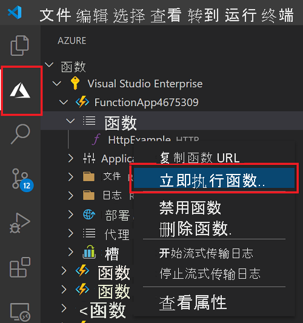

# 快速入门：在 Azure 中使用 Visual Studio Code 创建 JavaScript 函数

> [!div class="op_single_selector" title1="选择你的函数语言： "]
> - [JavaScript](create-first-function-vs-code-node.md)
> - [C#](create-first-function-vs-code-csharp.md)
> - [Java](create-first-function-vs-code-java.md)
> - [PowerShell](create-first-function-vs-code-powershell.md)
> - [Python](create-first-function-vs-code-python.md)
> - [TypeScript](create-first-function-vs-code-typescript.md)
> - [其他 (Go/Rust)](create-first-function-vs-code-other.md)

使用 Visual Studio Code 来创建一个响应 HTTP 请求的 JavaScript 函数。 在本地测试代码，然后将代码部署到 Azure Functions 的无服务器环境。

完成本快速入门会在你的 Azure 帐户中产生最多几美分的费用 <abbr title="Azure 帐户是全球唯一的实体，可用于访问 Azure 服务和 Azure 订阅。">Azure 帐户</abbr>.

## 1.准备环境

在开始之前，请确保已满足下列要求：

+ 具有有效订阅的 <abbr title="Azure 订阅是用于在 Azure 中预置资源的逻辑容器。 它包含你的所有资源（如虚拟机 (VM)、数据库等）的详细信息。">Azure 帐户</abbr>. [免费创建帐户](https://azure.microsoft.com/free/?ref=microsoft.com&utm_source=microsoft.com&utm_medium=docs&utm_campaign=visualstudio)。

+ [Node.js 10.14.1+](https://nodejs.org/)

+ [Visual Studio Code](https://code.visualstudio.com/)

+ 适用于 Visual Studio Code 的 [Azure Functions 扩展](https://marketplace.visualstudio.com/items?itemName=ms-azuretools.vscode-azurefunctions)。

+ [Azure Functions Core Tools](functions-run-local.md?tabs=linux%2Ccsharp%2Cbash#install-the-azure-functions-core-tools)

 

## 2.创建本地 Functions 项目

1. 选择活动栏中的 Azure 图标 <abbr title="">活动栏</abbr>，然后在“Azure: 函数”区域中，选择“新建项目...”图标 。

    

1. 为项目工作区选择一个目录位置，然后勾选“选择” 。 

1. 根据提示提供以下信息：

    + **选择函数项目的语言**：选择`JavaScript`。

    + **为项目的第一个函数选择模板**：选择`HTTP trigger`。

    + **提供函数名称**：键入 `HttpExample`。

    + **授权级别**：选择 `Anonymous`，这使任何人都可以调用你的函数终结点。

    + **选择打开项目的方式**：选择`Add to workspace`。

 

<strong>无法创建函数项目？</strong>

在创建本地 Functions 项目时，要解决的最常见的问题是：
* 未安装 Azure Functions 扩展。 

 

## 3.在本地运行函数

1. 按 <kbd>F5</kbd> 启动函数应用项目。 

1. 在终端，可看到正在本地运行的函数的 URL 终结点。

    

1. 将以下 URL 复制粘贴到 Web 浏览器，然后按 Enter。

    `http://localhost:7071/api/HttpExample?name=Functions`

1. 查看返回的响应。

    

1. 在“终端”面板中查看请求的相关信息。

    

1. 按 Ctrl + C 停止 Core Tools 并断开调试器的连接<kbd></kbd>。

 

<strong>无法在本地运行函数？</strong>

在运行本地 Functions 项目时，要解决的最常见的问题是：
* 未安装 Core Tools。 
*  如果在 Windows 上运行时遇到问题，请确保用于 Visual Studio Code 的默认终端 shell 未设置为“WSL Bash”。 

 

## 4.登录 Azure

若要发布应用，请登录 Azure。 如果已登录，请转到下一部分。

1. 在活动栏中选择“Azure”图标，然后在“Azure: Functions”区域中选择“登录 Azure...” 。

    

1. 在浏览器中出现提示时，请选择你的 Azure 帐户，并使用你的 Azure 帐户凭据登录 。

1. 成功登录后，关闭新的浏览器窗口，然后返回 Visual Studio Code。 

 

## 5.将项目发布到 Azure

首次部署代码时，需在 Azure 订阅中创建函数资源。 

1. 在活动栏中选择“Azure”图标，然后在“Azure:函数”区域中，选择“部署到函数应用...”按钮。

    

1. 根据提示提供以下信息：

    + **选择文件夹**：选择包含你的函数应用的文件夹。 

    + **选择订阅**：选择要使用的订阅。 如果只有一个订阅，则不会看到此项。

    + **在 Azure 中选择函数应用**：选择`+ Create new Function App`。

    + **输入函数应用的全局唯一名称**：在 URL 路径中键入在 Azure 中唯一的名称。 验证键入的名称，确保它在全局唯一。

    + **选择运行时**：选择你一直在本地运行的 Node.js 版本。 可以使用 `node --version` 命令来检查你的版本。

    + **选择新资源的位置**：为了获得更好的性能，请选择你附近的 [区域](https://azure.microsoft.com/regions/)。 

1. 创建函数应用并应用了部署包之后，会显示一个通知。 选择“查看输出”，查看创建和部署结果。 
    
    

 

<strong>无法发布函数？</strong>

在本部分中，创建了 Azure 资源，还将本地代码部署到了函数应用。 如果操作失败：

* 请查看输出中的错误信息。 此外，还可点击右下角的响铃图标查看输出。 
* 你是否已发布到现有的函数应用？ 该操作会在 Azure 中覆盖该应用的内容。

 

<strong>创建了哪些资源？</strong>

完成后，将使用基于函数应用名称的名称在订阅中创建以下 Azure 资源： 
* **资源组**：资源组是同一区域中相关资源的逻辑容器。
* **Azure 存储帐户**：存储资源可维护项目的状态和其他信息。
* **消耗计划**：消耗计划定义无服务器函数应用的基础主机。
* **函数应用**：函数应用提供执行函数代码的环境并将函数分组为一个逻辑单元。
* **Application Insights**：Application Insights 跟踪无服务器函数的使用情况。

 

## 6.在 Azure 中运行函数
1. 在“Azure: 函数”侧边栏中，展开新的函数应用。 
1. 展开“函数”，右键单击“HttpExample”，然后选择“立即执行函数...”  。

    

1. 按 Enter，将默认请求消息发送到函数。 

1. 函数执行完成后，Visual Studio Code 中会出现一条通知。

 

<strong>无法运行基于云的函数应用？</strong>

* 你记得在 URL 的末尾添加了查询字符串吗？

 

## 7.清理资源

删除函数应用及其资源以避免产生任何后续成本。

1. 在 Visual Studio Code 的“活动”栏中选择 Azure 图标，然后在侧边栏中选择“函数”区域。 
1. 选择函数应用，然后右键单击并选择“删除函数应用...”。

 

## 后续步骤

通过添加输出绑定来 <abbr title="绑定到函数是以声明方式将其他资源连接到函数的一种方法。">扩展函数</abbr>. 此绑定将 HTTP 请求中的字符串写入 Azure 队列存储队列中的消息。 

> [!div class="nextstepaction"]
> [连接到 Azure 存储队列](functions-add-output-binding-storage-queue-vs-code.md?pivots=programming-language-javascript)

[Azure Functions Core Tools]: functions-run-local.md
[Azure Functions extension for Visual Studio Code]: https://marketplace.visualstudio.com/items?itemName=ms-azuretools.vscode-azurefunctions
