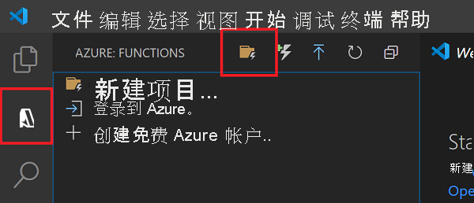

# <a name="quickstart-create-a-go-or-rust-function-in-azure-using-visual-studio-code"></a>快速入门：在 Azure 中使用 Visual Studio Code 创建 Go 或 Rust 函数

[!INCLUDE [functions-language-selector-quickstart-vs-code](../../includes/functions-language-selector-quickstart-vs-code.md)]

在本文中，你将使用 Visual Studio Code 来创建一个响应 HTTP 请求的[自定义处理程序](functions-custom-handlers.md)函数。 在本地测试代码后，将代码部署到 Azure Functions 的无服务器环境。

可以使用自定义处理程序，通过运行 HTTP 服务器进程以任意语言或运行时创建函数。 本文支持 [Go](create-first-function-vs-code-other.md?tabs=go) 和 [Rust](create-first-function-vs-code-other.md?tabs=rust)。

完成本快速入门会从你的 Azure 帐户中扣取最多几美分的费用。

## <a name="configure-your-environment"></a>配置环境

在开始之前，请确保已满足下列要求：

# <a name="go"></a>[Go](#tab/go)

+ 具有活动订阅的 Azure 帐户。 [免费创建帐户](https://azure.microsoft.com/free/?ref=microsoft.com&utm_source=microsoft.com&utm_medium=docs&utm_campaign=visualstudio)。

+ 安装在某个[受支持的平台](https://code.visualstudio.com/docs/supporting/requirements#_platforms)上的 [Visual Studio Code](https://code.visualstudio.com/)。

+ Visual Studio Code 的 [Azure Functions 扩展](https://marketplace.visualstudio.com/items?itemName=ms-azuretools.vscode-azurefunctions)。

+ [Azure Functions Core Tools](./functions-run-local.md#v2) 版本 3.x。 使用 `func --version` 命令检查是否已正确安装。

+ [Go](https://golang.org/doc/install)，推荐使用最新版本。 可以使用 `go version` 命令检查你的版本。

# <a name="rust"></a>[Rust](#tab/rust)

+ 具有活动订阅的 Azure 帐户。 [免费创建帐户](https://azure.microsoft.com/free/?ref=microsoft.com&utm_source=microsoft.com&utm_medium=docs&utm_campaign=visualstudio)。

+ 安装在某个[受支持的平台](https://code.visualstudio.com/docs/supporting/requirements#_platforms)上的 [Visual Studio Code](https://code.visualstudio.com/)。

+ Visual Studio Code 的 [Azure Functions 扩展](https://marketplace.visualstudio.com/items?itemName=ms-azuretools.vscode-azurefunctions)。

+ [Azure Functions Core Tools](./functions-run-local.md#v2) 版本 3.x。 使用 `func --version` 命令检查是否已正确安装。

+ 使用 [rustup](https://www.rust-lang.org/tools/install)的 Rust 工具链。 可以使用 `rustc --version` 命令检查你的版本。

---

## <a name="create-your-local-project"></a><a name="create-an-azure-functions-project"></a>创建本地项目

在本部分，你将使用 Visual Studio Code 创建一个本地 Azure Functions 自定义处理程序项目。 稍后在本文中，你要将函数代码发布到 Azure。

1. 在活动栏中选择“Azure”图标，然后在“Azure:函数”区域中选择“创建新项目...”图标。

    

1. 为项目工作区选择目录位置，然后选择“选择”  。

    > [!NOTE]
    > 这些步骤已设计为在工作区之外完成。 在这种情况下，请不要选择属于工作区内的项目文件夹。

1. 根据提示提供以下信息：

    + **选择函数项目的语言**：选择`Custom`。

    + **为项目的第一个函数选择模板**：选择`HTTP trigger`。

    + **提供函数名称**：键入 `HttpExample`。

    + **授权级别**：选择 `Anonymous`，这使任何人都可以调用你的函数终结点。 若要了解授权级别，请参阅[授权密钥](functions-bindings-http-webhook-trigger.md#authorization-keys)。

    + **选择打开项目的方式**：选择`Add to workspace`。

1. Visual Studio Code 将使用此信息生成一个包含 HTTP 触发器函数的 Azure Functions 项目。 可以在资源管理器中查看本地项目文件。 若要详细了解所创建的文件，请参阅[生成的项目文件](functions-develop-vs-code.md#generated-project-files)。 

## <a name="create-and-build-your-function"></a>创建和生成函数

HttpExample 文件夹中的 function.json 文件声明 HTTP 触发器函数 。 可以通过添加处理程序并将其编译为可执行文件来完成该函数。

# <a name="go"></a>[Go](#tab/go)

1. 按 <kbd>Ctrl + N</kbd>（对于 macOS，则为 <kbd>Cmd + N</kbd>）新建文件。 在函数应用根文件夹（host.json 所在的文件夹）中将其另存为 handler.go 。

1. 在 handler.go 中，添加以下代码并保存文件。 这就是 Go 自定义处理程序。

    ```go
    package main

    import (
        "fmt"
        "log"
        "net/http"
        "os"
    )

    func helloHandler(w http.ResponseWriter, r *http.Request) {
        message := "This HTTP triggered function executed successfully. Pass a name in the query string for a personalized response.\n"
        name := r.URL.Query().Get("name")
        if name != "" {
            message = fmt.Sprintf("Hello, %s. This HTTP triggered function executed successfully.\n", name)
        }
        fmt.Fprint(w, message)
    }

    func main() {
        listenAddr := ":8080"
        if val, ok := os.LookupEnv("FUNCTIONS_CUSTOMHANDLER_PORT"); ok {
            listenAddr = ":" + val
        }
        http.HandleFunc("/api/HttpExample", helloHandler)
        log.Printf("About to listen on %s. Go to https://127.0.0.1%s/", listenAddr, listenAddr)
        log.Fatal(http.ListenAndServe(listenAddr, nil))
    }
    ```

1. 按 <kbd>Ctrl + Shift +`</kbd> 或在“终端”菜单中选择“新建终端”，在 VS Code 中打开新的集成终端 。

1. 使用以下命令编译自定义处理程序。 函数应用的根文件夹中会输出名为 `handler`（对于 Windows，则为 `handler.exe`）的可执行文件。

    ```bash
    go build handler.go
    ```

    

# <a name="rust"></a>[Rust](#tab/rust)

1. 按 <kbd>Ctrl + Shift +`</kbd> 或在“终端”菜单中选择“新建终端”，在 VS Code 中打开新的集成终端 。

1. 在函数应用根文件夹（host.json 所在的文件夹）中，初始化名为 `handler` 的 Rust 项目。

    ```bash
    cargo init --name handler
    ```

1. 在 Cargo.toml 中，添加完成本快速入门所需的以下依赖关系。 该示例使用 [warp](https://docs.rs/warp/) Web 服务器框架。

    ```toml
    [dependencies]
    warp = "0.2"
    tokio = { version = "0.2", features = ["full"] }
    ```

1. 在 src/main.rs 中，添加以下代码并保存文件。 这就是 Rust 自定义处理程序。

    ```rust
    use std::collections::HashMap;
    use std::env;
    use std::net::Ipv4Addr;
    use warp::{http::Response, Filter};

    #[tokio::main]
    async fn main() {
        let example1 = warp::get()
            .and(warp::path("api"))
            .and(warp::path("HttpExample"))
            .and(warp::query::<HashMap<String, String>>())
            .map(|p: HashMap<String, String>| match p.get("name") {
                Some(name) => Response::builder().body(format!("Hello, {}. This HTTP triggered function executed successfully.", name)),
                None => Response::builder().body(String::from("This HTTP triggered function executed successfully. Pass a name in the query string for a personalized response.")),
            });

        let port_key = "FUNCTIONS_CUSTOMHANDLER_PORT";
        let port: u16 = match env::var(port_key) {
            Ok(val) => val.parse().expect("Custom Handler port is not a number!"),
            Err(_) => 3000,
        };

        warp::serve(example1).run((Ipv4Addr::UNSPECIFIED, port)).await
    }
    ```

1. 为自定义处理程序编译二进制文件。 函数应用的根文件夹中会输出名为 `handler`（对于 Windows，则为 `handler.exe`）的可执行文件。

    ```bash
    cargo build --release
    cp target/release/handler .
    ```

    

---

## <a name="configure-your-function-app"></a>配置函数应用

函数主机需配置为在启动时运行自定义处理程序二进制文件。

1. 打开 host.json。

1. 在 `customHandler.description` 部分中，将 `defaultExecutablePath` 的值设置为 `handler`（对于 Windows，则将其设置为 `handler.exe`）。

1. 在 `customHandler` 部分中，添加名为 `enableForwardingHttpRequest` 的属性并将其值设置为 `true`。 对于仅包含 HTTP 触发器的函数，通过此设置可处理典型的 HTTP 请求（而不是自定义处理程序[请求有效负载](functions-custom-handlers.md#request-payload)），从而简化编程。

1. 确认 `customHandler` 部分是否如以下示例所示。 保存文件。

    ```
    "customHandler": {
      "description": {
        "defaultExecutablePath": "handler",
        "workingDirectory": "",
        "arguments": []
      },
      "enableForwardingHttpRequest": true
    }
    ```

将函数应用配置为启动自定义处理程序可执行文件。

## <a name="run-the-function-locally"></a>在本地运行函数

可以先在本地开发计算机上运行此项目，然后再将其发布到 Azure。

1. 在集成终端中，使用 Azure Functions Core Tools 启动函数应用。

    ```bash
    func start
    ```

1. 在 Core Tools 运行时，导航至以下 URL 以执行 GET 请求（其中包括 `?name=Functions` 查询字符串）。

    `http://localhost:7071/api/HttpExample?name=Functions`

1. 系统会返回响应，在浏览器中如下所示：

    

1. 有关请求的信息将显示在“终端”  面板中。

    

1. 按 <kbd>Ctrl + C</kbd> 停止 Core Tools。

确认该函数可以在本地计算机上正确运行以后，可以使用 Visual Studio Code 将项目直接发布到 Azure。

[!INCLUDE [functions-sign-in-vs-code](../../includes/functions-sign-in-vs-code.md)]

## <a name="compile-the-custom-handler-for-azure"></a>编译 Azure 的自定义处理程序

在本部分，你将在运行 Linux 的函数应用中将项目发布到 Azure。 在大多数情况下，必须先重新编译二进制文件并将配置调整为与目标平台匹配，然后才可将其发布到 Azure。

# <a name="go"></a>[Go](#tab/go)

1. 在集成终端中，将处理程序编译为 Linux/x64。 函数应用根文件夹中会创建名为 `handler` 的二进制文件。

    # <a name="macos"></a>[macOS](#tab/macos)

    ```bash
    GOOS=linux GOARCH=amd64 go build handler.go
    ```

    # <a name="linux"></a>[Linux](#tab/linux)

    ```bash
    GOOS=linux GOARCH=amd64 go build handler.go
    ```

    # <a name="windows"></a>[Windows](#tab/windows)
    ```cmd
    set GOOS=linux
    set GOARCH=amd64
    go build hello.go
    ```

    将 host.json 中的 `defaultExecutablePath` 从 `handler.exe` 更改为 `handler`。 这会指示函数应用运行 Linux 二进制文件。
    
    ---

# <a name="rust"></a>[Rust](#tab/rust)

1. 在 .cargo/config 中创建文件。添加以下内容，然后保存该文件。

    ```
    [target.x86_64-unknown-linux-musl]
    linker = "rust-lld"
    ```

1. 在集成终端中，将处理程序编译为 Linux/x64。 随即会创建一个名为 `handler` 的二进制文件。 将其复制到函数应用根文件夹。

    ```bash
    rustup target add x86_64-unknown-linux-musl
    cargo build --release --target=x86_64-unknown-linux-musl
    cp target/x86_64-unknown-linux-musl/release/handler .
    ```

1. 如果使用的是 Windows，请将 host.json 中的 `defaultExecutablePath` 从 `handler.exe` 更改为 `handler`。 这会指示函数应用运行 Linux 二进制文件。

1. 将以下行添加到 .funcignore 文件：

    ```
    target
    ```

    这可防止发布 target 文件夹中的内容。

---

## <a name="publish-the-project-to-azure"></a>将项目发布到 Azure

在本部分，你将在 Azure 订阅中创建一个函数应用和相关资源，然后部署代码。 

> [!IMPORTANT]
> 发布到现有函数应用将覆盖该应用在 Azure 中的内容。 


1. 在活动栏中选择“Azure”图标，然后在“Azure:函数”区域中，选择“部署到函数应用...”按钮。

    

1. 根据提示提供以下信息：

    + **选择文件夹**：从工作区中选择一个文件夹，或浏览到包含函数应用的文件夹。 如果已打开有效的函数应用，则不会看到此信息。

    + **选择订阅**：选择要使用的订阅。 如果只有一个订阅，则不会看到此项。

    + **在 Azure 中选择函数应用**：选择`+ Create new Function App (advanced)`。 
    
        > [!IMPORTANT]
        > 使用 `advanced` 选项，可选择在 Azure 中运行函数应用的特定操作系统，在本例中为 Linux。

        

    + **输入函数应用的全局唯一名称**：键入在 URL 路径中有效的名称。 将对你键入的名称进行验证，以确保其在 Azure Functions 中是唯一的。

    + **选择运行时堆栈**：选择`Custom Handler`。

    + **选择 OS**：选择`Linux`。

    + **选择托管计划**：选择`Consumption`。

    + **选择资源组**：选择`+ Create new resource group`。 输入资源组的名称。 此名称必须在 Azure 订阅中具有唯一性。 可以使用提示中推荐的名称。

    + **选择存储帐户**：选择`+ Create new storage account`。 该名称在 Azure 中必须全局唯一。 可以使用提示中推荐的名称。

    + **选择 Application Insights 资源**：选择`+ Create Application Insights resource`。 该名称在 Azure 中必须全局唯一。 可以使用提示中推荐的名称。

    + **选择新资源的位置**：为了获得更好的性能，请选择你附近的 [区域](https://azure.microsoft.com/regions/)。 

1. 完成后，将使用基于函数应用名称的名称在订阅中创建以下 Azure 资源：

    + 一个资源组：相关资源的逻辑容器。
    + 一个标准 Azure 存储帐户：用于维护项目的状态和其他信息。
    + 一个消耗计划：用于定义无服务器函数应用的基础主机。 
    + 一个函数应用：提供用于执行函数代码的环境。 可以通过函数应用将函数分组为逻辑单元，以便在同一托管计划中更轻松地管理、部署和共享资源。
    + 一个连接到函数应用的 Application Insights 实例：用于跟踪无服务器函数的使用情况。

    创建函数应用并应用了部署包之后，会显示一个通知。 

1. 在此通知中选择“查看输出”以查看创建和部署结果，其中包括你创建的 Azure 资源。 如果错过了通知，请选择右下角的响铃图标以再次查看。

    

[!INCLUDE [functions-vs-code-run-remote](../../includes/functions-vs-code-run-remote.md)]

[!INCLUDE [functions-cleanup-resources-vs-code.md](../../includes/functions-cleanup-resources-vs-code.md)]

## <a name="next-steps"></a>后续步骤

> [!div class="nextstepaction"]
> [了解 Azure Functions 自定义处理程序](functions-custom-handlers.md)
