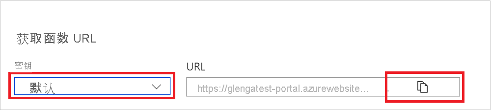
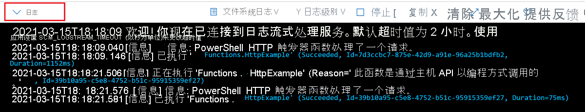

# 在 Azure 门户中创建第一个函数

Azure Functions 用于在无服务器环境中运行代码，无需先创建虚拟机 (VM) 或发布 Web 应用程序。 本文介绍如何使用 Azure Functions 在 Azure 门户中创建 HTTP 触发器函数“hello world”。

[!INCLUDE [functions-in-portal-editing-note](../../includes/functions-in-portal-editing-note.md)] 

建议你在 [本地开发函数](functions-develop-local.md) 并发布到 Azure 中的函数应用。  
通过以下链接之一开始使用所选的本地开发环境和语言：

| Visual Studio Code | 终端/命令提示符 | Visual Studio |
| --- | --- | --- |
|  &bull;&nbsp;[C# 入门](./create-first-function-vs-code-csharp.md) &bull;&nbsp;[Java 入门](./create-first-function-vs-code-java.md) &bull;&nbsp;[JavaScript 入门](./create-first-function-vs-code-node.md) &bull;&nbsp;[PowerShell 入门](./create-first-function-vs-code-powershell.md) &bull;&nbsp;[Python 入门](./create-first-function-vs-code-python.md) |&bull;&nbsp;[C# 入门](./create-first-function-cli-csharp.md) &bull;&nbsp;[Java 入门](./create-first-function-cli-java.md) &bull;&nbsp;[JavaScript 入门](./create-first-function-cli-node.md) &bull;&nbsp;[PowerShell 入门](./create-first-function-cli-powershell.md) &bull;&nbsp;[Python 入门](./create-first-function-cli-python.md) | [C# 入门](functions-create-your-first-function-visual-studio.md) |

[!INCLUDE [quickstarts-free-trial-note](../../includes/quickstarts-free-trial-note.md)]

## 登录 Azure

使用 Azure 帐户登录到 [Azure 门户](https://portal.azure.com)。

## 创建函数应用

必须使用 Function App 托管函数的执行。 函数应用可将函数分组为逻辑单元，以便更轻松地管理、部署、缩放和共享资源。

[!INCLUDE [Create function app Azure portal](../../includes/functions-create-function-app-portal.md)]

接下来，在新的函数应用中创建一个函数。

## 创建 HTTP 触发器函数

1. 从“Functions”窗口的左侧菜单中选择“Functions”，然后从顶部菜单中选择“添加”。 
 
1. 在“新建函数”窗口中，选择“Http 触发器”。

    

1. 在“新建函数”窗口中，接受新函数的默认名称，或输入新名称。 

1. 从“授权级别”下拉列表中选择“匿名”，然后选择“创建函数”。

    Azure 会创建该 HTTP 触发器函数。 现在，可以通过发送 HTTP 请求来运行新函数了。

## 测试函数

1. 在新的 HTTP 触发器函数中，从左侧菜单中选择“代码 + 测试”"，然后从顶部菜单中选择“获取函数 URL”。

    

1. 在“获取函数 URL”对话框的下拉列表中选择“默认值”，然后选择“复制到剪贴板”图标。 

    

1. 将函数 URL 粘贴到浏览器的地址栏中。 将查询字符串值 `?name=<your_name>` 添加到该 URL 尾部，然后按 Enter 来运行请求。 

    以下示例显示了浏览器中的响应：

    

    如果请求 URL 包含[访问密钥](functions-bindings-http-webhook-trigger.md#authorization-keys) (`?code=...`)，则意味着在创建函数时选择“Function”而不是“Anonymous”访问级别。 在这种情况下，应改为追加 `&name=<your_name>`。

1. 运行函数时，会在日志中写入跟踪信息。 若要查看跟踪输出，请返回到门户中的“代码 + 测试”页，并展开页面底部的“日志”箭头。

   

## 清理资源

[!INCLUDE [Clean-up resources](../../includes/functions-quickstart-cleanup.md)]

## 后续步骤

[!INCLUDE [Next steps note](../../includes/functions-quickstart-next-steps.md)]
