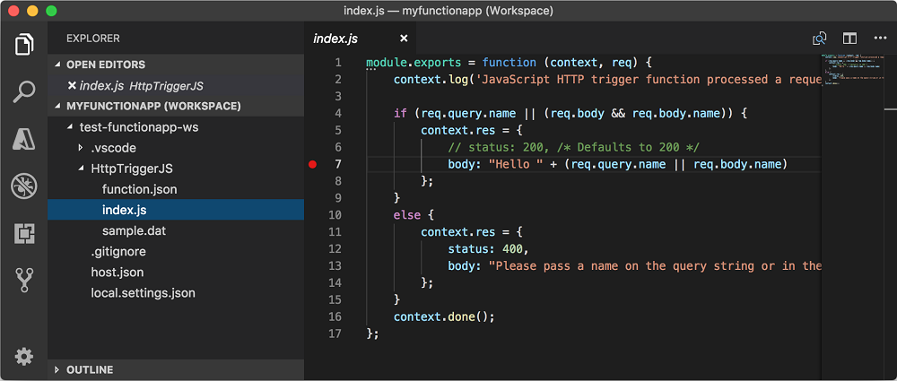
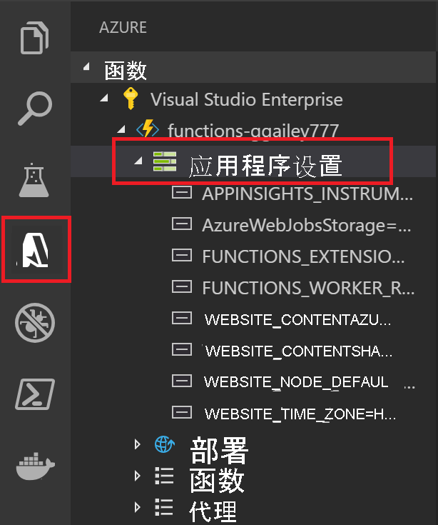

# <a name="develop-azure-functions-by-using-visual-studio-code"></a>使用 Visual Studio 开发 Azure Functions

使用 [适用于 Visual Studio Code 的 Azure Functions 扩展]可在本地开发函数并将其部署到 Azure。 如果这是你第一次体验 Azure Functions，可以在 [Azure Functions 简介](functions-overview.md)中了解详细信息。

Azure Functions 扩展提供以下优势：

* 在本地开发计算机上编辑、生成和运行函数。
* 将 Azure Functions 项目直接发布到 Azure。
* 以各种语言编写函数，同时利用 Visual Studio Code 的优势。

该扩展可与 Azure Functions 运行时版本 2.x（及以上）支持的以下语言配合使用：

* [C# 编译](functions-dotnet-class-library.md)
* [C# 脚本](functions-reference-csharp.md)<sup>*</sup>
* [JavaScript](functions-reference-node.md)
* [Java](functions-reference-java.md)
* [PowerShell](functions-reference-powershell.md)
* [Python](functions-reference-python.md)

<sup>*</sup>要求[将 C# 脚本设置为默认的项目语言](#c-script-projects)。

本文中的示例当前仅适用于 JavaScript (Node.js) 和 C# 类库函数。  

本文详细介绍如何使用 Azure Functions 扩展开发函数并将其发布到 Azure。 在阅读本文之前，应[使用 Visual Studio Code 创建第一个函数](./create-first-function-vs-code-csharp.md)。

> [!IMPORTANT]
> 不要对单个函数应用混合使用本地开发和门户开发。 从本地项目发布到函数应用时，部署过程会覆盖在门户中开发的任何函数。

## <a name="prerequisites"></a>先决条件

在安装并运行 [Azure Functions 扩展][适用于 visual studio code 的 azure functions 扩展]之前，必须符合以下要求：

* 已在某个[支持的平台](https://code.visualstudio.com/docs/supporting/requirements#_platforms)上安装 [Visual Studio Code](https://code.visualstudio.com/)。

* 一个有效的 Azure 订阅。

[!INCLUDE [quickstarts-free-trial-note](../../includes/quickstarts-free-trial-note.md)]

所需的其他资源（例如 Azure 存储帐户）将在[使用 Visual Studio Code 发布](#publish-to-azure)时在订阅中创建。 

### <a name="run-local-requirements"></a>运行本地要求

仅在本地运行和调试函数时需要这些[先决条件](#run-functions-locally)。 不需要它们创建项目或将项目发布到 Azure Functions。

# <a name="c"></a>[C\#](#tab/csharp)

+ [Azure Functions Core Tools](functions-run-local.md#install-the-azure-functions-core-tools) 版本 2.x 或更高版本。 在本地启动项目时，系统会自动下载并安装 Core Tools 包。 Core Tools 包含整个 Azure Functions 运行时，因此下载和安装可能需要一段时间。

+ Visual Studio Code 的 [C# 扩展](https://marketplace.visualstudio.com/items?itemName=ms-dotnettools.csharp)。 

+ [.NET Core CLI 工具](/dotnet/core/tools/?tabs=netcore2x)。  

# <a name="java"></a>[Java](#tab/java)

+ [Azure Functions Core Tools](functions-run-local.md#install-the-azure-functions-core-tools) 版本 2.x 或更高版本。 在本地启动项目时，系统会自动下载并安装 Core Tools 包。 Core Tools 包含整个 Azure Functions 运行时，因此下载和安装可能需要一段时间。

+ [适用于 Java 的调试器扩展](https://marketplace.visualstudio.com/items?itemName=vscjava.vscode-java-debug)。

+ [Java 8](/azure/developer/java/fundamentals/java-support-on-azure)（建议）。 有关其他受支持的版本，请参阅 [Java 版本](functions-reference-java.md#java-versions)。

+ [Maven 3 或更高版本](https://maven.apache.org/)

# <a name="javascript"></a>[JavaScript](#tab/nodejs)

+ [Azure Functions Core Tools](functions-run-local.md#install-the-azure-functions-core-tools) 版本 2.x 或更高版本。 在本地启动项目时，系统会自动下载并安装 Core Tools 包。 Core Tools 包含整个 Azure Functions 运行时，因此下载和安装可能需要一段时间。

+ [Node.js](https://nodejs.org/)，活动 LTS 和维护 LTS 版本（建议使用 10.14.1）。 可以使用 `node --version` 命令检查你的版本。 

# <a name="powershell"></a>[PowerShell](#tab/powershell)

+ [Azure Functions Core Tools](functions-run-local.md#install-the-azure-functions-core-tools) 版本 2.x 或更高版本。 在本地启动项目时，系统会自动下载并安装 Core Tools 包。 Core Tools 包含整个 Azure Functions 运行时，因此下载和安装可能需要一段时间。

+ [PowerShell 7](/powershell/scripting/install/installing-powershell-core-on-windows)（建议）。 有关版本信息，请参阅 [PowerShell 版本](functions-reference-powershell.md#powershell-versions)。

+ [.NET Core 3.1 运行时](https://dotnet.microsoft.com/download)和 [.NET Core 2.1 运行时](https://dotnet.microsoft.com/download/dotnet/2.1)  

+ [Visual Studio Code 的 PowerShell 扩展](https://marketplace.visualstudio.com/items?itemName=ms-vscode.PowerShell)。  

# <a name="python"></a>[Python](#tab/python)

+ [Azure Functions Core Tools](functions-run-local.md#install-the-azure-functions-core-tools) 版本 2.x 或更高版本。 在本地启动项目时，系统会自动下载并安装 Core Tools 包。 Core Tools 包含整个 Azure Functions 运行时，因此下载和安装可能需要一段时间。

+ [Python 3.x](https://www.python.org/downloads/)。 有关版本信息，请参阅 Azure Functions 运行时使用的 [Python 版本](functions-reference-python.md#python-version)。

+ 适用于 Visual Studio Code 的 [Python 扩展](https://marketplace.visualstudio.com/items?itemName=ms-python.python)。

---

[!INCLUDE [functions-install-vs-code-extension](../../includes/functions-install-vs-code-extension.md)]

## <a name="create-an-azure-functions-project"></a>创建 Azure Functions 项目

使用 Functions 扩展可以创建函数应用项目以及第一个函数。 以下步骤说明如何在新的 Functions 项目中创建 HTTP 触发的函数。 [HTTP 触发器](functions-bindings-http-webhook.md)是用于演示的最简单函数触发器模板。

1. 从 **Azure：Functions** 中，选择“创建函数”图标：

    

1. 选择函数应用项目所在的文件夹，然后 **选择函数项目的语言**。

1. 选择“HTTP 触发器”函数模板，或者可以选择“暂时跳过”以创建不带函数的项目。  以后始终可以[将函数添加到项目](#add-a-function-to-your-project)。

    

1. 键入“HttpExample”作为函数名称，按 Enter，然后选择“函数”授权。 调用函数终结点时，此授权级别需要提供[函数密钥](functions-bindings-http-webhook-trigger.md#authorization-keys)。

    

    此时将使用 HTTP 触发的函数的模板，以所选语言创建函数。

    

### <a name="generated-project-files"></a>生成的项目文件

项目模板将以所选语言创建一个项目，并安装所需的依赖项。 对于任何语言，新项目包含以下文件：

* **host.json**：用于配置 Functions 主机。 在本地和 Azure 中运行函数时，将应用这些设置。 有关详细信息，请参阅 [host.json 参考](functions-host-json.md)。

* **local.settings.json**：维护本地运行函数时使用的设置。 仅当在本地运行函数时，才使用这些设置。 有关详细信息，请参阅[本地设置文件](#local-settings)。

    >[!IMPORTANT]
    >由于 local.settings.json 文件可能包含机密，因此需要将其从项目源代码管理中排除。

根据你的语言，将创建以下其他文件：

# <a name="c"></a>[C\#](#tab/csharp)

* 用于实现函数的 [HttpExample.cs 类库文件](functions-dotnet-class-library.md#functions-class-library-project)。

# <a name="java"></a>[Java](#tab/java)

+ 根文件夹中定义项目和部署参数的 pom.xml 文件，包括项目依赖项和 [Java 版本](functions-reference-java.md#java-versions)。 pom.xml 还包含有关在部署期间创建的 Azure 资源的信息。   

+ src 路径中实现函数的 [Functions.java](functions-reference-java.md#triggers-and-annotations) 文件。

# <a name="javascript"></a>[JavaScript](#tab/nodejs)

* 根文件夹中的 package.json 文件。

* 一个 HttpExample 文件夹，其中包含 [function.json 定义文件](functions-reference-node.md#folder-structure)和 [index.js 文件](functions-reference-node.md#exporting-a-function)、一个包含函数代码的 Node.js 文件。

# <a name="powershell"></a>[PowerShell](#tab/powershell)

* HttpExample 文件夹，包含 [function.json 定义文件](functions-reference-powershell.md#folder-structure)和 run.ps1 文件（包含函数代码）。
 
# <a name="python"></a>[Python](#tab/python)
    
* 项目级别 requirements.txt 文件，其中列出了 Functions 所需的包。
    
* HttpExample 文件夹，其中包含 [function.json 定义文件](functions-reference-python.md#folder-structure)和 \_\_init\_\_.py 文件（包含函数代码）。

---

此时，可以[将输入和输出绑定添加到函数](#add-input-and-output-bindings)。 还可以[将新函数添加到项目](#add-a-function-to-your-project)。

## <a name="install-binding-extensions"></a>安装绑定扩展

绑定将在扩展包中实现，但 HTTP 和计时器触发器除外。 对于需要扩展包的触发器和绑定，必须安装这些包。 安装绑定扩展的过程取决于项目的语言。

# <a name="c"></a>[C\#](#tab/csharp)

在终端窗口中运行 [dotnet add package](/dotnet/core/tools/dotnet-add-package) 命令，在项目中安装所需的扩展包。 以下命令安装 Azure 存储扩展，用于实现 Blob、队列和表存储的绑定。

```bash
dotnet add package Microsoft.Azure.WebJobs.Extensions.Storage --version 3.0.4
```

# <a name="java"></a>[Java](#tab/java)

[!INCLUDE [functions-extension-bundles](../../includes/functions-extension-bundles.md)]

# <a name="javascript"></a>[JavaScript](#tab/nodejs)

[!INCLUDE [functions-extension-bundles](../../includes/functions-extension-bundles.md)]

# <a name="powershell"></a>[PowerShell](#tab/powershell)

[!INCLUDE [functions-extension-bundles](../../includes/functions-extension-bundles.md)]

# <a name="python"></a>[Python](#tab/python)

[!INCLUDE [functions-extension-bundles](../../includes/functions-extension-bundles.md)]

---

## <a name="add-a-function-to-your-project"></a>将函数添加到项目

可以使用某个预定义的函数触发器模板将新函数添加到现有项目。 若要添加新的函数触发器，请按 F1 打开命令面板，然后搜索并运行命令“Azure Functions:创建函数”。 遵照提示选择触发器类型，并定义触发器的所需属性。 如果触发器需要访问密钥或连接字符串才能连接到服务，请在创建函数触发器之前做好准备。

此操作的结果取决于项目语言：

# <a name="c"></a>[C\#](#tab/csharp)

将新的 C# 类库 (.cs) 文件添加到项目。

# <a name="java"></a>[Java](#tab/java)

新的 Java (.java) 文件将被添加到项目。

# <a name="javascript"></a>[JavaScript](#tab/nodejs)

此时会在项目中创建一个新文件夹。 该文件夹包含新的 function.json 文件和新的 JavaScript 代码文件。

# <a name="powershell"></a>[PowerShell](#tab/powershell)

此时会在项目中创建一个新文件夹。 该文件夹包含新的 function.json 文件和新的 PowerShell 代码文件。

# <a name="python"></a>[Python](#tab/python)

此时会在项目中创建一个新文件夹。 此文件夹包含新的 function.json 文件和新的 Python 代码文件。

---

## <a name="connect-to-services"></a><a name="add-input-and-output-bindings"></a>连接到服务

可以添加输入和输出绑定将函数连接到其他 Azure 服务。 绑定将函数连接到其他服务，而无需编写连接代码。 添加绑定的过程取决于项目的语言。 有关绑定的详细信息，请参阅 [Azure Functions 触发器和绑定的概念](functions-triggers-bindings.md)。

以下示例连接到名为 `outqueue` 的存储队列，其中，存储帐户的连接字符串已在 local.settings.json 中的 `MyStorageConnection` 应用程序设置内进行设置。

# <a name="c"></a>[C\#](#tab/csharp)

更新函数方法，将以下参数添加到 `Run` 方法定义：

:::code language="csharp" source="~/functions-docs-csharp/functions-add-output-binding-storage-queue-cli/HttpExample.cs" range="17":::

`msg` 参数为 `ICollector<T>` 类型，表示函数完成时写入输出绑定的消息集合。 以下代码将消息添加到集合：

:::code language="csharp" source="~/functions-docs-csharp/functions-add-output-binding-storage-queue-cli/HttpExample.cs" range="30-31":::

 函数完成后，这些消息被发送到队列。

有关详细信息，请参阅[队列存储输出绑定参考文章](functions-bindings-storage-queue-output.md?tabs=csharp)文档。 若要进一步了解有关可添加到函数的绑定的常规信息，请参阅[向 Azure Functions 中的现有函数添加绑定](add-bindings-existing-function.md?tabs=csharp)。 

# <a name="java"></a>[Java](#tab/java)

更新函数方法，将以下参数添加到 `Run` 方法定义：

:::code language="java" source="~/functions-quickstart-java/functions-add-output-binding-storage-queue/src/main/java/com/function/Function.java" range="20-21":::

`msg` 参数是 `OutputBinding<T>` 类型，其中 `T` 是函数完成时写入到输出绑定的字符串。 可使用下面的代码在输出绑定中设置消息：

:::code language="java" source="~/functions-quickstart-java/functions-add-output-binding-storage-queue/src/main/java/com/function/Function.java" range="33-34":::

函数完成后，此消息将被发送到队列。

有关详细信息，请参阅[队列存储输出绑定参考文章](functions-bindings-storage-queue-output.md?tabs=java)文档。 若要进一步了解有关可添加到函数的绑定的常规信息，请参阅[向 Azure Functions 中的现有函数添加绑定](add-bindings-existing-function.md?tabs=java)。 

# <a name="javascript"></a>[JavaScript](#tab/nodejs)

[!INCLUDE [functions-add-output-binding-vs-code](../../includes/functions-add-output-binding-vs-code.md)]

在函数代码中，可从 `msg` 访问 `context` 绑定，如以下示例中所示：

:::code language="javascript" range="5-7" source="~/functions-docs-javascript/functions-add-output-binding-storage-queue-cli/HttpExample/index.js":::

函数完成后，此消息将被发送到队列。

有关详细信息，请参阅[队列存储输出绑定参考文章](functions-bindings-storage-queue-output.md?tabs=javascript)文档。 若要进一步了解有关可添加到函数的绑定的常规信息，请参阅[向 Azure Functions 中的现有函数添加绑定](add-bindings-existing-function.md?tabs=javascript)。 

# <a name="powershell"></a>[PowerShell](#tab/powershell)

[!INCLUDE [functions-add-output-binding-vs-code](../../includes/functions-add-output-binding-vs-code.md)]

:::code language="powershell" range="18-19" source="~/functions-docs-powershell/functions-add-output-binding-storage-queue-cli/HttpExample/run.ps1":::

函数完成后，此消息将被发送到队列。

有关详细信息，请参阅[队列存储输出绑定参考文章](functions-bindings-storage-queue-output.md?tabs=powershell)文档。 若要进一步了解有关可添加到函数的绑定的常规信息，请参阅[向 Azure Functions 中的现有函数添加绑定](add-bindings-existing-function.md?tabs=powershell)。 

# <a name="python"></a>[Python](#tab/python)

[!INCLUDE [functions-add-output-binding-vs-code](../../includes/functions-add-output-binding-vs-code.md)]

更新 `Main` 定义来添加输出参数 `msg: func.Out[func.QueueMessage]`，以便定义如下面的示例所示：

:::code language="python" range="6" source="~/functions-docs-python/functions-add-output-binding-storage-queue-cli/HttpExample/__init__.py":::

下面的代码将请求中的字符串数据添加到输出队列：

:::code language="python" range="18" source="~/functions-docs-python/functions-add-output-binding-storage-queue-cli/HttpExample/__init__.py":::

函数完成后，此消息将被发送到队列。

有关详细信息，请参阅[队列存储输出绑定参考文章](functions-bindings-storage-queue-output.md?tabs=python)文档。 若要进一步了解有关可添加到函数的绑定的常规信息，请参阅[向 Azure Functions 中的现有函数添加绑定](add-bindings-existing-function.md?tabs=python)。 

---

[!INCLUDE [functions-sign-in-vs-code](../../includes/functions-sign-in-vs-code.md)]

## <a name="publish-to-azure"></a>发布到 Azure

使用 Visual Studio Code 可以将 Functions 项目直接发布到 Azure。 在此过程中，将在 Azure 订阅中创建函数应用和相关的资源。 函数应用为函数提供了执行上下文。 该项目将打包并部署到 Azure 订阅中的新函数应用。

从 Visual Studio Code 发布到 Azure 中的新函数应用时，可以选择使用默认路径快速创建函数应用路径，也可使用对所创建的远程资源具有更多控制权的高级路径来创建。 

从 Visual Studio Code 发布时，可以利用 [Zip 部署](functions-deployment-technologies.md#zip-deploy)技术。 

### <a name="quick-function-app-create"></a>快速函数应用创建

当你选择“+ 在 Azure 中创建新的函数应用...”时，扩展会自动为函数应用所需的 Azure 资源生成值。 这些值基于所选的函数应用名称。 有关使用默认值将项目发布到 Azure 中的新函数应用的示例，请参阅 [Visual Studio Code 快速入门文章](./create-first-function-vs-code-csharp.md#publish-the-project-to-azure)。

如果要为创建的资源提供显式名称，则必须选择高级创建路径。

### <a name="publish-a-project-to-a-new-function-app-in-azure-by-using-advanced-options"></a><a name="enable-publishing-with-advanced-create-options"></a>使用高级选项将项目发布到 Azure 中的新函数应用

以下步骤使用高级创建选项将项目发布到创建的新函数应用：

1. 在命令面板中，输入“Azure Functions: 部署到函数应用”。

1. 如果你未登录，系统会提示“登录到 Azure”。 还可以 **创建免费 Azure 帐户**。 从浏览器登录后，返回到 Visual Studio Code。

1. 如果你有多个订阅，请为函数应用 **选择一个订阅**，然后选择“+ 在 Azure 中创建新的函数应用...”**_“高级”_**。 使用此“高级”选项可以更好地控制在 Azure 中创建的资源。 

1. 按提示操作并提供以下信息：

    | Prompt | 值 | 说明 |
    | ------ | ----- | ----------- |
    | 选择 Azure 中的函数应用 | 在 Azure 中创建新的函数应用 | 在下一个提示中，键入用于标识新函数应用的全局唯一名称，然后按 Enter。 函数应用名称的有效字符包括 `a-z`、`0-9` 和 `-`。 |
    | 选择 OS | Windows | 函数应用在 Windows 上运行。 |
    | 选择托管计划 | 消耗计划 | 使用无服务器[消耗计划托管](consumption-plan.md)。 |
    | 选择新应用的运行时 | 项目语言 | 该运行时必须与要发布的项目相匹配。 |
    | 选择新资源的资源组 | 创建新的资源组 | 在下一个提示中，键入资源组名称（例如 `myResourceGroup`），然后按 Enter。 也可以选择现有的资源组。 |
    | 选择存储帐户 | 新建存储帐户 | 在下一个提示中，键入函数应用使用的新存储帐户的全局唯一名称，然后按 Enter。 存储帐户名称长度必须为 3 到 24 个字符，只能包含数字和小写字母。 也可以选择现有的帐户。 |
    | 选择新资源的位置 | region | 在与你靠近或者与函数要访问的其他服务靠近的[区域](https://azure.microsoft.com/regions/)中选择一个位置。 |

    创建函数应用并应用了部署包之后，会显示一个通知。 在此通知中选择“查看输出”以查看创建和部署结果，其中包括你创建的 Azure 资源。

### <a name="get-the-url-of-an-http-triggered-function-in-azure"></a><a name="get-the-url-of-the-deployed-function"></a>在 Azure 中获取 HTTP 触发的函数的 URL

若要从客户端调用 HTTP 触发的函数，需要部署到函数应用的函数的 URL。 此 URL 包含全部所需的函数密钥。 可以使用扩展获取已部署的函数的这些 URL。 如果只是想在 Azure 中运行远程函数，可[使用立即执行函数](#run-functions-in-azure)扩展功能。

1. 按 F1 打开命令面板，然后搜索并运行命令“Azure Functions:**Copy Function URL**。

1. 按提示选择 Azure 中的函数应用，然后选择要调用的特定 HTTP 触发器。

函数 URL 将复制到剪贴板，同时，将使用 `code` 查询参数传递全部所需的密钥。 使用 HTTP 工具提交 POST 请求，或使用浏览器对远程函数发出 GET 请求。  

在 Azure 中获取函数的 URL 时，该扩展使用 Azure 帐户自动检索启动该函数所需的密钥。 [详细了解函数访问密钥](security-concepts.md#function-access-keys)。 启动非 HTTP 触发的函数需要使用管理密钥。

## <a name="republish-project-files"></a>重新发布项目文件

当你设置[持续部署](functions-continuous-deployment.md)时，如果你在连接的源位置更新源文件，则会更新 Azure 中的函数应用。 建议持续部署，但你也可以从 Visual Studio Code 重新发布项目文件更新。

> [!IMPORTANT]
> 发布到现有函数应用将覆盖该应用在 Azure 中的内容。

[!INCLUDE [functions-republish-vscode](../../includes/functions-republish-vscode.md)]

## <a name="run-functions"></a>运行函数

通过 Azure Functions 扩展，你可以在本地开发计算机上的项目或 Azure 订阅中运行单个函数。 

对于 HTTP 触发器函数，该扩展会调用 HTTP 终结点。 对于其他类型的触发器，它会调用管理员 API 来启动函数。 发送到函数的请求的消息正文取决于触发器的类型。 当触发器需要测试数据时，系统会提示你以特定的 JSON 格式输入数据。

### <a name="run-functions-in-azure"></a>在 Azure 中运行函数

在 Azure 中从 Visual Studio Code 执行函数。 

1. 在命令面板中，输入“Azure Functions: 立即执行函数”，然后选择 Azure 订阅。 

1. 在 Azure 中从列表选择函数应用。 如果看不到函数应用，请确保你已登录到正确的订阅。 

1. 选择要从列表中运行的函数，并在“输入请求正文”中键入请求的消息正文。 按 Enter 将此请求消息发送给函数。 “输入请求正文”中的默认文本应指示正文的格式。 如果你的函数应用没有函数，则会显示包含此错误的通知错误。 

1. 当函数在 Azure 中执行并返回响应时，Visual Studio Code 中将引发通知。
 
你也可以通过右键单击（在 Mac 上为按住 Ctrl 单击）想要从 Azure 订阅的函数应用中运行的函数，并选择“立即执行函数...”来运行函数 。

在 Azure 中运行函数时，扩展使用 Azure 帐户自动检索启动该函数所需的密钥。 [详细了解函数访问密钥](security-concepts.md#function-access-keys)。 启动非 HTTP 触发的函数需要使用管理密钥。

### <a name="run-functions-locally"></a>在本地运行函数

本地运行时是在 Azure 中托管函数应用的同一个运行时。 将从 [local.settings.json 文件](#local-settings)读取本地设置。 若要在本地运行 Functions 项目，必须满足以下[附加要求](#run-local-requirements)。

#### <a name="configure-the-project-to-run-locally"></a>将项目配置为在本地运行

对于除 HTTP 和 Webhook 以外的所有触发器类型，Functions 运行时在内部使用 Azure 存储帐户。 因此，需要将 **Values.AzureWebJobsStorage** 键设置为有效的 Azure 存储帐户连接字符串。

本部分结合使用 [Visual Studio Code 的 Azure 存储扩展](https://marketplace.visualstudio.com/items?itemName=ms-azuretools.vscode-azurestorage)和 [Azure 存储资源管理器](https://storageexplorer.com/)进行连接并检索存储连接字符串。

若要设置存储帐户连接字符串，请执行以下操作：

1. 在 Visual Studio 中，打开“Cloud Explorer”，展开“存储帐户” > “你的存储帐户”，然后选择“属性面板”并复制“主连接字符串”值。    

2. 在项目内，打开 local.settings.json 项目文件，并将“AzureWebJobsStorage”键的值设置为复制的连接字符串。

3. 重复上述步骤，将唯一键添加到函数所需的其他任何连接的 **Values** 数组。

有关详细信息，请参阅[本地设置文件](#local-settings)。

#### <a name="debug-functions-locally"></a><a name="debugging-functions-locally"></a>在本地调试函数  

若要调试函数，请按 F5。 如果你尚未下载 [Core Tools][Azure Functions Core Tools]，系统会提示你下载。 安装后运行 Core Tools 时，输出将显示在终端中。 这与从终端运行 `func host start` Core Tools 命令的结果相同，不过，此处使用了其他生成任务和附加的调试器。  

当项目正在运行时，你可以使用“立即执行函数...”扩展功能，以触发函数，就像将项目部署到 Azure 时一样。 在调试模式下运行项目时，将按预期命中 Visual Studio Code 中的断点。 

1. 在命令面板中，输入“Azure Functions: 立即执行函数”，然后选择“本地项目” 。 

1. 选择要在项目中运行的函数，并在“输入请求正文”中键入请求的消息正文。 按 Enter 将此请求消息发送给函数。 “输入请求正文”中的默认文本应指示正文的格式。 如果你的函数应用没有函数，则会显示包含此错误的通知错误。 

1. 当函数在本地运行并在收到响应后，Visual Studio Code 中将引发通知。 函数执行的相关信息将显示在“终端”面板中。

在本地运行函数不需要使用密钥。 

[!INCLUDE [functions-local-settings-file](../../includes/functions-local-settings-file.md)]

默认情况下，将项目发布到 Azure 时，这些设置不会自动迁移。 发布完成后，系统会提供将 local.settings.json 中的设置发布到 Azure 中的函数应用的选项。 有关详细信息，请参阅[发布应用程序设置](#publish-application-settings)。

**ConnectionStrings** 中的值永远不会发布。

还可以在代码中读取环境变量形式的函数应用程序设置值。 有关详细信息，请参阅以下特定于语言的参考文章的“环境变量”部分：

* [预编译 C#](functions-dotnet-class-library.md#environment-variables)
* [C# 脚本 (.csx)](functions-reference-csharp.md#environment-variables)
* [Java](functions-reference-java.md#environment-variables)
* [JavaScript](functions-reference-node.md#environment-variables)
* [PowerShell](functions-reference-powershell.md#environment-variables)
* [Python](functions-reference-python.md#environment-variables)

## <a name="application-settings-in-azure"></a>Azure 中的应用程序设置

项目中 local.settings.json 文件内的设置应与 Azure 中函数应用内的应用程序设置相同。 还必须将添加到 local.settings.json 的任何设置添加到 Azure 函数应用中。 发布项目时，不会自动上传这些设置。 同样，通过[门户](functions-how-to-use-azure-function-app-settings.md#settings)在函数应用中创建的任何设置必须下载到本地项目。

### <a name="publish-application-settings"></a>发布应用程序设置

将所需设置发布到 Azure 中的函数应用的最简单方法是使用成功发布项目之后显示的“上传设置”链接。


也可以使用命令面板中的“Azure Functions:上传本地设置”命令来发布设置。 可以使用“Azure Functions:添加新设置”命令将各个设置添加到 Azure 中的应用程序设置。

> [!TIP]
> 在发布 local.settings.json 文件之前，请务必保存它。

如果本地文件已加密，则会将其解密、发布，然后再次加密。 如果两个位置中的设置使用了有冲突的值，系统会提示你选择如何继续。

在“Azure: Functions”区域中，依次展开你的订阅、函数应用和“应用程序设置”，查看现有的应用设置。



### <a name="download-settings-from-azure"></a>从 Azure 下载设置

如果已在 Azure 中创建应用程序设置，可以使用“Azure Functions:下载远程设置”命令将其下载到 local.settings.json 文件中。

与上传时一样，如果本地文件已加密，则会将其解密、更新，然后再次加密。 如果两个位置中的设置使用了有冲突的值，系统会提示你选择如何继续。

## <a name="monitoring-functions"></a>监视函数

在[本地运行函数](#run-functions-locally)时，日志数据将流式传输到终端控制台。 当 Functions 项目在 Azure 中的函数应用内运行时，也可以获取日志数据。 可以连接到 Azure 中的流式传输日志来查看近实时日志数据，也可以启用 Application Insights 以更全面地了解函数应用的行为。

### <a name="streaming-logs"></a>流式处理日志

开发应用程序时，以近乎实时的方式查看日志记录信息通常很有用。 可以查看函数正在生成的日志文件流。 以下输出是对 HTTP 触发的函数发出请求后生成的流日志示例：


有关详细信息，请参阅[流日志](functions-monitoring.md#streaming-logs)。

[!INCLUDE [functions-enable-log-stream-vs-code](../../includes/functions-enable-log-stream-vs-code.md)]

> [!NOTE]
> 流日志仅支持单个 Functions 宿主实例。 将函数扩展为多个实例时，不会在日志流中显示来自其他实例的数据。 Application Insights 中的[实时指标流](../azure-monitor/app/live-stream.md)支持多个实例。 同时，在近实时情况下，流分析基于[采样数据](configure-monitoring.md#configure-sampling)。

### <a name="application-insights"></a>Application Insights

我们建议通过将函数应用与 Application Insights 集成来监视函数的执行。 在 Azure 门户中创建函数应用时，默认情况下会完成此集成。 在 Visual Studio 发布期间创建函数应用时，需要自己集成 Application Insights。 若要了解如何操作，请参阅[启用 Application Insights 集成](configure-monitoring.md#enable-application-insights-integration)。

若要详细了解如何使用 Application Insights 进行监视，请参阅[监视 Azure Functions](functions-monitoring.md)。

## <a name="c-script-projects"></a>C\# 脚本项目

默认情况下，所有 C# 项目创建为 [C# 编译的类库项目](functions-dotnet-class-library.md)。 如果你偏好使用 C# 脚本项目，则必须在 Azure Functions 扩展设置中选择 C# 脚本作为默认语言。

1. 选择“文件” > “首选项” > “设置”。  

1. 转到“用户设置” > “扩展” > “Azure Functions”。  

1. 选择“C#Script”：“Azure Functions: 选择“C# 脚本”。

完成这些步骤后，对底层 Core Tools 发出的调用包含 `--csx` 选项，该选项会生成并发布 C# 脚本 (.csx) 项目文件。 如果指定了此默认语言，创建的所有项目将默认为 C# 脚本项目。 如果设置了默认值，则系统不会提示你选择项目语言。 若要以其他语言创建项目，必须更改此设置，或者将其从用户的 settings.json 文件中删除。 删除此设置后，在创建项目时，系统会再次提示你选择语言。

## <a name="command-palette-reference"></a>命令面板参考

Azure Functions 扩展在区域提供一个有用的图形界面，用于与 Azure 中的函数应用交互。 命令面板 (F1) 中的命令也具有相同的功能。 以下 Azure Functions 命令可用：

|Azure Functions 命令  | 说明  |
|---------|---------|
|**添加新设置**  |  在 Azure 中创建新的应用程序设置。 有关详细信息，请参阅[发布应用程序设置](#publish-application-settings)。 可能还需要[将此设置下载到本地设置](#download-settings-from-azure)。 |
| **配置部署源** | 将 Azure 中的函数应用连接到本地 Git 存储库。 若要了解详细信息，请参阅 [Azure Functions 的持续部署](functions-continuous-deployment.md)。 |
| **连接到 GitHub 存储库** | 将函数应用连接到 GitHub 存储库。 |
| **复制函数 URL** | 获取 Azure 中运行的 HTTP 触发函数的远程 URL。 有关详细信息，请参阅[获取已部署的函数的 URL](#get-the-url-of-the-deployed-function)。 |
| **在 Azure 中创建函数应用** | 在 Azure 中的订阅内创建新的函数应用。 有关详细信息，请参阅有关如何[发布到 Azure 中的新函数应用](#publish-to-azure)的部分。        |
| **解密设置** | 解密已由以下命令加密的[本地设置](#local-settings)：“Azure Functions:加密设置”。  |
| **删除函数应用** | 从 Azure 中的订阅内删除函数应用。 如果应用服务计划中没有其他应用，则系统也会提供用于删除其他应用的选项。 不会删除其他资源，例如存储帐户和资源组。 若要删除所有资源，应[删除资源组](functions-add-output-binding-storage-queue-vs-code.md#clean-up-resources)。 本地项目不受影响。 |
|**删除函数**  | 从 Azure 中的函数应用内删除现有的函数。 由于此删除操作不会影响本地项目，因此请考虑在本地删除函数，然后[重新发布项目](#republish-project-files)。 |
| **删除代理** | 从 Azure 中的函数应用内删除 Azure Functions 代理。 有关代理的详细信息，请参阅[使用 Azure Functions 代理](functions-proxies.md)。 |
| **删除设置** | 删除 Azure 中的函数应用设置。 此操作不影响 local.settings.json 文件中的设置。 |
| **从存储库断开连接**  | 删除 Azure 中的函数应用与源代码管理存储库之间的[持续部署](functions-continuous-deployment.md)连接。 |
| **下载远程设置** | 将 Azure 中所选函数应用的设置下载到 local.settings.json 文件中。 如果本地文件已加密，则会将其解密、更新，然后再次加密。 如果两个位置中的设置使用了有冲突的值，系统会提示你选择如何继续。 在运行此命令之前，请确保已保存对 local.settings.json 文件所做的更改。 |
| **编辑设置** | 更改 Azure 中现有函数应用设置的值。 此命令不影响 local.settings.json 文件中的设置。  |
| **加密设置** | 加密[本地设置](#local-settings)中 `Values` 数组内的单个项。 在此文件中，`IsEncrypted` 也设置为 `true`，指定本地运行时在使用设置之前先将其解密。 加密本地设置可以减少泄露重要信息的风险。 在 Azure 中，应用程序设置始终以加密的形式进行存储。 |
| **立即执行函数** | 使用管理员 API 手动启动函数。 此命令用于在调试过程中和针对 Azure 中运行的函数的本地测试。 在 Azure 中触发函数时，扩展首先会自动获得管理密钥，此密钥用于调用在 Azure 中启动函数的远程管理员 API。 发送到 API 的消息正文取决于触发器的类型。 计时器触发器不需要传递任何数据。 |
| **初始化项目以便与 VS Code 配合使用** | 将所需的 Visual Studio Code 项目文件添加到现有的 Functions 项目。 运行此命令可以使用 Core Tools 处理创建的项目。 |
| **安装或更新 Azure Functions Core Tools** | 安装或更新用于在本地运行函数的 [Azure Functions Core Tools]。 |
| **重新部署**  | 用于将项目文件从连接的 Git 存储库重新部署到 Azure 中的特定部署。 若要从 Visual Studio Code 重新发布本地更新，请[重新发布项目](#republish-project-files)。 |
| **重命名设置** | 更改 Azure 中现有函数应用设置的键名。 此命令不影响 local.settings.json 文件中的设置。 重命名 Azure 中的设置后，应[将这些更改下载到本地项目](#download-settings-from-azure)。 |
| **重启** | 重启 Azure 中的函数应用。 部署更新也会重启函数应用。 |
| **设置 AzureWebJobsStorage**| 设置 `AzureWebJobsStorage` 应用程序设置的值。 Azure Functions 需要此设置。 此设置是在 Azure 中创建函数应用时指定的。 |
| **启动** | 启动 Azure 中已停止的函数应用。 |
| **启动流日志** | 启动 Azure 中函数应用的流日志。 在 Azure 中进行远程故障排除期间，如果需要近实时查看日志信息，可以使用流日志。 有关详细信息，请参阅[流日志](#streaming-logs)。 |
| **停止** | 停止 Azure 中运行的函数应用。 |
| **停止流日志** | 停止 Azure 中函数应用的流日志。 |
| **切换为槽设置** | 启用后，请确保保留给定部署槽的应用程序设置。 |
| **卸载 Azure Functions Core Tools** | 删除扩展所需的 Azure Functions Core Tools。 |
| **上传本地设置** | 将 local.settings.json 文件中的设置上传到 Azure 中所选的函数应用。 如果本地文件已加密，则会将其解密、上传，然后再次加密。 如果两个位置中的设置使用了有冲突的值，系统会提示你选择如何继续。 在运行此命令之前，请确保已保存对 local.settings.json 文件所做的更改。 |
| **在 GitHub 中查看提交内容** | 在函数应用已连接到存储库后，显示特定部署中的最新提交内容。 |
| **查看部署日志** | 显示 Azure 中函数应用的特定部署的日志。 |

## <a name="next-steps"></a>后续步骤

有关 Azure Functions Core Tools 的详细信息，请参阅[使用 Azure Functions Core Tools](functions-run-local.md)。

若要了解有关以 .NET 类库开发函数的详细信息，请参阅 [Azure Functions C# 开发人员参考](functions-dotnet-class-library.md)。 本文还提供了示例链接来说明如何使用属性声明 Azure Functions 支持的各种类型的绑定。

[适用于 Visual Studio Code 的 Azure Functions 扩展]: https://marketplace.visualstudio.com/items?itemName=ms-azuretools.vscode-azurefunctions
[Azure Functions Core Tools]: functions-run-local.md
