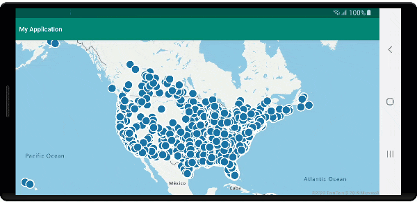

# <a name="tutorial-load-geojson-data-into-azure-maps-android-sdk"></a>教程：将 GeoJSON 数据加载到 Azure Maps Android SDK 中

本教程将指导你完成将位置数据的 GeoJSON 文件导入 Azure Maps Android SDK 的过程。 在本教程中，你将了解如何执行以下操作：

> [!div class="checklist"]
> * 将 Azure Maps 添加到 Android 应用程序。
> * 从本地文件或 Web 创建数据源并将其加载到 GeoJSON 文件中。
> * 在地图上显示数据。
> * 与地图上的数据进行交互以查看详细信息。

## <a name="prerequisites"></a>先决条件

1. 完成[快速入门：创建 Android 应用](quick-android-map.md)。 本教程将扩展该快速入门中使用的代码。
2. 下载[示例兴趣点](https://raw.githubusercontent.com/Azure-Samples/AzureMapsCodeSamples/master/AzureMapsCodeSamples/Common/data/geojson/SamplePoiDataSet.json) GeoJSON 文件。

### <a name="import-geojson-data-from-web-or-assets-folder"></a>从 Web 或资产文件夹导入 GeoJSON 数据

大多数 GeoJSON 文件将所有数据包装在 `FeatureCollection` 中。 考虑到这一点，如果将 GeoJSON 文件作为字符串加载到应用程序中，则可将其传递到特征集合的静态 `fromJson` 方法中，该方法可将字符串反序列化为 GeoJSON `FeatureCollection` 对象并添加到地图中。

以下步骤显示如何将 GeoJSON 文件导入应用程序并将其反序列化为 GeoJSON `FeatureCollection` 对象。

1. 完成[快速入门：创建 Android 应用](quick-android-map.md)，因为以下步骤基于此应用程序构建。
2. 在 Android Studio 的项目面板中，右键单击“app”文件夹，然后转到 `New > Folder > Assets Folder`。
3. 将[示例兴趣点](https://raw.githubusercontent.com/Azure-Samples/AzureMapsCodeSamples/master/AzureMapsCodeSamples/Common/data/geojson/SamplePoiDataSet.json) GeoJSON 文件拖放到 assets 文件夹中。

::: zone pivot="programming-language-java-android"

4. 打开 MainActivity.java 文件，并在 `mapControl.onReady` 事件的回调（位于 `onCreate` 方法内）中添加以下代码。 此代码使用 `importDataFromUrl` 方法将资产文件夹中的 SamplePoiDataSet.json 文件加载到数据源中，然后再将其添加到地图中。

```java
//Create a data source and add it to the map.
DataSource source = new DataSource();

//Import the geojson data and add it to the data source.
source.importDataFromUrl("asset://SamplePoiDataSet.json");

//Add data source to the map.
map.sources.add(source);
```

::: zone-end

::: zone pivot="programming-language-kotlin"

4. 打开 MainActivity.kt 文件，并在 `mapControl.onReady` 事件的回调（位于 `onCreate` 方法内）中添加以下代码。 此代码使用 `importDataFromUrl` 方法将资产文件夹中的 SamplePoiDataSet.json 文件加载到数据源中，然后再将其添加到地图中。

```kotlin
//Create a data source and add it to the map.
DataSource source = new DataSource();

//Import the geojson data and add it to the data source.
source.importDataFromUrl("asset://SamplePoiDataSet.json");

//Add data source to the map.
map.sources.add(source);
```

::: zone-end

5. 使用此代码将 GeoJSON 数据加载到数据源，我们现在需要指定该数据在地图上的显示方式。 点数据有多个不同的渲染层；[气泡层](map-add-bubble-layer-android.md)、[符号层](how-to-add-symbol-to-android-map.md)和[热度地图层](map-add-heat-map-layer-android.md)是最常用的层。 在用于导入数据的代码后面，添加以下代码，以在 `mapControl.onReady` 事件的回调的气泡层中呈现数据。

::: zone pivot="programming-language-java-android"

```java
//Create a layer and add it to the map.
BubbleLayer layer = new BubbleLayer(source);
map.layers.add(layer);
```

::: zone-end

::: zone pivot="programming-language-kotlin"

```kotlin
//Create a layer and add it to the map.
val layer = new BubbleLayer(source)
map.layers.add(layer)
```

::: zone-end

6. 在 Android Studio 的项目面板中，在路径 `app > res > layout` 下右键单击“布局”文件夹，然后转到 `New > File`。 创建名为 popup_text.xml 的新文件。
7. 打开 popup_text.xml 文件。 如果该文件在设计器视图中打开，请右键单击屏幕并选择“转到 XML”。 复制以下 XML 并将其粘贴到此文件中。 此 XML 将创建一个简单的布局，该布局通过弹出窗口使用并包含文本视图。

```xml
<?xml version="1.0" encoding="utf-8"?>
<RelativeLayout xmlns:android="http://schemas.android.com/apk/res/android"
    android:layout_width="match_parent"
    android:orientation="vertical"
    android:background="#ffffff"
    android:layout_margin="8dp"
    android:padding="10dp"

    android:layout_height="match_parent">

    <TextView
        android:id="@+id/message"
        android:layout_width="wrap_content"
        android:text=""
        android:textSize="18dp"
        android:textColor="#222"
        android:layout_height="wrap_content"
        android:width="200dp"/>

</RelativeLayout>
```

::: zone pivot="programming-language-java-android"

8. 返回到 MainActivity.java 文件，然后在气泡层的代码后面添加以下代码，以创建可重用的弹出窗口。

```java
//Create a popup and add it to the map.
Popup popup = new Popup();
map.popups.add(popup);

//Close it initially.
popup.close();
```

::: zone-end

::: zone pivot="programming-language-kotlin"

8. 返回到 MainActivity.kt 文件，然后在气泡图层的代码后面添加以下代码，以创建可重用的弹出窗口。

```kotlin
//Create a popup and add it to the map.
val popup = Popup()
map.popups.add(popup)
    
//Close it initially.
popup.close()
```

::: zone-end

9. 添加以下代码，将单击事件附加到气泡层。 单击气泡层中的气泡时，该事件将触发并从所选特征的属性中检索某些详细信息，使用 popup_text.xml 布局文件创建一个视图，将其作为内容传递到弹出窗口中，然后在特征位置显示该弹出窗口。

::: zone pivot="programming-language-java-android"

```java
//Add a click event to the layer.
map.events.add((OnFeatureClick)(feature) -> {
    //Get the first feature and it's properties.
    Feature f = feature.get(0);
    JsonObject props = f.properties();

    //Retrieve the custom layout for the popup.
    View customView = LayoutInflater.from(this).inflate(R.layout.popup_text, null);

    //Display the name and entity type information of the feature into the text view of the popup layout.
    TextView tv = customView.findViewById(R.id.message);
    tv.setText("%s\n%s",
        f.getStringProperty("Name"),
        f.getStringProperty("EntityType")
    );

    //Get the position of the clicked feature.
    Position pos = MapMath.getPosition((Point)f.geometry());

    //Set the options on the popup.
    popup.setOptions(
            //Set the popups position.
            position(pos),

            //Set the anchor point of the popup content.
            anchor(AnchorType.BOTTOM),

            //Set the content of the popup.
            content(customView)
    );

    //Open the popup.
    popup.open();

    //Return a boolean indicating if event should be consumed or continue to bubble up.
    return false;
}, layer);
```

::: zone-end

::: zone pivot="programming-language-kotlin"

```kotlin
//Add a click event to the layer.
map.events.add(OnFeatureClick { feature: List<Feature> ->
    //Get the first feature and it's properties.
    val f = feature[0]
    val props = f.properties()

    //Retrieve the custom layout for the popup.
    val customView: View = LayoutInflater.from(this).inflate(R.layout.popup_text, null)

    //Display the name and entity type information of the feature into the text view of the popup layout.
    val tv = customView.findViewById<TextView>(R.id.message)
    tv.text = String.format(
        "%s\n%s",
        f.getStringProperty("Name"),
        f.getStringProperty("EntityType")
    )

    //Get the position of the clicked feature.
    val pos = MapMath.getPosition(f.geometry() as Point?)

    //Set the options on the popup.
    popup.setOptions( //Set the popups position.
        position(pos),  //Set the anchor point of the popup content.
        anchor(AnchorType.BOTTOM),  //Set the content of the popup.
        content(customView)
    )

    //Open the popup.
    popup.open()

    //Return a boolean indicating if event should be consumed or continue to bubble up.
    false
} as OnFeatureClick, layer)
```

::: zone-end

10. 运行应用程序。 所显示地图中的气泡即代表 GeoJSON 文件中的每一个位置。 单击任意气泡将显示一个弹出窗口，其中包含所单击特征的名称和实体类型。

    

## <a name="clean-up-resources"></a>清理资源

请按照以下步骤清理本教程中的资源：

1. 关闭 Android Studio 并删除你创建的应用程序。
2. 如果在外部设备上测试了应用程序，请从该设备上卸载它。

## <a name="next-steps"></a>后续步骤

若要查看更多代码示例和交互式编码体验，请参阅：

> [!div class="nextstepaction"]
> [使用数据驱动样式表达式](data-driven-style-expressions-android-sdk.md)

> [!div class="nextstepaction"]
> [显示功能信息](display-feature-information-android.md)

> [!div class="nextstepaction"]
> [添加符号层](how-to-add-symbol-to-android-map.md)

> [!div class="nextstepaction"]
> [添加线条层](android-map-add-line-layer.md)

> [!div class="nextstepaction"]
> [添加多边形层](how-to-add-shapes-to-android-map.md)
