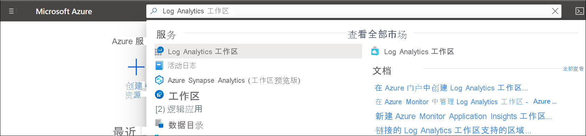

# 在 Azure 门户中创建 Log Analytics 工作区
使用“Log Analytics 工作区”菜单通过 Azure 门户创建 Log Analytics 工作区。 Log Analytics 工作区是适用于 Azure Monitor 日志数据的唯一环境。 每个工作区都有其自己的数据存储库和配置，并且数据源和解决方案均配置为将其数据存储在特定工作区中。 如果打算从以下源收集数据，则需要 Log Analytics 工作区：

* 订阅中的 Azure 资源
* 受 System Center Operations Manager 监视的本地计算机
* Configuration Manager 中的设备集合 
* Azure 存储中的诊断或日志数据

如果没有 Azure 订阅，请在开始之前创建一个[免费帐户](https://azure.microsoft.com/free/?WT.mc_id=A261C142F)。

## 登录到 Azure 门户
在 [https://portal.azure.com](https://portal.azure.com) 中登录 Azure 门户。 

## 创建工作区
在 Azure 门户中，单击“所有服务”。 在资源列表中，键入“Log Analytics”。 开始键入时，会根据输入筛选该列表。 选择“Log Analytics 工作区”。

  
单击“添加”，然后为以下选项提供值：

   * 如果选择的默认值不合适，请从下拉列表中选择要链接到的 **订阅**。
   * 对于 **资源组**，选择要使用已设置的现有资源组，还是要创建一个新资源组。  
   * 为新的 Log Analytics 工作区提供名称，如 DefaultLAWorkspace。 对于每个资源组，该名称必须是唯一的。
   * 选择可用区域。  有关详细信息，请参阅[可在哪些区域中使用 Log Analytics](https://azure.microsoft.com/regions/services/)，并在“搜索产品”字段中搜索 Azure Monitor。  

          

单击“查看 + 创建”以查看设置，然后单击“创建”以创建工作区 。 这将选择“即用即付”的默认定价层，在你开始收集到足够量的数据之前，将不会产生任何更改。 有关其他定价层的详细信息，请参阅 [Log Analytics 定价详细信息](https://azure.microsoft.com/pricing/details/log-analytics/)。

## 疑难解答
如果创建了一个工作区，该工作区已在过去 14 天内删除且处于[软删除状态](../logs/delete-workspace.md#soft-delete-behavior)，那么该操作可能会有不同的结果，具体取决于你的工作区配置：
1. 如果你提供的工作区名称、资源组、订阅和区域与已删除的工作区中的相同，则将恢复你的工作区，包括其数据、配置和连接的代理。
2. 每个资源组的工作区名称必须是唯一的。 如果你使用已经存在（也在资源组的软删除中）的工作区名称，则会收到错误消息“工作区名称‘workspace-name’不唯一”或“冲突”。 若要替换软删除，同时永久删除你的工作区并创建新的同名工作区，请按照以下步骤，先恢复工作区再执行永久删除：
   - [恢复](../logs/delete-workspace.md#recover-workspace)工作区
   - [永久删除](../logs/delete-workspace.md#permanent-workspace-delete)工作区
   - 使用相同的工作区名称创建新的工作区

## 后续步骤
现在，你已有可用的工作区，可以配置监视遥测收集、运行日志搜索分析该数据，以及添加管理解决方案以提供其他数据和分析见解。 

* 请参阅 [Azure Monitor 中 Log Analytics 工作区的监视器运行状况](../logs/monitor-workspace.md)创建用于监视工作区运行状况的预警规则。 
* 请参阅[收集要在 Log Analytics 中使用的 Azure 服务日志和指标](../essentials/resource-logs.md#send-to-log-analytics-workspace)启用通过 Azure 诊断或 Azure 存储从 Azure 资源收集数据。
