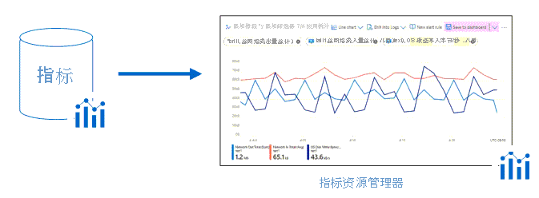

# Azure Monitor 概述

Azure Monitor 可帮助最大程度地提高应用程序和服务的可用性和性能。 它提供了一个全面的解决方案，用于从云和本地环境收集、分析和处理遥测数据。 此信息可以帮助你了解应用程序的性能，并主动识别影响应用程序及其所依赖资源的问题。

可以使用 Azure Monitor 执行的操作的几个示例包括：

- 使用 [Application Insights](app/app-insights-overview.md) 检测和诊断应用程序和依赖项的问题。
- 将基础结构问题与[用于 VM 的 Azure Monitor](vm/vminsights-overview.md) 和[用于容器的 Azure Monitor](containers/container-insights-overview.md) 关联。
- 使用 [Log Analytics](logs/log-query-overview.md) 深入查看监视数据，以进行故障排除和深入诊断。
- 通过[智能警报](alerts/alerts-smartgroups-overview.md)和[自动操作](alerts/alerts-action-rules.md)支持大规模操作。
- 使用 Azure [仪表板](visualize/tutorial-logs-dashboards.md)和[工作簿](visualize/workbooks-overview.md)创建可视化效果。
- 使用 [Azure Monitor 指标](./essentials/data-platform-metrics.md)从[监视的资源](./monitor-reference.md)收集数据。

> [!VIDEO https://www.microsoft.com/en-us/videoplayer/embed/RE4qXeL]

[!INCLUDE [azure-lighthouse-supported-service](../../includes/azure-lighthouse-supported-service.md)]

## 概述

下图提供了 Azure Monitor 的概要视图。 示意图的中心是用于指标和日志（Azure Monitor 使用的两种基本类型的数据）的数据存储。 左侧是用于填充这些[数据存储](/data-platform.md)的[监视数据源](agents/data-sources.md)。 右侧是 Azure Monitor 针对这些收集的数据执行的不同功能。 其中包括分析、警报和流式传输到外部系统等操作。

## 监视数据平台

Azure Monitor 收集的所有数据属于以下两种基本类型之一：[指标和日志](/data-platform.md)。 [指标](essentials/data-platform-metrics.md)是数字值，用于描述系统某些方面在特定时间点的情况。 指标是轻型数据，可以支持近实时方案。 [日志](logs/data-platform-logs.md)包含不同类型的已经整理成记录的数据，每种类型都有不同的属性集。 与性能数据一样，事件和跟踪等遥测数据也作为日志存储，因此，可将它们合并以进行分析。

Azure 门户中的“概述”页会直接显示 Azure Monitor 针对许多 Azure 资源收集的数据。 例如，在查看任一虚拟机时，多个图表会显示性能指标。 单击任一图形会在 Azure 门户上的[指标资源管理器](essentials/metrics-charts.md)中打开数据，可在其中绘制多个指标在不同时间段的值的图表。  可以通过交互方式查看图表，也可以将其固定到某个仪表板，与其他可视化效果一起查看。

可以使用[查询](logs/log-query-overview.md)来分析 Azure Monitor 收集的日志数据，这些查询可以快速检索、合并和分析所收集的数据。  可以使用 Azure 门户中的 [Log Analytics](./logs/log-query-overview.md) 创建和测试查询。 然后可以直接使用不同的工具分析数据，或者保存查询以便与[可视化效果](visualizations.md)或[警报规则](alerts/alerts-overview.md)配合使用。

Azure Monitor 使用 [Kusto 查询语言](/azure/kusto/query/)的某个版本，该查询语言适用于简单的日志查询，但也包括高级功能，例如聚合、联接、智能分析。 可以通过[多个课程](logs/get-started-queries.md)快速了解此查询语言。  特定指南提供给已熟悉 [SQL](log-query/sql-cheatsheet.md) 和 [Splunk](log-query/splunk-cheatsheet.md) 的用户。

## Azure Monitor 收集哪些数据？

Azure Monitor 可从[各种源](monitor-reference.md)收集数据。 这涉及你的应用程序、任意操作系统和它所依赖的服务，直至平台本身。 Azure Monitor 从以下每个层收集数据：

- **应用程序监视数据**：有关编写的代码的性能和功能的数据，不管平台是什么。
- **来宾 OS 监视数据**：有关运行应用程序的操作系统的数据。 此应用程序可以在 Azure 中运行，也可以在其他云中或本地运行。 
- **Azure 资源监视数据**：有关 Azure 资源操作的数据。
- **Azure 订阅监视数据**：有关 Azure 订阅操作和管理的数据，以及有关 Azure 本身运行状况和操作的数据。 
- **Azure 租户监视数据**：有关租户级 Azure 服务（例如 Azure Active Directory）操作的数据。

在创建 Azure 订阅并开始添加虚拟机和 Web 应用等资源后，Azure Monitor 会立即开始收集数据。  [活动日志](essentials/platform-logs-overview.md)记录创建或修改资源的时间。 [指标](/data-platform.md)告知资源的性能如何，以及该资源消耗的资源。 

[启用诊断](essentials/platform-logs-overview.md)，将正在收集的数据扩展到资源的内部操作中。  [添加代理](agents/agents-overview.md)来计算资源，以收集其来宾操作系统中的遥测数据。 

使用 [Application Insights](app/app-insights-overview.md) 启用对应用程序的监视，以收集详细信息，包括页面视图、应用程序请求和异常。 通过配置[可用性测试](app/monitor-web-app-availability.md)来模拟用户流量，进一步验证应用程序的可用性。

### 自定义来源

Azure Monitor 可以使用[数据收集器 API](logs/data-collector-api.md) 从任何 REST 客户端收集日志数据。 这样，便可以创建自定义监视方案，并将监视范围扩展到不通过其他源公开遥测数据的资源。

## 洞察力
仅当能够有利于洞察计算环境的操作时，监视数据才有作用。 [见解](monitor-reference.md#insights-and-core-solutions)为特定 Azure 服务提供自定义监视体验。 它们只需最少的配置，并且可提高你对关键资源操作的可见性。

### Application Insights
无论 Web 应用程序托管在云中还是本地，[Application Insights](app/app-insights-overview.md) 都可以监视其可用性、性能和使用情况。 它利用 Azure Monitor 中的强大数据分析平台来提供应用程序操作的深入见解。 它使你可以诊断错误，无需等到用户报告这些问题。 Application Insights 包含各种开发工具的连接点，并与 Visual Studio 集成以支持 DevOps 过程。

### 用于容器的 Azure Monitor
[用于容器的 Azure Monitor](containers/container-insights-overview.md) 监视部署到 Azure Kubernetes 服务 (AKS) 上托管的托管 Kubernetes 群集的容器工作负载的性能。 它通过指标 API 从 Kubernetes 中提供的控制器、节点和容器收集指标，来提供性能可见性。 容器日志也会被收集。  从 Kubernetes 群集启用监视后，将通过适用于 Linux 的 Log Analytics 代理的容器化版本自动收集这些指标和日志。

### 用于 VM 的 Azure Monitor
[用于 VM 的 Azure Monitor](vm/vminsights-overview.md) 可以大规模监视 Azure 虚拟机 (VM)。 它分析 Windows VM 和 Linux VM 的性能和运行状况，并确定它们的各种进程及其对外部进程的相互依赖关系。 该解决方案支持监视本地或其他云提供程序中托管的 VM 的性能和应用程序依赖项。  

## 应对关键状况
除了让你以交互方式分析监视数据以外，有效的监视解决方案必须能够主动应对所收集的数据中指出的关键状况。 应对措施可以是向负责调查问题的管理员发送短信或邮件。 或者，可以启动自动化过程来尝试纠正错误状况。

### 警报
[Azure Monitor 中的警报](alerts/alerts-overview.md)会主动发送有关关键状况的通知，并可能尝试采取纠正措施。 基于指标的警报规则根据数值提供近乎实时的警报。 基于日志的规则允许跨多个源的数据的复杂逻辑。

Azure Monitor 中的警报规则使用[操作组](alerts/action-groups.md)，其中包含可在多个规则之间共享的独特接收者和操作集。 操作组可根据要求执行多种操作，例如，使用 Webhook 来让警报启动外部操作，或者与 ITSM 工具集成。

### 自动缩放
自动缩放是指在处理应用程序负载时让适当数量的资源运行。 创建使用 Azure Monitor 收集的指标的规则，以确定负载增加后何时自动添加资源。 删除处于空闲状态的资源，以节省资金。 可以指定最小和最大实例数，并创建逻辑来控制何时要增加或减少资源。

## 可视化监视数据
图表和表等[可视化效果](visualizations.md)是用于汇总监视数据并向不同的受众呈现这些数据的有效工具。 Azure Monitor 具有自身的可视化监视数据的功能，并可利用其他 Azure 服务将这些数据发布到不同的受众。

### 仪表板
[Azure 仪表板](../azure-portal/azure-portal-dashboards.md)允许将不同类型的数据合并到 [Azure 门户](https://portal.azure.com)的单个窗格中。 可以选择与其他 Azure 用户共享仪表板。 将任意日志查询或指标图表的输出添加到 Azure 仪表板。 例如，可以创建一个包含多个磁贴的仪表板，这些磁贴分别用于显示指标图、活动日志表、Application Insights 的使用情况图表，以及日志查询的输出。

### 工作簿
[工作簿](visualize/workbooks-overview.md)提供了灵活的画布，用于数据分析和在 Azure 门户中创建丰富的可视化报表。 使用工作簿可以在整个 Azure 中接入多个数据源，并将其组合成统一的交互式体验。 使用 Insights 随附的工作簿或从预定义模板创建自己的工作簿。

### Power BI
[Power BI](https://powerbi.microsoft.com) 是业务分析服务，可提供跨各种数据源的交互式可视化效果。 它是将数据提供给组织内外的其他人的有效方法。 可将 Power BI 配置为[自动从 Azure Monitor 导入日志数据](./visualize/powerbi.md)，以利用这些附加的可视化效果。

## 集成和导出数据
通常，我们需要将 Azure Monitor 与其他系统集成，并生成使用监视数据的自定义解决方案。 其他 Azure 服务使用 Azure Monitor 来提供这种集成。

### 事件中心
[Azure 事件中心](../event-hubs/index.yml)是流式处理平台和事件引入服务。 它可以使用任何实时分析提供程序或批处理/存储适配器来转换和存储数据。 使用事件中心可[将 Azure Monitor 数据流式传输](essentials/stream-monitoring-data-event-hubs.md)到合作伙伴 SIEM 和监视工具。

### 逻辑应用
使用[逻辑应用](https://azure.microsoft.com/services/logic-apps)服务可以通过与不同系统和服务集成的工作流将任务和业务流程自动化。 可以使用可在 Azure Monitor 中读取和写入指标和日志的活动。 这允许你生成与各种其他系统集成的工作流。

### API
可以使用多个 API 从/向 Azure Monitor 读取和写入指标与日志，以及访问生成的警报。 还可以配置和检索警报。 这样，几乎可以不受限制地生成与 Azure Monitor 集成的自定义解决方案。

## 后续步骤
了解有关以下方面的详细信息：

* [指标和日志](/data-platform.md)，以了解由 Azure Monitor 收集的数据。
* [数据源](agents/data-sources.md)，了解应用程序的不同组件如何发送遥测数据。
* [日志查询](logs/log-query-overview.md)，以便分析所收集的数据。
* 用于监视云应用程序和服务的[最佳做法](/azure/architecture/best-practices/monitoring)。
