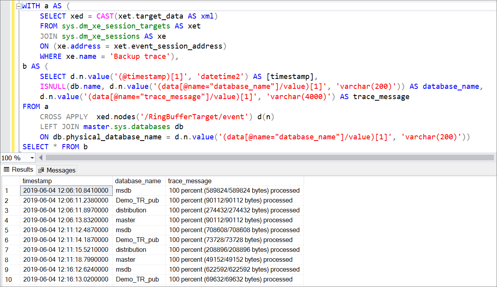

# <a name="monitor-backup-activity-for-azure-sql-managed-instance"></a>监视 Azure SQL 托管实例的备份活动 
[!INCLUDE[appliesto-sqlmi](../includes/appliesto-sqlmi.md)]

本文介绍如何配置扩展事件 (XEvent) 会话，以监视 [Azure SQL 托管实例](sql-managed-instance-paas-overview.md)的备份活动。 

## <a name="overview"></a>概述

Azure SQL 托管实例在备份活动期间发出事件（也称为[扩展事件或 XEvent](../database/xevent-db-diff-from-svr.md)）以用于报告。 配置 XEvent 会话可以跟踪 msdb 数据库中的备份状态、备份类型、大小、时间和位置等信息。 此信息可以与备份监视软件集成，还可用于 Enterprise 审核。 

Enterprise 审核可能需要成功备份、备份时间和备份持续时间的证明。

## <a name="configure-xevent-session"></a>配置 XEvent 会话

使用扩展事件 `backup_restore_progress_trace` 记录 SQL 托管实例备份的进度。 根据需要修改 XEvent 会话，以跟踪你感兴趣的业务信息。 这些 T-SQL 代码片段将 XEvent 会话存储在环形缓冲区中，但也可以写入 [Azure Blob 存储](../database/xevent-code-event-file.md)。 在环形缓冲区中存储数据的 XEvent 会话有大约 1000 条消息的限制，所以应该只用于跟踪最近的活动。 此外，环形缓冲区数据在故障转移时也会丢失。 因此，对于备份的历史记录，请改为写入事件文件。 

### <a name="simple-tracking"></a>简单跟踪

配置一个简单的 XEvent 会话，以捕获有关完整备份的简单事件。 此脚本收集数据库的名称、已处理的总字节数以及备份完成时间。

使用 Transact-SQL (T-SQL) 配置简单的 XEvent 会话： 


```sql
CREATE EVENT SESSION [Simple backup trace] ON SERVER
ADD EVENT sqlserver.backup_restore_progress_trace(
WHERE operation_type = 0
AND trace_message LIKE '%100 percent%')
ADD TARGET package0.ring_buffer
WITH(STARTUP_STATE=ON)
GO
ALTER EVENT SESSION [Simple backup trace] ON SERVER
STATE = start;
```


### <a name="verbose-tracking"></a>详细跟踪

配置一个详细的 XEvent 会话，以跟踪有关备份活动的更多详细信息。 这个脚本可以捕获完整备份、差异备份和日志备份的启动和完成。 由于这个脚本更详细，它填充环形缓冲区的速度更快，因此条目回收的速度可能比简单脚本更快。 

使用 Transact-SQL (T-SQL) 配置详细的 XEvent 会话： 

```sql
CREATE EVENT SESSION [Verbose backup trace] ON SERVER 
ADD EVENT sqlserver.backup_restore_progress_trace(
    WHERE (
              [operation_type]=(0) AND (
              [trace_message] like '%100 percent%' OR 
              [trace_message] like '%BACKUP DATABASE%' OR [trace_message] like '%BACKUP LOG%'))
       )
ADD TARGET package0.ring_buffer
WITH (MAX_MEMORY=4096 KB,EVENT_RETENTION_MODE=ALLOW_SINGLE_EVENT_LOSS,
       MAX_DISPATCH_LATENCY=30 SECONDS,MAX_EVENT_SIZE=0 KB,MEMORY_PARTITION_MODE=NONE,
       TRACK_CAUSALITY=OFF,STARTUP_STATE=ON)

ALTER EVENT SESSION [Verbose backup trace] ON SERVER
STATE = start;

```

## <a name="monitor-backup-progress"></a>监视备份进度 

创建 XEvent 会话后，可以使用 Transact-SQL (T-SQL) 来查询环形缓冲区结果，并监视备份进度。 启动 XEvent 后，它将收集所有备份事件，因此条目大约每 5-10 分钟就会被添加到会话中一次。  

### <a name="simple-tracking"></a>简单跟踪

下面的 Transact-SQL (T-SQL) 代码查询简单的 XEvent 会话，并返回数据库的名称、已处理的字节总数以及备份完成的时间： 

```sql 
WITH
a AS (SELECT xed = CAST(xet.target_data AS xml)
FROM sys.dm_xe_session_targets AS xet
JOIN sys.dm_xe_sessions AS xe
ON (xe.address = xet.event_session_address)
WHERE xe.name = 'Backup trace'),
b AS(SELECT
d.n.value('(@timestamp)[1]', 'datetime2') AS [timestamp],
ISNULL(db.name, d.n.value('(data[@name="database_name"]/value)[1]', 'varchar(200)')) AS database_name,
d.n.value('(data[@name="trace_message"]/value)[1]', 'varchar(4000)') AS trace_message
FROM a
CROSS APPLY  xed.nodes('/RingBufferTarget/event') d(n)
LEFT JOIN master.sys.databases db
ON db.physical_database_name = d.n.value('(data[@name="database_name"]/value)[1]', 'varchar(200)'))
SELECT * FROM b
```

下面的屏幕截图展示了上述查询的一个输出示例： 



在本示例中，在 2 小时 30 分钟内自动备份了 5 个数据库，XEvent 会话中有 130 个条目。 

### <a name="verbose-tracking"></a>详细跟踪 

以下 Transact-SQL (T-SQL) 代码查询详细的 XEvent 会话并返回数据库的名称，以及完整备份、差异备份和日志备份的启动和完成。 


```sql
WITH
a AS (SELECT xed = CAST(xet.target_data AS xml)
FROM sys.dm_xe_session_targets AS xet
JOIN sys.dm_xe_sessions AS xe
ON (xe.address = xet.event_session_address)
WHERE xe.name = 'Verbose backup trace'),
b AS(SELECT
d.n.value('(@timestamp)[1]', 'datetime2') AS [timestamp],
ISNULL(db.name, d.n.value('(data[@name="database_name"]/value)[1]', 'varchar(200)')) AS database_name,
d.n.value('(data[@name="trace_message"]/value)[1]', 'varchar(4000)') AS trace_message
FROM a
CROSS APPLY  xed.nodes('/RingBufferTarget/event') d(n)
LEFT JOIN master.sys.databases db
ON db.physical_database_name = d.n.value('(data[@name="database_name"]/value)[1]', 'varchar(200)'))
SELECT * FROM b
```

下面的屏幕截图展示了 XEvent 会话中的一个完整备份示例：

:::image type="content" source="media/backup-activity-monitor/output-with-full.png" alt-text="显示完整备份的 XEvent 输出":::

下面的屏幕截图展示了 XEvent 会话中差异备份的一个输出示例：

:::image type="content" source="media/backup-activity-monitor/output-with-differential.png" alt-text="显示差异备份的 XEvent 输出":::


## <a name="next-steps"></a>后续步骤

完成备份后，可以[还原到时间点](point-in-time-restore.md)或[配置长期保留策略](long-term-backup-retention-configure.md)。 

若要了解详细信息，请参阅[自动备份](../database/automated-backups-overview.md)。 
