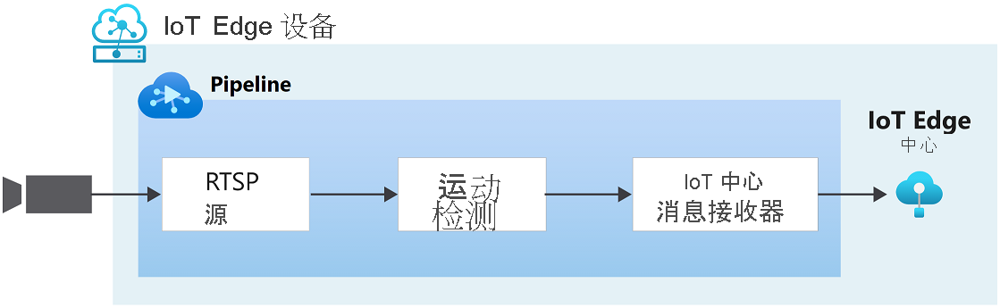

# 快速入门：检测运动并发出事件

本快速入门将引导你完成开始使用 Azure 视频分析器的步骤。 它将 Azure VM 用作 IoT Edge 设备和模拟的实时视频流。 完成设置步骤后，你将能通过视频管道运行模拟实时视频流，该管道可检测和报告该流中的任何运动。 下图显示了该管道的图形表示形式。

> [!div class="mx-imgBorder"]
> :::image type="content" source="./media/get-started-detect-motion-emit-events/motion-detection.svg" alt-text="检测运动":::

::: zone pivot="programming-language-csharp"
[!INCLUDE [header](includes/detect-motion-emit-events-quickstart/csharp/header.md)]
::: zone-end

::: zone pivot="programming-language-python"
[!INCLUDE [header](includes/detect-motion-emit-events-quickstart/python/header.md)]
::: zone-end

## 先决条件

::: zone pivot="programming-language-csharp"
[!INCLUDE [prerequisites](./includes/common-includes/csharp-prerequisites.md)]
::: zone-end

::: zone pivot="programming-language-python"
[!INCLUDE [prerequisites](./includes/common-includes/python-prerequisites.md)]
::: zone-end

## 设置 Azure 资源

[!INCLUDE [resources](./includes/common-includes/azure-resources.md)]

## 概述

此图显示本快速入门中信号的流动方式。 [Edge 模块](https://github.com/Azure/video-analyzer/tree/main/edge-modules/sources/rtspsim-live555)模拟托管实时流式处理协议 (RTSP) 服务器的 IP 相机。 [RTSP 源](pipeline.md#rtsp-source)节点从该服务器拉取视频源，并将视频帧发送到[运动检测处理器](pipeline.md#motion-detection-processor)节点。 通过运动检测处理器节点，你可以在实时视频中检测运动。 它会检查传入的视频帧并确定视频中是否有移动。 如果检测到运动，它会将视频帧传递到管道中的下一个节点，并发出事件。 最后，任何发出的事件都会发送到 IoT 中心消息接收器，这些事件在此接收器中被发布到 IoT 中心。

## 设置开发环境

::: zone pivot="programming-language-csharp"
[!INCLUDE [setup development environment](./includes/set-up-dev-environment/csharp/csharp-set-up-dev-env.md)]
::: zone-end

::: zone pivot="programming-language-python"
[!INCLUDE [setup development environment](./includes/set-up-dev-environment/python/python-set-up-dev-env.md)]
::: zone-end

## 观看示例视频

::: zone pivot="programming-language-csharp"
[!INCLUDE [review-sample-video](./includes/detect-motion-emit-events-quickstart/csharp/review-sample-video.md)]
::: zone-end

::: zone pivot="programming-language-python"
[!INCLUDE [review-sample-video](./includes/detect-motion-emit-events-quickstart/python/review-sample-video.md)]
::: zone-end

## 检查示例文件

::: zone pivot="programming-language-csharp"
[!INCLUDE [examine-sample-files](./includes/detect-motion-emit-events-quickstart/csharp/examine-sample-files.md)]
::: zone-end

::: zone pivot="programming-language-python"
[!INCLUDE [examine-sample-files](./includes/detect-motion-emit-events-quickstart/python/examine-sample-files.md)]
::: zone-end

## 生成并部署部署清单

::: zone pivot="programming-language-csharp"
[!INCLUDE [generate-deploy-deployment-manifest](./includes/detect-motion-emit-events-quickstart/csharp/generate-deploy-deployment-manifest.md)]
::: zone-end

::: zone pivot="programming-language-python"
[!INCLUDE [generate-deploy-deployment-manifest](./includes/detect-motion-emit-events-quickstart/python/generate-deploy-deployment-manifest.md)]
::: zone-end

## 准备监视事件

::: zone pivot="programming-language-csharp"
[!INCLUDE [prepare-monitor-events](./includes/detect-motion-emit-events-quickstart/csharp/prepare-monitor-events.md)]
::: zone-end

::: zone pivot="programming-language-python"
[!INCLUDE [prepare-monitor-events](./includes/detect-motion-emit-events-quickstart/python/prepare-monitor-events.md)]
::: zone-end

## 运行示例程序

::: zone pivot="programming-language-csharp"
[!INCLUDE [run-sample-program](./includes/detect-motion-emit-events-quickstart/csharp/run-sample-program.md)]
::: zone-end

::: zone pivot="programming-language-python"
[!INCLUDE [run-sample-program](./includes/detect-motion-emit-events-quickstart/python/run-sample-program.md)]
::: zone-end

## 解释结果

::: zone pivot="programming-language-csharp"
[!INCLUDE [interpret-results](includes/detect-motion-emit-events-quickstart/csharp/interpret-results.md)]
::: zone-end

::: zone pivot="programming-language-python"
[!INCLUDE [interpret-results](includes/detect-motion-emit-events-quickstart/python/interpret-results.md)]
::: zone-end

## 清理资源

如果想学习其他快速入门，则请保留所创建的资源。 否则，请在 Azure 门户中，转到资源组，选择运行本快速入门所用的资源组，然后删除所有资源。

## 后续步骤

- 按照[使用自己的模型分析实时视频](analyze-live-video-use-your-model-http.md)快速入门操作，将 AI 应用于实时视频源。
- 查看高级用户面临的其他挑战：

  - 使用支持 RTSP 的 [IP 相机](https://en.wikipedia.org/wiki/IP_camera)，而不是使用 RTSP 模拟器。 可以在 [ONVIF 一致性](https://www.onvif.org/conformant-products/)产品页上找到支持 RTSP 的 IP 相机。 查找符合配置文件 G、S 或 T 的设备。
  - 使用 AMD64 或 x64 Linux 设备，而不使用 Azure 中的 Linux VM。 此设备必须与 IP 相机位于同一网络中。 按照[在 Linux 上安装 Azure IoT Edge 运行时](../../iot-edge/how-to-install-iot-edge.md?preserve-view=true&view=iotedge-2020-11)中的说明进行操作。 然后按照[将首个 IoT Edge 模块部署到虚拟 Linux 设备](../../iot-edge/quickstart-linux.md?preserve-view=true&view=iotedge-2020-11)中的说明进行操作，将设备注册到 Azure IoT 中心。
