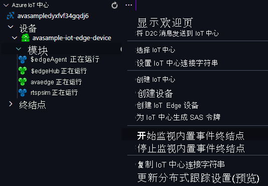

你将使用视频分析器 Edge 模块来检测传入的实时视频流中的运动并将事件发送到 IoT 中心。 若要查看这些事件，请执行以下步骤：

1. 在 Visual Studio Code 中打开“资源管理器”窗格，然后在左下角查找“Azure IoT 中心”。
1. 展开“设备”节点。
1. 右键单击 avasample-iot-edge-device，选择“开始监视内置事件终结点” 。

   

> [!NOTE]
> 系统可能会要求你提供 IoT 中心的内置终结点信息。 若要获取此信息，请在 Azure 门户中导航到 IoT 中心，然后在左侧导航窗格中查找“内置终结点”选项。 单击此处，在“与事件中心兼容的终结点”部分下查找“与事件中心兼容的终结点” 。 复制并使用框中的文本。 终结点将如下所示：  `Endpoint=sb://iothub-ns-xxx.servicebus.windows.net/;SharedAccessKeyName=iothubowner;SharedAccessKey=XXX;EntityPath=<IoT Hub name>`
