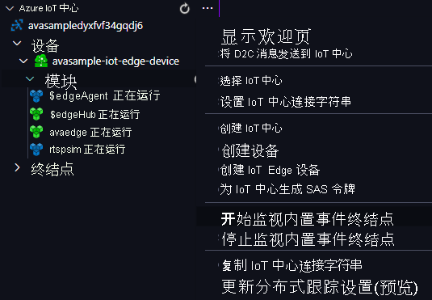

你将使用 Azure 视频分析器模块来检测传入的实时视频流中的运动并将事件发送到 IoT 中心。 若要查看这些事件，请执行以下步骤：

1. 在 Visual Studio Code 中打开“资源管理器”窗格，然后在左下角查找“Azure IoT 中心”。
1. 展开“设备”节点。
1. 右键单击 avasample-iot-edge-device，选择“开始监视内置事件终结点” 。

[!INCLUDE [provide-builtin-endpoint](../../common-includes/provide-builtin-endpoint.md)]
