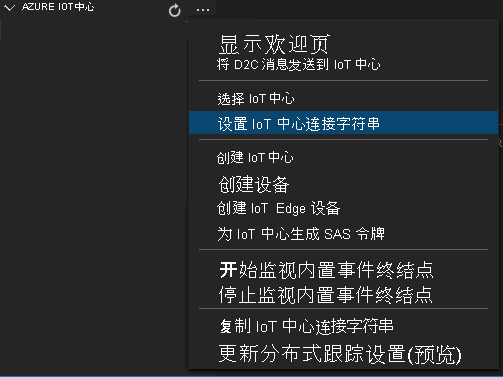

部署清单定义要部署到边缘设备的模块。 它还定义了这些模块的配置设置。

请按照以下步骤从模板文件生成清单，然后将其部署到边缘设备。

1. 打开 Visual Studio Code。
1. 在“AZURE IOT 中心”窗格旁，选择“更多操作”图标以设置 IoT 中心连接字符串 。 可以从 src/cloud-to-device-console-app/appsettings.json 文件复制该字符串。

    

    [!INCLUDE [provide-builtin-endpoint](../../common-includes/provide-builtin-endpoint.md)]
1. 右键单击“src/edge/deployment.template.json”并选择“生成 IoT Edge 部署清单”。

   

   此操作应在 src/edge/config 文件夹中创建一个名为“deployment.amd64.json”的清单文件 。
1. 右键单击“src/edge/config/deployment.amd64.json”，选择“为单个设备创建部署”，然后选择边缘设备的名称 。

   
1. 如果系统提示你选择 IoT 中心设备，请从下拉菜单中选择“avasample-iot-edge-device”。
1. 大约 30 秒后，在该窗口的左下角刷新 Azure IoT 中心。 边缘设备现在显示以下已部署的模块：

    - 视频分析器 Edge 模块（模块名称为 `avaedge`）
    - 实时流式处理协议 (RTSP) 模拟器（模块名称为 `rtspsim`）
