# <a name="tutorial-use-computer-vision-to-generate-image-metadata-in-azure-storage"></a>教程：使用计算机视觉在 Azure 存储中生成图像元数据

本教程介绍如何将 Azure 计算机视觉服务集成到 Web 应用中，以便生成已上传图像的元数据。 这对于[数字资产管理 (DAM)](../overview.md#computer-vision-for-digital-asset-management) 方案非常有用，例如，如果公司希望为其所有图像快速生成描述性标题或可搜索的关键字。

你将使用 Visual Studio 编写 MVC Web 应用，该应用接受用户上传的图像，并会将其存储在 Azure Blob 存储中。 你将了解如何使用 C# 读取和写入 Blob，以及如何使用 Blob 元数据将其他信息附加到你创建的 Blob。 然后，将用户上传的每个图像提交到计算机视觉 API，以生成图像的标题和搜索元数据。 最后，你可以使用 Visual Studio 将应用部署到云。

本教程演示如何：

> [!div class="checklist"]
> * 使用 Azure 门户创建存储帐户和存储容器
> * 在 Visual Studio 中创建 Web 应用并将其部署到 Azure
> * 使用计算机视觉 API 提取图像中的信息
> * 将元数据附加到 Azure 存储图像
> * 使用 [Azure 存储资源管理器](http://storageexplorer.com/)查看图像元数据

> [!TIP]
> [使用计算机视觉生成元数据](#Exercise5)部分与图像分析的相关性最大。 如果只想查看如何将图像分析集成到已建立的应用程序，请跳到该步骤。

如果没有 Azure 订阅，请在开始之前创建一个[免费帐户](https://azure.microsoft.com/free/cognitive-services)。 

## <a name="prerequisites"></a>先决条件

- [Visual Studio 2017 Community 版本](https://www.visualstudio.com/products/visual-studio-community-vs.aspx)或更高版本，并已安装“ASP.NET 和 Web 开发”或“Azure 开发”工作负荷。
- 已安装 [Azure 存储资源管理器](http://storageexplorer.com/)工具。

<a name="Exercise1"></a>
## <a name="create-a-storage-account"></a>创建存储帐户

在本部分，我们将使用 [Azure 门户](https://portal.azure.com?WT.mc_id=academiccontent-github-cxa)创建一个存储帐户。 然后创建一对容器：一个容器用于存储用户上传的图像，另一个容器用于存储从上传的图像生成的图像缩略图。

1. 在浏览器中，打开 [Azure 门户](https://portal.azure.com?WT.mc_id=academiccontent-github-cxa)。 系统要求登录时，请使用 Microsoft 帐户登录。
1. 若要创建存储帐户，请单击左侧功能区中的“+ 创建资源”。 然后依次单击“存储”和“存储帐户”。

    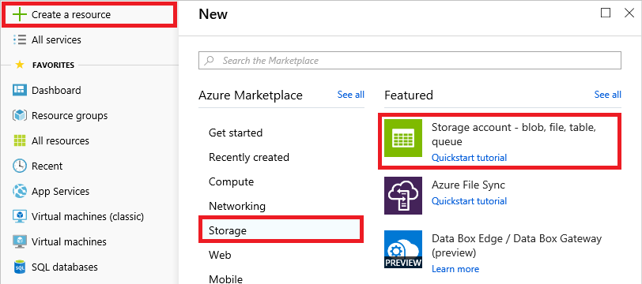
1. 在“名称”字段中输入存储帐户的唯一名称，并确保其旁边出现绿色选中标记。 该名称很重要，因为它构成 URL 的一部分，通过该 URL 可以访问在此帐户下创建的 blob。 将存储帐户放在名为“IntellipixResources”的新资源组中，然后选择离你最近的区域。 单击屏幕底部的“查看 + 创建”按钮以创建新的存储帐户，到此完成操作。
    > [!NOTE]
    > 存储帐户的名称必须为 3 到 24 个字符，并且只能包含数字和小写字母。 此外，输入的名称在 Azure 中必须是唯一的。 如果其他人已选择同一名称，系统会通知你，指出该名称不可用，并在“名称”字段中以红色感叹号标记。
   
    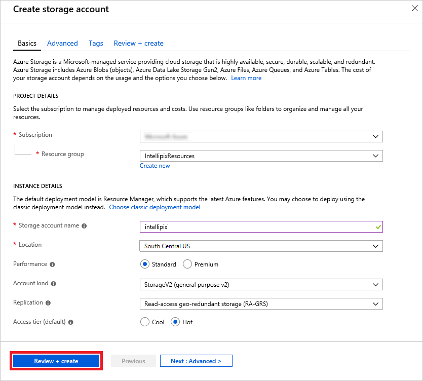
1. 单击左侧功能区中的“资源组”。 然后单击“IntellipixResources”资源组。

    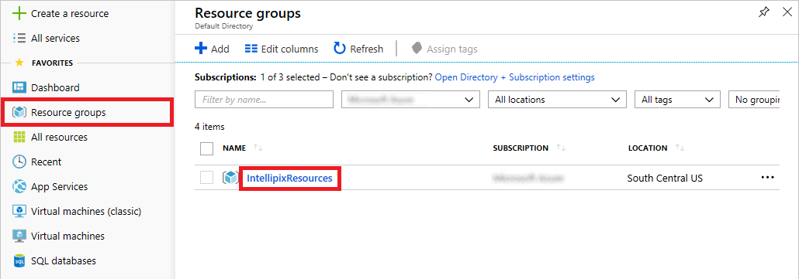
1. 在为资源组打开的选项卡中，单击你创建的存储帐户。 如果存储帐户尚不存在，可以单击选项卡顶部的“刷新”，直到它出现。

    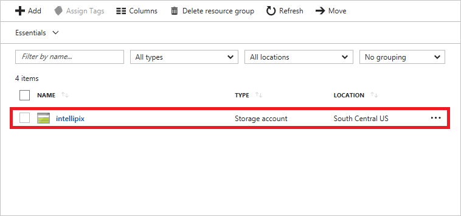
1. 在存储帐户的选项卡中，单击“Blob”以查看与此帐户关联的容器列表。

    

1. 此存储帐户当前没有容器。 创建 blob 前，必须先创建用于存储 blob 的容器。 单击“+ 容器”来新建容器。 在“名称”字段中键入 `photos`，然后选择“Blob”作为“公共访问级别”。 然后单击“确定”，创建一个名为“photos”的容器。

    > 默认情况下，容器及其内容均为私有。 选择“Blob”作为访问级别，会让“photos”容器中的 Blob 可供公开访问，但不会让容器本身公开。 这正是你想要的，因为存储在“photos”容器中的图像会从 Web 应用链接到。 

    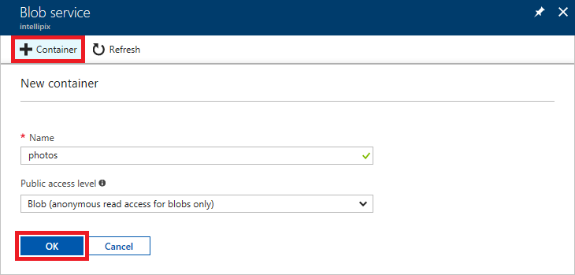

1. 重复上一步，创建名为“thumbnails”的容器，再次确保容器的“公共访问级别”设置为“Blob”。
1. 确认这两个容器都显示在此存储帐户的容器列表中，并且名称拼写正确。

    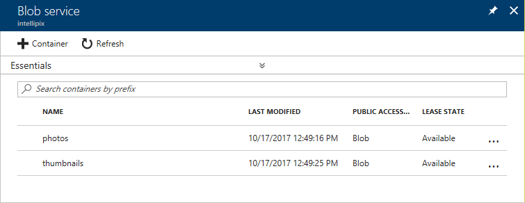

1. 关闭“Blob 服务”屏幕。 单击存储帐户屏幕左侧菜单中的“访问密钥”，然后单击“key1”的“密钥”旁边的“复制”按钮。 将此访问密钥粘贴到你喜欢的文本编辑器中，供以后使用。

    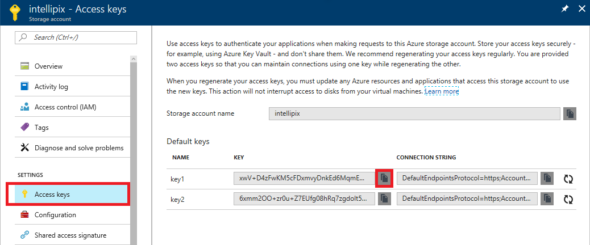

现在，你已创建一个存储帐户和用于存储图像的容器，存储帐户可以保存上传到要生成应用的图像。 

<a name="Exercise2"></a>
## <a name="run-azure-storage-explorer"></a>运行 Azure 存储资源管理器

[Azure 存储资源管理器](http://storageexplorer.com/)是一个免费工具，它提供了一个图形界面，用于在运行 Windows、macOS 和 Linux 的 PC 上与 Azure 存储配合使用。 其中大部分功能与 Azure 门户相同，同时还提供其他一些功能，例如查看 Blob 元数据。 在本部分，你将使用 Microsoft Azure 存储资源管理器查看在上一部分中创建的容器。

1. 如果你尚未安装存储资源管理器或希望确保运行最新版本，请转到 http://storageexplorer.com/ 并下载安装。
1. 启动存储资源管理器。 当系统要求你登录时，请使用 Microsoft 帐户登录&mdash;与登录 Azure 门户时使用的帐户相同。 如果在存储资源管理器的左窗格中看不到存储帐户，请单击下面突出显示的“管理帐户”按钮，并确保 Microsoft 帐户和创建存储帐户时使用的订阅已添加到存储资源管理器。

    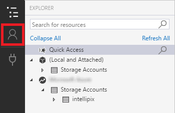

1. 单击存储帐户旁边的小箭头以显示其内容，然后单击“Blob 容器”旁边的箭头。 确认列表中有你创建的容器。

    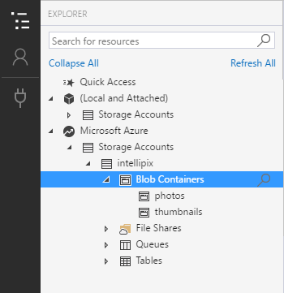

这些容器当前为空，但在部署应用并开始上传照片后，情况会改变。 安装存储资源管理器后，可以轻松查看应用写入 Blob 存储中的内容。

<a name="Exercise3"></a>
## <a name="create-a-new-web-app-in-visual-studio"></a>在 Visual Studio 中创建新的 Web 应用

在本部分，你将在 Visual Studio 中创建新的 Web 应用，并添加代码来实现上传图像、将图像写入 Blob 存储以及将其显示在网页中所需的基本功能。

1. 启动 Visual Studio 并使用“文件 -> 新建 -> 项目””命令创建名为“Intellipix”（“Intelligent Pictures”的缩写）的新 Visual C#“ASP.NET Web 应用程序”项目。

    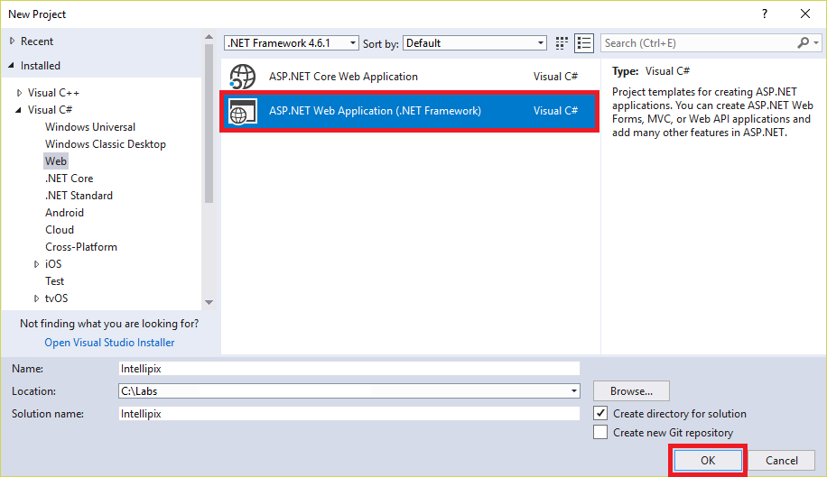

1. 在“新建 ASP.NET Web 应用程序”对话框中，确保已选中“MVC”。 然后单击“确定”。

    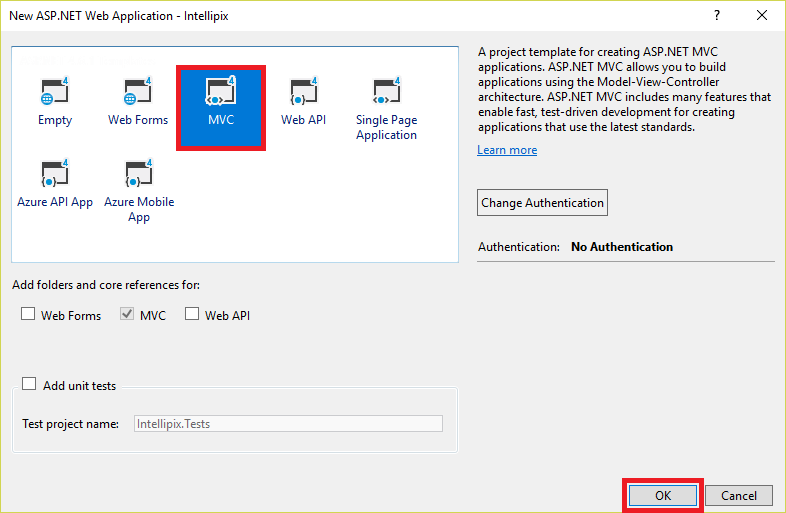

1. 请花一点时间查看解决方案资源管理器中的项目结构。 除其他内容外，有一个名为“Controllers”的文件夹，用于保存项目的 MVC 控制器，还有一个名为“Views”的文件夹，用于保存项目的视图。 实现应用程序时，你将用到这些文件夹和其他文件夹中的资产。

    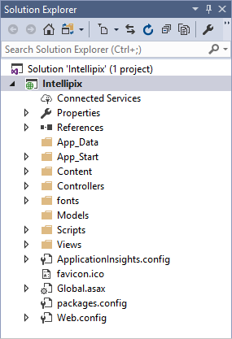

1. 使用 Visual Studio 的“调试 -> 启动而不调试”命令（或按“Ctrl+F5”），在浏览器中启动应用程序。 应用程序的当前状态显示如下：

    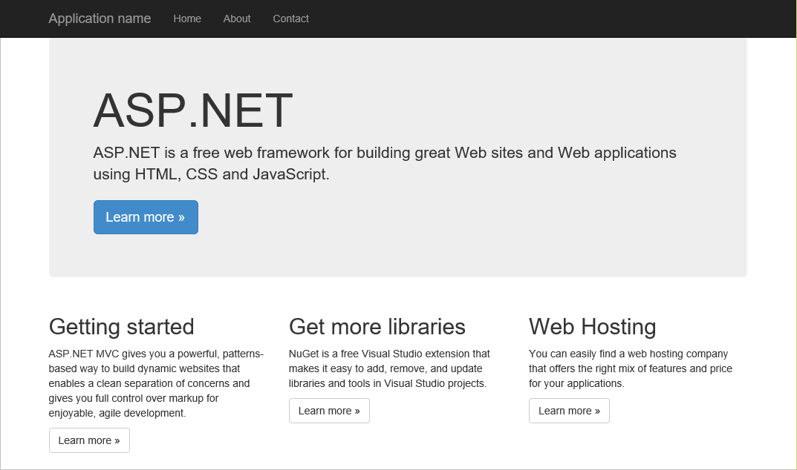

1. 关闭浏览器并返回到 Visual Studio。 在解决方案资源管理器中，右键单击“Intellipix”项目，然后选择“管理 NuGet 包...”。单击“浏览”。 然后，在搜索框中键入 `imageresizer` 并选择名为“ImageResizer”的 NuGet 包。 最后，单击“安装”，以安装该包的最新稳定版本。 ImageResizer 中包含根据上传到应用的图像创建图像缩略图时要使用的 API。 确定所有更改并接受系统显示的任何许可证。

    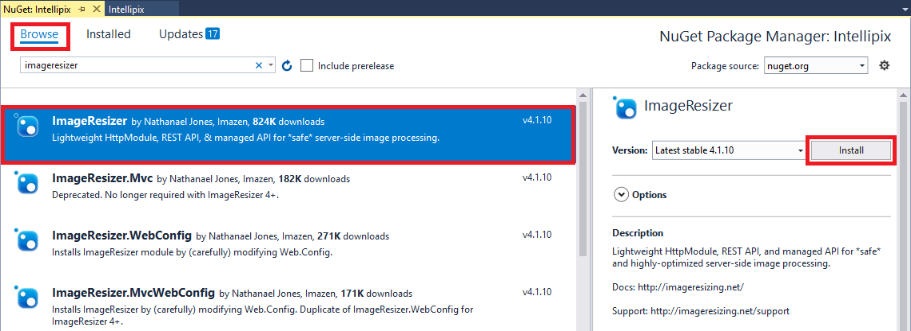

1. 重复此过程，将名为“WindowsAzure.Storage”的 NuGet 包添加到项目中。 此包包含从 .NET 应用程序访问 Azure 存储时要使用的 API。 确定所有更改并接受系统显示的任何许可证。

    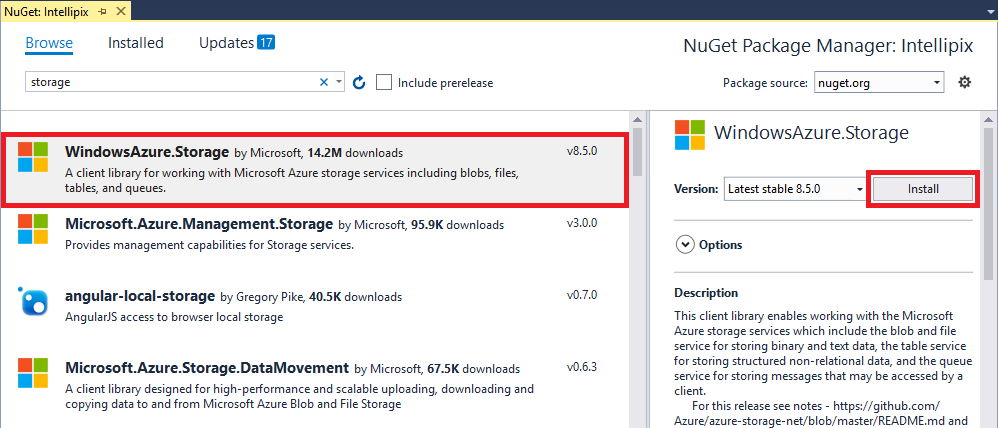

1. 打开“Web.config”并将以下语句添加到 ```<appSettings>``` 部分，将 ACCOUNT_NAME 替换为你在第一部分中创建的存储帐户的名称，将 ACCOUNT_KEY 替换为你保存过的访问密钥。

    ```xml
    <add key="StorageConnectionString" value="DefaultEndpointsProtocol=https;AccountName=ACCOUNT_NAME;AccountKey=ACCOUNT_KEY" />
    ```

1. 打开项目中“Views\Shared”文件夹中名为“_Layout.cshtml”的文件。 在第 19 行中，将“应用程序名称”更改为“Intellipix”。 该行应如下所示：

    ```C#
    @Html.ActionLink("Intellipix", "Index", "Home", new { area = "" }, new { @class = "navbar-brand" })
    ```

    > [!NOTE]
    > 在 ASP.NET MVC 项目中，“_Layout.cshtml”是一个特殊视图，用作其他视图的模板。 你通常会定义此文件中所有视图共有的页眉和页脚内容。

1. 右键单击项目的“Models"文件夹，并使用“添加 -> 类...”命令将名为“BlobInfo.cs”的类文件添加到文件夹中。 然后，将空的“BlobInfo”类替换为以下类定义：

    ```C#
    public class BlobInfo
    {
        public string ImageUri { get; set; }
        public string ThumbnailUri { get; set; }
        public string Caption { get; set; }
    }
    ```

1. 在项目的“Controllers”文件夹中打开“HomeController.cs”文件，并将下面的 `using` 语句添加到文件顶部：

    ```C#
    using ImageResizer;
    using Intellipix.Models;
    using Microsoft.WindowsAzure.Storage;
    using Microsoft.WindowsAzure.Storage.Blob;
    using System.Configuration;
    using System.Threading.Tasks;
    using System.IO;
    ```

1. 将“HomeController.cs”中的“Index”方法替换为以下实现：

    ```C#
    public ActionResult Index()
    {
        // Pass a list of blob URIs in ViewBag
        CloudStorageAccount account = CloudStorageAccount.Parse(ConfigurationManager.AppSettings["StorageConnectionString"]);
        CloudBlobClient client = account.CreateCloudBlobClient();
        CloudBlobContainer container = client.GetContainerReference("photos");
        List<BlobInfo> blobs = new List<BlobInfo>();
    
        foreach (IListBlobItem item in container.ListBlobs())
        {
            var blob = item as CloudBlockBlob;
    
            if (blob != null)
            {
                blobs.Add(new BlobInfo()
                {
                    ImageUri = blob.Uri.ToString(),
                    ThumbnailUri = blob.Uri.ToString().Replace("/photos/", "/thumbnails/")
                });
            }
        }
    
        ViewBag.Blobs = blobs.ToArray();
        return View();
    }
    ```

    新的“Index”方法会枚举 `"photos"` 容器中的 blob，并通过 ASP.NET MVC 的“ViewBag”属性将表示这些 blob 的“BlobInfo”对象数组传递给视图。 稍后，你将修改视图以枚举这些对象，并显示照片缩略图的集合。 访问存储帐户和枚举 blob &mdash; **[CloudStorageAccount](/dotnet/api/microsoft.azure.storage.cloudstorageaccount?view=azure-dotnet&preserve-view=true)** 、 **[CloudBlobClient](/dotnet/api/microsoft.azure.storage.blob.cloudblobclient?view=azure-dotnet-legacy&preserve-view=true)** 和 **[CloudBlobContainer](/dotnet/api/microsoft.azure.storage.blob.cloudblobcontainer?view=azure-dotnet-legacy&preserve-view=true)** &mdash; 时使用的类来自你通过 NuGet 安装的“WindowsAzure.Storage”包。

1. 将以下方法添加至“HomeController.cs”中的“HomeController”类：

    ```C#
    [HttpPost]
    public async Task<ActionResult> Upload(HttpPostedFileBase file)
    {
        if (file != null && file.ContentLength > 0)
        {
            // Make sure the user selected an image file
            if (!file.ContentType.StartsWith("image"))
            {
                TempData["Message"] = "Only image files may be uploaded";
            }
            else
            {
                try
                {
                    // Save the original image in the "photos" container
                    CloudStorageAccount account = CloudStorageAccount.Parse(ConfigurationManager.AppSettings["StorageConnectionString"]);
                    CloudBlobClient client = account.CreateCloudBlobClient();
                    CloudBlobContainer container = client.GetContainerReference("photos");
                    CloudBlockBlob photo = container.GetBlockBlobReference(Path.GetFileName(file.FileName));
                    await photo.UploadFromStreamAsync(file.InputStream);
    
                    // Generate a thumbnail and save it in the "thumbnails" container
                    using (var outputStream = new MemoryStream())
                    {
                        file.InputStream.Seek(0L, SeekOrigin.Begin);
                        var settings = new ResizeSettings { MaxWidth = 192 };
                        ImageBuilder.Current.Build(file.InputStream, outputStream, settings);
                        outputStream.Seek(0L, SeekOrigin.Begin);
                        container = client.GetContainerReference("thumbnails");
                        CloudBlockBlob thumbnail = container.GetBlockBlobReference(Path.GetFileName(file.FileName));
                        await thumbnail.UploadFromStreamAsync(outputStream);
                    }
                }
                catch (Exception ex)
                {
                    // In case something goes wrong
                    TempData["Message"] = ex.Message;
                }
            }
        }
    
        return RedirectToAction("Index");
    }
    ```

    这是上传照片时调用的方法。 它会将上传的每个图像作为一个 blob 存储在 `"photos"` 容器中，使用 `ImageResizer` 包根据原始图像创建缩略图，并将缩略图图像作为一个 blob 存储在 `"thumbnails"` 容器中。

1. 在项目的“Views/Home”文件夹中打开“Index.cshmtl”，并将其内容替换为以下代码和标记：

    ```HTML
    @{
        ViewBag.Title = "Intellipix Home Page";
    }
    
    @using Intellipix.Models
    
    <div class="container" style="padding-top: 24px">
        <div class="row">
            <div class="col-sm-8">
                @using (Html.BeginForm("Upload", "Home", FormMethod.Post, new { enctype = "multipart/form-data" }))
                {
                    <input type="file" name="file" id="upload" style="display: none" onchange="$('#submit').click();" />
                    <input type="button" value="Upload a Photo" class="btn btn-primary btn-lg" onclick="$('#upload').click();" />
                    <input type="submit" id="submit" style="display: none" />
                }
            </div>
            <div class="col-sm-4 pull-right">
            </div>
        </div>
    
        <hr />
    
        <div class="row">
            <div class="col-sm-12">
                @foreach (BlobInfo blob in ViewBag.Blobs)
                {
                    
                }
            </div>
        </div>
    </div>
    
    @section scripts
    {
        <script type="text/javascript" language="javascript">
            if ("@TempData["Message"]" !== "") {
                alert("@TempData["Message"]");
            }
        </script>
    }
    ```

    此处使用的语言是 [Razor](http://www.asp.net/web-pages/overview/getting-started/introducing-razor-syntax-c)，这让你可以在 HTML 标记中嵌入可执行代码。 文件中间的 ```@foreach``` 语句会枚举从“ViewBag”中的控制器传递的“BlobInfo”对象，并根据这些对象创建 HTML `````` 元素。 每个元素的 ```src``` 属性都是用包含图像缩略图的 blob 的 URI 初始化。

1. 下载并解压缩 [GitHub 示例数据存储库](https://github.com/Azure-Samples/cognitive-services-sample-data-files/tree/master/ComputerVision/storage-lab-tutorial)中的“photos.zip”文件。 你可以使用其中的不同照片来测试应用。

1. 保存更改，然后按“Ctrl+F5”，在浏览器中启动应用程序。 然后单击“上传照片”，上传你下载的一个图像。 确认页面上显示了照片的缩略图版本。

    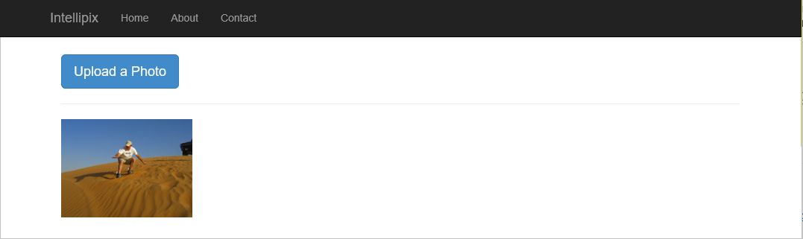

1. 再从“photos”文件夹中上传一些图像。 同样确认页面上已显示这些图像：

    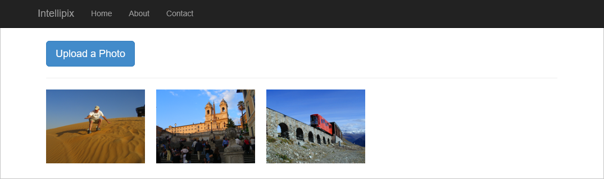

1. 右键单击浏览器，然后选择“查看页面源”，以查看页面的源代码。 找到表示图像缩略图的 `````` 元素。 请注意，分配给图像的 URL 直接引用 blob 存储中的 blob。 这是因为你将容器的“公共访问级别”设置为“Blob”，这使得 blob 可以公开访问。

1. 返回到 Azure 存储资源管理器（若未运行，则重新启动它），并在存储帐户下选择 `"photos"` 容器。 容器中的 blob 数应该等于你上传的照片数。 双击其中一个 blob 进行下载，并查看存储在 blob 中的图像。

    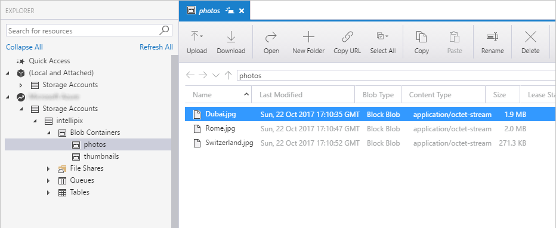

1. 在存储资源管理器中，打开 `"thumbnails"` 容器。 打开其中一个 blob，查看从图像上传生成的缩略图图像。

应用目前尚未提供查看上传的原始图像的方法。 理想情况下，单击图像缩略图应显示原始图像。 你将在下一步添加该功能。

<a name="Exercise4"></a>
## <a name="add-a-lightbox-for-viewing-photos"></a>添加 lightbox 以查看照片

在本部分中，你将使用免费的开源 JavaScript 库来添加 lightbox 查看器，用户使用该查看器可查看已上传的原始图像（而不只是图像缩略图）。 系统会为你提供文件。 你只需将它们集成到项目中，并对“Index.cshtml”进行少许修改。

1. 从 [GitHub 代码存储库](https://github.com/Azure-Samples/cognitive-services-quickstart-code/tree/master/dotnet/ComputerVision/storage-lab-tutorial)下载“lightbox.css”和“lightbox.js”文件。
1. 在解决方案资源管理器中，右键单击项目的“Scripts”文件夹，并使用“添加 > 新项...”命令创建“lightbox.js”文件。 粘贴“[GitHub 代码存储库](https://github.com/Azure-Samples/cognitive-services-quickstart-code/blob/master/dotnet/ComputerVision/storage-lab-tutorial/scripts/lightbox.js)”中示例文件的内容。

1. 右键单击项目的“Content”文件夹，并使用“添加 > 新项...”命令创建“lightbox.css”文件。 粘贴“[GitHub 代码存储库](https://github.com/Azure-Samples/cognitive-services-quickstart-code/blob/master/dotnet/ComputerVision/storage-lab-tutorial/css/lightbox.css)”中示例文件的内容。
1. 从 GitHub 数据文件存储库下载“buttons.zip”文件并解压缩： https://github.com/Azure-Samples/cognitive-services-sample-data-files/tree/master/ComputerVision/storage-lab-tutorial 。 应有四个按钮图像。

1. 在解决方案资源管理器中，右键单击 Intellipix 项目，并使用“添加 -> 新建文件夹”命令向项目中添加一个名为“Images”的文件夹。

1. 右键单击“Images”文件夹，然后使用“添加 -> 现有项...”命令导入下载的四个图像。

1. 打开项目的“App_Start”文件夹中的“BundleConfig.cs”。 将以下语句添加到“BundleConfig.cs”中的 ```RegisterBundles``` 方法：

    ```C#
    bundles.Add(new ScriptBundle("~/bundles/lightbox").Include(
              "~/Scripts/lightbox.js"));
    ```

1. 在同一方法中，从 "~/Content/css" 中找到创建 ```StyleBundle``` 的语句，并将“lightbox.css”添加到捆绑包中的样式表列表。 下面是修改后的语句：

    ```C#
    bundles.Add(new StyleBundle("~/Content/css").Include(
              "~/Content/bootstrap.css",
              "~/Content/site.css",
              "~/Content/lightbox.css"));
    ```

1. 在项目的“Views/Shared”文件夹中打开“_Layout.cshtml”，并在靠近底部的 ```@RenderSection``` 语句之前添加以下语句：

    ```C#
    @Scripts.Render("~/bundles/lightbox")
    ```

1. 最终任务是将 lightbox 查看器合并到主页中。 若要执行此操作，请打开“Index.cshtml”（位于项目的“视图/主页”文件夹）中，并将 ```@foreach``` 循环替换为：

    ```HTML
    @foreach (BlobInfo blob in ViewBag.Blobs)
    {
        <a href="@blob.ImageUri" rel="lightbox" title="@blob.Caption">
            
        </a>
    }
    ```

1. 保存更改，然后按“Ctrl+F5”，在浏览器中启动应用程序。 然后单击之前上传的一个图像。 确认页面上显示 lightbox 并显示图像的放大视图。

    

1. 单击 lightbox 右下角的“X”将其关闭。

现在，你可以查看上传的图像了。 下一步是对这些图像执行更多操作。

<a name="Exercise5"></a>
## <a name="use-computer-vision-to-generate-metadata"></a>使用计算机视觉生成元数据

### <a name="create-a-computer-vision-resource"></a>创建计算机视觉资源

需要为 Azure 帐户创建计算机视觉资源；该资源管理你对 Azure 的计算机视觉服务的访问权限。 

1. 按照[创建 Azure 认知服务资源](../../cognitive-services-apis-create-account.md)中的说明创建计算机视觉资源。

1. 然后，转到你的资源组菜单，单击刚创建的计算机视觉 API 订阅。 将“终结点”  下的 URL 复制到可以随后轻松地进行检索的某个位置。 然后，单击“显示访问密钥”。 

    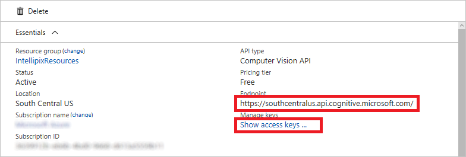
    
    [!INCLUDE [Custom subdomains notice](../../../../includes/cognitive-services-custom-subdomains-note.md)]


1. 在下一窗口中，将“密钥 1”的值复制到剪贴板。 

    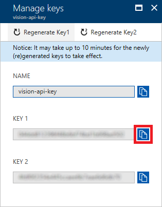

### <a name="add-computer-vision-credentials"></a>添加计算机视觉凭据

接下来，向应用添加所需凭据，使其能够访问计算机视觉资源。

导航至位于项目根目录的“Web.config”文件。 将以下语句添加到文件的 `<appSettings>` 节，将 `VISION_KEY` 替换为你在上一步复制的键，将 `VISION_ENDPOINT` 替换为你在此前的步骤中保存的 URL。

```xml
<add key="SubscriptionKey" value="VISION_KEY" />
<add key="VisionEndpoint" value="VISION_ENDPOINT" />
```

然后，在解决方案资源管理器中右键单击项目，使用“管理 NuGet 包”命令  安装 **Microsoft.Azure.CognitiveServices.Vision.ComputerVision** 包。 该包包含调用计算机视觉 API 所需的类型。

### <a name="add-metadata-generation-code"></a>添加元数据生成代码

接下来，添加可以实际利用计算机视觉服务的代码，以便为图像创建元数据。

1. 在项目的 **Controllers** 文件夹中打开 *HomeController.cs* 文件，将下面的 `using` 语句添加到文件顶部：

    ```csharp
    using Microsoft.Azure.CognitiveServices.Vision.ComputerVision;
    using Microsoft.Azure.CognitiveServices.Vision.ComputerVision.Models;
    ```

1. 然后转到 **Upload** 方法；此方法将图像转换并上传到 Blob 存储。 将以下代码直接添加到以 `// Generate a thumbnail` 开头的块后面（或者添加到 image-blob-creation 过程的末尾）。 此代码使用包含图像 (`photo`) 的 Blob，并使用计算机视觉为该图像生成说明。 计算机视觉 API 也生成一系列适用于图像的关键字。 生成的说明和关键字存储在 Blob 的元数据中，供以后检索。

    ```csharp
    // Submit the image to Azure's Computer Vision API
    ComputerVisionClient vision = new ComputerVisionClient(
        new ApiKeyServiceClientCredentials(ConfigurationManager.AppSettings["SubscriptionKey"]),
        new System.Net.Http.DelegatingHandler[] { });
    vision.Endpoint = ConfigurationManager.AppSettings["VisionEndpoint"];

    List<VisualFeatureTypes?> features = new List<VisualFeatureTypes?>() { VisualFeatureTypes.Description };
    var result = await vision.AnalyzeImageAsync(photo.Uri.ToString(), features);

    // Record the image description and tags in blob metadata
    photo.Metadata.Add("Caption", result.Description.Captions[0].Text);

    for (int i = 0; i < result.Description.Tags.Count; i++)
    {
        string key = String.Format("Tag{0}", i);
        photo.Metadata.Add(key, result.Description.Tags[i]);
    }

    await photo.SetMetadataAsync();
    ```

1. 接下来，转到同一文件中的 **Index** 方法。 此方法枚举存储在目标 Blob 容器中的图像 Blob（采用 **IListBlobItem** 实例的形式），并将其传递到应用程序视图。 将此方法中的 `foreach` 块替换为以下代码。 此代码调用 **CloudBlockBlob.FetchAttributes**，以获取每个 Blob 的附加元数据。 它从元数据提取计算机生成的说明 (`caption`)，然后将它添加到 **BlobInfo** 对象，该对象会被传递到视图。
    
    ```csharp
    foreach (IListBlobItem item in container.ListBlobs())
    {
        var blob = item as CloudBlockBlob;
    
        if (blob != null)
        {
            blob.FetchAttributes(); // Get blob metadata
            var caption = blob.Metadata.ContainsKey("Caption") ? blob.Metadata["Caption"] : blob.Name;
    
            blobs.Add(new BlobInfo()
            {
                ImageUri = blob.Uri.ToString(),
                ThumbnailUri = blob.Uri.ToString().Replace("/photos/", "/thumbnails/"),
                Caption = caption
            });
        }
    }
    ```

### <a name="test-the-app"></a>测试应用程序

在 Visual Studio 中保存所做的更改，然后按 **Ctrl+F5**，在浏览器中启动应用程序。 使用应用上传更多的图像，可以来自你下载的照片集或你自己的文件夹。 将光标悬停在视图中一个新图像的上方时，屏幕上会出现工具提示窗口，并显示由计算机生成的图像标题。

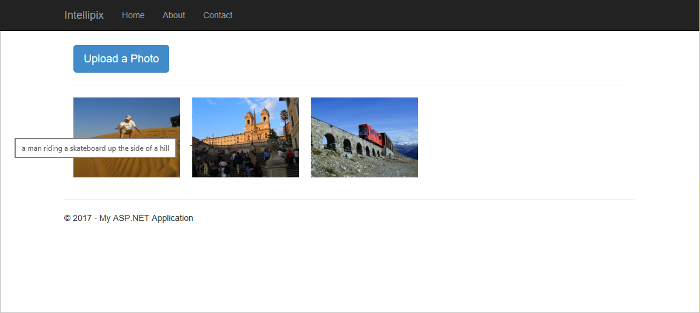

若要查看所有附加的元数据，请使用 Azure 存储资源管理器来查看用于图像的存储容器。 右键单击容器中的任意 Blob，然后选择“属性”。  在对话框中，会看到键值对的列表。 由计算机生成的图像说明存储在 `Caption` 项中，搜索关键字存储在 `Tag0`、`Tag1` 之类的项中。 完成后，单击 **取消** 即可关闭对话框。

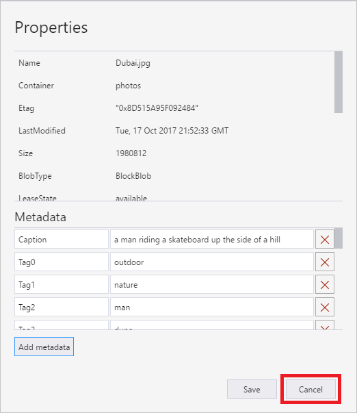

<a name="Exercise6"></a>
## <a name="add-search-to-the-app"></a>向应用添加搜索

在本部分，你将向主页添加一个搜索框，使用户能够对已上传的图像执行关键字搜索。 关键字是由计算机视觉 API 生成并存储在 Blob 元数据中。

1. 在项目的“Views/Home”文件夹中打开“Index.cshtml”，并将以下语句添加到具有 ```class="col-sm-4 pull-right"``` 属性的空 ```<div>``` 元素：

    ```HTML
    @using (Html.BeginForm("Search", "Home", FormMethod.Post, new { enctype = "multipart/form-data", @class = "navbar-form" }))
    {
        <div class="input-group">
            <input type="text" class="form-control" placeholder="Search photos" name="term" value="@ViewBag.Search" style="max-width: 800px">
            <span class="input-group-btn">
                <button class="btn btn-primary" type="submit">
                    <i class="glyphicon glyphicon-search"></i>
                </button>
            </span>
        </div>
    }
    ```

    此代码和标记会将搜索框和“搜索”按钮添加到主页。

1. 在项目的“Controllers”文件夹中打开“HomeController.cs”文件，将下面的方法添加到“HomeController”类中：

    ```C#
    [HttpPost]
    public ActionResult Search(string term)
    {
        return RedirectToAction("Index", new { id = term });
    }
    ```

    这是当用户单击上一步中添加的“搜索”按钮时调用的方法。 它会刷新页面，并在 URL 中包含一个搜索参数。

1. 将“Index”方法替换为以下实现：

    ```C#
    public ActionResult Index(string id)
    {
        // Pass a list of blob URIs and captions in ViewBag
        CloudStorageAccount account = CloudStorageAccount.Parse(ConfigurationManager.AppSettings["StorageConnectionString"]);
        CloudBlobClient client = account.CreateCloudBlobClient();
        CloudBlobContainer container = client.GetContainerReference("photos");
        List<BlobInfo> blobs = new List<BlobInfo>();

        foreach (IListBlobItem item in container.ListBlobs())
        {
            var blob = item as CloudBlockBlob;

            if (blob != null)
            {
                blob.FetchAttributes(); // Get blob metadata

                if (String.IsNullOrEmpty(id) || HasMatchingMetadata(blob, id))
                {
                    var caption = blob.Metadata.ContainsKey("Caption") ? blob.Metadata["Caption"] : blob.Name;

                    blobs.Add(new BlobInfo()
                    {
                        ImageUri = blob.Uri.ToString(),
                        ThumbnailUri = blob.Uri.ToString().Replace("/photos/", "/thumbnails/"),
                        Caption = caption
                    });
                }
            }
        }

        ViewBag.Blobs = blobs.ToArray();
        ViewBag.Search = id; // Prevent search box from losing its content
        return View();
    }
    ```

    请注意，“Index”方法现在接受其中包含用户在搜索框中所键入值的参数“id”。 “id”参数为空或缺失表示应显示所有照片。

1. 将以下帮助程序方法添加到“HomeController”类中：

    ```C#
    private bool HasMatchingMetadata(CloudBlockBlob blob, string term)
    {
        foreach (var item in blob.Metadata)
        {
            if (item.Key.StartsWith("Tag") && item.Value.Equals(term, StringComparison.InvariantCultureIgnoreCase))
                return true;
        }

        return false;
    }
    ```

    此方法使用“Index”方法调用，以确定附加到给定图像 Blob 的元数据关键字是否包含用户输入的搜索词。

1. 再次启动应用程序并上传多张照片。 请随意使用自己的照片，而不只是本教程中提供的照片。

1. 在搜索框中键入关键字，例如“river”。 然后单击“搜索”按钮。

    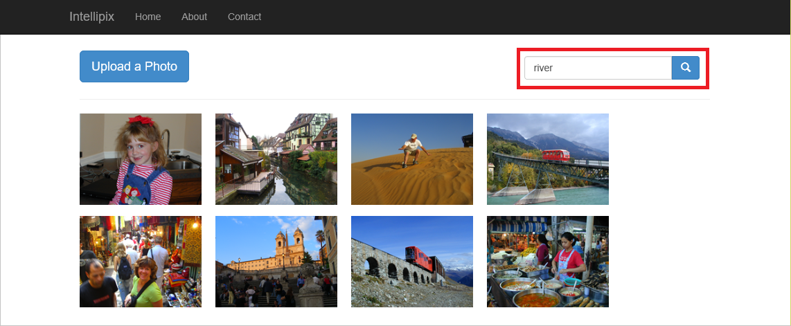

1. 搜索结果因键入的内容和上传的图像而异。 但结果应该是筛选后的图像列表，其元数据关键字包含你键入全部或部分关键字。

    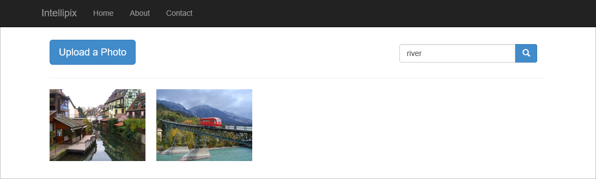

1. 单击浏览器的后退按钮，再次显示所有图像。

操作即将完成。 现在可以将应用部署到云了。

<a name="Exercise7"></a>
## <a name="deploy-the-app-to-azure"></a>将应用部署到 Azure

在本部分中，你会将应用从 Visual Studio 部署到 Azure。 Visual Studio 将为你创建一个 Azure Web 应用，这样你就不必登入 Azure 门户单独创建应用。

1. 在解决方案资源管理器中右键单击项目，并从上下文菜单中选择“发布...”。 确保选择“Microsoft Azure 应用服务”和“新建”，并单击“发布”按钮。

    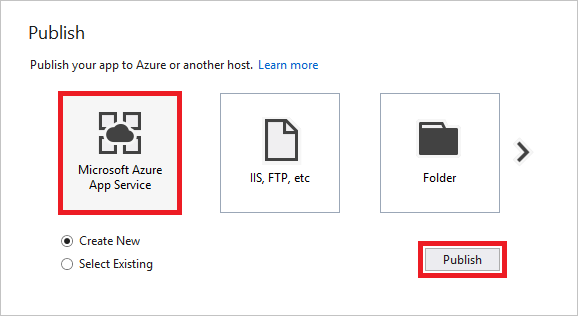

1. 在下一个对话框中，选择“资源组”下的“IntellipixResources”资源组。 单击“应用服务计划”旁边的“新建...”按钮，在你在[创建存储帐户](#Exercise1)中为存储帐户选择的同一位置创建新的应用服务计划，接受其他所有位置的默认值。 单击“创建”按钮，完成操作。

    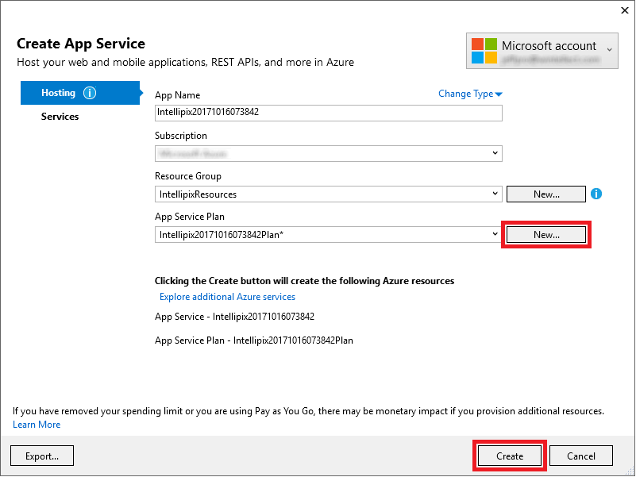

1. 片刻之后，应用将显示在浏览器窗口中。 记录地址栏中的 URL。 此应用不再在本地运行，它位于可公开访问的 Web 上。

    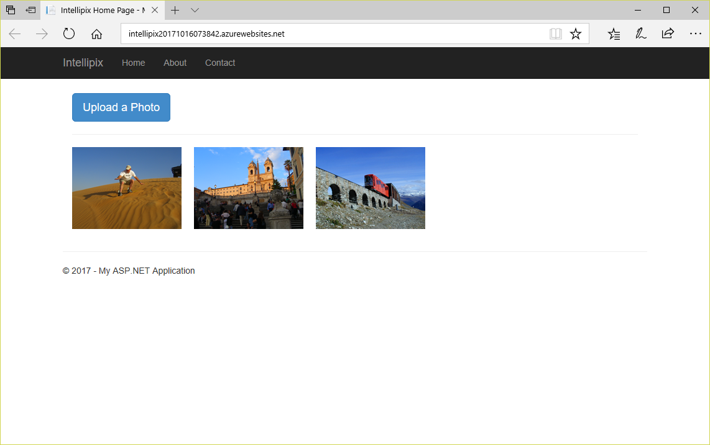

如果要更改应用，并且将更改推送到 Web，请再次完成发布过程。 在发布到 Web 之前，你仍可在本地测试更改。

## <a name="clean-up-resources"></a>清理资源

若要继续使用 Web 应用，请参阅 [后续步骤](#next-steps) 部分。 如果不打算继续使用此应用程序，则应删除所有特定于应用的资源。 若要删除资源，可以删除包含 Azure 存储订阅和计算机视觉资源的资源组。 这样会删除存储帐户、上传到其中的 Blob，以及与 ASP.NET Web 应用进行连接所需的应用服务资源。 

若要删除资源组，请在门户中打开“资源组”选项卡，  导航到用于此项目的资源组，然后单击视图顶部的“删除资源组”。  系统会要求你键入资源组的名称以确认你要删除它。 资源组一旦删除，则无法恢复。

## <a name="next-steps"></a>后续步骤

你可以使用 Azure 执行更多操作，并可进一步开发 Intellipix 应用。 例如，你可以添加对用户进行身份验证和删除照片的支持，而不是强制用户等待认知服务在上传后处理照片。每次将图像添加到 Blob 存储时，可以使用“[Azure Functions](https://azure.microsoft.com/services/functions/?WT.mc_id=academiccontent-github-cxa)”以异步方式调用计算机视觉 API。 此外，还可以对图像执行任意次数的其他图像分析操作，如概述中所述。

> [!div class="nextstepaction"]
> [图像分析概述](../overview-image-analysis.md)
