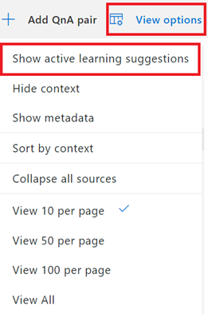
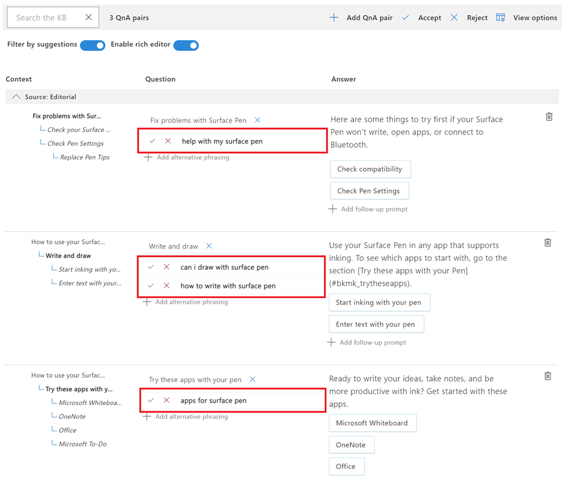
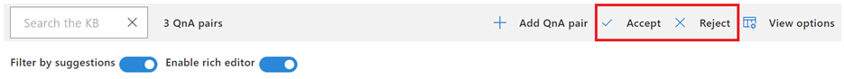
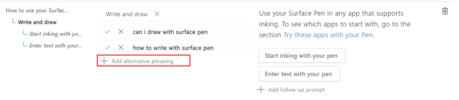

# 通过主动学习丰富知识库

本教程介绍如何通过主动学习来增强知识库。 如果你发现知识库中没有客户询问的问题， 通常，可以换一种方式表述问题。 

将这些变化作为替代问题添加到相关的问答对，可帮助优化知识库，以解答真实的用户查询。 你可以通过编辑器向问答对手动添加替代问题。 同时，还可以使用主动学习功能根据用户查询来生成主动学习建议。 但主动学习功能要求知识库接收定期用户流量以生成建议。

## 启用主动学习
默认情况下，自定义问答功能的主动学习为开启状态。 但是，你需要手动更新 QnA Maker GA 的主动学习设置。 可在此处找到更多详细信息：[开启主动学习](../how-to/use-active-learning.md#turn-on-active-learning-for-alternate-questions)。

若要尝试主动学习建议，可以将以下文件导入知识库：[SampleActiveLearning.tsv](https://github.com/Azure-Samples/cognitive-services-sample-data-files/blob/master/qna-maker/knowledge-bases/SampleActiveLearning.tsv)。 有关导入知识库的详细信息，请参阅[导入知识库](migrate-knowledge-base.md)。

## 查看和添加/拒绝主动学习建议
获得可用的主动学习建议后，可以从“视图选项” > “显示主动学习建议”中查看这些建议。

> [!div class="mx-imgBorder"]
> 

单击“显示主动学习建议”可以启用选项来筛选有建议的问答对。 如果禁用主动学习或没有任何建议，则会禁用“显示主动学习建议”。

> [!div class="mx-imgBorder"]
> 

我们可以根据主动学习的建议仅筛选那些具有替代问题的问答对，这样就会显示筛选后的问答对列表：

> [!div class="mx-imgBorder"]
> 

现在，我们可以使用复选标记或交叉标记来接受或拒绝这些建议。 你可以单独导航到每个问答对或使用顶部的“接受/拒绝”选项来完成此操作。

> [!div class="mx-imgBorder"]
> 

除非按照主动学习的建议选择添加或编辑建议，否则知识库不会更改。 最后，单击“保存并训练”以保存更改。

> [!NOTE] 
> 若要查看主动学习的版本和服务设置，请参阅有关[如何使用主动学习](../how-to/use-active-learning.md)的文章

## 使用编辑器添加替代问题

尽管主动学习会自动根据命中知识库的用户查询来建议替代问题，但我们也可以使用编辑器添加问题的变体。
选择要添加替代问题的问答对，然后选择“添加替代表述”

> [!div class="mx-imgBorder"]
> 

添加到问答对的替代问题显示为

> [!div class="mx-imgBorder"]
> 

通过添加替代问题和主动学习，我们可以使用问题的变体进一步充实知识库，这有助于向类似用户查询提供相同的响应。

> [!NOTE] 
> 替代问题有很多停止字词，它们可能不会像预期那样影响响应的准确性。 因此，如果替代问题之间的唯一区别在于停止字词，则不需要这些替代问题。

你可在此处找到停用字词列表：[停用字词](https://github.com/Azure-Samples/azure-search-sample-data/blob/master/STOPWORDS.md)列表。

## 后续步骤

> [!div class="nextstepaction"]
> [使用同义词改善响应质量](adding-synonyms.md)