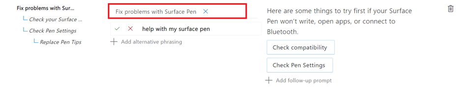
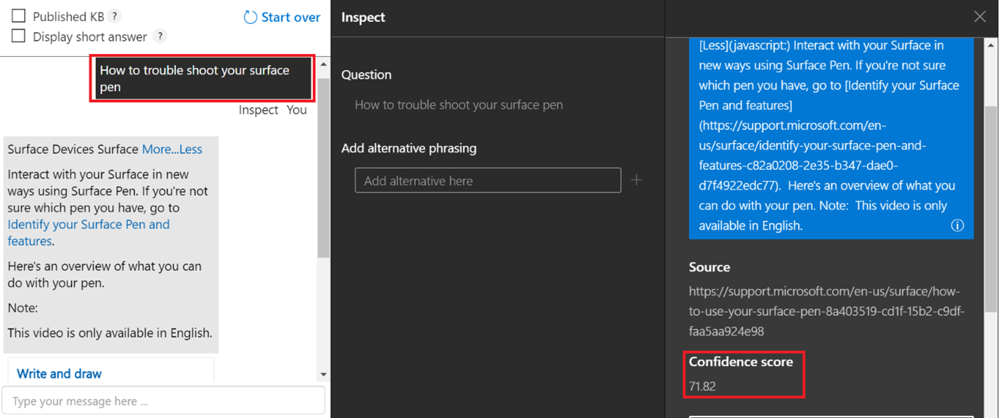
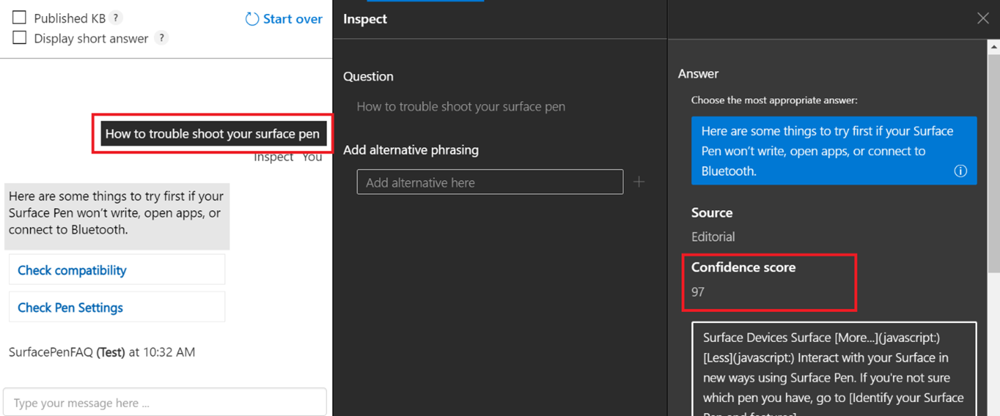

# <a name="improve-quality-of-response-with-synonyms"></a>使用同义词改善响应质量

本教程将向你演示如何通过使用同义词来改善响应质量。 假设用户在使用某个单词的替代形式、同义词或首字母缩写词进行查询时，未能获得准确的响应。 因此，用户决定通过使用[替代词 API](/rest/api/cognitiveservices-qnamaker/QnAMaker4.0/Alterations) 为关键字添加同义词来改善响应质量。

## <a name="add-synonyms-using-alterations-api"></a>使用替代词 API 添加同义词

接下来，我们将添加以下单词及其替代词来改善响应结果：

|Word | 替代词|
|--------------|--------------------------------|
| 修复问题 | `Troubleshoot`, `trouble-shoot`|
| 白板   | `white-board`, `white board`   |
| 蓝牙    | `blue-tooth`, `blue tooth`     |

```json
{
    "wordAlterations": [
        {
            "alterations": [
                "fix problems",
                "trouble shoot",
                "trouble-shoot",
                ]
        },
        {
            "alterations": [
                "whiteboard",
                "white-board",
                "white board"
            ]
        },
        {
            "alterations": [
                "bluetooth",
                "blue-tooth",
                "blue tooth"
            ]
        }
    ]
}

```

## <a name="response-after-adding-synonyms"></a>添加同义词之后的响应

下图显示了关于“修复 Surface 触控笔问题”的问题和答案对，我们将其与使用同义词“故障排除”进行查询的响应进行了比较。

> [!div class="mx-imgBorder"]
> [  ]( ../media/adding-synonyms/fix-problems.png#lightbox)

## <a name="response-before-addition-of-synonym"></a>添加同义词之前的响应

> [!div class="mx-imgBorder"]
> [  ]( ../media/adding-synonyms/confidence-score.png#lightbox)

## <a name="response-after-addition-of-synonym"></a>添加同义词之后的响应 

> [!div class="mx-imgBorder"]
> [  ]( ../media/adding-synonyms/increase-score.png#lightbox)

如你所见，在未将 `trouble shoot` 添加为同义词时，“如何对你的 Surface 触控笔进行故障排除”这一查询获得的响应置信度较低。 但是，在将 `trouble shoot` 添加为“修复问题”的同义词后，我们获得了对该查询的正确响应，置信度评分也更高。 因此，添加这些替代词提高了查询结果的相关性，从而改善了用户体验。 

> [!NOTE]
> 同义词不区分大小写。 如果将停用词添加为同义词，同义词可能不起作用。 你可在此处找到停用字词列表：[停用字词列表](https://github.com/Azure-Samples/azure-search-sample-data/blob/master/STOPWORDS.md)。

例如，如果你添加了“信息技术”的缩写词“IT”，系统可能无法识别“信息技术”一词，因为“IT”是一个停用词，系统在处理查询时会将其排除在外。

## <a name="next-steps"></a>后续步骤

> [!div class="nextstepaction"]
> [创建多种语言的知识库](multiple-languages.md)