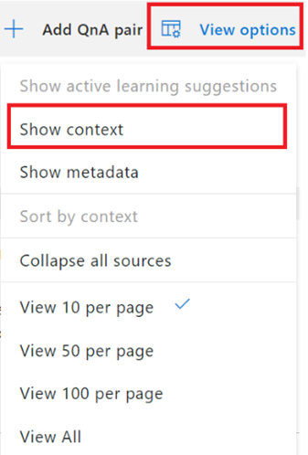
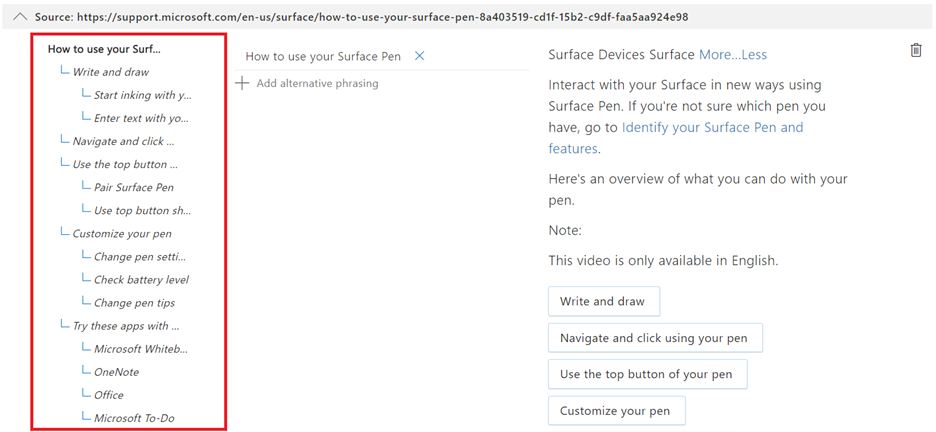
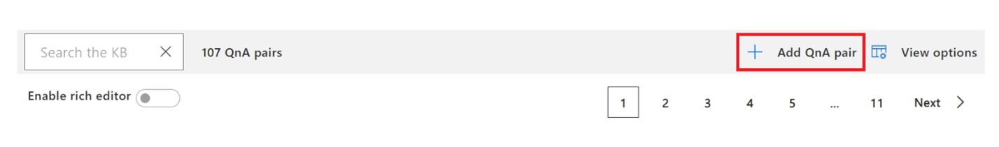
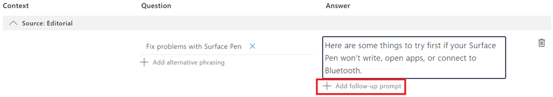
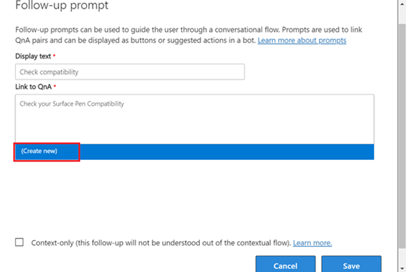
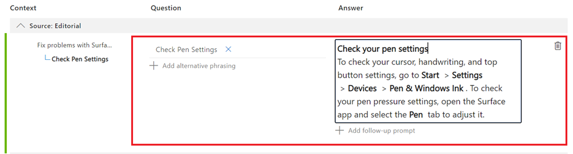
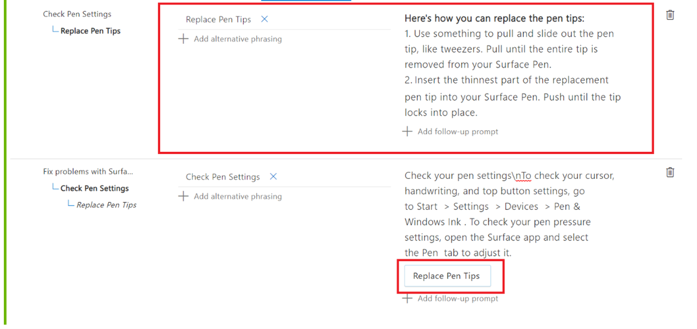
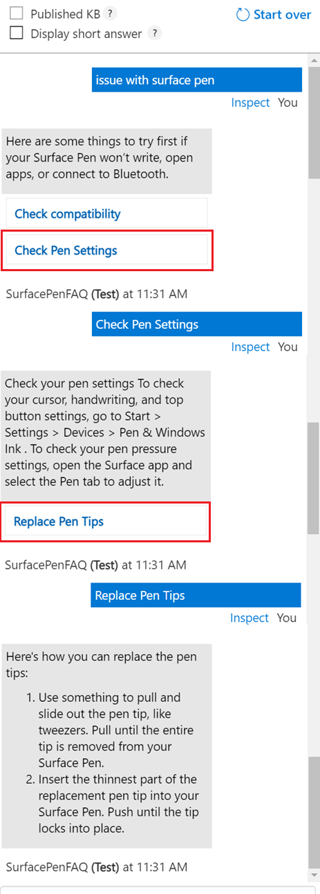

# 使用多轮次提示创建引导式对话

 在本教程中，我们使用 [Surface 触控笔常见问题解答](https://support.microsoft.com/surface/how-to-use-your-surface-pen-8a403519-cd1f-15b2-c9df-faa5aa924e98)来创建知识库。

在此示例中，假设用户要询问有关 Surface 触控笔产品的其他详细信息，尤其是如何排除其 Surface 触控笔的故障，但没有获得正确的答案。 接下来，我们将添加更多提示以支持其他方案，并使用多轮提示指导用户使用正确的答案。

## 查看具有上下文的问答
在为 [Surface 触控笔常见问题解答](https://support.microsoft.com/surface/how-to-use-your-surface-pen-8a403519-cd1f-15b2-c9df-faa5aa924e98)创建知识库时，我们选择启用从源文档进行多轮提取。 有关更多详细信息，请参阅[从文档创建多轮会话](../how-to/multiturn-conversation.md#create-a-multi-turn-conversation-from-a-documents-structure)。 这会列出与问答对关联的多轮提示，你可以使用“视图选项”下的“显示上下文”来查看这些提示。

> [!div class="mx-imgBorder"]
> 

此时将显示上下文树，其中会显示链接到问答对的所有跟进提示： 

> [!div class="mx-imgBorder"]
> 

## 新增包含跟进提示的问答对

为了帮助用户解决 Surface 触控笔的问题，我们添加了跟进提示：

1.  新增包含两个跟进提示的问答对
2.  在新增的一个提示中添加跟进提示

“步骤 1”：新增包含两个跟进提示“检查兼容性”和“检查触控笔设置”的问答对 使用编辑器，通过单击“添加问答对”来新增包含一个跟进提示的问答对

> [!div class="mx-imgBorder"]
> 

此时系统会在“编辑器”中创建一个新行，我们在其中输入问答对，如下所示：

> [!div class="mx-imgBorder"]
> 

然后，通过选择“添加跟进提示”，将跟进提示添加到新创建的问答对。 单击该选项，填写提示的详细信息，如下所示：

> [!div class="mx-imgBorder"]
> 

我们提供“检查兼容性”作为提示的“显示文本”并尝试将其链接到问答对。 由于没有相关的问答对可链接到该提示，因此，当我们搜索“检查 Surface 触控笔的兼容性”时，请单击“新建”创建一个新的问答对。 “保存”更改后，系统将显示以下页面，我们可以在其中输入跟进提示的新问答对，如下所示：

> [!div class="mx-imgBorder"]
> 

同样，我们添加了另一个提示“检查触控笔设置”，以帮助用户对 Surface 触控笔进行故障排除，并在其中添加问答对。

> [!div class="mx-imgBorder"]
> 

“步骤 2”：向新创建的提示添加另一个跟进提示。 现在，将“更换触控笔笔尖”添加为先前创建的“检查触控笔设置”提示的跟进提示。

> [!div class="mx-imgBorder"]
> 

最后，保存更改并在“测试”窗格中测试这些提示： 

> [!div class="mx-imgBorder"]
> 

针对“Surface 触控笔问题”的用户查询，系统将返回一个答案，并向用户显示新添加的提示。 然后，用户可选择其中一个提示“检查触控笔设置”，系统向用户返回包含另一个提示“更换触控笔笔尖”的相关答案，选择该选项后，系统将向用户提供更多详细信息。 因此，使用多轮提示可协助并指导用户获得所需的答案。

## 后续步骤

> [!div class="nextstepaction"]
> [通过主动学习丰富知识库](active-learning.md)