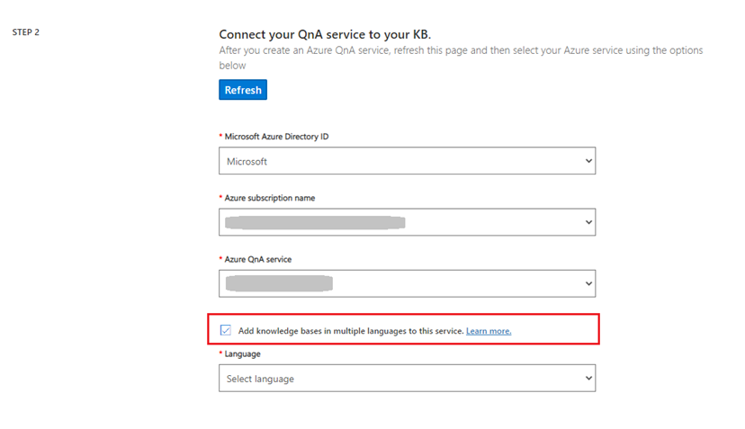
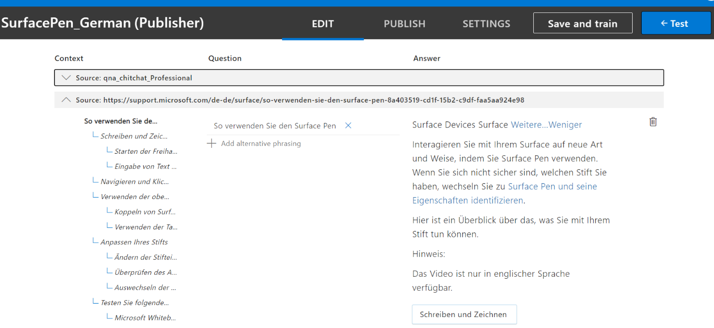
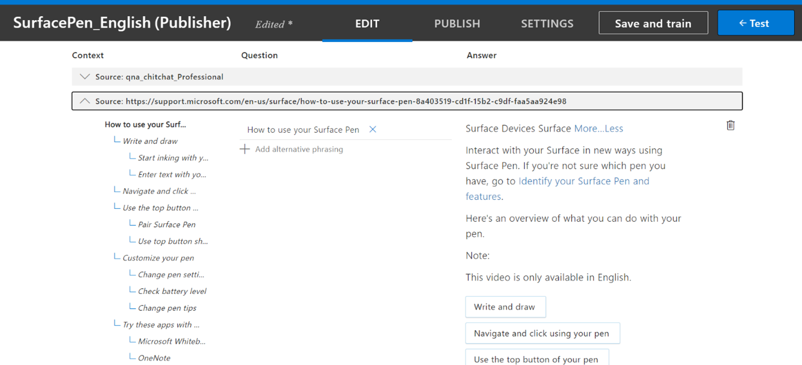
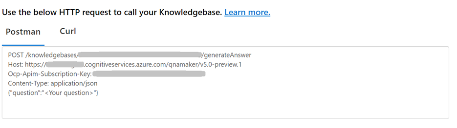

# 创建多种语言的知识库

本教程将指导你完成创建具有多种语言的知识库的过程。 我们会使用 [Surface 触笔常见问题解答](https://support.microsoft.com/surface/how-to-use-your-surface-pen-8a403519-cd1f-15b2-c9df-faa5aa924e98) URL 创建德语和英语知识库。 然后，我们发布知识库并使用 [GenerateAnswerAPI](/rest/api/cognitiveservices-qnamaker/QnAMaker4.0/Runtime/GenerateAnswer) 对其进行查询，以获取所需语言的常见问题解答。

## 创建德语知识库

为了能够创建多种语言的知识库，必须在创建 QnA 服务的第一个知识库 (KB) 时设置语言设置。

> [!NOTE]
> 将多种语言的知识库添加到服务的选项仅在自定义问答（文本分析的一项功能）中提供。
>
> 如果使用 QnA Maker 的 GA 版本，则需要为每种不同的语言创建一个单独的 QnA Maker 资源。

> [!div class="mx-imgBorder"]
> 

在步骤 2 中：启用“将多语言的知识库添加到此服务”，然后从“语言”下拉列表中选择“德语”作为 KB 的语言。 
在步骤 3 和步骤 4 中填充相关详细信息，最后选择“创建 KB”。
 
在此步骤中，QnA maker 会读取文档并从源 URL 中提取 QnA 对，以创建德语知识库。 知识库页将打开，我们可在其中编辑知识库的内容。

> [!div class="mx-imgBorder"]
> 

## 创建英语知识库

现在，请重复上述步骤，但在步骤 2 和步骤 4 中需要做出特定于语言的更改，以创建英语知识库：
1.  步骤 2：选择“英语”作为语言 
2.  步骤 4：选择使用选定语言的源文件，以创建英语知识库。
创建知识库后，可以看到由 QnA maker 以英语生成的相关 QnA 对，如下所示：

> [!div class="mx-imgBorder"]
> 

## 发布和查询知识库

现在，我们已准备好发布这两个知识库，并使用 [GenerateAnswerAPI](/rest/api/cognitiveservices-qnamaker/QnAMaker4.0/Runtime/GenerateAnswer) 以所需语言对其进行查询。 在发布知识库后，系统将显示以下页面，该页面提供查询知识库的详细信息。

> [!div class="mx-imgBorder"]
> 

可以通过[语言检测 API](../../text-analytics/how-tos/text-analytics-how-to-language-detection.md) 检测传入用户查询的语言，用户可以根据检测到的语言调用适当的终结点和知识库。